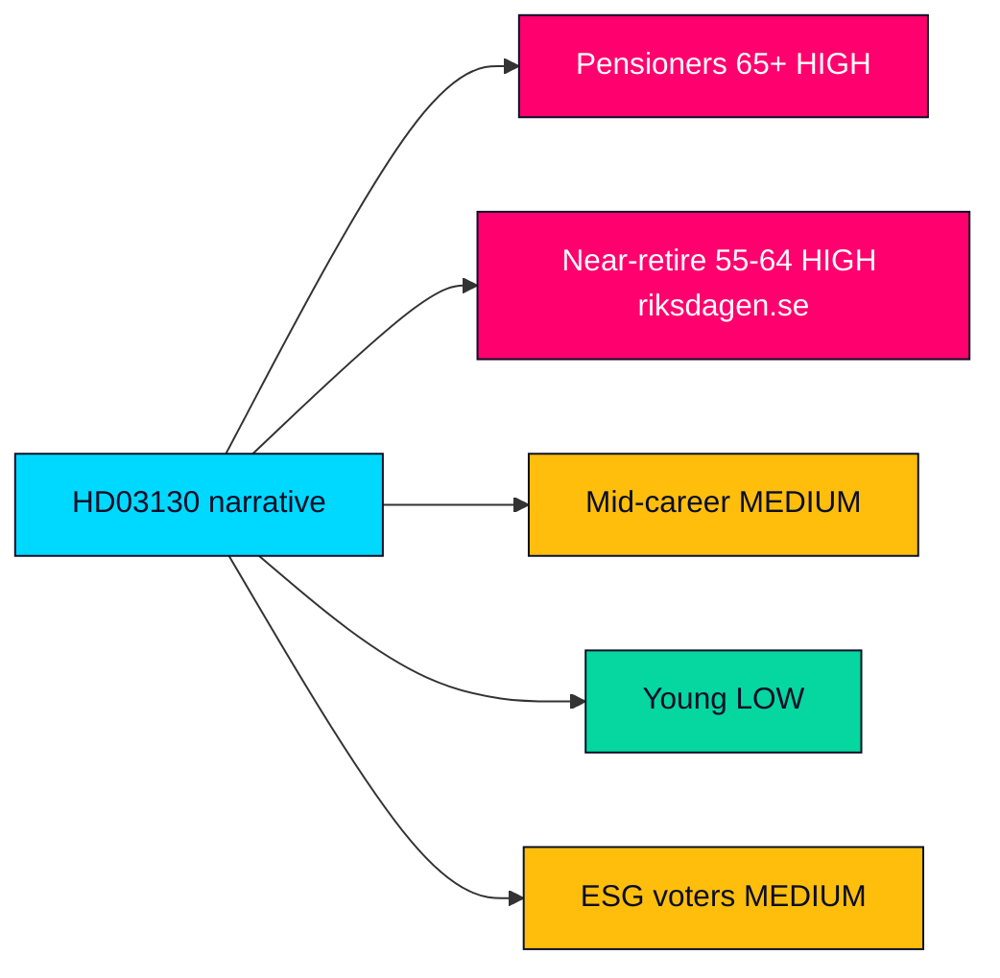

# Voter Segmentation — Propositions 2026-05-29 (HD03130)

Which voter segments are most exposed to, and most mobilisable by, the AP-funds report and the pension narrative it feeds. Segmentation is analytic, drawing on the salience of pension adequacy across cohorts.

---

## Primary Segments

| Segment | Exposure | Mobilisation potential | Note |
|---------|----------|------------------------|------|
| Current pensioners (65+) | Very high | High | Direct income stake; most sensitive to "at risk" framing (HD03130) |
| Near-retirement (55–64) | High | High | Buffer outlook shapes their imminent pension (riksdagen.se) |
| Mid-career (35–54) | Medium | Medium | Long-horizon stake but discounted salience (HD03130) |
| Young workers (18–34) | Low–medium | Low | Abstract relevance; low present salience (HD03130) |
| ESG-motivated voters | Medium | Medium | Mobilised by föredöme holdings scrutiny (riksdagen.se) |

## Segment Dynamics

- **Pensioners and near-retirees** are the decisive segment: numerous, high-turnout and acutely sensitive to pension messaging. A negative buffer read is most potent here (HD03130).
- **Mid-career voters** respond to system-credibility framing more than to one-year results (riksdagen.se).
- **Young voters** are largely outside this issue's pull, though ESG framing can recruit a subset (HD03130).

## Messaging Sensitivity

| Frame | Resonant segment | Risk |
|-------|------------------|------|
| "Pension at risk" | Pensioners, near-retirement | High mobilisation, low accuracy (HD03130) |
| "Sound stewardship" | Mid-career, stability-oriented | Lower emotional pull (riksdagen.se) |
| "Funds must divest" | ESG-motivated | Niche but intense (HD03130) |

## Turnout Consideration

- The most exposed segments (pensioners, near-retirement) are also the highest-turnout cohorts, amplifying the electoral weight of how the report is framed (HD03130).

## Segmentation Map

> **Pass-2 note**: the decisive intersection is high exposure × high turnout — pensioners and near-retirees are simultaneously the most sensitive to the "at risk" frame and the most likely to vote, which is what gives a technically minor report outsized electoral leverage (HD03130).

