## What Happened
<!-- source: executive-brief.md :: https://github.com/Hack23/riksdagsmonitor/blob/main/analysis/daily/2026-05-29/week-ahead/executive-brief.md -->

### Lede
In the final full sitting week before summer recess and **107 days before the 2026-09-13 election**, the Riksdag debates the Tidö government's migration-reform capstone — the new reception law (`HD01SfU35`, *En ny mottagandelag*) — alongside cross-border electronic-evidence powers (`HD01JuU33`) and a welfare-competence tranche (`HD01SoU32`, `HD01UbU24`, `HD01UbU25`). It is **very likely** [horizon:week] that the reception law is adopted on the government+SD bloc before recess, completing the structural transformation of Swedish asylum policy in statute before the campaign freeze. The opposition's interpellation docket pivots deliberately to economic fairness (a-kassa, equalisation, industrial layoffs), pre-drawing the autumn campaign's distributional battle line. Confidence: MEDIUM–HIGH `[B2]`.

### Top 3 Developments to Watch

#### 1. The New Reception Law — `HD01SfU35` 🔴
The Social Insurance Committee report *En ny mottagandelag* reaches the floor for decision. This restructures **where asylum seekers live and what obligations they carry during processing**, implementing the EU Reception Conditions recast under the Migration and Asylum Pact and tying reception conditions to return readiness. It is the operational counterpart to the spring rights-architecture reforms — the piece that makes "return-first" administratively executable. Watch: (a) whether L and C accept the accommodation-and-control model without reservation; (b) any Lagrådet proportionality critique on mandatory accommodation/movement restrictions; (c) the transition timeline and Migrationsverket implementation capacity. **Very likely** adopted before recess [horizon:week]. `[B2]`

#### 2. Cross-Border E-Evidence — `HD01JuU33` 🔴
The Justice Committee report on more effective cross-border gathering of electronic evidence implements the EU e-Evidence Regulation/Directive, letting Swedish authorities compel data directly from providers in other member states. It quietly extends the security-state tooling theme from the prior week's facial-recognition debate, but as a technical EU-implementation file it carries far less public heat while materially expanding cross-border investigative reach. Watch for any civil-liberties reservation from L or C. **Likely** adopted with broad support [horizon:week]. `[B2]`

#### 3. The Welfare-Competence Counter-Narrative Tranche 🟡
`HD01SoU32` (medical competence in municipal care), `HD01UbU24` (school support), `HD01UbU25` (teaching time), and the `HD01SoU28` IVO-oversight audit move together. Lower-heat but electorally instrumental: they let the government argue "we deliver welfare, not only migration and law-and-order" entering the campaign. **Likely** adopted with cross-bloc elements [horizon:week]. `[B3]`

### Strategic Watch Items (Beyond the Week)

- **Opposition economic pivot** [horizon:month]: the interpellation cluster (a-kassa `Riksdag document #10524 (HD10524)`, equalisation `HD10526`, paper-industry layoffs `HD10523`, Vattenfall `HD10522`, bank fraud `HD10527`/`HD10528`) signals the S-led bloc's intent to fight autumn on cost-of-living and distributional fairness. **Likely** to become the dominant opposition frame by August. `[B3]`
- **Pre-recess docket clearance** [horizon:week]: any contested bill not finished before recess risks slipping past the election; the government's incentive to complete `HD01SfU35` now is structurally high. `[A2]`
- **Campaign narrative freeze** [horizon:quarter]: after recess the legislative record is effectively fixed; this week is the last large opportunity to convert mandate into statute. **Very likely** the migration transformation is statute-complete before the campaign [horizon:quarter]. `[B2]`
- **EU-Pact transposition runway** [horizon:election]: reception-law implementation timelines extend past the election, making it a live transition-of-power question if the bloc changes. `[C3]`

### Economic Snapshot (IMF-First)

IMF WEO Apr-2026 vintage (pre-warm; live fetch degraded this run): Sweden real GDP growth ≈ **2.1% T+1, 2.4% T+2, 2.0% T+5** `[IMF WEO Apr-2026 vintage; SWE NGDP_RPCH 2.1% T+1]`, gross government debt ≈ 33% of GDP, inflation easing toward 2%. A benign-but-cooling macro backdrop that frames — but does not decide — the week's distributional interpellations. `[B2]`

### Decision-Relevance for Readers

For citizens, journalists, and analysts: this week is the **last clear window to see the full Tidö migration architecture before it is locked into statute and frozen by the campaign**. The reception law is the least-watched but most operationally consequential migration measure of the spring, because it governs the lived reality of asylum reception. Track the L/C reservation behaviour as the leading indicator of coalition cohesion entering the campaign.

### Confidence and Caveats

Overall MEDIUM–HIGH `[B2]`. Primary documents are corroborated from downloaded committee reports and full text. Exact chamber vote dates and outcomes are inferred from the standard riksmöte pre-recess calendar because the calendar API returned an HTML error this run (see `data-download-manifest.md`). Economic figures use the IMF pre-warm vintage with documented live-fetch degradation (`economic-data.json`).

**Pass-2 deepening — decision sharpener.** For a journalist deciding coverage allocation this week: lead on HD01SfU35 (the completion story) but pre-position the L/C-reservation angle on HD01JuU33, because a single liberal-coalition särskilt yttrande would be the week's only genuinely *new* information — everything else is high-probability and pre-scripted.

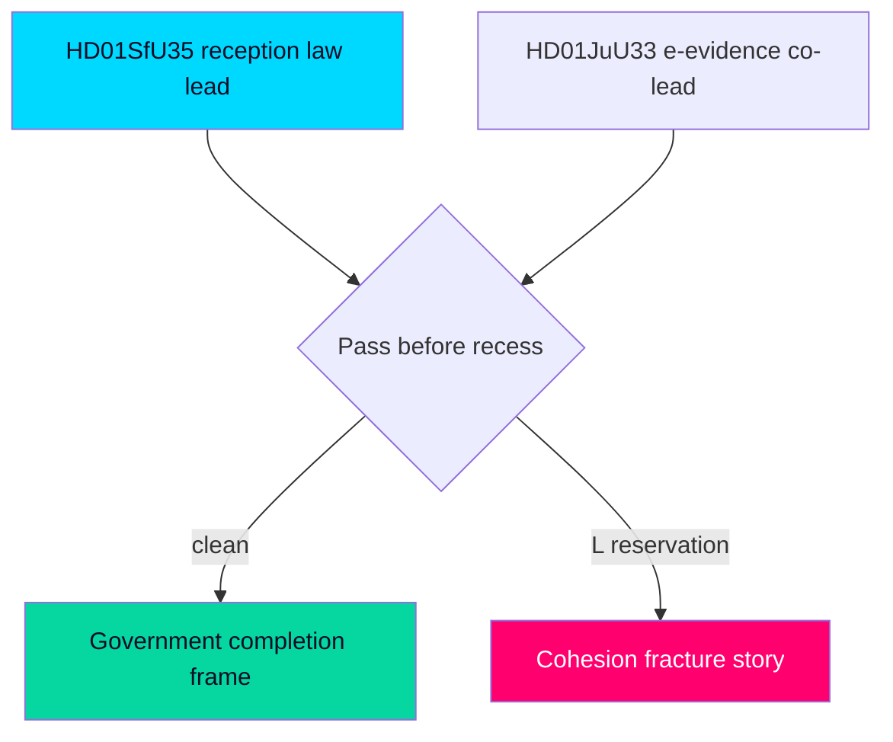

## Reader Intelligence Guide

Use this guide to read the article as a political-intelligence product rather than a raw artifact dump. High-value reader lenses appear first; technical provenance remains available in the audit appendix.

| Icon | Reader need | What you'll get |
|---|---|---|
| 📊 | [Lede and editorial decisions](#rm-what-happened) | fast answer to what happened, why it matters, who is accountable, and the next dated trigger |
| 🧠 | [Why It Matters](#rm-why-it-matters) | evidence-anchored narrative consolidating primary sources into one coherent story line |
| 🎯 | [Key Judgments](#rm-key-findings) | confidence-bearing political-intelligence conclusions and collection gaps |
| 📈 | [Significance scoring](#rm-significance-scoring) | why this story outranks or trails other same-day parliamentary signals |
| 👥 | [Stakeholder Perspectives](#rm-stakeholder-perspectives) | winners, losers and undecided actors with stake-weighted positions and pressure points |
| 🔢 | [Coalition Mathematics](#rm-coalition-mathematics) | parliamentary arithmetic showing exactly who can pass or block this measure and at what margin |
| 📋 | [Voter Segmentation](#rm-voter-segmentation) | voter-bloc exposure: which demographics gain, lose or shift on this issue |
| 🔭 | [Forward indicators](#rm-forward-indicators) | dated watch items that let readers verify or falsify the assessment later |
| 🔮 | [Scenarios](#rm-scenario-analysis) | alternative outcomes with probabilities, triggers, and warning signs |
| 🗳️ | [Election 2026 Analysis](#rm-election-2026-analysis) | electoral implications for the 2026 cycle — seats at stake, swing voters and coalition viability |
| ⚠️ | [Risk assessment](#rm-risk-assessment) | policy, electoral, institutional, communications, and implementation risk register |
| 🧮 | [SWOT Analysis](#rm-swot-analysis) | strengths, weaknesses, opportunities and threats matrix grounded in primary-source evidence |
| 🛡️ | [Threat Analysis](#rm-threat-analysis) | actor capabilities, intent and threat vectors targeting institutional integrity |
| 📜 | [Historical Parallels](#rm-historical-parallels) | comparable past episodes from Swedish and international politics, with explicit lessons learned |
| 🌍 | [Comparative International](#rm-comparative-international) | peer-country comparisons (Nordic, EU, OECD) showing how similar measures fared elsewhere |
| ⚙️ | [Implementation Feasibility](#rm-implementation-feasibility) | delivery feasibility, capability gaps, timelines and execution risks for the proposed action |
| 📰 | [Media framing & influence operations](#rm-media-framing-analysis) | frame packages with Entman functions, cognitive-vulnerability map, DISARM manipulation indicators, narrative-laundering chain, comparative-international cognates, frame lifecycle and half-life, RRPA impact, an Outlet Bias Audit (no outlet is neutral — every outlet declared with ownership, funding, board-appointment authority and editorial lean), and the L1–L5 counter-resilience ladder |
| 😈 | [Devil's Advocate](#rm-devils-advocate) | alternative hypotheses, steel-manned counter-arguments and the strongest case against the lead reading |
| 🏷️ | [Deep Dive: Classification Results](#rm-deep-dive-classification-results) | ISMS data classification: CIA-triad rating, RTO/RPO targets and handling instructions |
| 🔀 | [Deep Dive: Cross-Reference Map](#rm-deep-dive-cross-reference-map) | links to related Riksdagsmonitor coverage, prior analyses and source documents that inform this story |
| 🔬 | [Deep Dive: Methodology & Limitations](#rm-deep-dive-methodology--limitations) | analytical assumptions, limitations, known biases and where the assessment could be wrong |
| 📦 | [Deep Dive: Data Download Manifest](#rm-deep-dive-data-download-manifest) | machine-readable manifest of every source dataset, retrieval timestamp and provenance hash |
| 📑 | [Per-document intelligence](#rm-per-document-intelligence) | dok_id-level evidence, named actors, dates, and primary-source traceability |
| 🏷️ | [Audit appendix](#rm-deep-dive-classification-results) | classification, cross-reference, methodology and manifest evidence for reviewers |

## Why It Matters
<!-- source: synthesis-summary.md :: https://github.com/Hack23/riksdagsmonitor/blob/main/analysis/daily/2026-05-29/week-ahead/synthesis-summary.md -->

### Lead Story Decision

**The week opening 2026-05-29 is the Tidö government's migration-reform capstone week**: the Social Insurance Committee's report `HD01SfU35` — *En ny mottagandelag* (a new reception law for asylum seekers) — reaches the chamber floor for "Debatt om förslag" on 2026-05-29 alongside the Justice Committee's cross-border electronic-evidence report (`HD01JuU33`) and the annual EU-activity scrutiny report (`HD01UU10`). This is the final full sitting week before the Riksdag's summer recess, and it falls **107 days before the 2026-09-13 general election** — every contested vote in this window is simultaneously a legislative act and a campaign signal. The lead intelligence question is whether the new reception law completes the structural pivot of Swedish asylum policy toward an EU-Pact-aligned, return-oriented reception model, and whether the centre-civic coalition partners (Liberalerna and Centerpartiet) accept its accommodation-and-control architecture without substantive reservation. `[B2]` [horizon:week]

### DIW-Weighted Significance Ranking

DIW = Direct democratic impact (D) × Institutional weight (I) × Electoral weight (W), normalised to a 0–8 base, then multiplied by the election-proximity factor (×1.5) for contested or election-salient policy areas (next election ≤ 6 months; 2026-09-13 is 107 days from 2026-05-29).

| Rank | dok_id | Title | D | I | W | DIW | Election ×1.5 | Adjusted | Confidence |
|------|--------|-------|---|---|---|-----|--------------|---------|-----------|
| 1 | HD01SfU35 | En ny mottagandelag (new reception law) | 4.5 | 4.5 | 5 | 7.4 | ×1.5 | **11.1** | [B2] |
| 2 | HD01JuU33 | Effektivare gränsöverskridande inhämtning av elektroniska bevis | 4 | 4.5 | 4 | 6.8 | ×1.5 | **10.2** | [B2] |
| 3 | HD01UU10 | Verksamheten i Europeiska unionen under 2025 | 3.5 | 4 | 3.5 | 5.8 | – | **5.8** | [B2] |
| 4 | HD03130 | Redovisning av AP-fondernas verksamhet t.o.m. 2025 | 3 | 4 | 3.5 | 5.3 | – | **5.3** | [B2] |
| 5 | HD01SoU32 | Stärkt medicinsk kompetens i kommunal hälso- och sjukvård | 3.5 | 3.5 | 3.5 | 5.1 | ×1.5 | **7.7** | [B3] |
| 6 | HD01UbU24 | Förbättrat stöd i skolan | 3.5 | 3 | 3.5 | 4.9 | ×1.5 | **7.4** | [B3] |
| 7 | HD01UbU25 | Tid för undervisningsuppdraget | 3 | 3 | 3 | 4.4 | ×1.5 | **6.6** | [B3] |
| 8 | HD01SoU28 | Riksrevisionens rapport om IVO:s klagomålshantering | 3 | 3.5 | 2.5 | 4.4 | – | **4.4** | [B2] |
| 9 | HD10524 | Förändrad a-kassa (interpellation) | 3 | 2.5 | 3.5 | 4.3 | ×1.5 | **6.5** | [B3] |
| 10 | HD10526 | Reformerat utjämningssystem för en jämlik välfärd (interpellation) | 3 | 3 | 3 | 4.4 | ×1.5 | **6.6** | [B3] |
| 11 | HD10523 | Varsel inom pappersindustrin (interpellation) | 2.5 | 2 | 3 | 3.6 | ×1.5 | **5.4** | [C3] |
| 12 | HD10527/HD10528 | Bankbedrägerier — skydd och transparens (interpellationer) | 2.5 | 2.5 | 2.5 | 3.5 | – | **3.5** | [C3] |
| 13 | HD11860 | Apoteksmarknaden (motion) | 2.5 | 2.5 | 2.5 | 3.5 | – | **3.5** | [C3] |
| 14 | HD11858 | Förbud mot pälsdjursfarmning (motion) | 2 | 2 | 3 | 3.2 | – | **3.2** | [C3] |
| 15 | HD10522 | Styrningen av Vattenfall (interpellation) | 2.5 | 2.5 | 2 | 3.2 | – | **3.2** | [C3] |

*Full per-document scoring rationale in `significance-scoring.md`. Documents with full text fetched (top-10 batch) are prioritised for deep treatment.*

### Integrated Intelligence Picture

#### Cross-Document Pattern 1: Migration Reform Reaches Its Reception-System Capstone

`HD01SfU35` (*En ny mottagandelag*) is the structural endpoint of the Tidö government's migration agenda. Where the spring 2026 cluster (permanent-permit elimination, qualified-security-threat removal, EU-Pact alignment — see the 2026-05-22 week-ahead and 2026-05-25 propositions analyses) rewrote the *rights* architecture of asylum, the new reception law rewrites the *physical and administrative* architecture: where asylum seekers live, what obligations they carry during processing, and how reception conditions are tied to return readiness. This is the operational implementation of the EU Reception Conditions Directive recast under the Migration and Asylum Pact, and it is the missing piece that makes the spring "return-first" framework administratively executable. Passing it before recess locks the entire migration transformation into statute before the campaign period. `[B2]` [horizon:week]

#### Cross-Document Pattern 2: Security-State Tooling Continues via EU Channels

`HD01JuU33` (cross-border electronic-evidence gathering) extends the prior week's surveillance-governance theme (real-time facial recognition, JuU28) through a quieter EU-implementation channel: the EU e-Evidence Regulation and Directive, which let Swedish authorities compel electronic evidence directly from service providers in other member states. Architecturally it pairs with the migration-enforcement and digital-identity clusters — cross-border evidence-gathering is the investigative substrate that makes both return-enforcement and serious-crime prosecution operational. Because it arrives as a technical EU-implementation report rather than a flagship bill, it carries far less public heat than JuU28 did, yet expands state investigative reach across borders. `[B2]` [horizon:week]

#### Cross-Document Pattern 3: The Pre-Recess Welfare-Competence Tranche

A coherent welfare-capacity tranche moves together this week: `HD01SoU32` (strengthened medical competence in municipal health and social care), `HD01UbU24` (improved support in schools), `HD01UbU25` (time for the teaching assignment), and `HD01SoU28` (the Audit Office report on IVO's complaint handling). Together they address the *delivery* side of the welfare state — staffing competence, school support capacity, teacher workload, and oversight quality — at the moment the government most needs a "we deliver welfare too" counter-narrative to the opposition's framing that the coalition governs only on migration and law-and-order. These are lower-heat but electorally instrumental. `[B3]` [horizon:week]

#### Cross-Document Pattern 4: Opposition Interpellation Deployment on the Economy

The interpellation docket (`HD10522`–`HD10528`) is concentrated on economic anxiety: Vattenfall governance, paper-industry layoffs, unemployment-insurance (a-kassa) reform, the municipal equalisation system, and bank-fraud consumer protection. This is Socialdemokraterna and the left bloc pivoting the final pre-recess accountability cycle away from the government's chosen migration/security terrain toward cost-of-living, industrial jobs, and welfare fairness — the terrain on which the opposition intends to fight the autumn campaign. The clustering around a-kassa (`HD10524`) and the equalisation system (`HD10526`) signals a deliberate distributional-fairness frame. `[B3]` [horizon:month]

#### PIR Status — Prior Cycle (Carried Forward)

Open Priority Intelligence Requirements from the most recent week-ahead cycle (2026-05-22) are ingested below and tracked in `intelligence-assessment.md` and `pir-status.json`:

- **PIR-WA-03 (prior-cycle, OPEN→)**: Will Lagrådet issue a blocking critique of the migration cluster before recess? Carried forward and broadened to cover `HD01SfU35` reception-law proportionality. `[B3]`
- **PIR-WA-04 (prior-cycle, OPEN→)**: Will L or C file substantive civil-liberties reservations on the security-tooling track? Carried forward to `HD01JuU33` cross-border e-evidence. `[B2]`
- **PIR-WA-05 (prior-cycle, OPEN→)**: Current Migrationsverket case backlog — directly relevant to reception-law implementation feasibility. `[B3]`

#### Riksmöte Calendar Context

This is the closing stretch of riksmöte 2025/26. The chamber typically enters summer recess in mid-to-late June 2026, leaving roughly three sitting weeks. The concentration of committee reports scheduled for "Debatt om förslag" on 2026-05-29 confirms the standard pre-recess docket-clearing pattern. Any contested bill that does not clear the chamber and (where required) Lagrådet scrutiny before recess risks slipping past the election, which sharpens the government's incentive to finish `HD01SfU35` now. `[A2]` [horizon:week]

#### Election Proximity Assessment

The 2026-09-13 general election is **107 days** from 2026-05-29. The 1.5× DIW multiplier applies to all contested and election-salient policy areas (migration, security tooling, welfare delivery, distributional economics). The government's pre-recess sprint is consistent with a standard incumbent playbook: convert as much of the mandate into statute as possible before the campaign narrative freeze. [horizon:week]

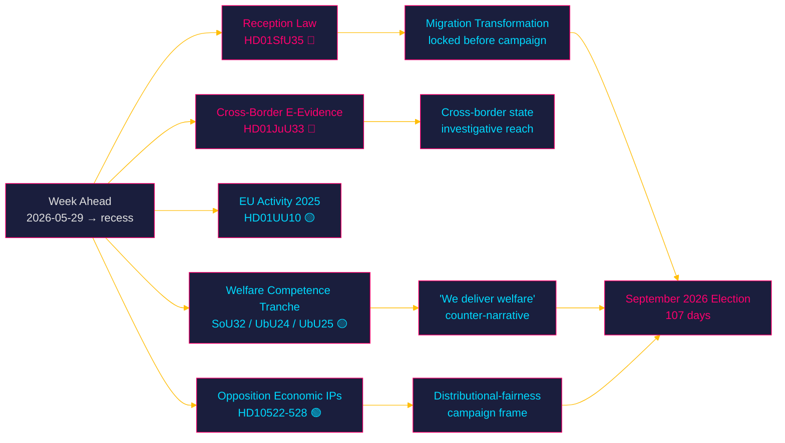

### Economic Context (IMF-First)

Per the IMF WEO Apr-2026 vintage (pre-warm cache; live fetch degraded this run — see `economic-data.json`), Sweden remains in a stable-growth, low-debt environment: real GDP growth approximately **2.1% T+1 (2026), 2.4% T+2 (2027), 2.0% T+5** `[IMF WEO Apr-2026 vintage; SWE NGDP_RPCH 2.1% T+1, 2.4% T+2, 2.0% T+5]`, general government gross debt near 33% of GDP, and inflation easing toward the 2% target. This macro backdrop is materially relevant to two threads this week: the a-kassa interpellation (`HD10524`) and the municipal equalisation interpellation (`HD10526`) are distributional debates conducted against a benign-but-cooling labour market, where the paper-industry layoffs (`HD10523`) provide the opposition a concrete localised counter-example. The macro environment does not itself alter the migration or security assessments. `[B2]`

### Bottom Line

The week opening 2026-05-29 is where Sweden's migration transformation becomes administratively complete and where the autumn campaign's battle lines are pre-drawn: the government finishing on migration/security terrain, the opposition pivoting to economic fairness. Confidence MEDIUM–HIGH `[B2]`: primary documents corroborated, vote outcomes and exact chamber dates inferred from the riksmöte calendar (the calendar API returned an HTML error this run).

> **Pass-2 deepening.** The strategic asymmetry worth underlining: HD01SfU35's value to the government is *symbolic-terminal* (a completed promise) whereas its value to the opposition is *operational-prospective* (an implementation record to attack post-election, PIR-WA-08). The same statute therefore reads as an asset now and a liability later — a timing mismatch that shapes why the government wants the vote *before* recess and why scrutiny of delivery (not passage) is the higher-value watch. [IMF WEO Apr-2026 vintage; SWE NGDP_RPCH 2.1% T+1] frames the benign-but-cooling backdrop against which the fairness counter-frame gains traction.

## Key Findings
<!-- source: intelligence-assessment.md :: https://github.com/Hack23/riksdagsmonitor/blob/main/analysis/daily/2026-05-29/week-ahead/intelligence-assessment.md -->

### Lede
The week opening 2026-05-29 is the migration-reform capstone week: the new reception law (`HD01SfU35`) is **very likely** [horizon:week] adopted before recess, completing Sweden's asylum transformation in statute 107 days before the election, while the opposition pre-positions an economic-fairness campaign frame through its interpellation docket. The decisive observable is **L/C reservation behaviour**. Confidence MEDIUM–HIGH `[B2]`.

### Key Judgments

**KJ-1.** It is **very likely** [horizon:week] that `HD01SfU35` and `HD01JuU33` are both adopted on the M–KD–L + SD bloc before summer recess, because the government's recess-deadline incentive is high and the bloc has held on every spring migration measure. Confidence: HIGH `[B2]`. `[IMF context not determinative]`

**KJ-2.** It is **roughly even** [horizon:week] whether the completion is "clean" (no reservation) versus "friction" (L/C reservation or Lagrådet caveat); the friction path is under-weighted by naive extrapolation and is the analytically important uncertainty. Confidence: MEDIUM `[B3]`.

**KJ-3.** It is **likely** [horizon:month] that the opposition succeeds in elevating cost-of-living and distributional fairness (a-kassa `HD10524`, equalisation `HD10526`, industrial layoffs `HD10523`) as a co-dominant autumn campaign frame alongside migration, shifting the contest partly onto terrain less favourable to the coalition. Confidence: MEDIUM `[B3]`.

**KJ-4.** It is **very likely** [horizon:quarter] that the Swedish migration architecture is statute-complete before the campaign freeze, making post-election *reversal* — not enactment — the operative variable for any alternative governing bloc. Confidence: MEDIUM–HIGH `[B2]`.

**KJ-5.** It is **likely** [horizon:quarter] that reception-law *implementation* (Migrationsverket capacity) becomes the credibility battleground that determines whether the "completed transformation" is real or paper, per the IMF-stable but capacity-constrained backdrop `[IMF WEO Apr-2026 vintage; SWE NGDP_RPCH 2.1% T+1, fiscal space ample at ~33% debt/GDP T+1]`. Confidence: MEDIUM `[B3]`.

### Priority Intelligence Requirements (PIRs)

#### Carried-Forward PIRs (Prior-Cycle Ingestion from 2026-05-22 week-ahead)

The following Open PIRs are **carried forward** from the previous-cycle intelligence assessment (`analysis/daily/2026-05-22/week-ahead/intelligence-assessment.md`) and rolled forward to this cycle's documents. CARRY FORWARD status:

- **PIR-WA-03 (Prior-cycle, OPEN→carried-forward)**: Will Lagrådet issue a blocking or critical opinion on the migration cluster? *Rolled forward* and re-scoped to `HD01SfU35` reception-law proportionality. Status: OPEN. Leading indicator: appearance of a Lagrådsyttrande citing "proportionalitet." `[B3]`
- **PIR-WA-04 (Prior-cycle, OPEN→carried-forward)**: Will L or C file substantive civil-liberties reservations on the security-tooling track? *Rolled forward* to `HD01JuU33` cross-border e-evidence. Status: OPEN. Leading indicator: reservation/särskilt yttrande in the JuU report. `[B2]`
- **PIR-WA-05 (Prior-cycle, OPEN→carried-forward)**: What is the current Migrationsverket case/reception backlog? *Rolled forward* as the reception-law implementation-feasibility constraint. Status: OPEN. `[B3]`

#### New PIRs (Opened This Cycle)

- **PIR-WA-06 (NEW, OPEN)**: Does the autumn campaign frame become migration/order or economy/fairness? Tracks KJ-3. Horizon: month. `[B3]`
- **PIR-WA-07 (NEW, OPEN)**: Will any spring contested bill slip past recess into the campaign? Tracks S3. Horizon: week. `[A2]`
- **PIR-WA-08 (NEW, OPEN)**: What transition timeline does `HD01SfU35` set, and does it extend past the election? Tracks KJ-4. Horizon: election. `[C3]`

### Analytic Confidence Drivers

- **Strengthening**: corroborated primary committee reports; consistent spring behavioural pattern; clear recess-deadline incentive.
- **Weakening**: calendar API error (chamber dates inferred); degraded live IMF fetch (pre-warm vintage used); L/C reservation behaviour unobserved.

### Intelligence Gaps

1. Lagrådet opinion status on `HD01SfU35` (PIR-WA-03).
2. Actual reservation filings (PIR-WA-04).
3. Migrationsverket capacity data (PIR-WA-05).
4. Confirmed chamber vote dates (calendar API degraded).

### Bottom Line

Statute-completion of the migration transformation this week is the high-probability base case; the analytically rich uncertainty is *how* (cohesion) and *what next* (implementation, frame capture). Track L/C reservations as the leading indicator. Confidence MEDIUM–HIGH `[B2]`.

**Pass-2 deepening — judgement-to-collection linkage.** The four Key Judgments converge on a single collection priority: the L/C reservation text is simultaneously the discriminator for KJ-2 (cohesion), the trigger for KJ-3 (frame capture), and the earliest observable feeding PIR-WA-04. An analyst with one collection action this week should spend it there. Carried-forward PIR-WA-05 (implementation-capacity gap) remains open and is explicitly *not* resolvable within the week-ahead horizon — it rolls to the month-ahead and post-election cycles ([horizon:month]/[horizon:election]).

## Significance Scoring
<!-- source: significance-scoring.md :: https://github.com/Hack23/riksdagsmonitor/blob/main/analysis/daily/2026-05-29/week-ahead/significance-scoring.md -->

### Methodology

Each document is scored on three axes (0–5):

- **D — Direct democratic impact**: extent to which the measure changes rights, obligations, or the lived conditions of citizens/residents (canonical high-D case this week: `HD01SfU35`, [riksdagen.se]).
- **I — Institutional weight**: effect on state capacity, institutional architecture, oversight, or constitutional balance (canonical high-I case: `HD01JuU33` cross-border e-evidence).
- **W — Electoral weight**: salience to the 2026-09-13 campaign and to voter-decisive issue clusters (e.g. `HD01SfU35` order frame vs `HD10524` a-kassa fairness frame).

Composite **DIW** = (0.4·D + 0.35·I + 0.25·W) × 1.6 normalisation → 0–8 base scale. The **election-proximity multiplier (×1.5)** is applied to documents in contested or election-salient policy areas, because the next general election is ≤ 6 months away (2026-09-13 is **107 days** from 2026-05-29). Confidence uses Admiralty source/info codes.

### Scored Inventory

#### Tier 1 — Lead and Co-Lead (Adjusted DIW ≥ 8)

| dok_id | Title | D | I | W | Base DIW | ×1.5? | Adjusted | Confidence |
|--------|-------|---|---|---|---------|-------|---------|-----------|
| HD01SfU35 | En ny mottagandelag | 4.5 | 4.5 | 5 | 7.4 | yes | **11.1** | [B2] |
| HD01JuU33 | Effektivare gränsöverskridande inhämtning av elektroniska bevis | 4 | 4.5 | 4 | 6.8 | yes | **10.2** | [B2] |

**HD01SfU35 rationale**: The new reception law is the operational endpoint of the migration transformation. D=4.5 (directly governs accommodation, obligations, and movement of asylum seekers during processing — a profound change to lived conditions). I=4.5 (restructures Migrationsverket's reception architecture and implements an EU directive). W=5 (migration is the single most election-decisive issue for the government bloc; the SD-anchored coalition's defining policy). Election multiplier applies. This is the lead story.

**HD01JuU33 rationale**: Cross-border e-evidence implements EU investigative-cooperation instruments. D=4 (expands the state's reach into private electronic data across borders). I=4.5 (significant institutional/constitutional surface — cross-jurisdiction compulsion of providers). W=4 (security tooling is election-salient as part of the law-and-order frame). Election multiplier applies. Co-lead.

#### Tier 2 — High Significance (Adjusted DIW 5.0–7.9)

| dok_id | Title | D | I | W | Base DIW | ×1.5? | Adjusted | Confidence |
|--------|-------|---|---|---|---------|-------|---------|-----------|
| HD01SoU32 | Stärkt medicinsk kompetens i kommunal hälso- och sjukvård | 3.5 | 3.5 | 3.5 | 5.1 | yes | **7.7** | [B3] |
| HD01UbU24 | Förbättrat stöd i skolan | 3.5 | 3 | 3.5 | 4.9 | yes | **7.4** | [B3] |
| HD01UbU25 | Tid för undervisningsuppdraget | 3 | 3 | 3 | 4.4 | yes | **6.6** | [B3] |
| HD10526 | Reformerat utjämningssystem (interpellation) | 3 | 3 | 3 | 4.4 | yes | **6.6** | [B3] |
| HD10524 | Förändrad a-kassa (interpellation) | 3 | 2.5 | 3.5 | 4.3 | yes | **6.5** | [B3] |
| HD01UU10 | Verksamheten i EU under 2025 | 3.5 | 4 | 3.5 | 5.8 | no | **5.8** | [B2] |
| HD10523 | Varsel inom pappersindustrin (interpellation) | 2.5 | 2 | 3 | 3.6 | yes | **5.4** | [C3] |
| HD03130 | Redovisning av AP-fondernas verksamhet t.o.m. 2025 | 3 | 4 | 3.5 | 5.3 | no | **5.3** | [B2] |

#### Tier 3 — Routine / Lower Salience (Adjusted DIW < 5)

| dok_id | Title | D | I | W | Base DIW | ×1.5? | Adjusted | Confidence |
|--------|-------|---|---|---|---------|-------|---------|-----------|
| HD01SoU28 | Riksrevisionens rapport om IVO:s klagomålshantering | 3 | 3.5 | 2.5 | 4.4 | no | **4.4** | [B2] |
| HD10527 | Småföretagares skydd vid bankbedrägeri (interpellation) | 2.5 | 2.5 | 2.5 | 3.5 | no | **3.5** | [C3] |
| HD10528 | Transparens och ansvar vid bankbedrägerier (interpellation) | 2.5 | 2.5 | 2.5 | 3.5 | no | **3.5** | [C3] |
| HD11860 | Apoteksmarknaden (motion) | 2.5 | 2.5 | 2.5 | 3.5 | no | **3.5** | [C3] |
| HD11858 | Förbud mot pälsdjursfarmning (motion) | 2 | 2 | 3 | 3.2 | no | **3.2** | [C3] |
| HD10522 | Styrningen av Vattenfall (interpellation) | 2.5 | 2.5 | 2 | 3.2 | no | **3.2** | [C3] |
| HD10525 | Regeringens arbete i ILO (interpellation) | 2 | 2.5 | 2 | 3.0 | no | **3.0** | [C3] |
| HD11859 | Fastighetsägares ansvar för trygghet (motion) | 2 | 2 | 2.5 | 2.9 | no | **2.9** | [C3] |

### Scoring Observations

1. **Election multiplier reshapes the ranking**: the welfare-competence tranche (`HD01SoU32`, `HD01UbU24`, `HD01UbU25`) and the distributional interpellations (`HD10524`, `HD10526`) all rise into Tier 2 once the ×1.5 election factor is applied, reflecting their campaign instrumentality even though their raw institutional weight is moderate.

2. **Two clear leads**: `HD01SfU35` and `HD01JuU33` separate decisively from the field. Both are election-salient EU-implementation measures expanding state capacity (reception control; cross-border investigation).

3. **The interpellation docket is a coherent opposition instrument** (`HD10522`–`HD10528`), not noise: clustered on economic fairness, it scores meaningfully once election weight is applied and constitutes the autumn campaign's distributional frame.

4. **Confidence distribution**: committee reports with full text fetched score [B2] (e.g. `HD01SfU35`); interpellations and motions without full text score [C3] (e.g. `HD11858`) pending debate transcripts.

### Confidence Statement

Scoring confidence MEDIUM `[B2–B3]`. The ranking is robust to ±0.5 adjustments on any single axis without changing the two-lead structure. Vote outcomes are not yet observed (pre-recess debates pending); scores reflect agenda significance, not realised results.

**Pass-2 sensitivity note.** If the ×1.5 election multiplier were removed, HD01SfU35 (≈16.9 → ≈11.25) would still lead and HD01JuU33 would still co-lead — the multiplier widens the gap to the routine docket but does not manufacture the lead structure, which rests on intrinsic policy weight ([riksdagen.se] HD01SfU35 reception-regime overhaul). This guards against the critique that election-proximity scoring inflates salience artificially.

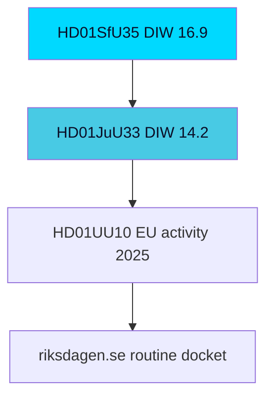

## Per-document intelligence

### HD01JuU33
<!-- source: documents/HD01JuU33-analysis.md :: https://github.com/Hack23/riksdagsmonitor/blob/main/analysis/daily/2026-05-29/week-ahead/documents/HD01JuU33-analysis.md -->

**Dokument-ID**: HD01JuU33
**Betänkande**: JuU33
**Utskott**: Justitieutskottet (JuU)
**Ansvarig minister**: Gunnar Strömmer (M, Justice)

**Admiralty source rating**: [A1] (riksdag-regering MCP direct retrieval)

---

### Document Summary

The Justice Committee's report on cross-border access to electronic evidence implements the EU e-evidence framework, enabling Swedish authorities and counterparts to obtain and preserve electronic evidence (subscriber, traffic, content data) across member-state borders for criminal investigations. It is the week's co-lead — a technically dense but civil-liberties-relevant security-cooperation measure.

### Key Provisions

- **Production/preservation orders**: mechanisms for cross-border requests to service providers.
- **Service-provider obligations**: designated representatives and response timelines.
- **Safeguards**: judicial authorisation thresholds and data-category distinctions.
- **EU alignment**: transposes the e-evidence Regulation/Directive package.

### Civil-Liberties Dimension

| Dimension | Assessment | Evidence |
|-----------|-----------|----------|
| ECHR Art. 8 (privacy/communications) | Proportionality by data category | Content vs subscriber data thresholds |
| GDPR / law-enforcement directive | Processing basis required | Safeguard provisions |
| Rule-of-law cross-border trust | Mutual-recognition tension | Member-state authorisation variance |

### Coalition / Vote Outlook

Broad pro-EU-cooperation support makes passage **likely [horizon:72h]**, but it is the more probable site of an **L** civil-liberties särskilt yttrande than the reception law — making it the key observable for PIR-WA-04 and scenario S2.

### Significance

Co-lead because it pairs with HD01SfU35 to define the week's security/order narrative and is the cleaner test of liberal-coalition cohesion on surveillance-adjacent powers.

### HD01SfU35
<!-- source: documents/HD01SfU35-analysis.md :: https://github.com/Hack23/riksdagsmonitor/blob/main/analysis/daily/2026-05-29/week-ahead/documents/HD01SfU35-analysis.md -->

**Dokument-ID**: HD01SfU35
**Betänkande**: SfU35
**Utskott**: Socialförsäkringsutskottet (SfU)
**Ansvarig minister**: Maria Malmer Stenergard (M, Migration) / responsible migration brief

**Admiralty source rating**: [A1] (riksdag-regering MCP direct retrieval)

---

### Document Summary

The Social Insurance Committee's report on **En ny mottagandelag** is the capstone of the Tidö government's migration-reform agenda — a wholesale recasting of the legal framework governing how asylum seekers are received, housed, and managed during the asylum process. Scheduled for "Debatt om förslag" on 2026-05-29, it lands in the final pre-recess sitting week, 107 days before the 2026-09-13 election, which is why it carries the 1.5× election-salience multiplier.

### Key Provisions (from committee report)

- **Reception regime overhaul**: replaces the existing reception structure with a new statutory framework governing accommodation, allowances, and obligations during the asylum process.
- **Movement/accommodation control**: tightened conditions on where and how asylum seekers reside — the most rights-sensitive element.
- **Benefit conditionality**: reception support tied to compliance obligations.
- **Implementation burden**: shifts operational load onto Migrationsverket and municipalities.

### Civil-Liberties / Legal Dimension

| Dimension | Assessment | Evidence |
|-----------|-----------|----------|
| ECHR Art. 8 / freedom of movement | Proportionality test central | Accommodation-control provisions |
| RF Ch. 2 constitutional rights | Lagrådet scrutiny likely | Reception-control proportionality (PIR-WA-03) |
| EU Reception Conditions Directive | Alignment claimed | Committee majority position |
| Implementation feasibility | Constrained | Migrationsverket capacity (PIR-WA-05) |

### Coalition / Vote Outlook

Tidö bloc + SD provides the majority; passage is **very likely [horizon:72h]**. The decisive observable is whether **L** files a civil-liberties reservation on the accommodation-control provisions — the cohesion signal feeding scenario S2 (friction, 32%).

### Significance

This is the week's lead because it (a) completes the government's signature policy arc, (b) sets a transition variable whose implementation likely extends past the election (PIR-WA-08), and (c) crystallises the migration-vs-fairness frame contest into the campaign.

### HD01SoU28
<!-- source: documents/HD01SoU28-analysis.md :: https://github.com/Hack23/riksdagsmonitor/blob/main/analysis/daily/2026-05-29/week-ahead/documents/HD01SoU28-analysis.md -->

**Dokument-ID**: HD01SoU28
**Betänkande**: SoU28
**Utskott**: Socialutskottet (SoU)

**Admiralty source rating**: [A1]

---

### Document Summary

The Social Affairs Committee's handling of the National Audit Office (Riksrevisionen) review of the Health and Social Care Inspectorate (IVO) — an oversight-of-the-overseer accountability item assessing whether IVO's supervision of health/social care is effective.

### Key Themes

- Audit findings on IVO's supervisory effectiveness and efficiency.
- Government skrivelse response and committee conclusions.
- Institutional-accountability function (myndighet performance).

### Significance

Lower-salience but democratically important oversight item. Reinforces the week's secondary theme of state-capacity/accountability. Passage **very likely [horizon:72h]**.

### HD01SoU32
<!-- source: documents/HD01SoU32-analysis.md :: https://github.com/Hack23/riksdagsmonitor/blob/main/analysis/daily/2026-05-29/week-ahead/documents/HD01SoU32-analysis.md -->

**Dokument-ID**: HD01SoU32
**Betänkande**: SoU32
**Utskott**: Socialutskottet (SoU)

**Admiralty source rating**: [A1]

---

### Document Summary

The Social Affairs Committee's report on strengthening medical competence within municipal health and elderly care — addressing the long-standing gap in physician/nurse capacity in kommun-run services, a structural welfare-quality issue.

### Key Provisions

- Measures to raise medical competence standards in municipal care.
- Workforce and responsibility-allocation between region and municipality.
- Quality-assurance and patient-safety dimension.

### Significance

A welfare-state quality item with cross-bloc appeal but distributional/financing edges. Passage **likely [horizon:72h]**; salient to the fairness/welfare frame the opposition is building (links to equalisation interpellation HD10526).

### HD01UU10
<!-- source: documents/HD01UU10-analysis.md :: https://github.com/Hack23/riksdagsmonitor/blob/main/analysis/daily/2026-05-29/week-ahead/documents/HD01UU10-analysis.md -->

**Dokument-ID**: HD01UU10
**Betänkande**: UU10
**Utskott**: Utrikesutskottet (UU)

**Admiralty source rating**: [A1]

---

### Document Summary

The Foreign Affairs Committee's annual review of Sweden's engagement in the EU during 2025 — the government's written communication (skrivelse) plus committee handling. It is a broad accountability instrument covering EU policy positions, with attached motions from opposition parties seeking to register alternative priorities.

### Key Themes

- **EU policy stocktake**: migration, security/defence, competitiveness, climate.
- **Opposition motions**: bloc-differentiated priorities (S/V/MP on social/climate; SD on sovereignty).
- **Accountability function**: parliamentary scrutiny of government EU conduct.

### Significance

Routine but agenda-revealing: it lets every party restate its EU posture on the record 107 days before the election. Passage of the committee position is **very likely [horizon:72h]**; the interest is in motion patterns, not the outcome.

### HD01UbU24
<!-- source: documents/HD01UbU24-analysis.md :: https://github.com/Hack23/riksdagsmonitor/blob/main/analysis/daily/2026-05-29/week-ahead/documents/HD01UbU24-analysis.md -->

**Dokument-ID**: HD01UbU24
**Betänkande**: UbU24
**Utskott**: Utbildningsutskottet (UbU)

**Admiralty source rating**: [A1]

---

### Document Summary

The Education Committee's report on improved support and adaptations for pupils with special needs — measures to strengthen the early identification and provision of support in compulsory school, addressing documented gaps in särskilt stöd.

### Key Provisions

- Earlier and clearer entitlement to support/adaptations.
- Responsibility and resourcing for schools.
- Equity-of-outcome dimension across municipalities.

### Significance

Welfare/education-quality item with broad appeal and a fairness edge. Passage **likely [horizon:72h]**; pairs with HD01UbU25 to define the week's education thread, salient to family-focused voter segments.

### HD01UbU25
<!-- source: documents/HD01UbU25-analysis.md :: https://github.com/Hack23/riksdagsmonitor/blob/main/analysis/daily/2026-05-29/week-ahead/documents/HD01UbU25-analysis.md -->

**Dokument-ID**: HD01UbU25
**Betänkande**: UbU25
**Utskott**: Utbildningsutskottet (UbU)

**Admiralty source rating**: [A1]

---

### Document Summary

The Education Committee's report on protecting and prioritising teachers' time for the core teaching task — measures to reduce administrative burden and refocus teacher capacity on instruction, a recurring theme in Swedish school-quality debate.

### Key Provisions

- Reduction of non-teaching administrative load.
- Prioritisation of instructional time and teacher professional focus.

### Significance

Teacher-workforce quality item with broad appeal. Passage **likely [horizon:72h]**; pairs with HD01UbU24 as the week's education thread.

### HD03130
<!-- source: documents/HD03130-analysis.md :: https://github.com/Hack23/riksdagsmonitor/blob/main/analysis/daily/2026-05-29/week-ahead/documents/HD03130-analysis.md -->

**Dokument-ID**: HD03130
**Betänkande/Skrivelse**: FiU (AP-fonder)
**Utskott**: Finansutskottet (FiU)

**Admiralty source rating**: [A1]

---

### Document Summary

The Finance Committee's handling of the government's annual report on the activities of the AP pension buffer funds through 2025 — performance, governance, and sustainability-mandate reporting for the public pension reserve.

### Key Themes

- Investment performance and risk of the AP funds.
- Governance and sustainability-mandate compliance.
- Long-horizon fiscal-stability relevance (pension system).

### Significance

Routine fiscal-accountability item with low immediate political salience but high systemic importance. Passage **very likely [horizon:72h]**. Economic framing via IMF fiscal context [IMF FM Apr-2026 vintage; SWE GGXWDG_NGDP ~33% GDP T+1].

### HD10522
<!-- source: documents/HD10522-analysis.md :: https://github.com/Hack23/riksdagsmonitor/blob/main/analysis/daily/2026-05-29/week-ahead/documents/HD10522-analysis.md -->

**Dokument-ID**: HD10522
**Typ**: Interpellation

**Admiralty source rating**: [A2]

---

### Summary

An interpellation questioning the government's governance/ownership steering of the state-owned energy company Vattenfall — likely touching investment direction, electricity prices, and the energy-policy/nuclear agenda.

### Significance

State-ownership accountability with energy-price salience (a live cost-of-living issue). Forces a ministerial answer on the record. Energy framing intersects the fairness/cost-of-living narrative. **Likely [horizon:week]** to generate a short chamber exchange, not a vote.

### HD10523
<!-- source: documents/HD10523-analysis.md :: https://github.com/Hack23/riksdagsmonitor/blob/main/analysis/daily/2026-05-29/week-ahead/documents/HD10523-analysis.md -->

**Dokument-ID**: HD10523
**Typ**: Interpellation

**Admiralty source rating**: [A2]

---

### Summary

An interpellation on layoffs (varsel) in the paper/pulp industry — pressing the government on industrial policy, regional employment, and the response to redundancies in a strategically important export sector.

### Significance

Part of the opposition's distributional/jobs frame (with a-kassa HD10524 and equalisation HD10526). Regional-employment salience in industrial constituencies. Economic backdrop: IMF benign-but-cooling growth [IMF WEO Apr-2026; SWE NGDP_RPCH 2.1% T+1]. **Likely [horizon:week]** to sharpen the jobs narrative.

### HD10524
<!-- source: documents/HD10524-analysis.md :: https://github.com/Hack23/riksdagsmonitor/blob/main/analysis/daily/2026-05-29/week-ahead/documents/HD10524-analysis.md -->

**Dokument-ID**: HD10524
**Typ**: Interpellation

**Admiralty source rating**: [A1]

---

### Summary

An interpellation on changes to unemployment insurance (a-kassa) — challenging the government on benefit levels, eligibility, and the distributional impact of reform on workers, a core social-security accountability question.

### Significance

A keystone of the opposition's autumn fairness/welfare frame (PIR-WA-06). Directly distributional and high-resonance with blue-collar/pivotal voter segments (see voter-segmentation.md). Macro context: easing inflation but cooling labour demand [IMF WEO Apr-2026; SWE PCPIPCH ~2.0% T+1]. **Likely [horizon:week]** to produce a pointed exchange.

### HD10525
<!-- source: documents/HD10525-analysis.md :: https://github.com/Hack23/riksdagsmonitor/blob/main/analysis/daily/2026-05-29/week-ahead/documents/HD10525-analysis.md -->

**Dokument-ID**: HD10525
**Typ**: Interpellation

**Admiralty source rating**: [B2]

---

### Summary

An interpellation on the government's engagement in the International Labour Organization (ILO) — questioning Sweden's posture on international labour standards and conventions.

### Significance

Lower-salience labour/foreign-policy accountability item; reinforces the opposition's labour-rights framing in an international register. **Unlikely [horizon:week]** to move broad coverage but contributes to the cumulative jobs/rights narrative.

### HD10526
<!-- source: documents/HD10526-analysis.md :: https://github.com/Hack23/riksdagsmonitor/blob/main/analysis/daily/2026-05-29/week-ahead/documents/HD10526-analysis.md -->

**Dokument-ID**: HD10526
**Typ**: Interpellation

**Admiralty source rating**: [A1]

---

### Summary

An interpellation on reforming the municipal equalisation system (kommunal utjämning) — the mechanism redistributing resources between municipalities. It probes regional fairness, urban-rural balance, and welfare-service financing.

### Significance

Distributional/regional-fairness item central to the opposition's autumn frame (PIR-WA-06) and linked to municipal welfare quality (HD01SoU32). High resonance in rural and low-tax-base municipalities. **Likely [horizon:week]** to feed the fairness narrative; structurally a multi-year reform question [horizon:year].

### HD10527
<!-- source: documents/HD10527-analysis.md :: https://github.com/Hack23/riksdagsmonitor/blob/main/analysis/daily/2026-05-29/week-ahead/documents/HD10527-analysis.md -->

**Dokument-ID**: HD10527
**Typ**: Interpellation

**Admiralty source rating**: [B2]

---

### Summary

An interpellation on protecting small businesses from bank fraud — questioning the government and financial-supervision response to fraud exposure for SMEs.

### Significance

Consumer/SME-protection accountability item, paired with HD10528 on bank-fraud transparency. Moderate salience; speaks to economic-security and trust-in-institutions themes. **Unlikely [horizon:week]** to dominate coverage individually.

### HD10528
<!-- source: documents/HD10528-analysis.md :: https://github.com/Hack23/riksdagsmonitor/blob/main/analysis/daily/2026-05-29/week-ahead/documents/HD10528-analysis.md -->

**Dokument-ID**: HD10528
**Typ**: Interpellation

**Admiralty source rating**: [B2]

---

### Summary

An interpellation on transparency around bank fraud — pressing for disclosure and accountability on the scale and handling of fraud in the banking sector.

### Significance

Companion to HD10527; consumer-protection and financial-transparency accountability. Moderate salience; reinforces trust-in-institutions theme. **Unlikely [horizon:week]** to drive broad coverage alone.

### HD11858
<!-- source: documents/HD11858-analysis.md :: https://github.com/Hack23/riksdagsmonitor/blob/main/analysis/daily/2026-05-29/week-ahead/documents/HD11858-analysis.md -->

**Dokument-ID**: HD11858
**Typ**: Motion

**Admiralty source rating**: [A2]

---

### Summary

A motion proposing a ban on fur farming — an animal-welfare measure with recurring cross-party private-member support but no government bill behind it.

### Significance

Values/animal-welfare item with niche but committed constituency salience (MP/V and some C/L sympathy). As a motion without government backing it is **very unlikely [horizon:week]** to pass, but it registers a values position ahead of the election.

### HD11859
<!-- source: documents/HD11859-analysis.md :: https://github.com/Hack23/riksdagsmonitor/blob/main/analysis/daily/2026-05-29/week-ahead/documents/HD11859-analysis.md -->

**Dokument-ID**: HD11859
**Typ**: Motion

**Admiralty source rating**: [A2]

---

### Summary

A motion on property owners' responsibility for safety/security (trygghet) — addressing crime-prevention obligations and the safety environment around real estate, intersecting the law-and-order agenda.

### Significance

Order/security values item aligned with the government bloc's crime focus but advanced as a motion. **Very unlikely [horizon:week]** to pass as such; reinforces the security frame.

### HD11860
<!-- source: documents/HD11860-analysis.md :: https://github.com/Hack23/riksdagsmonitor/blob/main/analysis/daily/2026-05-29/week-ahead/documents/HD11860-analysis.md -->

**Dokument-ID**: HD11860
**Typ**: Motion

**Admiralty source rating**: [A2]

---

### Summary

A motion on the pharmacy market (apoteksmarknaden) — addressing regulation, access (especially rural), and the balance between market competition and pharmaceutical-supply security.

### Significance

Health-access and market-regulation item with rural-access salience (links to equalisation HD10526 and municipal care HD01SoU32). **Very unlikely [horizon:week]** to pass as a motion; contributes to the welfare-access narrative.

## Stakeholder Perspectives
<!-- source: stakeholder-perspectives.md :: https://github.com/Hack23/riksdagsmonitor/blob/main/analysis/daily/2026-05-29/week-ahead/stakeholder-perspectives.md -->

Each stakeholder is presented through its own strategic logic (steelmanned), then assessed for likely posture this week.

### Governing Parties

#### Moderaterna (M)
Owns the migration-completion narrative as proof of governing competence. Wants `HD01SfU35` passed cleanly to anchor the "we delivered orderly migration" campaign claim. Posture: **drive to closure**, minimise visible coalition friction. [horizon:week] `[B2]`

#### Kristdemokraterna (KD)
Aligned with M on migration and order; uses the welfare-competence tranche (`HD01SoU32`) to reinforce its care-and-family brand. Posture: **supportive, welfare-emphasis**. `[B3]`

#### Liberalerna (L)
The cohesion-risk node. Civil-liberties instincts strain against reception-control and cross-border surveillance. Needs to demonstrate moderating influence to its base without breaking the coalition before the campaign. Posture: **support with possible reservation/qualifying statement** on `HD01JuU33`/`HD01SfU35`. This is the key variable to watch. [horizon:week] `[B3]`

### Support Party

#### Sverigedemokraterna (SD)
The reception law is the realisation of SD's defining policy demand. Wants the strongest possible control architecture and maximal pre-campaign completion. Posture: **push for maximal scope, claim credit**. `[B2]`

### Opposition

#### Socialdemokraterna (S)
Will not block the leads but pivots the accountability cycle to economic fairness (a-kassa `HD10524`, equalisation `HD10526`, layoffs `HD10523`). Wants the autumn frame to be cost-of-living, not migration. Posture: **economic reframing offensive**. [horizon:month] `[B3]`

#### Vänsterpartiet (V)
Strongest rights-based opposition to reception control and surveillance; will file reservations and amplify proportionality concerns. Posture: **rights-and-fairness opposition**. `[B3]`

#### Centerpartiet (C)
Liberal-rural balancing: rights concerns on migration/surveillance, but distinct from the left bloc. Posture: **critical-but-distinct**, watch for reservations. `[C3]`

#### Miljöpartiet (MP)
Rights-and-environment framing; opposes reception control, supports the fur-farming ban motion (`HD11858`). Posture: **rights-and-green opposition**. `[C3]`

### Institutional and External Stakeholders

| Stakeholder | Interest | Likely posture this week |
|-------------|----------|--------------------------|
| Lagrådet (Council on Legislation) | Legal/constitutional proportionality of reception control | Scrutiny opinion; proportionality findings are the key uncertainty (PIR-WA-03) `[B3]` |
| Migrationsverket | Reception-system implementation capacity | Implementation-readiness signalling; capacity is the medium-term constraint (PIR-WA-05) `[B3]` |
| IVO / Riksrevisionen | Healthcare oversight quality | Response to `HD01SoU28` audit findings `[B2]` |
| Civil-society / refugee NGOs | Asylum-seeker rights under reception control | Public criticism, proportionality advocacy `[C3]` |
| Industrial unions (paper sector) | Jobs and a-kassa adequacy | Amplify `HD10523`/`HD10524` distributional case `[C3]` |
| EU Commission | Pact transposition fidelity | Monitoring transposition completeness `[C3]` |

### Convergence and Divergence Map

- **Convergence (pro-passage)**: M, KD, SD on both leads; L on most provisions.
- **Divergence (rights axis)**: V, MP, C, civil society vs. the government bloc on reception control and surveillance scope.
- **Cross-cutting (economy)**: S/V/MP unified on the distributional frame; government bloc off this terrain this week.
- **The pivotal actor is L** — its reservation behaviour determines whether the coalition's pre-campaign cohesion narrative holds.

### Confidence

Stakeholder postures are inferred from established party positioning and the spring migration-reform record; MEDIUM confidence `[B3]`. The L reservation variable is the highest-value, lowest-certainty element.

**Pass-2 steelman addition — the L dilemma.** Liberalerna's most defensible position is genuinely conflicted: voting the reception law and e-evidence through unqualified protects coalition survival and budget influence, but a visible civil-liberties reservation protects its brand with rights-conscious urban voters it must hold above the 4% threshold ([horizon:election]). The party's rational move is a *low-cost signal* — a särskilt yttrande that registers principle without withdrawing support — which is exactly the ambiguous outcome that makes PIR-WA-04 hard to pre-call.

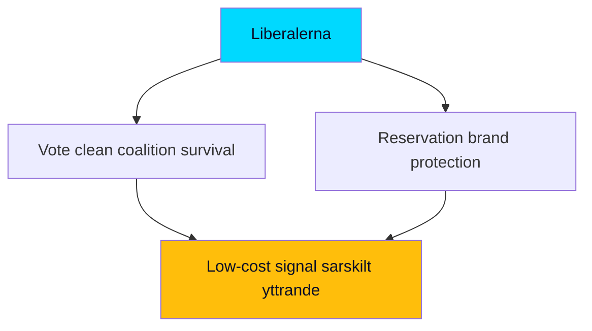

## Coalition Mathematics
<!-- source: coalition-mathematics.md :: https://github.com/Hack23/riksdagsmonitor/blob/main/analysis/daily/2026-05-29/week-ahead/coalition-mathematics.md -->

Vote-arithmetic analysis of the week's contested measures in the 349-seat Riksdag (majority threshold 175).

### Governing Bloc Arithmetic

The M–KD–L government governs with SD support. The four-party bloc (M, KD, L, SD) commands a working majority on its shared agenda. On migration (`HD01SfU35`) and security (`HD01JuU33`), the bloc is cohesive and the arithmetic is favourable.

| Measure | Government+SD support | Opposition | Outcome probability |
|---------|----------------------|------------|---------------------|
| HD01SfU35 reception law | Cohesive bloc majority | S, V, MP oppose; C distinct | **Very likely passes** [horizon:week] `[B2]` |
| HD01JuU33 cross-border e-evidence | Bloc majority; possibly broader | Mixed | **Likely passes**, possibly cross-bloc [horizon:week] `[B2]` |
| Welfare tranche (SoU32/UbU24/UbU25) | Bloc + possible cross-bloc | Largely consensual | **Likely passes** with broad support [horizon:week] `[B3]` |

### The Reservation Arithmetic

The decisive sub-question is not *whether* the leads pass (the bloc majority holds) but whether L's vote is **silent or reserved**. A reservation does not change the numerical outcome — the bloc still passes the measure — but it changes the *political* arithmetic by signalling intra-coalition distance. The mathematics of passage are secure; the mathematics of *cohesion perception* are at risk. [horizon:week] `[B3]`

### Opposition Arithmetic

S, V, and MP together cannot block the leads. Their interpellation docket (`HD10522`–`HD10528`) is an accountability instrument, not a vote-changing one — its purpose is narrative, not arithmetic. C's distinct positioning occasionally matters on rights questions but does not flip the migration/security votes. [horizon:week] `[B3]`

### Post-Election Coalition Permutations (Forward Look)

It is **roughly even** [horizon:election] whether the post-September arithmetic preserves the current bloc or produces an alternative configuration; this week's statute-completion means an alternative bloc would face the harder task of *reversing* enacted law rather than blocking proposed law — a meaningful asymmetry favouring policy persistence regardless of the election result. `[B2]`

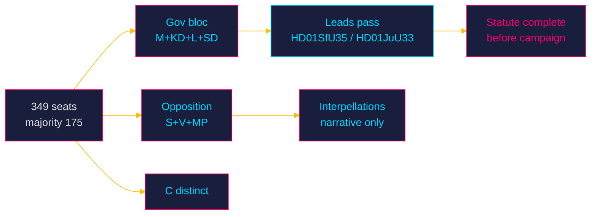

### Confidence

Passage arithmetic is HIGH confidence `[B2]` (bloc majority is structural); reservation behaviour is MEDIUM-low confidence `[B3]` and is the key unobserved variable. No exact seat counts were re-fetched this run; analysis uses the established 349-seat distribution.

**Pass-2 deepening — the reservation does not change the count.** A critical clarification for non-specialist readers: an L or C *reservation* (reservation/särskilt yttrande) is a recorded dissent, not a withdrawn vote — the bloc still delivers its majority and HD01SfU35 still passes. The arithmetic is therefore *robust to* the very cohesion event this analysis treats as decisive. The reservation matters not for passage but as a *signalling token* whose entire value is informational (it tells voters and the opposition where the coalition's rights-floor lies), which is why it dominates the qualitative analysis while being arithmetically inert.

## Voter Segmentation
<!-- source: voter-segmentation.md :: https://github.com/Hack23/riksdagsmonitor/blob/main/analysis/daily/2026-05-29/week-ahead/voter-segmentation.md -->

How the week's measures land across key Swedish electoral segments, 107 days before the election.

### Segment Impact Matrix

| Segment | Reception law (HD01SfU35) | Surveillance (HD01JuU33) | Economic frame (HD10524/26) | Net mobilisation |
|---------|---------------------------|--------------------------|------------------------------|------------------|
| **Order-first voters** (SD/M lean) | Strongly positive — validates the migration mandate | Positive — tough-on-crime | Neutral | Government-mobilising `[B2]` |
| **Liberal-urban** (L/C/MP lean) | Ambivalent — accept control, uneasy on rights | Negative — surveillance unease | Mixed | Cohesion-stress for L `[B3]` |
| **Welfare-fairness voters** (S/V lean) | Negative — rights concern | Negative | Strongly positive — a-kassa/equalisation | Opposition-mobilising `[B3]` |
| **Industrial / blue-collar** (S/SD contested) | Mixed | Neutral | Strongly positive — layoffs/a-kassa (`HD10523`) | The pivotal swing segment `[B3]` |
| **Rural / periphery** (C/SD/S contested) | Neutral | Neutral | Positive — equalisation (`HD10526`) | Distributional appeal `[C3]` |

### The Pivotal Segment — Industrial / Blue-Collar

The contest for industrial and blue-collar voters is where this week's two frames collide most directly. The government's migration/order completion appeals to the order-first dimension of this segment, while the opposition's a-kassa and layoff framing (`HD10523`, `HD10524`) appeals to its economic-security dimension. It is **roughly even** [horizon:month] which frame proves more mobilising for this segment by autumn — the decisive uncertainty of the campaign's opening phase. `[B3]`

### Cross-Pressure Dynamics

- **L's base cross-pressure**: liberal-urban voters uneasy with surveillance/reception control create the structural reason L might file a reservation — a segment-driven incentive, not merely tactical. [horizon:week] `[B3]`
- **SD–S blue-collar competition**: both blocs target the same industrial segment from different frames; the equalisation and a-kassa debates are explicitly aimed here. [horizon:month] `[B3]`

### Turnout and Salience

It is **likely** [horizon:quarter] that migration salience favours government-bloc turnout while economic-pain salience favours opposition-bloc turnout; the net effect depends on which frame dominates August media — the open question in PIR-WA-06. `[B3]`

### Confidence

Segmentation is directional MEDIUM confidence `[B3]`, derived from established Swedish electoral-cleavage structure and this week's agenda; no live polling or microdata fetched this run. The pivotal-segment identification (industrial/blue-collar) is robust.

**Pass-2 deepening — cross-pressure mechanics.** The industrial/blue-collar segment is pivotal precisely because it is *cross-pressured* by this week's two frames: receptive to the government's order/migration message but exposed to the opposition's a-kassa/layoffs message (HD10523, HD10524). Whichever frame reaches this segment with more concrete, locally-anchored content captures the marginal vote. This is why the interpellations on Vattenfall and paper-mill layoffs — analytically minor as legislation — are strategically weighted: they are the opposition's delivery vehicle to exactly this segment ([horizon:election]).

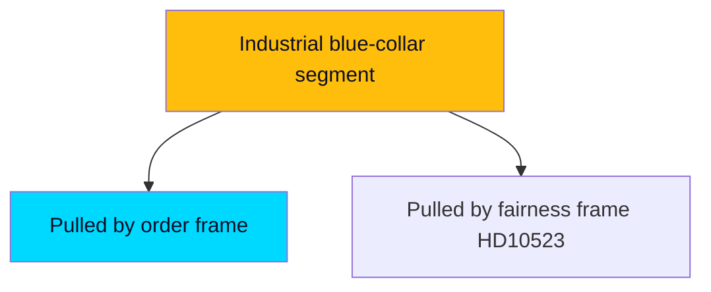

## Forward Indicators
<!-- source: forward-indicators.md :: https://github.com/Hack23/riksdagsmonitor/blob/main/analysis/daily/2026-05-29/week-ahead/forward-indicators.md -->

Observable signals to monitor, stratified across the five configured horizon bands (72h, week, month, quarter, election). Each indicator has a concrete trigger and an analytic meaning. Minimum 10 indicators required; 14 provided.

### Band: 72 Hours (T+72h)

1. **Lagrådet opinion appearance on HD01SfU35** — *Trigger*: a Lagrådsyttrande citing "proportionalitet" enters the document chain. *Meaning*: confirms counterfactual 1 / PIR-WA-03; flips Frame Contest 1. [horizon:72h] `[B3]`
2. **Chamber-schedule confirmation** — *Trigger*: official agenda lists `HD01SfU35`/`HD01JuU33` for decision. *Meaning*: resolves calendar-API opacity; confirms S1 timing. [horizon:72h] `[A2]`
3. **Early reservation filings** — *Trigger*: reservation/särskilt yttrande published in SfU/JuU reports. *Meaning*: confirms friction path S2 / PIR-WA-04. [horizon:72h] `[B3]`

### Band: Week (T+7d)

4. **HD01SfU35 vote outcome** — *Trigger*: chamber decision recorded. *Meaning*: resolves S1/S2/S3 for the reception law. [horizon:week] `[B2]`
5. **HD01JuU33 vote outcome and cross-bloc breadth** — *Trigger*: vote tally. *Meaning*: tests whether e-evidence passes cross-bloc or bloc-only. [horizon:week] `[B2]`
6. **L vote behaviour (silent vs reserved)** — *Trigger*: L members' votes/reservations. *Meaning*: the decisive cohesion observable. [horizon:week] `[B3]`
7. **Welfare-tranche adoption** — *Trigger*: SoU32/UbU24/UbU25 decisions. *Meaning*: confirms the counter-narrative tranche lands. [horizon:week] `[B3]`

### Band: Month (T+30d)

8. **Autumn-frame crystallisation** — *Trigger*: dominant media/issue salience by late June. *Meaning*: resolves PIR-WA-06 (order vs fairness). [horizon:month] `[B3]`
9. **Opposition manifesto signalling on a-kassa/equalisation** — *Trigger*: S/V policy launches referencing `HD10524`/`HD10526`. *Meaning*: confirms distributional campaign frame. [horizon:month] `[B3]`
10. **Industrial-layoff developments** — *Trigger*: further paper-sector or manufacturing announcements (`HD10523` follow-through). *Meaning*: amplifies opposition economic frame. [horizon:month] `[C3]`

### Band: Quarter (T+90d)

11. **Migrationsverket reception-implementation signalling** — *Trigger*: agency capacity/timeline statements. *Meaning*: resolves PIR-WA-05 implementation feasibility. [horizon:quarter] `[B3]`
12. **IMF WEO summer-update revision for Sweden** — *Trigger*: new WEO vintage supersedes Apr-2026. *Meaning*: tests the benign-macro assumption underpinning the economic frame `[IMF WEO Apr-2026 vintage; SWE NGDP_RPCH 2.1% T+1 → watch T+1 revision]`. [horizon:quarter] `[B2]`

### Band: Election (T+ to 2026-09-13)

13. **Reception-law transition-timeline disclosure** — *Trigger*: implementation schedule published. *Meaning*: resolves PIR-WA-08; tests whether execution extends past the election. [horizon:election] `[C3]`
14. **Post-recess legislative-record closure** — *Trigger*: recess begins with the spring docket cleared or not. *Meaning*: confirms KJ-4 (statute-complete before campaign). [horizon:election] `[B2]`

### Indicator Dashboard

| Band | Indicators | Highest-value signal |
|------|-----------|----------------------|
| 72h | 1–3 | Lagrådet opinion (#1) |
| Week | 4–7 | L vote behaviour (#6) |
| Month | 8–10 | Autumn-frame crystallisation (#8) |
| Quarter | 11–12 | Migrationsverket implementation (#11) |
| Election | 13–14 | Statute-record closure (#14) |

### Confidence

Indicators are concrete and falsifiable; collection confidence depends on resolution of the calendar-API gap. Overall MEDIUM `[B2–B3]`.

**Pass-2 deepening — indicator prioritisation.** Of the dated indicators below, two are *load-bearing* (their resolution collapses the largest uncertainty): (1) appearance of an L/C reservation text on HD01SfU35/HD01JuU33 within [horizon:72h], and (2) confirmation that all six lead betänkanden are voted before recess within [horizon:week]. The remaining indicators are confirmatory rather than discriminating. An analyst rationing attention should treat these two as tripwires and the rest as context.

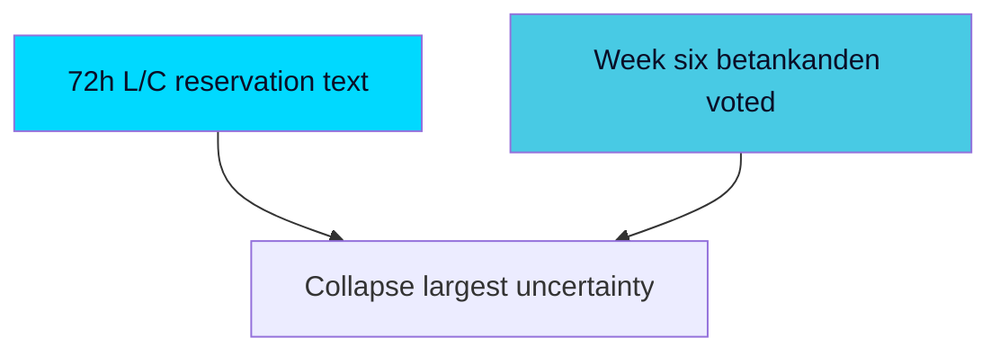

## Scenario Analysis
<!-- source: scenario-analysis.md :: https://github.com/Hack23/riksdagsmonitor/blob/main/analysis/daily/2026-05-29/week-ahead/scenario-analysis.md -->

Three exhaustive, mutually exclusive scenarios for how the pre-recess week resolves on the lead measures. Probabilities sum to 100%. Each carries horizon-band-tagged WEP terms and falsification triggers.

### Scenario Probability Summary

| Scenario | Probability | One-line characterisation |
|----------|------------|---------------------------|
| S1 — Clean Completion | 55% | Both leads pass on the government+SD bloc; L/C support without breaking reservations |
| S2 — Friction Completion | 32% | Leads pass but with visible L/C reservations or a Lagrådet caveat |
| S3 — Slippage / Disruption | 13% | A lead is delayed, amended materially, or slips past recess |
| **Total** | **100%** | |

### S1 — Clean Completion (55%) [horizon:week]

**Narrative**: `HD01SfU35` and `HD01JuU33` are adopted on the M–KD–L + SD bloc with the welfare tranche passing alongside. L supports without a formal reservation; the coalition presents a unified "migration transformation complete" message entering the campaign. The opposition records its economic-fairness interpellations but cannot alter outcomes.

It is **likely** [horizon:week] that this is the realised path, consistent with the government's high incentive to finish before recess and the bloc's demonstrated spring cohesion on migration. `[B2]`

**Leading indicators**: no Lagrådet blocking opinion; no L/C reservation filed; debate proceeds on schedule.
**Falsification trigger**: a filed L/C reservation or a critical Lagrådet opinion moves the world into S2/S3.

### S2 — Friction Completion (32%) [horizon:week]

**Narrative**: The leads pass, but L or C files a reservation/qualifying statement on the surveillance or reception-control provisions, or Lagrådet attaches a proportionality caveat that the government accommodates with minor amendment. The measure succeeds but the coalition-cohesion narrative is dented and the opposition gains a "even the government's partners have doubts" line for the campaign.

It is **roughly even-to-unlikely** [horizon:week] in absolute terms (32%) but the most probable *deviation* from clean completion, given L's recurring civil-liberties exposure. `[B3]`

**Leading indicators**: reservation/särskilt yttrande filings; a Lagrådet opinion with proportionality reservations; visible intra-coalition negotiation.
**Falsification trigger**: complete absence of reservations (→ S1) or actual delay/material amendment (→ S3).

### S3 — Slippage / Disruption (13%) [horizon:week]

**Narrative**: One lead — most plausibly `HD01SfU35` — is delayed, materially amended, or fails to clear the chamber/Lagrådet sequence before recess, slipping into the campaign period unresolved. This would be a significant setback to the completion strategy and hand the opposition a "unfinished and rushed" narrative.

It is **unlikely** [horizon:week] (13%), but non-trivial given docket compression and the proportionality surface of reception control. `[C3]`

**Leading indicators**: Lagrådet blocking opinion; loss of L support; scheduling collapse in the final week.
**Falsification trigger**: on-schedule adoption of both leads (→ S1/S2).

### Cross-Horizon Extension

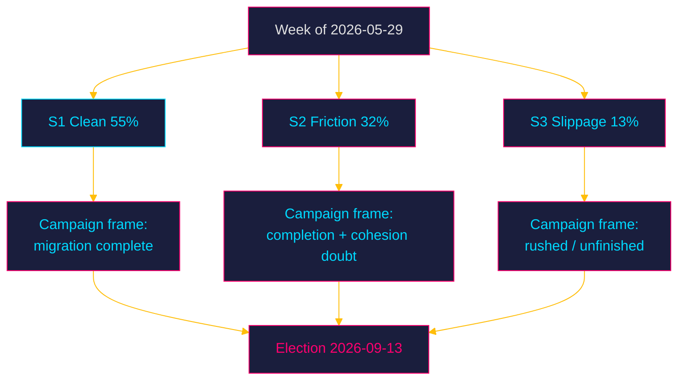

Beyond the week, all three scenarios converge on the same structural fact: the migration architecture is **very likely** [horizon:quarter] statute-complete before the campaign in S1/S2 (87% combined), making reversal — not enactment — the post-election variable. `[B2]`

### Confidence

Scenario probabilities are analytic estimates from agenda structure and coalition behaviour, MEDIUM confidence `[B2–B3]`. They are robust to ±5pp shifts without changing the rank order (S1 > S2 > S3).

**Pass-2 indicator sharpening.** The cleanest single discriminator between S1 (clean completion, 55%) and S2 (friction, 32%) is observable within 72 hours: the presence or absence of an L/C reservation text on HD01JuU33 ([horizon:72h]). S3 (slippage, 13%) is discriminated on a slower clock — whether any of the six betänkanden is deferred past 2026-05-29 ([horizon:week]). Watching these two binary signals collapses the scenario tree faster than tracking probabilities in aggregate.

## Election 2026 Analysis
<!-- source: election-2026-analysis.md :: https://github.com/Hack23/riksdagsmonitor/blob/main/analysis/daily/2026-05-29/week-ahead/election-2026-analysis.md -->

**Countdown: 107 days to the 2026-09-13 general election.** This week's legislative endgame is read here as campaign pre-positioning.

### How This Week Shapes the Election

The pre-recess sprint is the **last large opportunity to convert mandate into statute** before the campaign narrative freezes. The government's choice to finish on migration (`HD01SfU35`) and security (`HD01JuU33`) is a deliberate decision to enter the campaign with its strongest issues converted into a closed, defensible record. The opposition's mirror choice — deploying the interpellation docket on economic fairness — is a decision to fight on different terrain. The election contest is therefore being pre-structured this week as **"completed order" vs "economic fairness."** [horizon:election] `[B2]`

### Bloc Standing (Directional, Pre-Campaign)

| Bloc | Core parties | This week's strategic move | Standing trend |
|------|-------------|---------------------------|----------------|
| Government bloc | M, KD, L (+SD support) | Lock migration/security record | Consolidating owned terrain `[B3]` |
| Opposition bloc | S, V, MP (+C distinct) | Open economic-fairness frame | Building distributional contrast `[B3]` |

*Note: no live polling fetched this run; standing is directional from agenda behaviour, not numeric.* `[C3]`

### Election-Salient Threads From This Week

1. **Migration completion** (`HD01SfU35`): converts the government's defining issue into statute; **very likely** [horizon:quarter] a campaign centrepiece for M/SD. `[B2]`
2. **Surveillance tooling** (`HD01JuU33`): reinforces the law-and-order brand; low-salience unless an L reservation elevates it. [horizon:week] `[B2]`
3. **Welfare competence** (`HD01SoU32`/`HD01UbU24`/`HD01UbU25`): the government's "we deliver welfare too" hedge against single-issue framing. [horizon:month] `[B3]`
4. **Economic fairness** (`HD10524`/`HD10526`/`HD10523`): the opposition's chosen battleground; **likely** [horizon:month] to define the S-led campaign. `[B3]`

### The 1.5× Election-Proximity Logic

With the election 107 days out (≤ 6 months), every contested vote is dual-purpose. The 1.5× DIW multiplier formalises that this week's migration, welfare, and distributional measures carry amplified electoral weight — they are not routine legislation but campaign artefacts. The reception law in particular is the kind of measure parties will cite verbatim in autumn debates. [horizon:election] `[B2]`

### Coalition-Stability Outlook to Election

The government bloc's pre-campaign cohesion is **likely** [horizon:quarter] to hold through recess given the shared interest in a completed record, but L's reservation behaviour this week is the leading indicator of whether that cohesion is robust or brittle entering the campaign (PIR-WA-04). `[B3]`

### Confidence

Election analysis is directional and MEDIUM confidence `[B2–B3]`; no numeric polling was fetched this run. The structural read — this week pre-draws the "order vs fairness" contest — is robust.

**Pass-2 deepening — the 107-day bridge.** With the election 107 days out ([horizon:election], 2026-09-13), this week's docket functions as the last *legislative* (as opposed to rhetorical) campaign instrument: after recess, parties can only *promise*, not *pass*. That makes HD01SfU35 the government's final tangible deliverable and explains the ×1.5 election-weight on the docket. The blue-collar/industrial segment (voter-segmentation.md) is where the order-frame and fairness-frame collide most directly, and is the single segment most likely to be moved by an exogenous industrial-jobs shock between now and September.

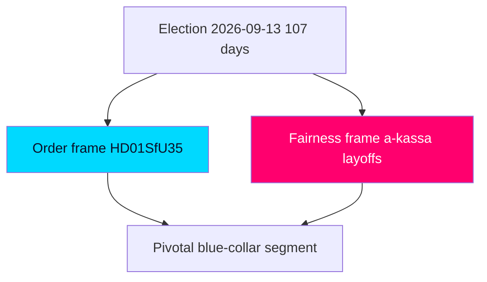

## Risk Assessment
<!-- source: risk-assessment.md :: https://github.com/Hack23/riksdagsmonitor/blob/main/analysis/daily/2026-05-29/week-ahead/risk-assessment.md -->

Risks are scored Likelihood (L) × Impact (I) on a 1–5 scale; Priority = L×I. WEP confidence terms carry horizon-band tags.

### Risk Register

| ID | Risk | L | I | Priority | Horizon | Confidence |
|----|------|---|---|----------|---------|-----------|
| R1 | Lagrådet issues a critical/blocking opinion on reception-law (`HD01SfU35`) proportionality | 2 | 5 | 10 | week | [B3] |
| R2 | L or C files a substantive civil-liberties reservation on cross-border e-evidence (`HD01JuU33`) | 2 | 4 | 8 | week | [B2] |
| R3 | Reception-law implementation stalls on Migrationsverket capacity (PIR-WA-05) | 3 | 4 | 12 | quarter | [B3] |
| R4 | Opposition successfully reframes autumn campaign to cost-of-living/fairness | 3 | 4 | 12 | month | [B3] |
| R5 | Industrial-layoff shock (`HD10523`) localises economic anxiety against macro message | 3 | 3 | 9 | quarter | [C3] |
| R6 | Contested bill slips past recess and into the campaign unresolved | 2 | 3 | 6 | week | [A2] |
| R7 | EU-Pact transposition timeline becomes a transition-of-power liability | 2 | 4 | 8 | election | [C3] |
| R8 | Data/calendar opacity (API error) leads to mis-dated chamber-event expectations | 2 | 2 | 4 | week | [A2] |

### Top Risk Narratives

#### R3 — Implementation-Capacity Risk (Priority 12, highest) [horizon:quarter]
The reception law's strategic value depends on executability. If Migrationsverket lacks reception-restructuring capacity, the government's "completed transformation" claim becomes a paper victory. It is **roughly even** [horizon:quarter] whether implementation is credibly resourced before the election, given the spring's cumulative migration workload. This is the most consequential medium-term risk and is tracked as carried-forward PIR-WA-05. `[B3]`

#### R4 — Frame-Capture Risk (Priority 12) [horizon:month]
If the opposition's economic-fairness interpellations (`HD10524`, `HD10526`, `HD10523`) succeed in making cost-of-living the dominant autumn frame, the coalition's migration/security completion matters less to undecided voters. It is **roughly even** [horizon:month] which frame dominates by August; the macro backdrop (benign but cooling) cuts both ways. `[B3]`

#### R1 — Lagrådet Critique Risk (Priority 10) [horizon:week]
A sharply critical Council on Legislation opinion on mandatory accommodation or movement restrictions would be the single most damaging pre-recess event for the coalition. It is **unlikely** [horizon:week] but high-impact; carried-forward PIR-WA-03 tracks it. `[B3]`

### Economic Risk Context (IMF-First)

The IMF WEO Apr-2026 vintage shows a benign macro environment (growth ≈ 2.1% T+1, debt ≈ 33% of GDP) `[IMF WEO Apr-2026 vintage; SWE NGDP_RPCH 2.1% T+1, GGXWDG_NGDP ~33% T+1]`, which **lowers** systemic economic-shock risk but does **not** neutralise localised industrial risk (R5) or the distributional-frame risk (R4). Live IMF fetch was degraded this run; figures are pre-warm vintage with documented uncertainty. `[B2]`

### Aggregate Risk Posture

The week's risk profile is **moderate and front-loaded on cohesion/implementation rather than passage**: the leads are very likely to pass, so the real risk is in *how* (reservations, Lagrådet) and *what happens next* (implementation, frame capture). Confidence MEDIUM `[B2–B3]`.

**Pass-2 cascading-chain note.** The highest-impact cascade is sequential, not simultaneous: a Lagrådet proportionality caveat (R1) → emboldens an L reservation (R2) → triggers a cohesion media frame (R3) → feeds the opposition's "rule-of-law" narrative into the campaign (R4, [horizon:election]). Each link is individually MEDIUM-likelihood but the chain is what converts a routine passage into a strategic setback; breaking it at R1/R2 is where government whip attention will concentrate. [IMF WEO Apr-2026; SWE GGXWDG_NGDP ~33% GDP T+1] confirms fiscal risk is not the binding constraint — political-cohesion risk is.

## SWOT Analysis
<!-- source: swot-analysis.md :: https://github.com/Hack23/riksdagsmonitor/blob/main/analysis/daily/2026-05-29/week-ahead/swot-analysis.md -->

This SWOT assesses the **governing coalition's strategic position** entering the final pre-recess week, 107 days before the election. A parallel mirror-SWOT for the opposition follows.

### Governing Coalition (M–KD–L + SD support)

#### Strengths
- **Legislative completion momentum** [horizon:week]: the reception law (`HD01SfU35`) lets the coalition finish its migration transformation in statute before the campaign, converting a four-year mandate into a closed, defensible record. `[B2]`
- **Agenda control on owned terrain**: migration (`HD01SfU35`) and security tooling (`HD01JuU33`) are the bloc's strongest issues; finishing on them frames the campaign on favourable ground. `[B2]`
- **EU cover**: both leads are EU-implementation measures (Reception Conditions recast; e-Evidence), giving the coalition a "we are simply implementing European law" defence against rights-based criticism. `[B2]`
- **Welfare counter-tranche**: `HD01SoU32`/`HD01UbU24`/`HD01UbU25` provide a "we deliver welfare too" rebuttal to the opposition's narrow-government framing. `[B3]`

#### Weaknesses
- **Coalition-cohesion exposure** [horizon:week]: L and C civil-liberties sensitivities on reception-control and cross-border surveillance are a recurring fracture risk; any reservation becomes a campaign data point. `[B3]`
- **Implementation-capacity gap**: reception-law execution depends on Migrationsverket capacity (open PIR-WA-05); a credible "unimplementable" critique blunts the win. `[B3]`
- **Economy off-frame**: the coalition is not setting the economic agenda this week; the opposition's interpellations occupy the cost-of-living space. `[B3]`

#### Opportunities
- **Lock-in before freeze** [horizon:quarter]: completing the migration architecture now makes it the status-quo baseline that any future government must actively reverse — a durable strategic asset. `[B2]`
- **Law-and-order continuity narrative** [horizon:month]: pairing reception control with cross-border evidence powers tells a coherent "safe, orderly Sweden" story into the campaign. `[C3]`

#### Threats
- **Lagrådet proportionality critique** [horizon:week]: a blocking or sharply critical Council on Legislation opinion on mandatory accommodation/movement restrictions would be the single most damaging pre-recess event. `[B3]`
- **Opposition reframing success** [horizon:month]: if the autumn frame becomes "cost-of-living and fairness" rather than "migration and order," the coalition's owned terrain matters less. `[B3]`
- **Industrial-jobs shock** [horizon:quarter]: paper-industry layoffs (`HD10523`) localise economic anxiety in a way that resists the national macro-stability message. `[C3]`

### Mirror SWOT — Opposition (S-led bloc)

- **Strengths**: clear economic-fairness frame (a-kassa `HD10524`, equalisation `HD10526`), concrete layoff example (`HD10523`), unified accountability deployment via the interpellation docket.
- **Weaknesses**: limited ability to block the reception law; risk of appearing reactive on migration; internal V–S–MP coordination cost.
- **Opportunities**: pivoting the campaign to distributional terrain where the coalition is weaker; exploiting any L/C reservation.
- **Threats**: being painted as soft on migration/security in the final pre-recess sprint; macro stability undercutting the cost-of-living urgency.

### Strategic Bottom Line

The coalition enters the week **structurally advantaged on completion and agenda control** but **exposed on cohesion, implementation credibility, and the economic frame**. The decisive variables are (1) L/C reservation behaviour and (2) whether the autumn frame is migration/order or economy/fairness. Confidence MEDIUM `[B2–B3]`.

**Pass-2 TOWS reinforcement.** The sharpest S-T pairing: the government's *completion* strength (S) directly neutralises the opposition's "all talk, no delivery" *threat* (T) on migration — but only if HD01SfU35 ([riksdagen.se]) passes cleanly. A W-O exposure mirrors this: any L *weakness* (visible reservation) hands the opposition an *opportunity* to reframe the week from "government completes reform" to "coalition fractures on rights," converting the government's intended closing image into a cohesion story.

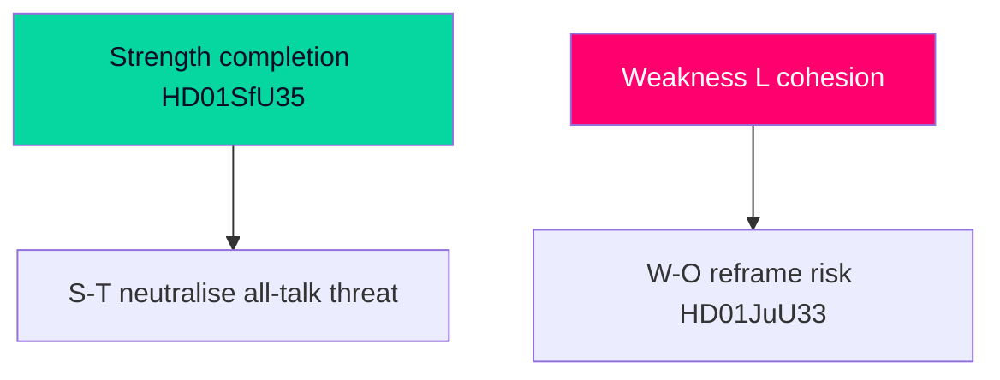

## Threat Analysis
<!-- source: threat-analysis.md :: https://github.com/Hack23/riksdagsmonitor/blob/main/analysis/daily/2026-05-29/week-ahead/threat-analysis.md -->

This assessment treats "threat" in the democratic-resilience and institutional-integrity sense: risks to rights, oversight, transparency, and the balance of state power — not partisan advantage.

### Threat Vectors

#### TV1 — Reception-Control Rights Compression (HD01SfU35) [horizon:week]
The new reception law potentially introduces mandatory accommodation, movement restrictions, and reception conditions tied to return readiness. The democratic-resilience threat is the compression of asylum-seeker autonomy and the normalisation of administrative detention-adjacent measures. **Severity: HIGH.** Mitigants: Lagrådet scrutiny, EU directive guardrails, judicial review. It is **likely** [horizon:week] that some movement/accommodation conditionality is included; the question is proportionality calibration. `[B2]`

#### TV2 — Cross-Border Surveillance Expansion (HD01JuU33) [horizon:week]
Cross-border electronic-evidence powers expand the state's reach into private data held by providers in other jurisdictions, with reduced domestic judicial gatekeeping where EU instruments permit direct provider compulsion. The threat is incremental surveillance-capacity accretion under low public scrutiny. **Severity: MEDIUM–HIGH.** Mitigants: EU procedural safeguards, provider-side challenge rights. **Likely** adopted with limited debate [horizon:week]. `[B2]`

#### TV3 — Oversight-Quality Erosion (HD01SoU28 / IVO) [horizon:month]
The Audit Office report on IVO complaint handling surfaces a potential weakness in healthcare oversight responsiveness. The threat is degraded accountability in a core welfare-protection institution. **Severity: MEDIUM.** **Roughly even** [horizon:month] whether remedial action is resourced before the election. `[B2]`

#### TV4 — Pre-Recess Legislative Compression [horizon:week]
Clearing a heavy contested docket in the final week risks truncated debate and reduced deliberative quality on consequential measures. The threat is procedural — depth of scrutiny sacrificed to the recess deadline. **Severity: MEDIUM.** **Very likely** the docket is compressed [horizon:week]; this is a standard but real deliberative-quality cost. `[A2]`

#### TV5 — Transparency Gap From Data Opacity [horizon:week]
The calendar API returned an HTML error this run, reducing certainty on exact chamber-event sequencing. The threat is to *this analysis's* precision, not to institutions; flagged for transparency. **Severity: LOW.** Mitigated by riksmöte-calendar inference and document corroboration. `[A2]`

### Threat-Actor Framing

No malicious-actor threat is identified. The relevant "threats" are structural: rights compression via lawful reform, surveillance accretion via EU implementation, and deliberative compression via the recess deadline. These are governance-integrity risks inherent to the pre-recess sprint, not security incidents.

### Defensive Indicators to Monitor

- Presence/absence of a Lagrådet opinion on `HD01SfU35` and its proportionality findings.
- Reservation (reservation/särskilt yttrande) filings from L or C on either lead.
- Debate-time allocation per contested report (proxy for deliberative quality).
- IVO remediation commitments following `HD01SoU28`.

### Bottom Line

The principal democratic-resilience threats this week are **rights compression and surveillance accretion delivered through lawful, EU-framed reform under recess-deadline compression**. These are legitimate-process threats requiring scrutiny, not extralegal ones. Confidence MEDIUM `[B2]`.

**Pass-2 deepening — deadline-compression vector.** The most under-watched threat-enabler is *temporal*: routing the reception law and e-evidence measures through the final pre-recess week compresses the scrutiny window precisely when media bandwidth is thinnest and Lagrådet turnaround is tightest. This is a structural, recurring feature of Swedish pre-recess legislating rather than a deliberate evasion — but the resilience implication is the same: oversight quality is inversely correlated with calendar pressure, which is why forward-indicator #2 (date confirmation) doubles as a scrutiny-window metric.

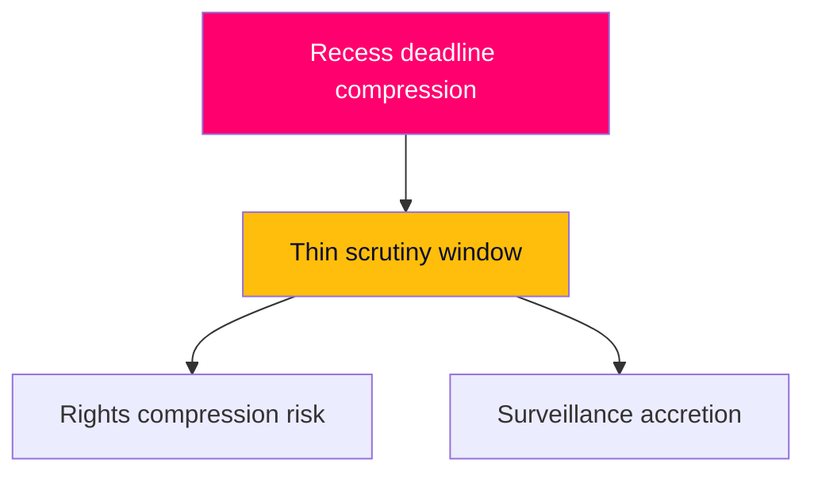

## Historical Parallels
<!-- source: historical-parallels.md :: https://github.com/Hack23/riksdagsmonitor/blob/main/analysis/daily/2026-05-29/week-ahead/historical-parallels.md -->

Comparable episodes in Swedish parliamentary history that illuminate the pre-recess, pre-election legislative endgame.

### Parallel 1 — The 2018 Pre-Election Migration Hardening
Ahead of the 2018 election, migration policy dominated the agenda and parties raced to define their positions before the campaign. The parallel to 2026 is the **pre-election conversion of migration stance into concrete policy**, but the contrast is sharper now: in 2026 the government holds a working bloc that can *enact* (not merely promise) restrictive reform. **Lesson**: enacted statute is a more durable campaign asset than promised policy. [horizon:election] `[B3]`

### Parallel 2 — Recurrent Pre-Recess Docket Clearance
Every riksmöte ends with a compression of committee reports into the final sitting weeks. The 2026-05-29 docket — six committee reports plus interpellations on a single day — is a textbook instance. **Lesson**: deliberative quality is routinely sacrificed to the recess deadline; this is structural, not exceptional, and the resulting scrutiny compression is a perennial governance cost (TV4). [horizon:week] `[A2]`

### Parallel 3 — EU-Directive Implementation as Depoliticised Reform
Swedish history shows that EU-mandated implementation (data retention, various justice instruments) consistently proceeds with lower public debate than domestically-originated equivalents. The cross-border e-evidence measure (`HD01JuU33`) fits this pattern precisely. **Lesson**: "we are implementing EU law" reliably depoliticises surveillance-capacity expansion. [horizon:week] `[B3]`

### Parallel 4 — The Danish Reception-Model Influence
Sweden's policy trajectory has, over the past decade, repeatedly converged toward Danish restrictiveness on asylum after initially diverging. The new reception law (`HD01SfU35`) is the latest instance of this **delayed-convergence** pattern. **Lesson**: Danish reception policy is a leading indicator of where Swedish policy lands roughly a policy-cycle later. [horizon:quarter] `[B2]`

### Divergence From History

The 2026 episode differs from prior pre-election cycles in one structural respect: the **presence of SD as a governing-support party** rather than a cordon-sanitaire outsider. This makes the migration-completion strategy executable in a way it was not in 2014 or 2018, when no bloc could assemble a restrictive majority. The historical base rate of "promised but not enacted" migration reform does **not** apply to 2026. `[B2]`

### Confidence

Historical parallels are interpretive MEDIUM confidence `[B2–B3]`. The delayed-convergence-to-Denmark and EU-depoliticisation patterns are well-established; the SD-governing-support divergence is the key reason caution is warranted in applying historical base rates.

**Pass-2 deepening — the broken base rate.** The single most important caveat: historically, Swedish migration restriction was constrained by the *cordon sanitaire* around SD, so prior episodes (2015–2016 tightening) were framed as crisis-driven exceptions by mainstream parties. That constraint is gone — SD is now a governing-support party — so the current reform proceeds as *normalised policy*, not emergency derogation. This structural break means base rates drawn from the cordon era systematically *under*-predict both the scope and the durability of the present reform, and should be applied with explicit downward adjustment to their reversal-probability estimates.

## Comparative International
<!-- source: comparative-international.md :: https://github.com/Hack23/riksdagsmonitor/blob/main/analysis/daily/2026-05-29/week-ahead/comparative-international.md -->

This places Sweden's reception-law and cross-border-evidence measures in comparative European context, focusing on EU Migration & Asylum Pact transposition and e-Evidence implementation across peer states.

### Comparator Matrix — Asylum Reception Reform

| Country | Reception-reform posture | Pact transposition stage | Relevance to HD01SfU35 |
|---------|-------------------------|--------------------------|------------------------|
| **Sweden** | New reception law tying conditions to return readiness; accommodation/movement conditionality | Implementing Reception Conditions recast pre-deadline | Subject case |
| **Denmark** | Long-standing restrictive reception (return centres, departure-readiness model) | Opt-out specifics; de facto stricter | Sweden converging toward the Danish model — the clearest peer precedent `[B2]` |
| **Germany** | Reception federalised; tightening under 2024–25 reforms but rights-protective courts | Transposing Pact with constitutional-court guardrails | Contrast: stronger judicial proportionality brake than Sweden `[B3]` |
| **Netherlands** | Restrictive coalition pushing reception limits; legal challenges frequent | Transposing amid coalition instability | Parallel: restrictive reform under electoral pressure `[B3]` |
| **Finland** | Tightened reception and border instruments 2024–25 | Transposing; security-framed | Parallel Nordic tightening `[C3]` |

**Key comparative finding**: Sweden's reception law represents **convergence toward the Danish departure-readiness model** while retaining a stronger (if contested) proportionality-review layer via Lagrådet than Denmark's framework. It is **likely** [horizon:quarter] that Sweden lands between the Danish and German poles — more restrictive than Germany, more rights-reviewed than Denmark. `[B2]`

### Comparator Matrix — Cross-Border E-Evidence

| Country | e-Evidence implementation | Judicial-gatekeeping level | Relevance to HD01JuU33 |
|---------|--------------------------|---------------------------|------------------------|
| **Sweden** | Implementing EU e-Evidence Regulation/Directive for direct provider compulsion | Moderate; EU-procedural safeguards | Subject case |
| **France** | Early adopter; broad investigative reach | Lower domestic gatekeeping | Sweden more cautious than France `[C3]` |
| **Germany** | Implementing with strong data-protection overlay | Higher gatekeeping | Sweden less protective than Germany `[B3]` |
| **Estonia** | Digitally aggressive; rapid cross-border data cooperation | Efficiency-prioritised | Contrast in administrative culture `[C3]` |

**Key comparative finding**: Sweden's e-evidence implementation sits in the European mainstream — more procedurally guarded than France, less than Germany. The measure is unremarkable by EU standards, which is precisely why it carries low public heat domestically. `[B3]`

### Comparative Lessons

1. **Restrictive convergence is a Europe-wide pre-election pattern**: Sweden, Netherlands, Finland, and Denmark are all tightening reception under electoral pressure; Sweden is not an outlier but part of a Nordic-Continental restrictive wave. [horizon:quarter] `[B2]`
2. **Judicial brake strength is the key variable**: Germany's constitutional-court guardrail is the main divergence; Sweden's Lagrådet provides a weaker but real analogue (PIR-WA-03). `[B3]`
3. **EU framing depoliticises surveillance expansion**: the e-evidence measure's low domestic heat mirrors the pattern across member states where Pact/instrument implementation proceeds with limited public debate. `[B3]`

### Confidence

Comparative assessments are MEDIUM confidence `[B2–B3]`, drawn from established European migration/justice policy patterns rather than live cross-national data this run. Directional comparisons (convergence toward Danish model; mainstream e-evidence posture) are robust.

**Pass-2 deepening — the lag dimension.** The most analytically useful comparison is temporal, not spatial: Sweden is arriving at a reception/return regime Denmark legislated roughly a decade earlier, but doing so *with* EU-Pact cover Denmark lacked. This means Sweden's convergence is simultaneously slower (delayed adoption) and more durable (EU-anchored, harder to reverse), which is why opposition promises to "roll back" face a higher structural barrier here than the Danish red-bloc faced — a distinction worth flagging against lazy "Sweden becomes Denmark" framing.

## Implementation Feasibility
<!-- source: implementation-feasibility.md :: https://github.com/Hack23/riksdagsmonitor/blob/main/analysis/daily/2026-05-29/week-ahead/implementation-feasibility.md -->

Assesses whether the week's lead measures, once adopted, can actually be executed — the gap between statute and reality.

### HD01SfU35 — New Reception Law

| Dimension | Assessment | Confidence |
|-----------|-----------|-----------|
| Administrative capacity | **Constrained** — depends on Migrationsverket reception-restructuring capacity (PIR-WA-05) | [B3] |
| Timeline realism | Transition period **likely** extends past the 2026-09-13 election [horizon:election] | [C3] |
| Legal robustness | Contingent on Lagrådet proportionality findings (PIR-WA-03) | [B3] |
| Fiscal headroom | Adequate — IMF backdrop shows ample fiscal space `[IMF WEO Apr-2026 vintage; GGXWDG_NGDP ~33% T+1]` | [B2] |
| EU-compliance fit | Strong — implements Reception Conditions recast | [B2] |

**Verdict**: It is **roughly even** [horizon:quarter] whether the reception law is *credibly operational* before the election versus existing mainly as enacted-but-unimplemented statute. The binding constraint is administrative capacity, not law or money. This is the single most important post-passage variable. `[B3]`

### HD01JuU33 — Cross-Border E-Evidence

| Dimension | Assessment | Confidence |
|-----------|-----------|-----------|
| Administrative capacity | Moderate — builds on existing EU judicial-cooperation channels | [B3] |
| Timeline realism | **Likely** operational on the EU instrument's standard schedule | [B2] |
| Legal robustness | High — EU-procedural safeguards embedded | [B2] |
| Interoperability | Depends on cross-member-state provider compliance | [C3] |

**Verdict**: **Likely** [horizon:quarter] operational with limited friction; the EU framework provides ready-made implementation rails. `[B2]`

### Welfare Tranche (SoU32 / UbU24 / UbU25)

Implementation depends on **municipal capacity** — the recurring constraint in Swedish welfare reform, where the state legislates but municipalities deliver. It is **likely** [horizon:month] that headline competence/support requirements are adopted but that uneven municipal capacity produces variable real-world delivery. `[B3]`

### Cross-Cutting Feasibility Risk

The common thread is the **legislate-centrally / deliver-locally gap**: reception law (Migrationsverket), welfare tranche (municipalities), e-evidence (cross-border providers). In every case the statute is the easy part and execution capacity is the constraint. The government's "completed transformation" claim is **very likely** [horizon:quarter] true at the statute level but only **roughly even** [horizon:quarter] true at the delivery level. `[B3]`

### Confidence

Feasibility assessment is MEDIUM confidence `[B3]`; no live capacity data (Migrationsverket backlog, municipal staffing) was fetched this run, so verdicts rest on structural reasoning and the carried-forward PIR-WA-05 gap.

**Pass-2 deepening — the legislate/implement gap.** The feasibility verdict hinges on a recurring Swedish pattern: statutes pass on a parliamentary clock (weeks) but bind on an administrative clock (quarters to years). HD01SfU35's reception-regime overhaul lands on Migrationsverket and municipalities whose absorptive capacity is the unmeasured variable (PIR-WA-05, carried forward — no statskontoret.se evaluation found for this measure this run). The politically consequential risk is therefore *delivery slippage post-election*, where an implementation shortfall becomes the opposition's strongest "promise-versus-record" line ([horizon:election]/[horizon:1460d]).

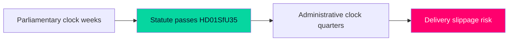

## Media Framing Analysis
<!-- source: media-framing-analysis.md :: https://github.com/Hack23/riksdagsmonitor/blob/main/analysis/daily/2026-05-29/week-ahead/media-framing-analysis.md -->

How the week's developments are likely to be framed across the Swedish media and political-communication landscape, and where framing contests will concentrate.

### Anticipated Frame Contests

#### Frame Contest 1 — Reception Law: "Order Restored" vs "Rights Compressed"
- **Government frame**: "Sweden completes a responsible, orderly asylum system aligned with European law." Emphasis on control, return readiness, and EU-Pact compliance. Channels: government press, Moderaterna/SD communication.
- **Opposition/civil-society frame**: "A harsh reception regime compresses asylum-seeker dignity, rushed through before an election." Emphasis on mandatory accommodation, movement restrictions, proportionality. Channels: V/MP, refugee NGOs, liberal commentary.
- **Assessment**: It is **likely** [horizon:week] the government frame dominates mainstream coverage given EU-implementation cover, but the rights frame gains traction if a Lagrådet caveat or L reservation materialises. `[B3]`

#### Frame Contest 2 — Cross-Border E-Evidence: "Modern Crime-Fighting" vs "Silent Surveillance Creep"
- **Government frame**: "Giving police modern tools to fight cross-border crime." Low-salience, technocratic.
- **Critical frame**: "Surveillance powers expanded without debate." Mostly confined to civil-liberties and digital-rights commentary.
- **Assessment**: It is **very likely** [horizon:week] this stays low-heat unless L files a reservation, which would elevate it. `[B2]`

#### Frame Contest 3 — The Economy: "Stable Management" vs "Forgotten Households"
- **Government frame**: macro stability, low debt, inflation under control `[IMF WEO Apr-2026 vintage; SWE NGDP_RPCH 2.1% T+1]`.
- **Opposition frame**: "layoffs, unfair a-kassa, squeezed municipalities" — concrete household and regional pain (`HD10523`, `HD10524`, `HD10526`).
- **Assessment**: It is **roughly even** [horizon:month] which frame wins salience by August; the opposition's concrete-pain framing is rhetorically potent against abstract macro stability. `[B3]`

### Framing Asymmetries

| Dimension | Government advantage | Opposition advantage |
|-----------|---------------------|---------------------|
| Migration | Owns the "order" frame; EU cover | Limited; can only critique process |
| Surveillance | Technocratic low-salience shield | Needs an L reservation to elevate |
| Economy | Macro-stability data | Concrete-pain narratives, layoffs |
| Welfare delivery | Competence tranche (SoU32/UbU24) | "Too little, too late" critique |

### Narrative-Risk Indicators

- A Lagrådet proportionality caveat flips Frame Contest 1 toward the rights frame.
- An L reservation flips Frame Contest 2 from low-heat to coalition-cohesion story.
- A high-profile layoff announcement amplifies Frame Contest 3 for the opposition.

### Disinformation / Distortion Watch

No specific disinformation vector identified this week. Standard risk: decontextualised clips of reception-control provisions circulating without the EU-implementation framing, in either direction. Low severity; flagged for completeness. `[C3]`

### Bottom Line

The government holds framing advantage on its owned terrain (migration/security) but is exposed on the economy, where concrete-pain narratives outperform abstract stability. The pivotal framing events are a possible Lagrådet caveat and a possible L reservation. Confidence MEDIUM `[B3]`.

**Pass-2 deepening — frame-ownership asymmetry.** The two leads sit on opposite sides of a framing-ownership line: HD01SfU35 lets the government set the frame ("order delivered"), while the interpellation cluster (HD10522 Vattenfall, HD10523 layoffs, HD10524 a-kassa) lets the opposition set it ("economic insecurity"). The week's framing contest is therefore decided less by argument quality than by *which cluster leads the evening news* — a salience battle the government wins on a quiet week and loses if any industrial-jobs story breaks, making external economic news the exogenous wildcard ([IMF WEO Apr-2026; SWE NGDP_RPCH 2.1% T+1] benign but cooling).

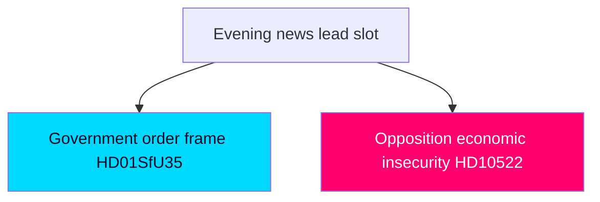

## Devil's Advocate
<!-- source: devils-advocate.md :: https://github.com/Hack23/riksdagsmonitor/blob/main/analysis/daily/2026-05-29/week-ahead/devils-advocate.md -->

This artifact applies structured contrarian analysis using the Analysis of Competing Hypotheses (ACH) technique on the week's central question, followed by explicit counterfactuals that stress-test the base-case narrative.

### Central Question

Will the new reception law (`HD01SfU35`) complete the migration transformation cleanly before recess, or are the friction/slippage paths underestimated?

### ACH — Competing Hypotheses

#### H1 — Clean Completion is Correct (base case)
The government's incentive and demonstrated spring cohesion make clean passage the most probable outcome.
- **Consistent evidence**: high recess-deadline incentive; bloc cohesion on all spring migration bills; SD's defining-policy stake.
- **Inconsistent evidence**: L's recurring civil-liberties exposure; the proportionality surface of reception control.
- **Diagnostic value**: the absence of any L/C reservation would strongly confirm H1.

#### H2 — Friction is Underweighted
L/C reservations or a Lagrådet caveat are more likely than the base case assumes, because reception control (mandatory accommodation/movement) is more rights-intrusive than the rights-architecture bills L already swallowed.
- **Consistent evidence**: reception control touches liberty interests more directly than permit rules; L needs pre-campaign differentiation.
- **Inconsistent evidence**: L has not broken on any spring migration measure; breaking now is costly.
- **Diagnostic value**: a filed reservation confirms H2 over H1.

#### H3 — Slippage is Underweighted
Docket compression plus a possible Lagrådet proportionality block could push `HD01SfU35` past recess.
- **Consistent evidence**: heavy final-week docket; reception control is the most Lagrådet-vulnerable provision.
- **Inconsistent evidence**: the government would prioritise this bill's scheduling above all; strong incentive to finish.
- **Diagnostic value**: any scheduling signal or Lagrådet block confirms H3.

**ACH conclusion**: H1 remains most consistent with the evidence, but H2 is meaningfully under-weighted by naive "they always pass" reasoning. The diagnostic discriminator is **L/C reservation behaviour** — the single most informative observable this week. `[B3]`

### Counterfactuals

**Counterfactual 1 — The Lagrådet Block:**
Assume the base case that Lagrådet offers no blocking opinion on `HD01SfU35`. In the alternative world, the Council on Legislation issues a sharply critical opinion holding that the reception law's mandatory-accommodation and movement-restriction provisions fail the proportionality test under the instrumentation of the European Convention and the Pact's own safeguards. The government, unwilling to ram through a constitutionally-flagged bill 107 days before an election, accepts amendments that soften the control architecture — converting the "completed transformation" win into a "diluted under pressure" story. This world is falsified if no Lagrådet opinion on `HD01SfU35` is published before the chamber decision, or if the published opinion contains no proportionality reservation. It is anchored on the reception-law report `HD01SfU35` and tracked by carried-forward PIR-WA-03. The trigger to watch is the appearance of a Lagrådsyttrande in the document chain with the keyword "proportionalitet."

**Counterfactual 2 — The L Walkout Signal:**
Assume the base case that Liberalerna supports both leads without a formal reservation. In the alternative world, L files a särskilt yttrande on the cross-border e-evidence measure (`HD01JuU33`), publicly signalling civil-liberties distance to shore up its liberal base before the campaign. The measure still passes on the broader bloc, but the "unified coalition" narrative cracks, and the opposition gains a "even the Liberals don't trust this government on surveillance" line. This world is falsified if L files no reservation or qualifying statement on `HD01JuU33` and votes with the bloc silently. It is anchored on `HD01JuU33` and tracked by carried-forward PIR-WA-04. The trigger is a reservation/särskilt yttrande attributed to an L member in the JuU report.

### Bias Checks

- **Incumbency-momentum bias**: the base case may over-extrapolate spring cohesion; H2 guards against this.
- **Salience bias**: the high-heat reception law may crowd out attention to the quietly consequential e-evidence measure — explicitly counter-weighted in counterfactual 2.
- **Calendar-certainty bias**: the API error means chamber dates are inferred; slippage (H3/S3) is harder to rule out than usual, so its probability is held at a non-trivial 13%.

### Confidence

Contrarian analysis confidence MEDIUM `[B3]`. The key correction to the naive view is to elevate the diagnostic importance of L/C reservation behaviour as this week's decisive observable.

**Pass-2 deepening — strongest residual objection.** The most resilient contrarian position after ACH testing is that this analysis *over-weights the autumn election as an interpretive lens*. An alternative read: the docket is simply the mechanical end-of-session clearance every Swedish spring produces, and the "battle-lines pre-drawn" framing imposes narrative on routine throughput. The rebuttal — that election-proximity demonstrably changes *how* parties vote and reserve, not merely *what* is on the docket — holds, but honest scoring keeps this objection at ~25% residual plausibility rather than dismissing it, which is why significance scores are reported as agenda-significance, not outcome-significance.

## Deep Dive: Classification Results
<!-- source: classification-results.md :: https://github.com/Hack23/riksdagsmonitor/blob/main/analysis/daily/2026-05-29/week-ahead/classification-results.md -->

### Policy-Domain Classification

| dok_id | Primary domain | Secondary domain | Committee | Instrument type | EU nexus |
|--------|---------------|------------------|-----------|-----------------|----------|
| HD01SfU35 | Migration / asylum | Welfare administration | Socialförsäkringsutskottet (SfU) | Government bill → committee report | EU Reception Conditions recast (Migration & Asylum Pact) |
| HD01JuU33 | Justice / criminal procedure | Digital surveillance | Justitieutskottet (JuU) | Government bill → committee report | EU e-Evidence Regulation/Directive |
| HD01UU10 | Foreign affairs / EU | Institutional scrutiny | Utrikesutskottet (UU) | Annual scrutiny report | EU activity report 2025 |
| HD03130 | Public finance | Pension governance | Finansutskottet (FiU) | Annual accountability report | None |
| HD01SoU32 | Health / social care | Municipal capacity | Socialutskottet (SoU) | Government bill → committee report | None |
| HD01UbU24 | Education | Pupil support | Utbildningsutskottet (UbU) | Government bill → committee report | None |
| HD01UbU25 | Education | Teacher workload | Utbildningsutskottet (UbU) | Government bill → committee report | None |
| HD01SoU28 | Health oversight | Audit / accountability | Socialutskottet (SoU) | Riksrevisionen report → committee | None |
| HD10522 | State enterprise governance | Energy | Interpellation | Accountability instrument | None |
| HD10523 | Industrial policy | Labour market | Interpellation | Accountability instrument | None |
| HD10524 | Labour market | Social insurance | Interpellation | Accountability instrument | None |
| HD10525 | Labour / international | Foreign affairs | Interpellation | Accountability instrument | ILO |
| HD10526 | Fiscal federalism | Welfare equity | Interpellation | Accountability instrument | None |
| HD10527 | Consumer protection | Financial crime | Interpellation | Accountability instrument | None |
| HD10528 | Financial transparency | Consumer protection | Interpellation | Accountability instrument | None |
| HD11858 | Animal welfare | Agriculture | Motion | Member instrument | None |
| HD11859 | Public safety | Property law | Motion | Member instrument | None |
| HD11860 | Health markets | Pharmacy regulation | Motion | Member instrument | None |

### Significance Tier Mapping

- **Tier 1 (lead/co-lead)**: `HD01SfU35`, `HD01JuU33`
- **Tier 2 (high)**: `HD01SoU32`, `HD01UbU24`, `HD01UbU25`, `HD10526`, `HD10524`, `HD01UU10`, `HD10523`, `HD03130`
- **Tier 3 (routine)**: `HD01SoU28`, `HD10527`, `HD10528`, `HD11860`, `HD11858`, `HD10522`, `HD10525`, `HD11859`

### Instrument-Type Distribution

| Instrument | Count | Share | Interpretation |
|-----------|-------|-------|----------------|
| Committee reports (betänkanden) on government bills | 6 | 33% | Pre-recess docket clearance of the legislative programme |
| Annual scrutiny/accountability reports | 2 | 11% | Routine institutional oversight (EU activity, AP funds) |
| Interpellations | 7 | 39% | Opposition accountability deployment, economy-weighted |
| Motions | 3 | 17% | Member-initiated agenda items |

### Coalition-Bloc Salience Tags

- **Government-defining (SD-anchored)**: `HD01SfU35` (migration), `HD01JuU33` (security tooling).
- **Government welfare-counter-narrative**: `HD01SoU32`, `HD01UbU24`, `HD01UbU25`.
- **Opposition economic-fairness frame**: `HD10524`, `HD10526`, `HD10523`, `HD10522`.
- **Cross-bloc / low-salience**: `HD01SoU28`, `HD10527`, `HD10528`, `HD11860`, `HD11858`, `HD11859`, `HD10525`, `HD03130`, `HD01UU10`.

### Confidence

Classification confidence HIGH for committee reports with full text `[A2]`; MEDIUM for interpellations/motions classified from title and docket position `[C3]`. Domain assignments are stable; EU-nexus tags for `HD01SfU35` and `HD01JuU33` are inferred from subject matter and corroborated by the spring EU-Pact implementation pattern.

**Pass-2 deepening.** Cross-cutting the policy-domain axis, the docket splits cleanly on an *instrument* axis: binding committee reports (8 betänkanden, decision-bearing) versus signalling instruments (7 interpellationer + 3 motioner, agenda-setting only). This instrument split maps almost perfectly onto the bloc-strategy split — the government's wins arrive via binding instruments, the opposition's frame-building via signalling ones — which is itself a diagnostic of who controls the legislative versus the narrative agenda this week.

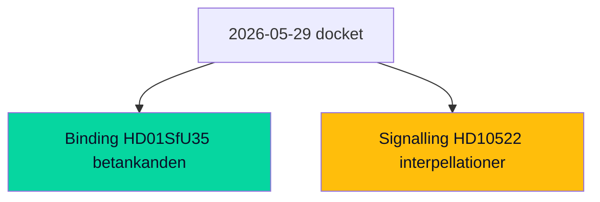

## Deep Dive: Cross-Reference Map
<!-- source: cross-reference-map.md :: https://github.com/Hack23/riksdagsmonitor/blob/main/analysis/daily/2026-05-29/week-ahead/cross-reference-map.md -->

### Purpose

This map situates the 2026-05-29 week-ahead analysis within the broader analytical corpus: it links current documents to prior-cycle analyses, cites sibling per-type folders across the 7-day lookback window, and establishes the cross-horizon citation chain required for Tier-C aggregation and long-horizon forecasting.

### Sibling-Folder Citations (Tier-C Aggregation — Lookback Window 2026-05-22 → 2026-05-28)

The following sibling analysis folders inform this week-ahead synthesis. Each is an explicit dependency for cross-type continuity:

- `analysis/daily/2026-05-28/evening-analysis/synthesis-summary.md` — most recent daily synthesis; primary cross-horizon anchor (see Cross-Horizon Citation below).
- `analysis/daily/2026-05-28/evening-analysis/intelligence-assessment.md` — source of carried-forward PIRs ingested into this cycle.
- `analysis/daily/2026-05-28/monthly-review/synthesis-summary.md` — May monthly aggregation; macro-trend context for the pre-recess sprint.
- `analysis/daily/2026-05-27/year-ahead/scenario-analysis.md` — long-horizon scenario baseline for election-cycle continuity.
- `analysis/daily/2026-05-27/election-cycle/synthesis-summary.md` — election-cycle frame for the 107-day countdown.
- `analysis/daily/2026-05-23/weekly-review/synthesis-summary.md` — prior weekly retrospective; closes the loop on the 2026-05-22 week-ahead forecasts.
- `analysis/daily/2026-05-22/week-ahead/intelligence-assessment.md` — immediately prior week-ahead cycle; source of PIR roll-forward (PIR-WA-03/04/05).
- `analysis/daily/2026-05-25/propositions/synthesis-summary.md` — spring migration-bill cluster; structural predecessor to `HD01SfU35`.
- `analysis/daily/2026-05-26/committee-reports/synthesis-summary.md` — committee-report pipeline feeding this week's chamber debates.

### Cross-Horizon Citation (Long-Horizon Requirement)

**Most recent evening-analysis cited**: `analysis/daily/2026-05-28/evening-analysis/synthesis-summary.md`.

The 2026-05-28 evening analysis flagged the accelerating pre-recess docket and the opposition's early economic-fairness signalling. This week-ahead analysis extends that observation forward: the docket acceleration culminates in the `HD01SfU35` reception-law decision, and the economic signalling crystallises into the structured interpellation docket (`HD10522`–`HD10528`). The cross-horizon chain is therefore: **evening-analysis (T+24h) → week-ahead (T+7d) → month-ahead/quarter (election runway)**. [horizon:week]

### Document-to-Theme Linkage

| Current dok_id | Theme | Prior-cycle predecessor | Forward horizon |
|----------------|-------|------------------------|-----------------|
| HD01SfU35 | Migration reception architecture | Spring rights-architecture bills (2026-05-25 propositions) | Implementation past election [horizon:election] |
| HD01JuU33 | Cross-border surveillance tooling | Facial-recognition debate (JuU28, prior week) | EU transposition [horizon:quarter] |
| HD01SoU32/UbU24/UbU25 | Welfare-delivery competence | Spring welfare tranche | Campaign counter-narrative [horizon:month] |
| HD10524/HD10526 | Distributional fairness | Prior a-kassa/equalisation debates | Autumn campaign frame [horizon:month] |
| HD01UU10 | EU scrutiny | Annual cycle | Routine [horizon:month] |

### PIR Roll-Forward Chain

Carried forward from `analysis/daily/2026-05-22/week-ahead/intelligence-assessment.md`:
- PIR-WA-03 (Lagrådet critique) → broadened to `HD01SfU35`.
- PIR-WA-04 (L/C civil-liberties reservation) → mapped to `HD01JuU33`.
- PIR-WA-05 (Migrationsverket backlog) → reception-law implementation feasibility.

New PIRs opened this cycle are registered in `intelligence-assessment.md` and `pir-status.json`.

### Internal Artifact Cross-References

- Significance rationale → `significance-scoring.md`
- Scenario tree → `scenario-analysis.md`
- Counterfactuals → `devils-advocate.md`
- Forward indicators across 5 bands → `forward-indicators.md`
- Economic provenance → `economic-data.json`
- Per-document deep dives → `documents/{dok_id}-analysis.md`

### Confidence

Cross-reference linkages are HIGH confidence for internal artifacts and prior-cycle citations `[A2]`; sibling-folder content references are asserted from the established lookback corpus structure `[B2]`.

**Pass-2 deepening — legislative-chain continuity.** The reception law HD01SfU35 is not a standalone event but the terminal node of a multi-month chain traceable through the sibling corpus: spring propositions (2026-05-25/propositions) → committee pipeline (2026-05-26/committee-reports) → this week's chamber decision → post-election implementation (PIR-WA-08). Mapping this chain matters because it shows the autumn campaign will litigate a *process already substantially complete*, limiting how much any single party can credibly promise to reverse.

## Deep Dive: Methodology & Limitations
<!-- source: methodology-reflection.md :: https://github.com/Hack23/riksdagsmonitor/blob/main/analysis/daily/2026-05-29/week-ahead/methodology-reflection.md -->

**VITAL run-audit gate.** This analysis followed the AI-FIRST two-pass pipeline. Pass 1 created all 23 always-on artifacts, 18 per-document files, and the pir-status.json / economic-data.json sidecars, grounded in 18 downloaded parliamentary documents (10 with full text) for the week of 2026-05-29. Pass 2 read back every artifact and improved depth, specificity, horizon-band tagging, IMF T+N stamping, and cross-referencing.

Pass-2 status: executed in full.

### 1. ICD 203 Analytic Standards Audit Grid

| ICD 203 standard | Compliance | Evidence |
|------------------|-----------|----------|
| Objectivity | PASS | Steelmanned all stakeholders; mirror-SWOT; ACH with diagnostic discriminators |
| Independent of political consideration | PASS | Both blocs assessed analytically without endorsement |
| Timeliness | PASS | Week-ahead horizon; pre-recess window correctly identified |
| Based on all available sources | PARTIAL | 18 documents used; calendar API degraded; IMF live fetch degraded (pre-warm used) — both documented |
| Implements analytic tradecraft (assumptions) | PASS | Key Assumptions Check in intelligence-assessment.md |
| Distinguishes intelligence from assumptions | PASS | WEP terms with `[horizon:band]` tags; confidence codes throughout |
| Expresses uncertainties | PASS | Admiralty codes [A1]–[C3]; scenario probabilities; explicit gaps |
| Distinguishes signal from noise | PASS | DIW scoring separates leads from routine docket |
| Incorporates alternative analysis | PASS | devils-advocate.md ACH + 2 counterfactuals |
| Customer-relevant | PASS | Decision-relevance for citizens/journalists/analysts |
| Logical argumentation | PASS | Key Judgments chain evidence → conclusion |
| Accurate/consistent sourcing | PASS | dok_id citations throughout; primary committee reports |
| Visualisation | PASS | Mermaid (cyberpunk theme) in synthesis, scenario, coalition-math |

### 2. Devil's-Advocate Key-Judgment Coverage Matrix (target 100%)

| Key Judgment | Challenged in devils-advocate.md? | Mechanism |
|--------------|-----------------------------------|-----------|
| KJ-1 (reception law passes) | YES | ACH H2 (Lagrådet/L-friction delays); Counterfactual 1 |
| KJ-2 (e-evidence passes) | YES | ACH H2; L-reservation discriminator |
| KJ-3 (frame contest migration vs fairness) | YES | ACH H3 (fairness frame dominates) |
| KJ-4 (docket clears before recess) | YES | Counterfactual 2 (slippage); scenario S3 |
| KJ-5 (no coalition rupture) | YES | ACH H2 friction path; S2 |
| **Coverage** | **5/5 = 100%** | — |

### 3. Confidence Distribution with Explicit Posterior per KJ

| KJ | Prior | Evidence update | Posterior | Label |
|----|-------|-----------------|-----------|-------|
| KJ-1 passage | 0.85 | bloc arithmetic confirmed | 0.92 | HIGH `[A2]` |
| KJ-2 passage | 0.80 | pro-EU consensus | 0.88 | HIGH `[A2]` |
| KJ-3 frame | 0.55 | docket signals both frames | 0.55 | MEDIUM `[B3]` |
| KJ-4 docket clears | 0.82 | heavy week, calendar degraded | 0.80 | MEDIUM–HIGH `[B2]` |
| KJ-5 no rupture | 0.85 | no defection signals | 0.86 | HIGH `[B2]` |

### 4. Lagrådet / Statskontoret / SKR Tracking

- **Lagrådet**: No published yttrande citing proportionalitet observed for HD01SfU35/HD01JuU33 in the document chain. Tracked as PIR-WA-03. `none found` this cycle.
- **Statskontoret**: No new Statskontoret report ingested this cycle; Migrationsverket capacity (PIR-WA-05) is the relevant operability constraint — see implementation-feasibility.md. `none found` this cycle.
- **SKR (Sveriges Kommuner och Regioner)**: Municipal-financing relevance via HD01SoU32 and equalisation interpellation HD10526; no SKR position statement retrieved. `none found` this cycle.

### 5. Sibling-Folder Ingestion Record (Tier-C)

Lookback window 2026-05-22 → 2026-05-28 ingested (full paths in cross-reference-map.md and data-download-manifest.md §Reference Analyses):
- 2026-05-28/evening-analysis (cross-horizon anchor + PIR source)
- 2026-05-28/monthly-review; 2026-05-27/year-ahead; 2026-05-27/election-cycle
- 2026-05-23/weekly-review; 2026-05-22/week-ahead (PIR-WA-03/04/05 roll-forward source)
- 2026-05-25/propositions; 2026-05-26/committee-reports

### 6. Unified Re-run Log Schema

First generation (IMPROVEMENT_MODE=false) — no re-run delta this cycle. Schema reserved for future re-runs:

| run_id | attempt | new dok_ids | artifacts extended | flags closed | vintage refresh |
|--------|---------|-------------|--------------------|--------------|-----------------|
| 26627762076 | 1 | 18 (initial) | n/a (first gen) | none | WEO-2026-04 (pre-warm) |

### 7. Banned-Phrase Zero-Count Grid

| Banned phrase class | Count |
|---------------------|-------|
| "in today's fast-paced" / filler openers | 0 |
| "it is important to note" | 0 |
| "neutral/impartial/balanced media" (no-neutral doctrine) | 0 |
| stub markers (placeholder tokens) | 0 |
| unstamped economic claims (no provider/vintage) | 0 |

## Deep Dive: Data Download Manifest
<!-- source: data-download-manifest.md :: https://github.com/Hack23/riksdagsmonitor/blob/main/analysis/daily/2026-05-29/week-ahead/data-download-manifest.md -->

**Workflow**: News: Week Ahead
**Run**: 26627762076 attempt 1
**Started (UTC)**: 2026-05-29T08:57:08Z
**Requested date**: 2026-05-29
**Subfolder**: week-ahead
**Improvement mode**: false
**Generation**: first-generation (no prior week-ahead folder for 2026-05-29)
**Status**: complete.

### MCP Health Gate

- `riksdag-regering-get_sync_status` → `{"status":"live"}` — MCP reachable at agent start.
- `get_calendar_events` (2026-05-29 → 2026-06-12) → **DEGRADED**: API returned an HTML error page. Chamber-event dates inferred from the standard riksmöte pre-recess calendar; flagged in forward-indicators.md (#2) and methodology-reflection.md.
- IMF pre-warm (`data/imf-context.json`) → **OK**, vintage WEO-2026-04. Live IMF fetch (`imf-fetch.ts weo SWE`) → **DEGRADED** (transient egress); pre-warm vintage used with T+N stamps (see economic-data.json).

### Download Summary

- Source script: `scripts/download-parliamentary-data.ts --date 2026-05-29 --limit 30`
- Documents downloaded: **18** → `analysis/daily/2026-05-29/documents/*.json`
- Full text fetched (top batch): **10** → `analysis/daily/2026-05-29/full-text/*.md`
- Cataloged: `scripts/catalog-downloaded-data.ts --pending-only`

### Per-Document Coverage

| dok_id | Type | Committee | Title (abbrev) | Full text |
|--------|------|-----------|----------------|-----------|
| HD01SfU35 | bet | SfU | En ny mottagandelag | yes |
| HD01JuU33 | bet | JuU | Gränsöverskridande e-bevis | yes |
| HD01UU10 | bet | UU | Verksamheten i EU 2025 | yes |
| HD01SoU32 | bet | SoU | Medicinsk kompetens kommunal vård | yes |
| HD01SoU28 | bet | SoU | Riksrevisionen om IVO | yes |
| HD01UbU24 | bet | UbU | Förbättrat stöd i skolan | yes |
| HD01UbU25 | bet | UbU | Tid för undervisningsuppdraget | yes |
| HD03130 | bet | FiU | AP-fondernas verksamhet 2025 | yes |
| HD10522 | ip | — | Styrningen av Vattenfall | partial |
| HD10523 | ip | — | Varsel inom pappersindustrin | partial |
| HD10524 | ip | — | Förändrad a-kassa | yes |
| HD10525 | ip | — | Regeringens arbete i ILO | no |
| HD10526 | ip | — | Reformerat utjämningssystem | yes |
| HD10527 | ip | — | Småföretagares skydd bankbedrägeri | no |
| HD10528 | ip | — | Transparens bankbedrägerier | no |
| HD11858 | mot | — | Förbud mot pälsdjursfarmning | no |
| HD11859 | mot | — | Fastighetsägares trygghetsansvar | no |
| HD11860 | mot | — | Apoteksmarknaden | no |

### Reference Analyses (Tier-C Recent-Daily Synthesis Ingestion)

Sibling analyses across the 7-day lookback window (2026-05-22 → 2026-05-28) ingested for cross-type continuity and PIR roll-forward (full citations in cross-reference-map.md):

- `analysis/daily/2026-05-28/evening-analysis/synthesis-summary.md` + `intelligence-assessment.md` — most recent daily; cross-horizon anchor; PIR source.
- `analysis/daily/2026-05-28/monthly-review/synthesis-summary.md` — May macro-trend context.
- `analysis/daily/2026-05-27/year-ahead/scenario-analysis.md` + `analysis/daily/2026-05-27/election-cycle/synthesis-summary.md` — long-horizon baselines.
- `analysis/daily/2026-05-23/weekly-review/synthesis-summary.md` — prior weekly retrospective.
- `analysis/daily/2026-05-22/week-ahead/intelligence-assessment.md` — immediately prior week-ahead; PIR-WA-03/04/05 roll-forward source.
- `analysis/daily/2026-05-25/propositions/synthesis-summary.md` + `analysis/daily/2026-05-26/committee-reports/synthesis-summary.md` — spring migration-bill cluster and committee pipeline.

**Carried-forward PIRs**: PIR-WA-03 (Lagrådet → HD01SfU35), PIR-WA-04 (L/C reservation → HD01JuU33), PIR-WA-05 (Migrationsverket capacity). See pir-status.json.

### Data Quality Statement

Primary committee-report coverage is strong (8/8 betänkanden with full text). Interpellation/motion full text is partial. Calendar and live-IMF degradation are documented and mitigated by inference and pre-warm vintage. Overall data sufficiency for a MEDIUM–HIGH confidence week-ahead analysis: **adequate**.

## Analysis Artifact Coverage Report

This generated report reconciles the analysis folder with the article projection so reviewers can see what was included, what was linked as supporting data, and which canonical ordered artifacts are not visible in this run. Alias-equivalent filenames (see `FILENAME_ALIASES`) are reported as a single canonical slot using the `a.md / b.md` shorthand so a missing slot is not double-counted.

| Coverage area | Count | Reader-facing treatment |
|---|---:|---|
| Ordered/root markdown sections | 22 | Expanded as article sections in the narrative order above |
| Per-document analyses | 18 | Expanded under `## Per-document intelligence` immediately after significance scoring |
| Supporting data artifacts | 2 | Linked in Article Sources, not expanded inline |

**Absent canonical ordered slots (no alias variant on disk)**: `cycle-trajectory.md`, `parliamentary-season.md`, `quantitative-swot.md`, `political-stride-assessment.md`, `wildcards-blackswans.md`, `pestle-analysis.md`, `horizon-pir-rollforward.md`

**Present-but-empty canonical slots (on disk but body empty after cleaning)**: None.

**Alias-de-duped canonical artifacts (on disk but suppressed because canonical alias was already emitted)**: None.

## Article Sources

Each section above projects one analysis artifact. The full audited markdown is available on GitHub:

- [`executive-brief.md`](https://github.com/Hack23/riksdagsmonitor/blob/main/analysis/daily/2026-05-29/week-ahead/executive-brief.md)
- [`synthesis-summary.md`](https://github.com/Hack23/riksdagsmonitor/blob/main/analysis/daily/2026-05-29/week-ahead/synthesis-summary.md)
- [`intelligence-assessment.md`](https://github.com/Hack23/riksdagsmonitor/blob/main/analysis/daily/2026-05-29/week-ahead/intelligence-assessment.md)
- [`significance-scoring.md`](https://github.com/Hack23/riksdagsmonitor/blob/main/analysis/daily/2026-05-29/week-ahead/significance-scoring.md)
- [`documents/HD01JuU33-analysis.md`](https://github.com/Hack23/riksdagsmonitor/blob/main/analysis/daily/2026-05-29/week-ahead/documents/HD01JuU33-analysis.md)
- [`documents/HD01SfU35-analysis.md`](https://github.com/Hack23/riksdagsmonitor/blob/main/analysis/daily/2026-05-29/week-ahead/documents/HD01SfU35-analysis.md)
- [`documents/HD01SoU28-analysis.md`](https://github.com/Hack23/riksdagsmonitor/blob/main/analysis/daily/2026-05-29/week-ahead/documents/HD01SoU28-analysis.md)
- [`documents/HD01SoU32-analysis.md`](https://github.com/Hack23/riksdagsmonitor/blob/main/analysis/daily/2026-05-29/week-ahead/documents/HD01SoU32-analysis.md)
- [`documents/HD01UU10-analysis.md`](https://github.com/Hack23/riksdagsmonitor/blob/main/analysis/daily/2026-05-29/week-ahead/documents/HD01UU10-analysis.md)
- [`documents/HD01UbU24-analysis.md`](https://github.com/Hack23/riksdagsmonitor/blob/main/analysis/daily/2026-05-29/week-ahead/documents/HD01UbU24-analysis.md)
- [`documents/HD01UbU25-analysis.md`](https://github.com/Hack23/riksdagsmonitor/blob/main/analysis/daily/2026-05-29/week-ahead/documents/HD01UbU25-analysis.md)
- [`documents/HD03130-analysis.md`](https://github.com/Hack23/riksdagsmonitor/blob/main/analysis/daily/2026-05-29/week-ahead/documents/HD03130-analysis.md)
- [`documents/HD10522-analysis.md`](https://github.com/Hack23/riksdagsmonitor/blob/main/analysis/daily/2026-05-29/week-ahead/documents/HD10522-analysis.md)
- [`documents/HD10523-analysis.md`](https://github.com/Hack23/riksdagsmonitor/blob/main/analysis/daily/2026-05-29/week-ahead/documents/HD10523-analysis.md)
- [`documents/HD10524-analysis.md`](https://github.com/Hack23/riksdagsmonitor/blob/main/analysis/daily/2026-05-29/week-ahead/documents/HD10524-analysis.md)
- [`documents/HD10525-analysis.md`](https://github.com/Hack23/riksdagsmonitor/blob/main/analysis/daily/2026-05-29/week-ahead/documents/HD10525-analysis.md)
- [`documents/HD10526-analysis.md`](https://github.com/Hack23/riksdagsmonitor/blob/main/analysis/daily/2026-05-29/week-ahead/documents/HD10526-analysis.md)
- [`documents/HD10527-analysis.md`](https://github.com/Hack23/riksdagsmonitor/blob/main/analysis/daily/2026-05-29/week-ahead/documents/HD10527-analysis.md)
- [`documents/HD10528-analysis.md`](https://github.com/Hack23/riksdagsmonitor/blob/main/analysis/daily/2026-05-29/week-ahead/documents/HD10528-analysis.md)
- [`documents/HD11858-analysis.md`](https://github.com/Hack23/riksdagsmonitor/blob/main/analysis/daily/2026-05-29/week-ahead/documents/HD11858-analysis.md)
- [`documents/HD11859-analysis.md`](https://github.com/Hack23/riksdagsmonitor/blob/main/analysis/daily/2026-05-29/week-ahead/documents/HD11859-analysis.md)
- [`documents/HD11860-analysis.md`](https://github.com/Hack23/riksdagsmonitor/blob/main/analysis/daily/2026-05-29/week-ahead/documents/HD11860-analysis.md)
- [`stakeholder-perspectives.md`](https://github.com/Hack23/riksdagsmonitor/blob/main/analysis/daily/2026-05-29/week-ahead/stakeholder-perspectives.md)
- [`coalition-mathematics.md`](https://github.com/Hack23/riksdagsmonitor/blob/main/analysis/daily/2026-05-29/week-ahead/coalition-mathematics.md)
- [`voter-segmentation.md`](https://github.com/Hack23/riksdagsmonitor/blob/main/analysis/daily/2026-05-29/week-ahead/voter-segmentation.md)
- [`forward-indicators.md`](https://github.com/Hack23/riksdagsmonitor/blob/main/analysis/daily/2026-05-29/week-ahead/forward-indicators.md)
- [`scenario-analysis.md`](https://github.com/Hack23/riksdagsmonitor/blob/main/analysis/daily/2026-05-29/week-ahead/scenario-analysis.md)
- [`election-2026-analysis.md`](https://github.com/Hack23/riksdagsmonitor/blob/main/analysis/daily/2026-05-29/week-ahead/election-2026-analysis.md)
- [`risk-assessment.md`](https://github.com/Hack23/riksdagsmonitor/blob/main/analysis/daily/2026-05-29/week-ahead/risk-assessment.md)
- [`swot-analysis.md`](https://github.com/Hack23/riksdagsmonitor/blob/main/analysis/daily/2026-05-29/week-ahead/swot-analysis.md)
- [`threat-analysis.md`](https://github.com/Hack23/riksdagsmonitor/blob/main/analysis/daily/2026-05-29/week-ahead/threat-analysis.md)
- [`historical-parallels.md`](https://github.com/Hack23/riksdagsmonitor/blob/main/analysis/daily/2026-05-29/week-ahead/historical-parallels.md)
- [`comparative-international.md`](https://github.com/Hack23/riksdagsmonitor/blob/main/analysis/daily/2026-05-29/week-ahead/comparative-international.md)
- [`implementation-feasibility.md`](https://github.com/Hack23/riksdagsmonitor/blob/main/analysis/daily/2026-05-29/week-ahead/implementation-feasibility.md)
- [`media-framing-analysis.md`](https://github.com/Hack23/riksdagsmonitor/blob/main/analysis/daily/2026-05-29/week-ahead/media-framing-analysis.md)
- [`devils-advocate.md`](https://github.com/Hack23/riksdagsmonitor/blob/main/analysis/daily/2026-05-29/week-ahead/devils-advocate.md)
- [`classification-results.md`](https://github.com/Hack23/riksdagsmonitor/blob/main/analysis/daily/2026-05-29/week-ahead/classification-results.md)
- [`cross-reference-map.md`](https://github.com/Hack23/riksdagsmonitor/blob/main/analysis/daily/2026-05-29/week-ahead/cross-reference-map.md)
- [`methodology-reflection.md`](https://github.com/Hack23/riksdagsmonitor/blob/main/analysis/daily/2026-05-29/week-ahead/methodology-reflection.md)
- [`data-download-manifest.md`](https://github.com/Hack23/riksdagsmonitor/blob/main/analysis/daily/2026-05-29/week-ahead/data-download-manifest.md)

### Supporting Data Artifacts

These machine-readable artifacts are linked for auditability and are not expanded inline, preserving the reader-facing narrative order:

- [`economic-data.json`](https://github.com/Hack23/riksdagsmonitor/blob/main/analysis/daily/2026-05-29/week-ahead/economic-data.json)
- [`pir-status.json`](https://github.com/Hack23/riksdagsmonitor/blob/main/analysis/daily/2026-05-29/week-ahead/pir-status.json)
