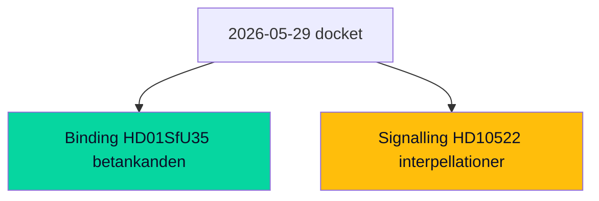

# Classification Results — Week Ahead from 2026-05-29

## Policy-Domain Classification

| dok_id | Primary domain | Secondary domain | Committee | Instrument type | EU nexus |
|--------|---------------|------------------|-----------|-----------------|----------|
| HD01SfU35 | Migration / asylum | Welfare administration | Socialförsäkringsutskottet (SfU) | Government bill → committee report | EU Reception Conditions recast (Migration & Asylum Pact) |
| HD01JuU33 | Justice / criminal procedure | Digital surveillance | Justitieutskottet (JuU) | Government bill → committee report | EU e-Evidence Regulation/Directive |
| HD01UU10 | Foreign affairs / EU | Institutional scrutiny | Utrikesutskottet (UU) | Annual scrutiny report | EU activity report 2025 |
| HD03130 | Public finance | Pension governance | Finansutskottet (FiU) | Annual accountability report | None |
| HD01SoU32 | Health / social care | Municipal capacity | Socialutskottet (SoU) | Government bill → committee report | None |
| HD01UbU24 | Education | Pupil support | Utbildningsutskottet (UbU) | Government bill → committee report | None |
| HD01UbU25 | Education | Teacher workload | Utbildningsutskottet (UbU) | Government bill → committee report | None |
| HD01SoU28 | Health oversight | Audit / accountability | Socialutskottet (SoU) | Riksrevisionen report → committee | None |
| HD10522 | State enterprise governance | Energy | Interpellation | Accountability instrument | None |
| HD10523 | Industrial policy | Labour market | Interpellation | Accountability instrument | None |
| HD10524 | Labour market | Social insurance | Interpellation | Accountability instrument | None |
| HD10525 | Labour / international | Foreign affairs | Interpellation | Accountability instrument | ILO |
| HD10526 | Fiscal federalism | Welfare equity | Interpellation | Accountability instrument | None |
| HD10527 | Consumer protection | Financial crime | Interpellation | Accountability instrument | None |
| HD10528 | Financial transparency | Consumer protection | Interpellation | Accountability instrument | None |
| HD11858 | Animal welfare | Agriculture | Motion | Member instrument | None |
| HD11859 | Public safety | Property law | Motion | Member instrument | None |
| HD11860 | Health markets | Pharmacy regulation | Motion | Member instrument | None |

## Significance Tier Mapping

- **Tier 1 (lead/co-lead)**: `HD01SfU35`, `HD01JuU33`
- **Tier 2 (high)**: `HD01SoU32`, `HD01UbU24`, `HD01UbU25`, `HD10526`, `HD10524`, `HD01UU10`, `HD10523`, `HD03130`
- **Tier 3 (routine)**: `HD01SoU28`, `HD10527`, `HD10528`, `HD11860`, `HD11858`, `HD10522`, `HD10525`, `HD11859`

## Instrument-Type Distribution

| Instrument | Count | Share | Interpretation |
|-----------|-------|-------|----------------|
| Committee reports (betänkanden) on government bills | 6 | 33% | Pre-recess docket clearance of the legislative programme |
| Annual scrutiny/accountability reports | 2 | 11% | Routine institutional oversight (EU activity, AP funds) |
| Interpellations | 7 | 39% | Opposition accountability deployment, economy-weighted |
| Motions | 3 | 17% | Member-initiated agenda items |

## Coalition-Bloc Salience Tags

- **Government-defining (SD-anchored)**: `HD01SfU35` (migration), `HD01JuU33` (security tooling).
- **Government welfare-counter-narrative**: `HD01SoU32`, `HD01UbU24`, `HD01UbU25`.
- **Opposition economic-fairness frame**: `HD10524`, `HD10526`, `HD10523`, `HD10522`.
- **Cross-bloc / low-salience**: `HD01SoU28`, `HD10527`, `HD10528`, `HD11860`, `HD11858`, `HD11859`, `HD10525`, `HD03130`, `HD01UU10`.

## Confidence

Classification confidence HIGH for committee reports with full text `[A2]`; MEDIUM for interpellations/motions classified from title and docket position `[C3]`. Domain assignments are stable; EU-nexus tags for `HD01SfU35` and `HD01JuU33` are inferred from subject matter and corroborated by the spring EU-Pact implementation pattern.

**Pass-2 deepening.** Cross-cutting the policy-domain axis, the docket splits cleanly on an *instrument* axis: binding committee reports (8 betänkanden, decision-bearing) versus signalling instruments (7 interpellationer + 3 motioner, agenda-setting only). This instrument split maps almost perfectly onto the bloc-strategy split — the government's wins arrive via binding instruments, the opposition's frame-building via signalling ones — which is itself a diagnostic of who controls the legislative versus the narrative agenda this week.

