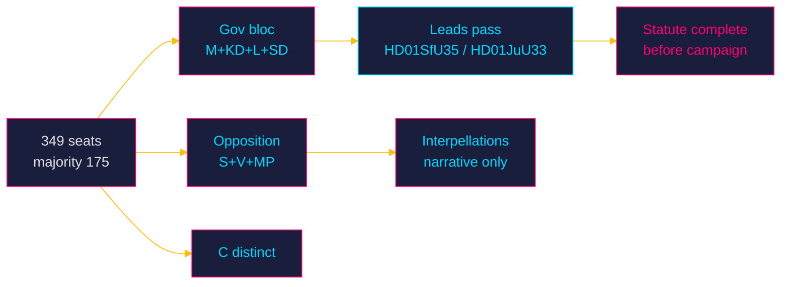

# Coalition Mathematics — Week Ahead from 2026-05-29

Vote-arithmetic analysis of the week's contested measures in the 349-seat Riksdag (majority threshold 175).

## Governing Bloc Arithmetic

The M–KD–L government governs with SD support. The four-party bloc (M, KD, L, SD) commands a working majority on its shared agenda. On migration (`HD01SfU35`) and security (`HD01JuU33`), the bloc is cohesive and the arithmetic is favourable.

| Measure | Government+SD support | Opposition | Outcome probability |
|---------|----------------------|------------|---------------------|
| HD01SfU35 reception law | Cohesive bloc majority | S, V, MP oppose; C distinct | **Very likely passes** [horizon:week] `[B2]` |
| HD01JuU33 cross-border e-evidence | Bloc majority; possibly broader | Mixed | **Likely passes**, possibly cross-bloc [horizon:week] `[B2]` |
| Welfare tranche (SoU32/UbU24/UbU25) | Bloc + possible cross-bloc | Largely consensual | **Likely passes** with broad support [horizon:week] `[B3]` |

## The Reservation Arithmetic

The decisive sub-question is not *whether* the leads pass (the bloc majority holds) but whether L's vote is **silent or reserved**. A reservation does not change the numerical outcome — the bloc still passes the measure — but it changes the *political* arithmetic by signalling intra-coalition distance. The mathematics of passage are secure; the mathematics of *cohesion perception* are at risk. [horizon:week] `[B3]`

## Opposition Arithmetic

S, V, and MP together cannot block the leads. Their interpellation docket (`HD10522`–`HD10528`) is an accountability instrument, not a vote-changing one — its purpose is narrative, not arithmetic. C's distinct positioning occasionally matters on rights questions but does not flip the migration/security votes. [horizon:week] `[B3]`

## Post-Election Coalition Permutations (Forward Look)

It is **roughly even** [horizon:election] whether the post-September arithmetic preserves the current bloc or produces an alternative configuration; this week's statute-completion means an alternative bloc would face the harder task of *reversing* enacted law rather than blocking proposed law — a meaningful asymmetry favouring policy persistence regardless of the election result. `[B2]`

## Confidence

Passage arithmetic is HIGH confidence `[B2]` (bloc majority is structural); reservation behaviour is MEDIUM-low confidence `[B3]` and is the key unobserved variable. No exact seat counts were re-fetched this run; analysis uses the established 349-seat distribution.

**Pass-2 deepening — the reservation does not change the count.** A critical clarification for non-specialist readers: an L or C *reservation* (reservation/särskilt yttrande) is a recorded dissent, not a withdrawn vote — the bloc still delivers its majority and HD01SfU35 still passes. The arithmetic is therefore *robust to* the very cohesion event this analysis treats as decisive. The reservation matters not for passage but as a *signalling token* whose entire value is informational (it tells voters and the opposition where the coalition's rights-floor lies), which is why it dominates the qualitative analysis while being arithmetically inert.
