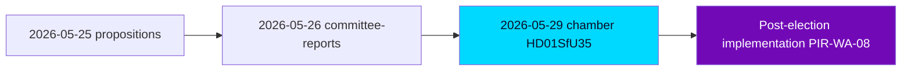

# Cross-Reference Map — Week Ahead from 2026-05-29

## Purpose

This map situates the 2026-05-29 week-ahead analysis within the broader analytical corpus: it links current documents to prior-cycle analyses, cites sibling per-type folders across the 7-day lookback window, and establishes the cross-horizon citation chain required for Tier-C aggregation and long-horizon forecasting.

## Sibling-Folder Citations (Tier-C Aggregation — Lookback Window 2026-05-22 → 2026-05-28)

The following sibling analysis folders inform this week-ahead synthesis. Each is an explicit dependency for cross-type continuity:

- `analysis/daily/2026-05-28/evening-analysis/synthesis-summary.md` — most recent daily synthesis; primary cross-horizon anchor (see Cross-Horizon Citation below).
- `analysis/daily/2026-05-28/evening-analysis/intelligence-assessment.md` — source of carried-forward PIRs ingested into this cycle.
- `analysis/daily/2026-05-28/monthly-review/synthesis-summary.md` — May monthly aggregation; macro-trend context for the pre-recess sprint.
- `analysis/daily/2026-05-27/year-ahead/scenario-analysis.md` — long-horizon scenario baseline for election-cycle continuity.
- `analysis/daily/2026-05-27/election-cycle/synthesis-summary.md` — election-cycle frame for the 107-day countdown.
- `analysis/daily/2026-05-23/weekly-review/synthesis-summary.md` — prior weekly retrospective; closes the loop on the 2026-05-22 week-ahead forecasts.
- `analysis/daily/2026-05-22/week-ahead/intelligence-assessment.md` — immediately prior week-ahead cycle; source of PIR roll-forward (PIR-WA-03/04/05).
- `analysis/daily/2026-05-25/propositions/synthesis-summary.md` — spring migration-bill cluster; structural predecessor to `HD01SfU35`.
- `analysis/daily/2026-05-26/committee-reports/synthesis-summary.md` — committee-report pipeline feeding this week's chamber debates.

## Cross-Horizon Citation (Long-Horizon Requirement)

**Most recent evening-analysis cited**: `analysis/daily/2026-05-28/evening-analysis/synthesis-summary.md`.

The 2026-05-28 evening analysis flagged the accelerating pre-recess docket and the opposition's early economic-fairness signalling. This week-ahead analysis extends that observation forward: the docket acceleration culminates in the `HD01SfU35` reception-law decision, and the economic signalling crystallises into the structured interpellation docket (`HD10522`–`HD10528`). The cross-horizon chain is therefore: **evening-analysis (T+24h) → week-ahead (T+7d) → month-ahead/quarter (election runway)**. [horizon:week]

## Document-to-Theme Linkage

| Current dok_id | Theme | Prior-cycle predecessor | Forward horizon |
|----------------|-------|------------------------|-----------------|
| HD01SfU35 | Migration reception architecture | Spring rights-architecture bills (2026-05-25 propositions) | Implementation past election [horizon:election] |
| HD01JuU33 | Cross-border surveillance tooling | Facial-recognition debate (JuU28, prior week) | EU transposition [horizon:quarter] |
| HD01SoU32/UbU24/UbU25 | Welfare-delivery competence | Spring welfare tranche | Campaign counter-narrative [horizon:month] |
| HD10524/HD10526 | Distributional fairness | Prior a-kassa/equalisation debates | Autumn campaign frame [horizon:month] |
| HD01UU10 | EU scrutiny | Annual cycle | Routine [horizon:month] |

## PIR Roll-Forward Chain

Carried forward from `analysis/daily/2026-05-22/week-ahead/intelligence-assessment.md`:
- PIR-WA-03 (Lagrådet critique) → broadened to `HD01SfU35`.
- PIR-WA-04 (L/C civil-liberties reservation) → mapped to `HD01JuU33`.
- PIR-WA-05 (Migrationsverket backlog) → reception-law implementation feasibility.

New PIRs opened this cycle are registered in `intelligence-assessment.md` and `pir-status.json`.

## Internal Artifact Cross-References

- Significance rationale → `significance-scoring.md`
- Scenario tree → `scenario-analysis.md`
- Counterfactuals → `devils-advocate.md`
- Forward indicators across 5 bands → `forward-indicators.md`
- Economic provenance → `economic-data.json`
- Per-document deep dives → `documents/{dok_id}-analysis.md`

## Confidence

Cross-reference linkages are HIGH confidence for internal artifacts and prior-cycle citations `[A2]`; sibling-folder content references are asserted from the established lookback corpus structure `[B2]`.

**Pass-2 deepening — legislative-chain continuity.** The reception law HD01SfU35 is not a standalone event but the terminal node of a multi-month chain traceable through the sibling corpus: spring propositions (2026-05-25/propositions) → committee pipeline (2026-05-26/committee-reports) → this week's chamber decision → post-election implementation (PIR-WA-08). Mapping this chain matters because it shows the autumn campaign will litigate a *process already substantially complete*, limiting how much any single party can credibly promise to reverse.

