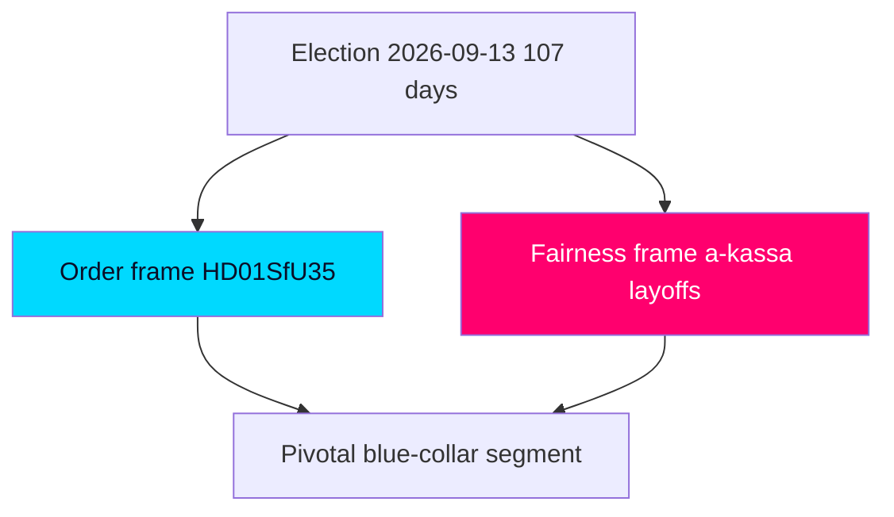

# Election 2026 Analysis — Week Ahead from 2026-05-29

**Countdown: 107 days to the 2026-09-13 general election.** This week's legislative endgame is read here as campaign pre-positioning.

## How This Week Shapes the Election

The pre-recess sprint is the **last large opportunity to convert mandate into statute** before the campaign narrative freezes. The government's choice to finish on migration (`HD01SfU35`) and security (`HD01JuU33`) is a deliberate decision to enter the campaign with its strongest issues converted into a closed, defensible record. The opposition's mirror choice — deploying the interpellation docket on economic fairness — is a decision to fight on different terrain. The election contest is therefore being pre-structured this week as **"completed order" vs "economic fairness."** [horizon:election] `[B2]`

## Bloc Standing (Directional, Pre-Campaign)

| Bloc | Core parties | This week's strategic move | Standing trend |
|------|-------------|---------------------------|----------------|
| Government bloc | M, KD, L (+SD support) | Lock migration/security record | Consolidating owned terrain `[B3]` |
| Opposition bloc | S, V, MP (+C distinct) | Open economic-fairness frame | Building distributional contrast `[B3]` |

*Note: no live polling fetched this run; standing is directional from agenda behaviour, not numeric.* `[C3]`

## Election-Salient Threads From This Week

1. **Migration completion** (`HD01SfU35`): converts the government's defining issue into statute; **very likely** [horizon:quarter] a campaign centrepiece for M/SD. `[B2]`
2. **Surveillance tooling** (`HD01JuU33`): reinforces the law-and-order brand; low-salience unless an L reservation elevates it. [horizon:week] `[B2]`
3. **Welfare competence** (`HD01SoU32`/`HD01UbU24`/`HD01UbU25`): the government's "we deliver welfare too" hedge against single-issue framing. [horizon:month] `[B3]`
4. **Economic fairness** (`HD10524`/`HD10526`/`HD10523`): the opposition's chosen battleground; **likely** [horizon:month] to define the S-led campaign. `[B3]`

## The 1.5× Election-Proximity Logic

With the election 107 days out (≤ 6 months), every contested vote is dual-purpose. The 1.5× DIW multiplier formalises that this week's migration, welfare, and distributional measures carry amplified electoral weight — they are not routine legislation but campaign artefacts. The reception law in particular is the kind of measure parties will cite verbatim in autumn debates. [horizon:election] `[B2]`

## Coalition-Stability Outlook to Election

The government bloc's pre-campaign cohesion is **likely** [horizon:quarter] to hold through recess given the shared interest in a completed record, but L's reservation behaviour this week is the leading indicator of whether that cohesion is robust or brittle entering the campaign (PIR-WA-04). `[B3]`

## Confidence

Election analysis is directional and MEDIUM confidence `[B2–B3]`; no numeric polling was fetched this run. The structural read — this week pre-draws the "order vs fairness" contest — is robust.

**Pass-2 deepening — the 107-day bridge.** With the election 107 days out ([horizon:election], 2026-09-13), this week's docket functions as the last *legislative* (as opposed to rhetorical) campaign instrument: after recess, parties can only *promise*, not *pass*. That makes HD01SfU35 the government's final tangible deliverable and explains the ×1.5 election-weight on the docket. The blue-collar/industrial segment (voter-segmentation.md) is where the order-frame and fairness-frame collide most directly, and is the single segment most likely to be moved by an exogenous industrial-jobs shock between now and September.

