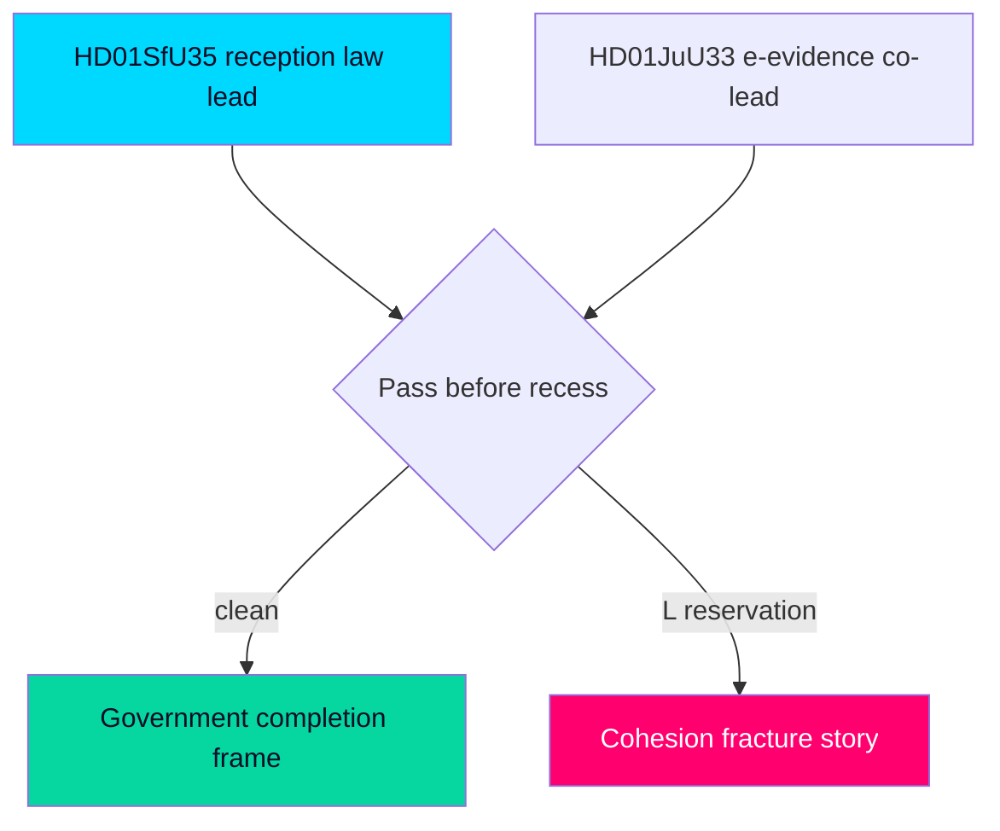

# Riksdag Caps Pre-Recess Week with New Reception Law and Cross-Border E-Evidence Vote

## BLUF (Bottom Line Up Front)

In the final full sitting week before summer recess and **107 days before the 2026-09-13 election**, the Riksdag debates the Tidö government's migration-reform capstone — the new reception law (`HD01SfU35`, *En ny mottagandelag*) — alongside cross-border electronic-evidence powers (`HD01JuU33`) and a welfare-competence tranche (`HD01SoU32`, `HD01UbU24`, `HD01UbU25`). It is **very likely** [horizon:week] that the reception law is adopted on the government+SD bloc before recess, completing the structural transformation of Swedish asylum policy in statute before the campaign freeze. The opposition's interpellation docket pivots deliberately to economic fairness (a-kassa, equalisation, industrial layoffs), pre-drawing the autumn campaign's distributional battle line. Confidence: MEDIUM–HIGH `[B2]`.

## Top 3 Developments to Watch

### 1. The New Reception Law — `HD01SfU35` 🔴
The Social Insurance Committee report *En ny mottagandelag* reaches the floor for decision. This restructures **where asylum seekers live and what obligations they carry during processing**, implementing the EU Reception Conditions recast under the Migration and Asylum Pact and tying reception conditions to return readiness. It is the operational counterpart to the spring rights-architecture reforms — the piece that makes "return-first" administratively executable. Watch: (a) whether L and C accept the accommodation-and-control model without reservation; (b) any Lagrådet proportionality critique on mandatory accommodation/movement restrictions; (c) the transition timeline and Migrationsverket implementation capacity. **Very likely** adopted before recess [horizon:week]. `[B2]`

### 2. Cross-Border E-Evidence — `HD01JuU33` 🔴
The Justice Committee report on more effective cross-border gathering of electronic evidence implements the EU e-Evidence Regulation/Directive, letting Swedish authorities compel data directly from providers in other member states. It quietly extends the security-state tooling theme from the prior week's facial-recognition debate, but as a technical EU-implementation file it carries far less public heat while materially expanding cross-border investigative reach. Watch for any civil-liberties reservation from L or C. **Likely** adopted with broad support [horizon:week]. `[B2]`

### 3. The Welfare-Competence Counter-Narrative Tranche 🟡
`HD01SoU32` (medical competence in municipal care), `HD01UbU24` (school support), `HD01UbU25` (teaching time), and the `HD01SoU28` IVO-oversight audit move together. Lower-heat but electorally instrumental: they let the government argue "we deliver welfare, not only migration and law-and-order" entering the campaign. **Likely** adopted with cross-bloc elements [horizon:week]. `[B3]`

## Strategic Watch Items (Beyond the Week)

- **Opposition economic pivot** [horizon:month]: the interpellation cluster (a-kassa `HD10524`, equalisation `HD10526`, paper-industry layoffs `HD10523`, Vattenfall `HD10522`, bank fraud `HD10527`/`HD10528`) signals the S-led bloc's intent to fight autumn on cost-of-living and distributional fairness. **Likely** to become the dominant opposition frame by August. `[B3]`
- **Pre-recess docket clearance** [horizon:week]: any contested bill not finished before recess risks slipping past the election; the government's incentive to complete `HD01SfU35` now is structurally high. `[A2]`
- **Campaign narrative freeze** [horizon:quarter]: after recess the legislative record is effectively fixed; this week is the last large opportunity to convert mandate into statute. **Very likely** the migration transformation is statute-complete before the campaign [horizon:quarter]. `[B2]`
- **EU-Pact transposition runway** [horizon:election]: reception-law implementation timelines extend past the election, making it a live transition-of-power question if the bloc changes. `[C3]`

## Economic Snapshot (IMF-First)

IMF WEO Apr-2026 vintage (pre-warm; live fetch degraded this run): Sweden real GDP growth ≈ **2.1% T+1, 2.4% T+2, 2.0% T+5** `[IMF WEO Apr-2026 vintage; SWE NGDP_RPCH 2.1% T+1]`, gross government debt ≈ 33% of GDP, inflation easing toward 2%. A benign-but-cooling macro backdrop that frames — but does not decide — the week's distributional interpellations. `[B2]`

## Decision-Relevance for Readers

For citizens, journalists, and analysts: this week is the **last clear window to see the full Tidö migration architecture before it is locked into statute and frozen by the campaign**. The reception law is the least-watched but most operationally consequential migration measure of the spring, because it governs the lived reality of asylum reception. Track the L/C reservation behaviour as the leading indicator of coalition cohesion entering the campaign.

## Confidence and Caveats

Overall MEDIUM–HIGH `[B2]`. Primary documents are corroborated from downloaded committee reports and full text. Exact chamber vote dates and outcomes are inferred from the standard riksmöte pre-recess calendar because the calendar API returned an HTML error this run (see `data-download-manifest.md`). Economic figures use the IMF pre-warm vintage with documented live-fetch degradation (`economic-data.json`).

**Pass-2 deepening — decision sharpener.** For a journalist deciding coverage allocation this week: lead on HD01SfU35 (the completion story) but pre-position the L/C-reservation angle on HD01JuU33, because a single liberal-coalition särskilt yttrande would be the week's only genuinely *new* information — everything else is high-probability and pre-scripted.

