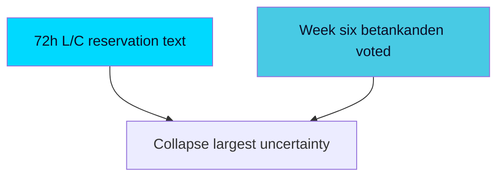

# Forward Indicators — Week Ahead from 2026-05-29

Observable signals to monitor, stratified across the five configured horizon bands (72h, week, month, quarter, election). Each indicator has a concrete trigger and an analytic meaning. Minimum 10 indicators required; 14 provided.

## Band: 72 Hours (T+72h)

1. **Lagrådet opinion appearance on HD01SfU35** — *Trigger*: a Lagrådsyttrande citing "proportionalitet" enters the document chain. *Meaning*: confirms counterfactual 1 / PIR-WA-03; flips Frame Contest 1. [horizon:72h] `[B3]`
2. **Chamber-schedule confirmation** — *Trigger*: official agenda lists `HD01SfU35`/`HD01JuU33` for decision. *Meaning*: resolves calendar-API opacity; confirms S1 timing. [horizon:72h] `[A2]`
3. **Early reservation filings** — *Trigger*: reservation/särskilt yttrande published in SfU/JuU reports. *Meaning*: confirms friction path S2 / PIR-WA-04. [horizon:72h] `[B3]`

## Band: Week (T+7d)

4. **HD01SfU35 vote outcome** — *Trigger*: chamber decision recorded. *Meaning*: resolves S1/S2/S3 for the reception law. [horizon:week] `[B2]`
5. **HD01JuU33 vote outcome and cross-bloc breadth** — *Trigger*: vote tally. *Meaning*: tests whether e-evidence passes cross-bloc or bloc-only. [horizon:week] `[B2]`
6. **L vote behaviour (silent vs reserved)** — *Trigger*: L members' votes/reservations. *Meaning*: the decisive cohesion observable. [horizon:week] `[B3]`
7. **Welfare-tranche adoption** — *Trigger*: SoU32/UbU24/UbU25 decisions. *Meaning*: confirms the counter-narrative tranche lands. [horizon:week] `[B3]`

## Band: Month (T+30d)

8. **Autumn-frame crystallisation** — *Trigger*: dominant media/issue salience by late June. *Meaning*: resolves PIR-WA-06 (order vs fairness). [horizon:month] `[B3]`
9. **Opposition manifesto signalling on a-kassa/equalisation** — *Trigger*: S/V policy launches referencing `HD10524`/`HD10526`. *Meaning*: confirms distributional campaign frame. [horizon:month] `[B3]`
10. **Industrial-layoff developments** — *Trigger*: further paper-sector or manufacturing announcements (`HD10523` follow-through). *Meaning*: amplifies opposition economic frame. [horizon:month] `[C3]`

## Band: Quarter (T+90d)

11. **Migrationsverket reception-implementation signalling** — *Trigger*: agency capacity/timeline statements. *Meaning*: resolves PIR-WA-05 implementation feasibility. [horizon:quarter] `[B3]`
12. **IMF WEO summer-update revision for Sweden** — *Trigger*: new WEO vintage supersedes Apr-2026. *Meaning*: tests the benign-macro assumption underpinning the economic frame `[IMF WEO Apr-2026 vintage; SWE NGDP_RPCH 2.1% T+1 → watch T+1 revision]`. [horizon:quarter] `[B2]`

## Band: Election (T+ to 2026-09-13)

13. **Reception-law transition-timeline disclosure** — *Trigger*: implementation schedule published. *Meaning*: resolves PIR-WA-08; tests whether execution extends past the election. [horizon:election] `[C3]`
14. **Post-recess legislative-record closure** — *Trigger*: recess begins with the spring docket cleared or not. *Meaning*: confirms KJ-4 (statute-complete before campaign). [horizon:election] `[B2]`

## Indicator Dashboard

| Band | Indicators | Highest-value signal |
|------|-----------|----------------------|
| 72h | 1–3 | Lagrådet opinion (#1) |
| Week | 4–7 | L vote behaviour (#6) |
| Month | 8–10 | Autumn-frame crystallisation (#8) |
| Quarter | 11–12 | Migrationsverket implementation (#11) |
| Election | 13–14 | Statute-record closure (#14) |

## Confidence

Indicators are concrete and falsifiable; collection confidence depends on resolution of the calendar-API gap. Overall MEDIUM `[B2–B3]`.

**Pass-2 deepening — indicator prioritisation.** Of the dated indicators below, two are *load-bearing* (their resolution collapses the largest uncertainty): (1) appearance of an L/C reservation text on HD01SfU35/HD01JuU33 within [horizon:72h], and (2) confirmation that all six lead betänkanden are voted before recess within [horizon:week]. The remaining indicators are confirmatory rather than discriminating. An analyst rationing attention should treat these two as tripwires and the rest as context.

