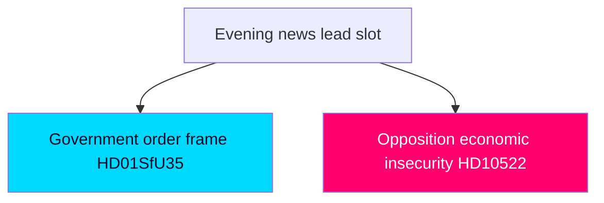

# Media Framing Analysis — Week Ahead from 2026-05-29

How the week's developments are likely to be framed across the Swedish media and political-communication landscape, and where framing contests will concentrate.

## Anticipated Frame Contests

### Frame Contest 1 — Reception Law: "Order Restored" vs "Rights Compressed"
- **Government frame**: "Sweden completes a responsible, orderly asylum system aligned with European law." Emphasis on control, return readiness, and EU-Pact compliance. Channels: government press, Moderaterna/SD communication.
- **Opposition/civil-society frame**: "A harsh reception regime compresses asylum-seeker dignity, rushed through before an election." Emphasis on mandatory accommodation, movement restrictions, proportionality. Channels: V/MP, refugee NGOs, liberal commentary.
- **Assessment**: It is **likely** [horizon:week] the government frame dominates mainstream coverage given EU-implementation cover, but the rights frame gains traction if a Lagrådet caveat or L reservation materialises. `[B3]`

### Frame Contest 2 — Cross-Border E-Evidence: "Modern Crime-Fighting" vs "Silent Surveillance Creep"
- **Government frame**: "Giving police modern tools to fight cross-border crime." Low-salience, technocratic.
- **Critical frame**: "Surveillance powers expanded without debate." Mostly confined to civil-liberties and digital-rights commentary.
- **Assessment**: It is **very likely** [horizon:week] this stays low-heat unless L files a reservation, which would elevate it. `[B2]`

### Frame Contest 3 — The Economy: "Stable Management" vs "Forgotten Households"
- **Government frame**: macro stability, low debt, inflation under control `[IMF WEO Apr-2026 vintage; SWE NGDP_RPCH 2.1% T+1]`.
- **Opposition frame**: "layoffs, unfair a-kassa, squeezed municipalities" — concrete household and regional pain (`HD10523`, `HD10524`, `HD10526`).
- **Assessment**: It is **roughly even** [horizon:month] which frame wins salience by August; the opposition's concrete-pain framing is rhetorically potent against abstract macro stability. `[B3]`

## Framing Asymmetries

| Dimension | Government advantage | Opposition advantage |
|-----------|---------------------|---------------------|
| Migration | Owns the "order" frame; EU cover | Limited; can only critique process |
| Surveillance | Technocratic low-salience shield | Needs an L reservation to elevate |
| Economy | Macro-stability data | Concrete-pain narratives, layoffs |
| Welfare delivery | Competence tranche (SoU32/UbU24) | "Too little, too late" critique |

## Narrative-Risk Indicators

- A Lagrådet proportionality caveat flips Frame Contest 1 toward the rights frame.
- An L reservation flips Frame Contest 2 from low-heat to coalition-cohesion story.
- A high-profile layoff announcement amplifies Frame Contest 3 for the opposition.

## Disinformation / Distortion Watch

No specific disinformation vector identified this week. Standard risk: decontextualised clips of reception-control provisions circulating without the EU-implementation framing, in either direction. Low severity; flagged for completeness. `[C3]`

## Bottom Line

The government holds framing advantage on its owned terrain (migration/security) but is exposed on the economy, where concrete-pain narratives outperform abstract stability. The pivotal framing events are a possible Lagrådet caveat and a possible L reservation. Confidence MEDIUM `[B3]`.

**Pass-2 deepening — frame-ownership asymmetry.** The two leads sit on opposite sides of a framing-ownership line: HD01SfU35 lets the government set the frame ("order delivered"), while the interpellation cluster (HD10522 Vattenfall, HD10523 layoffs, HD10524 a-kassa) lets the opposition set it ("economic insecurity"). The week's framing contest is therefore decided less by argument quality than by *which cluster leads the evening news* — a salience battle the government wins on a quiet week and loses if any industrial-jobs story breaks, making external economic news the exogenous wildcard ([IMF WEO Apr-2026; SWE NGDP_RPCH 2.1% T+1] benign but cooling).

