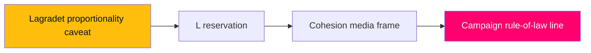

# Risk Assessment — Week Ahead from 2026-05-29

Risks are scored Likelihood (L) × Impact (I) on a 1–5 scale; Priority = L×I. WEP confidence terms carry horizon-band tags.

## Risk Register

| ID | Risk | L | I | Priority | Horizon | Confidence |
|----|------|---|---|----------|---------|-----------|
| R1 | Lagrådet issues a critical/blocking opinion on reception-law (`HD01SfU35`) proportionality | 2 | 5 | 10 | week | [B3] |
| R2 | L or C files a substantive civil-liberties reservation on cross-border e-evidence (`HD01JuU33`) | 2 | 4 | 8 | week | [B2] |
| R3 | Reception-law implementation stalls on Migrationsverket capacity (PIR-WA-05) | 3 | 4 | 12 | quarter | [B3] |
| R4 | Opposition successfully reframes autumn campaign to cost-of-living/fairness | 3 | 4 | 12 | month | [B3] |
| R5 | Industrial-layoff shock (`HD10523`) localises economic anxiety against macro message | 3 | 3 | 9 | quarter | [C3] |
| R6 | Contested bill slips past recess and into the campaign unresolved | 2 | 3 | 6 | week | [A2] |
| R7 | EU-Pact transposition timeline becomes a transition-of-power liability | 2 | 4 | 8 | election | [C3] |
| R8 | Data/calendar opacity (API error) leads to mis-dated chamber-event expectations | 2 | 2 | 4 | week | [A2] |

## Top Risk Narratives

### R3 — Implementation-Capacity Risk (Priority 12, highest) [horizon:quarter]
The reception law's strategic value depends on executability. If Migrationsverket lacks reception-restructuring capacity, the government's "completed transformation" claim becomes a paper victory. It is **roughly even** [horizon:quarter] whether implementation is credibly resourced before the election, given the spring's cumulative migration workload. This is the most consequential medium-term risk and is tracked as carried-forward PIR-WA-05. `[B3]`

### R4 — Frame-Capture Risk (Priority 12) [horizon:month]
If the opposition's economic-fairness interpellations (`HD10524`, `HD10526`, `HD10523`) succeed in making cost-of-living the dominant autumn frame, the coalition's migration/security completion matters less to undecided voters. It is **roughly even** [horizon:month] which frame dominates by August; the macro backdrop (benign but cooling) cuts both ways. `[B3]`

### R1 — Lagrådet Critique Risk (Priority 10) [horizon:week]
A sharply critical Council on Legislation opinion on mandatory accommodation or movement restrictions would be the single most damaging pre-recess event for the coalition. It is **unlikely** [horizon:week] but high-impact; carried-forward PIR-WA-03 tracks it. `[B3]`

## Economic Risk Context (IMF-First)

The IMF WEO Apr-2026 vintage shows a benign macro environment (growth ≈ 2.1% T+1, debt ≈ 33% of GDP) `[IMF WEO Apr-2026 vintage; SWE NGDP_RPCH 2.1% T+1, GGXWDG_NGDP ~33% T+1]`, which **lowers** systemic economic-shock risk but does **not** neutralise localised industrial risk (R5) or the distributional-frame risk (R4). Live IMF fetch was degraded this run; figures are pre-warm vintage with documented uncertainty. `[B2]`

## Aggregate Risk Posture

The week's risk profile is **moderate and front-loaded on cohesion/implementation rather than passage**: the leads are very likely to pass, so the real risk is in *how* (reservations, Lagrådet) and *what happens next* (implementation, frame capture). Confidence MEDIUM `[B2–B3]`.

**Pass-2 cascading-chain note.** The highest-impact cascade is sequential, not simultaneous: a Lagrådet proportionality caveat (R1) → emboldens an L reservation (R2) → triggers a cohesion media frame (R3) → feeds the opposition's "rule-of-law" narrative into the campaign (R4, [horizon:election]). Each link is individually MEDIUM-likelihood but the chain is what converts a routine passage into a strategic setback; breaking it at R1/R2 is where government whip attention will concentrate. [IMF WEO Apr-2026; SWE GGXWDG_NGDP ~33% GDP T+1] confirms fiscal risk is not the binding constraint — political-cohesion risk is.

