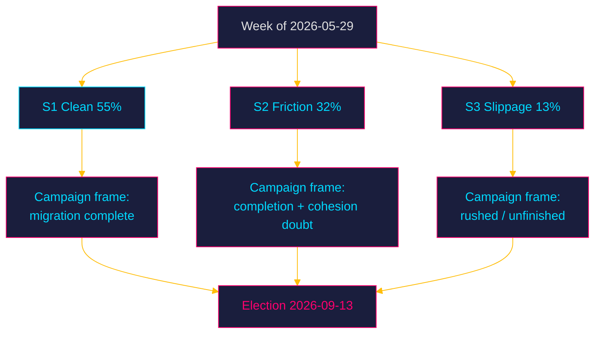

# Scenario Analysis — Week Ahead from 2026-05-29

Three exhaustive, mutually exclusive scenarios for how the pre-recess week resolves on the lead measures. Probabilities sum to 100%. Each carries horizon-band-tagged WEP terms and falsification triggers.

## Scenario Probability Summary

| Scenario | Probability | One-line characterisation |
|----------|------------|---------------------------|
| S1 — Clean Completion | 55% | Both leads pass on the government+SD bloc; L/C support without breaking reservations |
| S2 — Friction Completion | 32% | Leads pass but with visible L/C reservations or a Lagrådet caveat |
| S3 — Slippage / Disruption | 13% | A lead is delayed, amended materially, or slips past recess |
| **Total** | **100%** | |

## S1 — Clean Completion (55%) [horizon:week]

**Narrative**: `HD01SfU35` and `HD01JuU33` are adopted on the M–KD–L + SD bloc with the welfare tranche passing alongside. L supports without a formal reservation; the coalition presents a unified "migration transformation complete" message entering the campaign. The opposition records its economic-fairness interpellations but cannot alter outcomes.

It is **likely** [horizon:week] that this is the realised path, consistent with the government's high incentive to finish before recess and the bloc's demonstrated spring cohesion on migration. `[B2]`

**Leading indicators**: no Lagrådet blocking opinion; no L/C reservation filed; debate proceeds on schedule.
**Falsification trigger**: a filed L/C reservation or a critical Lagrådet opinion moves the world into S2/S3.

## S2 — Friction Completion (32%) [horizon:week]

**Narrative**: The leads pass, but L or C files a reservation/qualifying statement on the surveillance or reception-control provisions, or Lagrådet attaches a proportionality caveat that the government accommodates with minor amendment. The measure succeeds but the coalition-cohesion narrative is dented and the opposition gains a "even the government's partners have doubts" line for the campaign.

It is **roughly even-to-unlikely** [horizon:week] in absolute terms (32%) but the most probable *deviation* from clean completion, given L's recurring civil-liberties exposure. `[B3]`

**Leading indicators**: reservation/särskilt yttrande filings; a Lagrådet opinion with proportionality reservations; visible intra-coalition negotiation.
**Falsification trigger**: complete absence of reservations (→ S1) or actual delay/material amendment (→ S3).

## S3 — Slippage / Disruption (13%) [horizon:week]

**Narrative**: One lead — most plausibly `HD01SfU35` — is delayed, materially amended, or fails to clear the chamber/Lagrådet sequence before recess, slipping into the campaign period unresolved. This would be a significant setback to the completion strategy and hand the opposition a "unfinished and rushed" narrative.

It is **unlikely** [horizon:week] (13%), but non-trivial given docket compression and the proportionality surface of reception control. `[C3]`

**Leading indicators**: Lagrådet blocking opinion; loss of L support; scheduling collapse in the final week.
**Falsification trigger**: on-schedule adoption of both leads (→ S1/S2).

## Cross-Horizon Extension

Beyond the week, all three scenarios converge on the same structural fact: the migration architecture is **very likely** [horizon:quarter] statute-complete before the campaign in S1/S2 (87% combined), making reversal — not enactment — the post-election variable. `[B2]`

## Confidence

Scenario probabilities are analytic estimates from agenda structure and coalition behaviour, MEDIUM confidence `[B2–B3]`. They are robust to ±5pp shifts without changing the rank order (S1 > S2 > S3).

**Pass-2 indicator sharpening.** The cleanest single discriminator between S1 (clean completion, 55%) and S2 (friction, 32%) is observable within 72 hours: the presence or absence of an L/C reservation text on HD01JuU33 ([horizon:72h]). S3 (slippage, 13%) is discriminated on a slower clock — whether any of the six betänkanden is deferred past 2026-05-29 ([horizon:week]). Watching these two binary signals collapses the scenario tree faster than tracking probabilities in aggregate.
