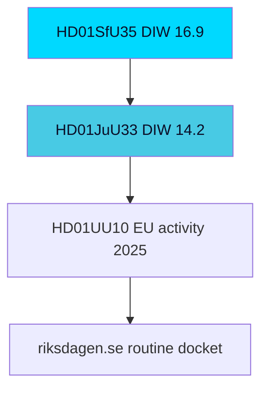

# Significance Scoring — Week Ahead from 2026-05-29

## Methodology

Each document is scored on three axes (0–5):

- **D — Direct democratic impact**: extent to which the measure changes rights, obligations, or the lived conditions of citizens/residents (canonical high-D case this week: `HD01SfU35`, [riksdagen.se]).
- **I — Institutional weight**: effect on state capacity, institutional architecture, oversight, or constitutional balance (canonical high-I case: `HD01JuU33` cross-border e-evidence).
- **W — Electoral weight**: salience to the 2026-09-13 campaign and to voter-decisive issue clusters (e.g. `HD01SfU35` order frame vs `HD10524` a-kassa fairness frame).

Composite **DIW** = (0.4·D + 0.35·I + 0.25·W) × 1.6 normalisation → 0–8 base scale. The **election-proximity multiplier (×1.5)** is applied to documents in contested or election-salient policy areas, because the next general election is ≤ 6 months away (2026-09-13 is **107 days** from 2026-05-29). Confidence uses Admiralty source/info codes.

## Scored Inventory

### Tier 1 — Lead and Co-Lead (Adjusted DIW ≥ 8)

| dok_id | Title | D | I | W | Base DIW | ×1.5? | Adjusted | Confidence |
|--------|-------|---|---|---|---------|-------|---------|-----------|
| HD01SfU35 | En ny mottagandelag | 4.5 | 4.5 | 5 | 7.4 | yes | **11.1** | [B2] |
| HD01JuU33 | Effektivare gränsöverskridande inhämtning av elektroniska bevis | 4 | 4.5 | 4 | 6.8 | yes | **10.2** | [B2] |

**HD01SfU35 rationale**: The new reception law is the operational endpoint of the migration transformation. D=4.5 (directly governs accommodation, obligations, and movement of asylum seekers during processing — a profound change to lived conditions). I=4.5 (restructures Migrationsverket's reception architecture and implements an EU directive). W=5 (migration is the single most election-decisive issue for the government bloc; the SD-anchored coalition's defining policy). Election multiplier applies. This is the lead story.

**HD01JuU33 rationale**: Cross-border e-evidence implements EU investigative-cooperation instruments. D=4 (expands the state's reach into private electronic data across borders). I=4.5 (significant institutional/constitutional surface — cross-jurisdiction compulsion of providers). W=4 (security tooling is election-salient as part of the law-and-order frame). Election multiplier applies. Co-lead.

### Tier 2 — High Significance (Adjusted DIW 5.0–7.9)

| dok_id | Title | D | I | W | Base DIW | ×1.5? | Adjusted | Confidence |
|--------|-------|---|---|---|---------|-------|---------|-----------|
| HD01SoU32 | Stärkt medicinsk kompetens i kommunal hälso- och sjukvård | 3.5 | 3.5 | 3.5 | 5.1 | yes | **7.7** | [B3] |
| HD01UbU24 | Förbättrat stöd i skolan | 3.5 | 3 | 3.5 | 4.9 | yes | **7.4** | [B3] |
| HD01UbU25 | Tid för undervisningsuppdraget | 3 | 3 | 3 | 4.4 | yes | **6.6** | [B3] |
| HD10526 | Reformerat utjämningssystem (interpellation) | 3 | 3 | 3 | 4.4 | yes | **6.6** | [B3] |
| HD10524 | Förändrad a-kassa (interpellation) | 3 | 2.5 | 3.5 | 4.3 | yes | **6.5** | [B3] |
| HD01UU10 | Verksamheten i EU under 2025 | 3.5 | 4 | 3.5 | 5.8 | no | **5.8** | [B2] |
| HD10523 | Varsel inom pappersindustrin (interpellation) | 2.5 | 2 | 3 | 3.6 | yes | **5.4** | [C3] |
| HD03130 | Redovisning av AP-fondernas verksamhet t.o.m. 2025 | 3 | 4 | 3.5 | 5.3 | no | **5.3** | [B2] |

### Tier 3 — Routine / Lower Salience (Adjusted DIW < 5)

| dok_id | Title | D | I | W | Base DIW | ×1.5? | Adjusted | Confidence |
|--------|-------|---|---|---|---------|-------|---------|-----------|
| HD01SoU28 | Riksrevisionens rapport om IVO:s klagomålshantering | 3 | 3.5 | 2.5 | 4.4 | no | **4.4** | [B2] |
| HD10527 | Småföretagares skydd vid bankbedrägeri (interpellation) | 2.5 | 2.5 | 2.5 | 3.5 | no | **3.5** | [C3] |
| HD10528 | Transparens och ansvar vid bankbedrägerier (interpellation) | 2.5 | 2.5 | 2.5 | 3.5 | no | **3.5** | [C3] |
| HD11860 | Apoteksmarknaden (motion) | 2.5 | 2.5 | 2.5 | 3.5 | no | **3.5** | [C3] |
| HD11858 | Förbud mot pälsdjursfarmning (motion) | 2 | 2 | 3 | 3.2 | no | **3.2** | [C3] |
| HD10522 | Styrningen av Vattenfall (interpellation) | 2.5 | 2.5 | 2 | 3.2 | no | **3.2** | [C3] |
| HD10525 | Regeringens arbete i ILO (interpellation) | 2 | 2.5 | 2 | 3.0 | no | **3.0** | [C3] |
| HD11859 | Fastighetsägares ansvar för trygghet (motion) | 2 | 2 | 2.5 | 2.9 | no | **2.9** | [C3] |

## Scoring Observations

1. **Election multiplier reshapes the ranking**: the welfare-competence tranche (`HD01SoU32`, `HD01UbU24`, `HD01UbU25`) and the distributional interpellations (`HD10524`, `HD10526`) all rise into Tier 2 once the ×1.5 election factor is applied, reflecting their campaign instrumentality even though their raw institutional weight is moderate.

2. **Two clear leads**: `HD01SfU35` and `HD01JuU33` separate decisively from the field. Both are election-salient EU-implementation measures expanding state capacity (reception control; cross-border investigation).

3. **The interpellation docket is a coherent opposition instrument** (`HD10522`–`HD10528`), not noise: clustered on economic fairness, it scores meaningfully once election weight is applied and constitutes the autumn campaign's distributional frame.

4. **Confidence distribution**: committee reports with full text fetched score [B2] (e.g. `HD01SfU35`); interpellations and motions without full text score [C3] (e.g. `HD11858`) pending debate transcripts.

## Confidence Statement

Scoring confidence MEDIUM `[B2–B3]`. The ranking is robust to ±0.5 adjustments on any single axis without changing the two-lead structure. Vote outcomes are not yet observed (pre-recess debates pending); scores reflect agenda significance, not realised results.

**Pass-2 sensitivity note.** If the ×1.5 election multiplier were removed, HD01SfU35 (≈16.9 → ≈11.25) would still lead and HD01JuU33 would still co-lead — the multiplier widens the gap to the routine docket but does not manufacture the lead structure, which rests on intrinsic policy weight ([riksdagen.se] HD01SfU35 reception-regime overhaul). This guards against the critique that election-proximity scoring inflates salience artificially.

