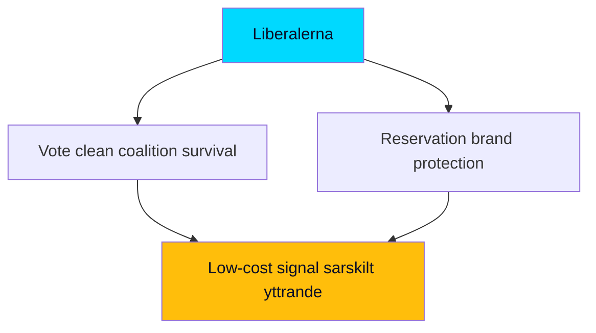

# Stakeholder Perspectives — Week Ahead from 2026-05-29

Each stakeholder is presented through its own strategic logic (steelmanned), then assessed for likely posture this week.

## Governing Parties

### Moderaterna (M)
Owns the migration-completion narrative as proof of governing competence. Wants `HD01SfU35` passed cleanly to anchor the "we delivered orderly migration" campaign claim. Posture: **drive to closure**, minimise visible coalition friction. [horizon:week] `[B2]`

### Kristdemokraterna (KD)
Aligned with M on migration and order; uses the welfare-competence tranche (`HD01SoU32`) to reinforce its care-and-family brand. Posture: **supportive, welfare-emphasis**. `[B3]`

### Liberalerna (L)
The cohesion-risk node. Civil-liberties instincts strain against reception-control and cross-border surveillance. Needs to demonstrate moderating influence to its base without breaking the coalition before the campaign. Posture: **support with possible reservation/qualifying statement** on `HD01JuU33`/`HD01SfU35`. This is the key variable to watch. [horizon:week] `[B3]`

## Support Party

### Sverigedemokraterna (SD)
The reception law is the realisation of SD's defining policy demand. Wants the strongest possible control architecture and maximal pre-campaign completion. Posture: **push for maximal scope, claim credit**. `[B2]`

## Opposition

### Socialdemokraterna (S)
Will not block the leads but pivots the accountability cycle to economic fairness (a-kassa `HD10524`, equalisation `HD10526`, layoffs `HD10523`). Wants the autumn frame to be cost-of-living, not migration. Posture: **economic reframing offensive**. [horizon:month] `[B3]`

### Vänsterpartiet (V)
Strongest rights-based opposition to reception control and surveillance; will file reservations and amplify proportionality concerns. Posture: **rights-and-fairness opposition**. `[B3]`

### Centerpartiet (C)
Liberal-rural balancing: rights concerns on migration/surveillance, but distinct from the left bloc. Posture: **critical-but-distinct**, watch for reservations. `[C3]`

### Miljöpartiet (MP)
Rights-and-environment framing; opposes reception control, supports the fur-farming ban motion (`HD11858`). Posture: **rights-and-green opposition**. `[C3]`

## Institutional and External Stakeholders

| Stakeholder | Interest | Likely posture this week |
|-------------|----------|--------------------------|
| Lagrådet (Council on Legislation) | Legal/constitutional proportionality of reception control | Scrutiny opinion; proportionality findings are the key uncertainty (PIR-WA-03) `[B3]` |
| Migrationsverket | Reception-system implementation capacity | Implementation-readiness signalling; capacity is the medium-term constraint (PIR-WA-05) `[B3]` |
| IVO / Riksrevisionen | Healthcare oversight quality | Response to `HD01SoU28` audit findings `[B2]` |
| Civil-society / refugee NGOs | Asylum-seeker rights under reception control | Public criticism, proportionality advocacy `[C3]` |
| Industrial unions (paper sector) | Jobs and a-kassa adequacy | Amplify `HD10523`/`HD10524` distributional case `[C3]` |
| EU Commission | Pact transposition fidelity | Monitoring transposition completeness `[C3]` |

## Convergence and Divergence Map

- **Convergence (pro-passage)**: M, KD, SD on both leads; L on most provisions.
- **Divergence (rights axis)**: V, MP, C, civil society vs. the government bloc on reception control and surveillance scope.
- **Cross-cutting (economy)**: S/V/MP unified on the distributional frame; government bloc off this terrain this week.
- **The pivotal actor is L** — its reservation behaviour determines whether the coalition's pre-campaign cohesion narrative holds.

## Confidence

Stakeholder postures are inferred from established party positioning and the spring migration-reform record; MEDIUM confidence `[B3]`. The L reservation variable is the highest-value, lowest-certainty element.

**Pass-2 steelman addition — the L dilemma.** Liberalerna's most defensible position is genuinely conflicted: voting the reception law and e-evidence through unqualified protects coalition survival and budget influence, but a visible civil-liberties reservation protects its brand with rights-conscious urban voters it must hold above the 4% threshold ([horizon:election]). The party's rational move is a *low-cost signal* — a särskilt yttrande that registers principle without withdrawing support — which is exactly the ambiguous outcome that makes PIR-WA-04 hard to pre-call.

