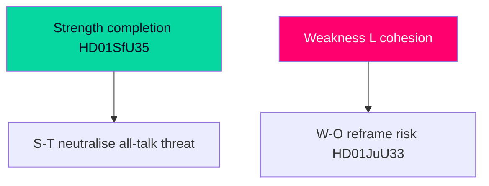

# SWOT Analysis — Week Ahead from 2026-05-29

This SWOT assesses the **governing coalition's strategic position** entering the final pre-recess week, 107 days before the election. A parallel mirror-SWOT for the opposition follows.

## Governing Coalition (M–KD–L + SD support)

### Strengths
- **Legislative completion momentum** [horizon:week]: the reception law (`HD01SfU35`) lets the coalition finish its migration transformation in statute before the campaign, converting a four-year mandate into a closed, defensible record. `[B2]`
- **Agenda control on owned terrain**: migration (`HD01SfU35`) and security tooling (`HD01JuU33`) are the bloc's strongest issues; finishing on them frames the campaign on favourable ground. `[B2]`
- **EU cover**: both leads are EU-implementation measures (Reception Conditions recast; e-Evidence), giving the coalition a "we are simply implementing European law" defence against rights-based criticism. `[B2]`
- **Welfare counter-tranche**: `HD01SoU32`/`HD01UbU24`/`HD01UbU25` provide a "we deliver welfare too" rebuttal to the opposition's narrow-government framing. `[B3]`

### Weaknesses
- **Coalition-cohesion exposure** [horizon:week]: L and C civil-liberties sensitivities on reception-control and cross-border surveillance are a recurring fracture risk; any reservation becomes a campaign data point. `[B3]`
- **Implementation-capacity gap**: reception-law execution depends on Migrationsverket capacity (open PIR-WA-05); a credible "unimplementable" critique blunts the win. `[B3]`
- **Economy off-frame**: the coalition is not setting the economic agenda this week; the opposition's interpellations occupy the cost-of-living space. `[B3]`

### Opportunities
- **Lock-in before freeze** [horizon:quarter]: completing the migration architecture now makes it the status-quo baseline that any future government must actively reverse — a durable strategic asset. `[B2]`
- **Law-and-order continuity narrative** [horizon:month]: pairing reception control with cross-border evidence powers tells a coherent "safe, orderly Sweden" story into the campaign. `[C3]`

### Threats
- **Lagrådet proportionality critique** [horizon:week]: a blocking or sharply critical Council on Legislation opinion on mandatory accommodation/movement restrictions would be the single most damaging pre-recess event. `[B3]`
- **Opposition reframing success** [horizon:month]: if the autumn frame becomes "cost-of-living and fairness" rather than "migration and order," the coalition's owned terrain matters less. `[B3]`
- **Industrial-jobs shock** [horizon:quarter]: paper-industry layoffs (`HD10523`) localise economic anxiety in a way that resists the national macro-stability message. `[C3]`

## Mirror SWOT — Opposition (S-led bloc)

- **Strengths**: clear economic-fairness frame (a-kassa `HD10524`, equalisation `HD10526`), concrete layoff example (`HD10523`), unified accountability deployment via the interpellation docket.
- **Weaknesses**: limited ability to block the reception law; risk of appearing reactive on migration; internal V–S–MP coordination cost.
- **Opportunities**: pivoting the campaign to distributional terrain where the coalition is weaker; exploiting any L/C reservation.
- **Threats**: being painted as soft on migration/security in the final pre-recess sprint; macro stability undercutting the cost-of-living urgency.

## Strategic Bottom Line

The coalition enters the week **structurally advantaged on completion and agenda control** but **exposed on cohesion, implementation credibility, and the economic frame**. The decisive variables are (1) L/C reservation behaviour and (2) whether the autumn frame is migration/order or economy/fairness. Confidence MEDIUM `[B2–B3]`.

**Pass-2 TOWS reinforcement.** The sharpest S-T pairing: the government's *completion* strength (S) directly neutralises the opposition's "all talk, no delivery" *threat* (T) on migration — but only if HD01SfU35 ([riksdagen.se]) passes cleanly. A W-O exposure mirrors this: any L *weakness* (visible reservation) hands the opposition an *opportunity* to reframe the week from "government completes reform" to "coalition fractures on rights," converting the government's intended closing image into a cohesion story.

