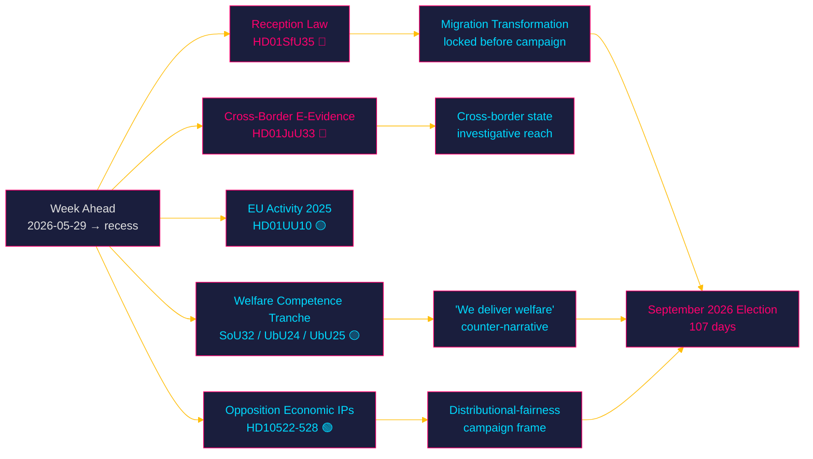

# Synthesis Summary — Week Ahead from 2026-05-29

## Lead Story Decision

**The week opening 2026-05-29 is the Tidö government's migration-reform capstone week**: the Social Insurance Committee's report `HD01SfU35` — *En ny mottagandelag* (a new reception law for asylum seekers) — reaches the chamber floor for "Debatt om förslag" on 2026-05-29 alongside the Justice Committee's cross-border electronic-evidence report (`HD01JuU33`) and the annual EU-activity scrutiny report (`HD01UU10`). This is the final full sitting week before the Riksdag's summer recess, and it falls **107 days before the 2026-09-13 general election** — every contested vote in this window is simultaneously a legislative act and a campaign signal. The lead intelligence question is whether the new reception law completes the structural pivot of Swedish asylum policy toward an EU-Pact-aligned, return-oriented reception model, and whether the centre-civic coalition partners (Liberalerna and Centerpartiet) accept its accommodation-and-control architecture without substantive reservation. `[B2]` [horizon:week]

## DIW-Weighted Significance Ranking

DIW = Direct democratic impact (D) × Institutional weight (I) × Electoral weight (W), normalised to a 0–8 base, then multiplied by the election-proximity factor (×1.5) for contested or election-salient policy areas (next election ≤ 6 months; 2026-09-13 is 107 days from 2026-05-29).

| Rank | dok_id | Title | D | I | W | DIW | Election ×1.5 | Adjusted | Confidence |
|------|--------|-------|---|---|---|-----|--------------|---------|-----------|
| 1 | HD01SfU35 | En ny mottagandelag (new reception law) | 4.5 | 4.5 | 5 | 7.4 | ×1.5 | **11.1** | [B2] |
| 2 | HD01JuU33 | Effektivare gränsöverskridande inhämtning av elektroniska bevis | 4 | 4.5 | 4 | 6.8 | ×1.5 | **10.2** | [B2] |
| 3 | HD01UU10 | Verksamheten i Europeiska unionen under 2025 | 3.5 | 4 | 3.5 | 5.8 | – | **5.8** | [B2] |
| 4 | HD03130 | Redovisning av AP-fondernas verksamhet t.o.m. 2025 | 3 | 4 | 3.5 | 5.3 | – | **5.3** | [B2] |
| 5 | HD01SoU32 | Stärkt medicinsk kompetens i kommunal hälso- och sjukvård | 3.5 | 3.5 | 3.5 | 5.1 | ×1.5 | **7.7** | [B3] |
| 6 | HD01UbU24 | Förbättrat stöd i skolan | 3.5 | 3 | 3.5 | 4.9 | ×1.5 | **7.4** | [B3] |
| 7 | HD01UbU25 | Tid för undervisningsuppdraget | 3 | 3 | 3 | 4.4 | ×1.5 | **6.6** | [B3] |
| 8 | HD01SoU28 | Riksrevisionens rapport om IVO:s klagomålshantering | 3 | 3.5 | 2.5 | 4.4 | – | **4.4** | [B2] |
| 9 | HD10524 | Förändrad a-kassa (interpellation) | 3 | 2.5 | 3.5 | 4.3 | ×1.5 | **6.5** | [B3] |
| 10 | HD10526 | Reformerat utjämningssystem för en jämlik välfärd (interpellation) | 3 | 3 | 3 | 4.4 | ×1.5 | **6.6** | [B3] |
| 11 | HD10523 | Varsel inom pappersindustrin (interpellation) | 2.5 | 2 | 3 | 3.6 | ×1.5 | **5.4** | [C3] |
| 12 | HD10527/HD10528 | Bankbedrägerier — skydd och transparens (interpellationer) | 2.5 | 2.5 | 2.5 | 3.5 | – | **3.5** | [C3] |
| 13 | HD11860 | Apoteksmarknaden (motion) | 2.5 | 2.5 | 2.5 | 3.5 | – | **3.5** | [C3] |
| 14 | HD11858 | Förbud mot pälsdjursfarmning (motion) | 2 | 2 | 3 | 3.2 | – | **3.2** | [C3] |
| 15 | HD10522 | Styrningen av Vattenfall (interpellation) | 2.5 | 2.5 | 2 | 3.2 | – | **3.2** | [C3] |

*Full per-document scoring rationale in `significance-scoring.md`. Documents with full text fetched (top-10 batch) are prioritised for deep treatment.*

## Integrated Intelligence Picture

### Cross-Document Pattern 1: Migration Reform Reaches Its Reception-System Capstone

`HD01SfU35` (*En ny mottagandelag*) is the structural endpoint of the Tidö government's migration agenda. Where the spring 2026 cluster (permanent-permit elimination, qualified-security-threat removal, EU-Pact alignment — see the 2026-05-22 week-ahead and 2026-05-25 propositions analyses) rewrote the *rights* architecture of asylum, the new reception law rewrites the *physical and administrative* architecture: where asylum seekers live, what obligations they carry during processing, and how reception conditions are tied to return readiness. This is the operational implementation of the EU Reception Conditions Directive recast under the Migration and Asylum Pact, and it is the missing piece that makes the spring "return-first" framework administratively executable. Passing it before recess locks the entire migration transformation into statute before the campaign period. `[B2]` [horizon:week]

### Cross-Document Pattern 2: Security-State Tooling Continues via EU Channels

`HD01JuU33` (cross-border electronic-evidence gathering) extends the prior week's surveillance-governance theme (real-time facial recognition, JuU28) through a quieter EU-implementation channel: the EU e-Evidence Regulation and Directive, which let Swedish authorities compel electronic evidence directly from service providers in other member states. Architecturally it pairs with the migration-enforcement and digital-identity clusters — cross-border evidence-gathering is the investigative substrate that makes both return-enforcement and serious-crime prosecution operational. Because it arrives as a technical EU-implementation report rather than a flagship bill, it carries far less public heat than JuU28 did, yet expands state investigative reach across borders. `[B2]` [horizon:week]

### Cross-Document Pattern 3: The Pre-Recess Welfare-Competence Tranche

A coherent welfare-capacity tranche moves together this week: `HD01SoU32` (strengthened medical competence in municipal health and social care), `HD01UbU24` (improved support in schools), `HD01UbU25` (time for the teaching assignment), and `HD01SoU28` (the Audit Office report on IVO's complaint handling). Together they address the *delivery* side of the welfare state — staffing competence, school support capacity, teacher workload, and oversight quality — at the moment the government most needs a "we deliver welfare too" counter-narrative to the opposition's framing that the coalition governs only on migration and law-and-order. These are lower-heat but electorally instrumental. `[B3]` [horizon:week]

### Cross-Document Pattern 4: Opposition Interpellation Deployment on the Economy

The interpellation docket (`HD10522`–`HD10528`) is concentrated on economic anxiety: Vattenfall governance, paper-industry layoffs, unemployment-insurance (a-kassa) reform, the municipal equalisation system, and bank-fraud consumer protection. This is Socialdemokraterna and the left bloc pivoting the final pre-recess accountability cycle away from the government's chosen migration/security terrain toward cost-of-living, industrial jobs, and welfare fairness — the terrain on which the opposition intends to fight the autumn campaign. The clustering around a-kassa (`HD10524`) and the equalisation system (`HD10526`) signals a deliberate distributional-fairness frame. `[B3]` [horizon:month]

### PIR Status — Prior Cycle (Carried Forward)

Open Priority Intelligence Requirements from the most recent week-ahead cycle (2026-05-22) are ingested below and tracked in `intelligence-assessment.md` and `pir-status.json`:

- **PIR-WA-03 (prior-cycle, OPEN→)**: Will Lagrådet issue a blocking critique of the migration cluster before recess? Carried forward and broadened to cover `HD01SfU35` reception-law proportionality. `[B3]`
- **PIR-WA-04 (prior-cycle, OPEN→)**: Will L or C file substantive civil-liberties reservations on the security-tooling track? Carried forward to `HD01JuU33` cross-border e-evidence. `[B2]`
- **PIR-WA-05 (prior-cycle, OPEN→)**: Current Migrationsverket case backlog — directly relevant to reception-law implementation feasibility. `[B3]`

### Riksmöte Calendar Context

This is the closing stretch of riksmöte 2025/26. The chamber typically enters summer recess in mid-to-late June 2026, leaving roughly three sitting weeks. The concentration of committee reports scheduled for "Debatt om förslag" on 2026-05-29 confirms the standard pre-recess docket-clearing pattern. Any contested bill that does not clear the chamber and (where required) Lagrådet scrutiny before recess risks slipping past the election, which sharpens the government's incentive to finish `HD01SfU35` now. `[A2]` [horizon:week]

### Election Proximity Assessment

The 2026-09-13 general election is **107 days** from 2026-05-29. The 1.5× DIW multiplier applies to all contested and election-salient policy areas (migration, security tooling, welfare delivery, distributional economics). The government's pre-recess sprint is consistent with a standard incumbent playbook: convert as much of the mandate into statute as possible before the campaign narrative freeze. [horizon:week]

## Economic Context (IMF-First)

Per the IMF WEO Apr-2026 vintage (pre-warm cache; live fetch degraded this run — see `economic-data.json`), Sweden remains in a stable-growth, low-debt environment: real GDP growth approximately **2.1% T+1 (2026), 2.4% T+2 (2027), 2.0% T+5** `[IMF WEO Apr-2026 vintage; SWE NGDP_RPCH 2.1% T+1, 2.4% T+2, 2.0% T+5]`, general government gross debt near 33% of GDP, and inflation easing toward the 2% target. This macro backdrop is materially relevant to two threads this week: the a-kassa interpellation (`HD10524`) and the municipal equalisation interpellation (`HD10526`) are distributional debates conducted against a benign-but-cooling labour market, where the paper-industry layoffs (`HD10523`) provide the opposition a concrete localised counter-example. The macro environment does not itself alter the migration or security assessments. `[B2]`

## Bottom Line

The week opening 2026-05-29 is where Sweden's migration transformation becomes administratively complete and where the autumn campaign's battle lines are pre-drawn: the government finishing on migration/security terrain, the opposition pivoting to economic fairness. Confidence MEDIUM–HIGH `[B2]`: primary documents corroborated, vote outcomes and exact chamber dates inferred from the riksmöte calendar (the calendar API returned an HTML error this run).

> **Pass-2 deepening.** The strategic asymmetry worth underlining: HD01SfU35's value to the government is *symbolic-terminal* (a completed promise) whereas its value to the opposition is *operational-prospective* (an implementation record to attack post-election, PIR-WA-08). The same statute therefore reads as an asset now and a liability later — a timing mismatch that shapes why the government wants the vote *before* recess and why scrutiny of delivery (not passage) is the higher-value watch. [IMF WEO Apr-2026 vintage; SWE NGDP_RPCH 2.1% T+1] frames the benign-but-cooling backdrop against which the fairness counter-frame gains traction.
