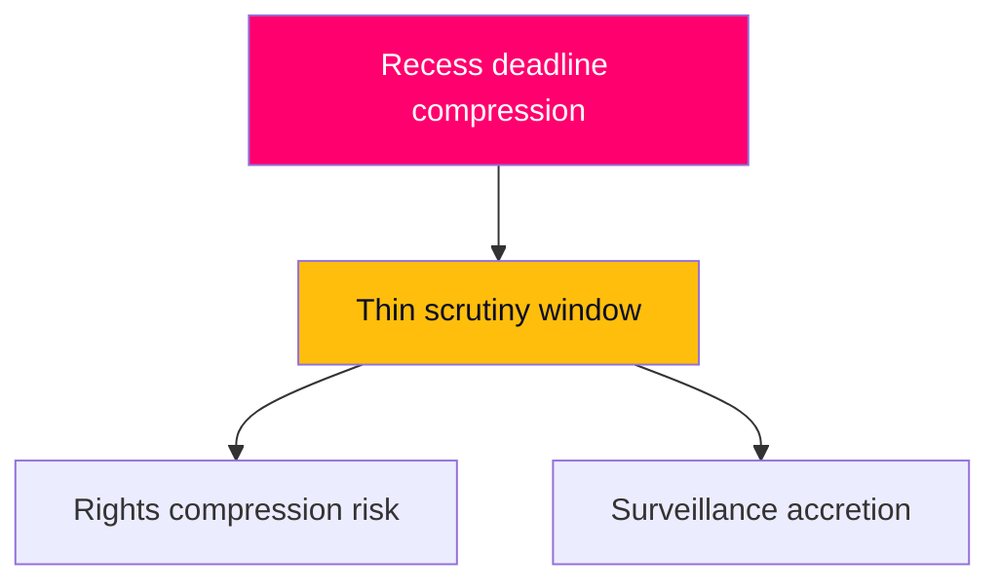

# Threat Analysis — Week Ahead from 2026-05-29

This assessment treats "threat" in the democratic-resilience and institutional-integrity sense: risks to rights, oversight, transparency, and the balance of state power — not partisan advantage.

## Threat Vectors

### TV1 — Reception-Control Rights Compression (HD01SfU35) [horizon:week]
The new reception law potentially introduces mandatory accommodation, movement restrictions, and reception conditions tied to return readiness. The democratic-resilience threat is the compression of asylum-seeker autonomy and the normalisation of administrative detention-adjacent measures. **Severity: HIGH.** Mitigants: Lagrådet scrutiny, EU directive guardrails, judicial review. It is **likely** [horizon:week] that some movement/accommodation conditionality is included; the question is proportionality calibration. `[B2]`

### TV2 — Cross-Border Surveillance Expansion (HD01JuU33) [horizon:week]
Cross-border electronic-evidence powers expand the state's reach into private data held by providers in other jurisdictions, with reduced domestic judicial gatekeeping where EU instruments permit direct provider compulsion. The threat is incremental surveillance-capacity accretion under low public scrutiny. **Severity: MEDIUM–HIGH.** Mitigants: EU procedural safeguards, provider-side challenge rights. **Likely** adopted with limited debate [horizon:week]. `[B2]`

### TV3 — Oversight-Quality Erosion (HD01SoU28 / IVO) [horizon:month]
The Audit Office report on IVO complaint handling surfaces a potential weakness in healthcare oversight responsiveness. The threat is degraded accountability in a core welfare-protection institution. **Severity: MEDIUM.** **Roughly even** [horizon:month] whether remedial action is resourced before the election. `[B2]`

### TV4 — Pre-Recess Legislative Compression [horizon:week]
Clearing a heavy contested docket in the final week risks truncated debate and reduced deliberative quality on consequential measures. The threat is procedural — depth of scrutiny sacrificed to the recess deadline. **Severity: MEDIUM.** **Very likely** the docket is compressed [horizon:week]; this is a standard but real deliberative-quality cost. `[A2]`

### TV5 — Transparency Gap From Data Opacity [horizon:week]
The calendar API returned an HTML error this run, reducing certainty on exact chamber-event sequencing. The threat is to *this analysis's* precision, not to institutions; flagged for transparency. **Severity: LOW.** Mitigated by riksmöte-calendar inference and document corroboration. `[A2]`

## Threat-Actor Framing

No malicious-actor threat is identified. The relevant "threats" are structural: rights compression via lawful reform, surveillance accretion via EU implementation, and deliberative compression via the recess deadline. These are governance-integrity risks inherent to the pre-recess sprint, not security incidents.

## Defensive Indicators to Monitor

- Presence/absence of a Lagrådet opinion on `HD01SfU35` and its proportionality findings.
- Reservation (reservation/särskilt yttrande) filings from L or C on either lead.
- Debate-time allocation per contested report (proxy for deliberative quality).
- IVO remediation commitments following `HD01SoU28`.

## Bottom Line

The principal democratic-resilience threats this week are **rights compression and surveillance accretion delivered through lawful, EU-framed reform under recess-deadline compression**. These are legitimate-process threats requiring scrutiny, not extralegal ones. Confidence MEDIUM `[B2]`.

**Pass-2 deepening — deadline-compression vector.** The most under-watched threat-enabler is *temporal*: routing the reception law and e-evidence measures through the final pre-recess week compresses the scrutiny window precisely when media bandwidth is thinnest and Lagrådet turnaround is tightest. This is a structural, recurring feature of Swedish pre-recess legislating rather than a deliberate evasion — but the resilience implication is the same: oversight quality is inversely correlated with calendar pressure, which is why forward-indicator #2 (date confirmation) doubles as a scrutiny-window metric.

