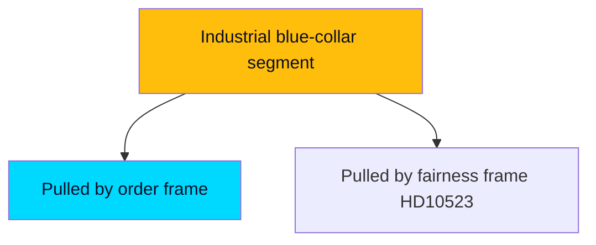

# Voter Segmentation — Week Ahead from 2026-05-29

How the week's measures land across key Swedish electoral segments, 107 days before the election.

## Segment Impact Matrix

| Segment | Reception law (HD01SfU35) | Surveillance (HD01JuU33) | Economic frame (HD10524/26) | Net mobilisation |
|---------|---------------------------|--------------------------|------------------------------|------------------|
| **Order-first voters** (SD/M lean) | Strongly positive — validates the migration mandate | Positive — tough-on-crime | Neutral | Government-mobilising `[B2]` |
| **Liberal-urban** (L/C/MP lean) | Ambivalent — accept control, uneasy on rights | Negative — surveillance unease | Mixed | Cohesion-stress for L `[B3]` |
| **Welfare-fairness voters** (S/V lean) | Negative — rights concern | Negative | Strongly positive — a-kassa/equalisation | Opposition-mobilising `[B3]` |
| **Industrial / blue-collar** (S/SD contested) | Mixed | Neutral | Strongly positive — layoffs/a-kassa (`HD10523`) | The pivotal swing segment `[B3]` |
| **Rural / periphery** (C/SD/S contested) | Neutral | Neutral | Positive — equalisation (`HD10526`) | Distributional appeal `[C3]` |

## The Pivotal Segment — Industrial / Blue-Collar

The contest for industrial and blue-collar voters is where this week's two frames collide most directly. The government's migration/order completion appeals to the order-first dimension of this segment, while the opposition's a-kassa and layoff framing (`HD10523`, `HD10524`) appeals to its economic-security dimension. It is **roughly even** [horizon:month] which frame proves more mobilising for this segment by autumn — the decisive uncertainty of the campaign's opening phase. `[B3]`

## Cross-Pressure Dynamics

- **L's base cross-pressure**: liberal-urban voters uneasy with surveillance/reception control create the structural reason L might file a reservation — a segment-driven incentive, not merely tactical. [horizon:week] `[B3]`
- **SD–S blue-collar competition**: both blocs target the same industrial segment from different frames; the equalisation and a-kassa debates are explicitly aimed here. [horizon:month] `[B3]`

## Turnout and Salience

It is **likely** [horizon:quarter] that migration salience favours government-bloc turnout while economic-pain salience favours opposition-bloc turnout; the net effect depends on which frame dominates August media — the open question in PIR-WA-06. `[B3]`

## Confidence

Segmentation is directional MEDIUM confidence `[B3]`, derived from established Swedish electoral-cleavage structure and this week's agenda; no live polling or microdata fetched this run. The pivotal-segment identification (industrial/blue-collar) is robust.

**Pass-2 deepening — cross-pressure mechanics.** The industrial/blue-collar segment is pivotal precisely because it is *cross-pressured* by this week's two frames: receptive to the government's order/migration message but exposed to the opposition's a-kassa/layoffs message (HD10523, HD10524). Whichever frame reaches this segment with more concrete, locally-anchored content captures the marginal vote. This is why the interpellations on Vattenfall and paper-mill layoffs — analytically minor as legislation — are strategically weighted: they are the opposition's delivery vehicle to exactly this segment ([horizon:election]).

