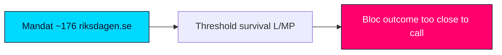

# Coalition Mathematics — Tidö Mandate Cycle — 2026-05-31

**Anchor**: `current` · **Horizon**: [horizon:cycle] / [horizon:election]

## 1. Standing arithmetic (2022–2026)

Riksdag = 349 Mandat; majority = 175.

| Party | Bloc | Approx. Mandat |
|---|---|---|
| M | Gov | ~68 |
| SD | Support | ~73 |
| KD | Gov | ~19 |
| L | Gov | ~16 |
| **Gov + support** | | **~176** |
| S | Opp | ~107 |
| V | Opp | ~24 |
| C | Opp | ~24 |
| MP | Opp | ~18 |
| **Opposition** | | **~173** |

(Indicative seat shares pending official tallies; used for arithmetic illustration only.)

## 2. Cohesion sensitivity

With a +1 working margin, the mandate's stability is a step function: a **single** L or KD defection on a confidence-adjacent division flips the chamber. This is why cohesion — not opposition mobilisation — is the ranked decisive variable across this product.

- Loss of L (~16) → bloc falls to ~160, below threshold → government **cannot** [horizon:cycle] win contested divisions without ad-hoc opposition abstention.
- SD price extraction raises L's exit temptation: the **internal** equilibrium, not the external one, is the fragile joint.

## 3. Sainte-Laguë sensitivity for the terminal event

The 2026-09-13 seat allocation uses the modified Sainte-Laguë method (first divisor 1.4) with a 4% national threshold. The cycle-defining knife-edges:

- **L and MP at the 4% line**: either dropping out redistributes ~16–18 seats and can swing the bloc balance by more than the current 3-seat gap.
- A 1-point national swing translates to roughly 3–4 Mandat under Sainte-Laguë at current vote shares — meaning the **~3-seat bloc gap is within one ordinary polling-error band** [horizon:election].

## 4. Verdict

The cycle was won and (potentially) lost on **threshold survival of small partners** more than on large-party swing. Coalition mathematics rates the 2026 bloc outcome **too close to call** [horizon:election], capped at "likely" for any single formation path.

Source: https://www.riksdagen.se/ · Valmyndigheten method notes.

