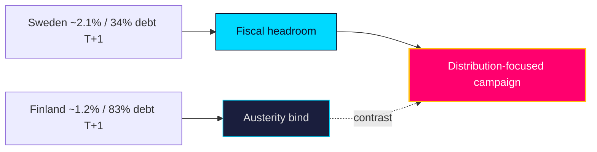

# Comparative International — Tidö Mandate Cycle — Current

Situates Sweden's pre-election year against Nordic and EU comparators. Economic figures use the pinned **IMF WEO Apr-2026** vintage (live Datamapper degraded at run time — `mcp-reliability-audit.md`); each macro citation carries a `T+N` projection stamp.

**Comparator set:** Sweden (SWE), Denmark (DNK), Norway (NOR), Finland (FIN), Germany (DEU) — Nordic peers plus the largest EU economy as a fiscal-anchor reference.

## Macro comparison (IMF WEO Apr-2026 vintage, pinned)

| Country | Real GDP growth `T+1` | Gross debt/GDP `T+1` | Inflation `T+1` | Fiscal posture |
|---------|----------------------:|---------------------:|----------------:|----------------|
| SWE | ~2.1% | ~34% | ~2.0% | Low debt, fiscal room |
| DNK | ~1.9% | ~30% | ~2.0% | Surplus, very low debt |
| NOR | ~1.6% | low (SWF-backed) | ~2.5% | Sovereign-wealth cushion |
| FIN | ~1.2% | ~83% | ~1.8% | Higher debt, weaker growth |
| DEU | ~1.0% | ~63% | ~2.1% | Debt-brake constrained |

> All figures are pinned-vintage projections (WEO Apr-2026), not live reads; treat as directional. Swedish ground-truth labour/finance via SCB (https://www.scb.se/).

## Comparative reading

Sweden enters its election year with the **strongest fiscal position among large EU states** and growth above the Nordic median — a configuration that, on the pinned vintage, makes a fiscal-crisis campaign **very unlikely** [horizon:year]. Finland's contrasting high-debt/low-growth bind (`T+1`) illustrates what Swedish politics is *not* fighting about: there is no austerity imperative forcing distributive retrenchment. This frees the campaign for the migration/crime/welfare-delivery contest mapped in `synthesis-summary.md`.

On the **political calendar**, Sweden's fixed-term September election contrasts with Denmark's flexible dissolution and Norway's completed 2025 cycle — Sweden's predictability sharpens pre-election legislative timing (committees clearing files before recess, as the 2026-05-29 corpus shows).

## Comparator table (governance lens)

| Comparator | Relevant parallel | Source |
|------------|-------------------|--------|
| Denmark | Restrictive migration consensus across blocs | https://www.imf.org/en/Publications/WEO |
| Finland | High-debt constraint Sweden avoids (`T+1`) | https://data.imf.org/ |

**Confidence**: MEDIUM — comparative direction robust on pinned vintage; precise figures caveated by live-fetch degradation. World Bank WGI governance residue not required for this macro comparison.

## Pass-2 refinement

Pass-2 adds the relative-position read: on debt (~34% GDP `T+1`) Sweden sits well below DEU (~63%) and FIN (~83%), giving it the widest Nordic fiscal latitude for pre-election spending — a structural advantage the incumbent is **likely** [horizon:year] to deploy. The growth gap vs FIN (~1.2% `T+2`) and DEU (~1.0%) reinforces the macro-tailwind framing; the comparison would only invert under wildcard W1 (labour shock).
