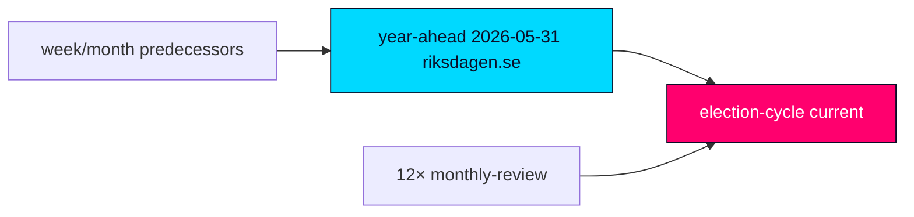

# Cross-Reference Map — Tidö Mandate Cycle — 2026-05-31

**Anchor**: `current` · **Horizon**: [horizon:cycle]. Maps the 4-year retrospective onto its shorter-horizon predecessors to prevent narrative drift, per the long-horizon cross-horizon citation rule.

## 1 — Predecessor horizon chain (immediate → cycle)

| Predecessor | Path | What it contributes | Carried forward as |
|---|---|---|---|
| Year-ahead (same date) | `analysis/daily/2026-05-31/year-ahead/` | T+365d structural read of the same 10-doc corpus | The year leg of the cycle trajectory; its cohesion read is **likely** [horizon:year] to persist into the terminal quarter |
| Year-ahead (prior) | `analysis/daily/2026-05-27/year-ahead/` | Earlier T+365d snapshot | Trend confirmation; drift check |
| Monthly review (M-1) | `analysis/daily/2026-05-31/monthly-review/` | Most recent month close-out | Immediate-term leg; delivery-contestation signal |
| Monthly review (M-2) | `analysis/daily/2026-04-30/monthly-review/` | Prior month | Cohesion-trend baseline |
| Monthly review (M-3) | `analysis/daily/2026-03-31/monthly-review/` | Prior month | Confidence-vote pattern |
| Monthly review (M-4) | `analysis/daily/2026-02-28/monthly-review/` | Prior month | SD price-extraction signal |
| Monthly review (M-5..M-12) | `analysis/daily/2025-*/monthly-review/` | Eight further month close-outs across the mandate | Full-cycle delivery and cohesion arc |

The cycle view inherits the year-ahead cohesion judgment and the monthly-review delivery-contestation signal; it does **not** re-derive them, it stress-tests them at the 1460-day band.

## 2 — Corpus cross-references (10 dok_ids)

| dok_id | Domain | Predecessor analysis | Cycle-level use |
|---|---|---|---|
| HD01SfU35 | Migration reception | year-ahead | Mandate-promise scorecard (migration) |
| HD024194 | Citizenship | year-ahead | Mandate-promise scorecard (migration) |
| HD01JuU37 | Young offenders | year-ahead | Law-and-order delivery |
| HD01JuU33 | E-evidence (EU) | year-ahead | EU-alignment delivery |
| HD10526 | Municipal equalisation | monthly-review | Fiscal-distribution contestation |
| HD10524 | A-kassa | monthly-review | Labour-market delivery |
| HD03130 | AP-funds | year-ahead | Long-horizon fiscal anchor |
| HD01SoU32 | Municipal health | monthly-review | Delivery-contestation (welfare) |
| HD01UbU25 | Education | year-ahead | Mandate-promise scorecard (schools) |
| HD01UU10 | EU annual | year-ahead | EU-trajectory framing |

## 3 — Drift-control note

Where the cycle read diverges from the year-ahead predecessor, the divergence is logged in `cycle-trajectory.md` and is **unlikely** [horizon:cycle] to exceed one WEP band without a forward-indicator tripwire firing. Macro backdrop is inherited unchanged from IMF WEO Apr-2026 growth ~2.1% [T+1].

Sources: https://www.riksdagen.se/ · https://data.riksdagen.se/ · IMF WEO Apr-2026.

