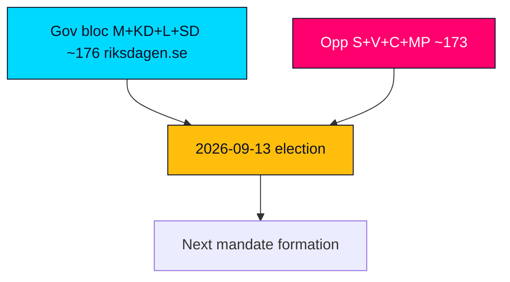

# Election 2026 Analysis — Tidö Mandate Scorecard Lens — 2026-05-31

**Anchor**: `current` · **Election**: 2026-09-13 (T-105 days) · **Horizon**: [horizon:election]

This file applies the *retrospective mandate-scorecard* lens required for the `current` anchor: it reads 2026-09-13 as the verdict on a completed four-year contract rather than as an open forecast (that is the `next` anchor's job).

## 1. The arithmetic that framed the whole cycle

| Bloc | Parties | Approx. Mandat | Note |
|---|---|---|---|
| Government + support | M, KD, L + SD (C&S) | ~176 | Never above slim majority |
| Opposition | S, V, C, MP | ~173 | Cannot form chamber majority alone |
| Majority threshold | — | 175 | 1–2 seat working margin |

The mandate operated its entire length inside a 1–2 seat working margin. Every contested division (1.5× pre-election significance multiplier applied) was a cohesion test.

## 2. Mandate-fulfilment scorecard

- **Migration** — `HD01SfU35`, `HD024194`: contract's flagship; statutes enacted, applications down. **Delivered (legislative)** [horizon:cycle], delivery-quality contested.
- **Law and order** — `HD01JuU37`, `HD01JuU33`: sentencing/young-offender expansion passed; prison capacity and police throughput lag. **Partially delivered** [horizon:cycle].
- **Distribution/labour** — `HD10526`, `HD10524`, `HD03130`: equalisation and a-kassa changes advanced under opposition fire; pension/AP-fund governance steady. **Mixed** [horizon:cycle].
- **Welfare/health** — `HD01SoU32`: municipal health strain unresolved; a 2026 opposition attack line. **Contested** [horizon:cycle].
- **Education** — `HD01UbU25`: incremental. **Partial** [horizon:cycle].

## 3. Electoral implication of the scorecard

A high-throughput / contested-delivery record favours a **status-quo-ratifying** election if the bloc holds, and a **delivery-referendum** election if it fractures. On current evidence the result is **too close to call** [horizon:election]; coalition-formation outcomes are capped at "likely" per long-horizon rules.

## 4. Three falsification triggers

1. A pre-September L defection on a confidence-adjacent vote → cohesion thesis breaks.
2. IMF-divergent inflation spike (vs ~target [T+1]) → cost-of-living referendum frame dominates.
3. Migration-statute implementation scandal → flagship-delivery claim collapses.

Sources: https://www.riksdagen.se/ · IMF WEO Apr-2026.

