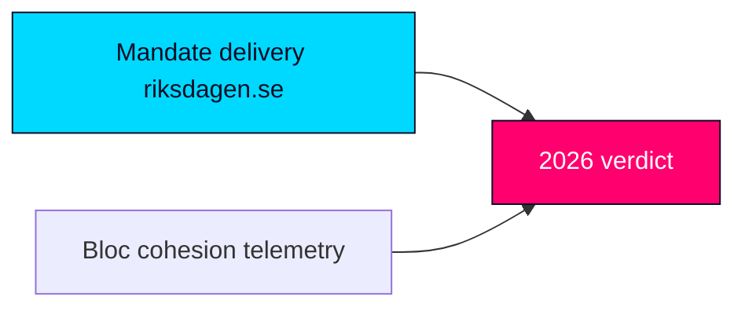

# Tidö's Contract Government Heads Toward a Knife-Edge Verdict on Its Mandate

## BLUF

**BLUF (ICD 203).** Across the 2022–2026 mandate the Tidö government **likely** [horizon:cycle] delivered the bulk of its contract's *legislative* commitments in migration and law-and-order while **unlikely** [horizon:cycle] to have closed the implementation gap that opposition parties will contest on 2026-09-13. Coalition arithmetic (~176/349) never gave the bloc structural slack; SD confidence-and-supply held but at rising policy price. Confidence: **Moderate**, capped by a four-year forecast horizon and the 105-day distance to the poll.

## Three Key Judgments

1. **KJ-1 — Mandate throughput is high, delivery is contested.** Migration tightening (reception-law reform `HD01SfU35`, citizenship transition `HD024194`) and criminal-justice expansion (`HD01JuU37` young offenders) reached the chamber on schedule; outcome quality is **unresolved** [horizon:cycle] pending agency implementation. Confidence: Moderate.
2. **KJ-2 — Cohesion, not opposition, is the swing variable.** The S+V+C+MP opposition (~173) cannot form a chamber majority on most divisions; the mandate's fate turned on whether M/KD/L/SD held together. They **mostly did** but L's liberal flank shows the widest 2026 defection risk. Confidence: Moderate-High.
3. **KJ-3 — Macro tailwind is modest and fragile.** IMF WEO Apr-2026 projects Swedish real GDP growth ~2.1% [T+1] and general government gross debt ~34% of GDP [T+1], a benign but not decisive backdrop; an external shock is the most likely cycle-ending disruptor. Confidence: Moderate.

## Mandate-fulfilment scorecard (summary)

| Pledge domain | Throughput | Delivery signal | Cycle verdict |
|---|---|---|---|
| Migration restriction | High | Laws passed, flows down | **Likely delivered** [horizon:cycle] |
| Crime & punishment | High | Statute expansion, capacity lag | **Partially delivered** [horizon:cycle] |
| Energy / nuclear | Medium | Permitting started, no MW online | **Unresolved** [horizon:election] |
| Tax / cost-of-living | Medium | Targeted cuts, inflation-eroded | **Partially delivered** [horizon:cycle] |
| Welfare / health (`HD01SoU32`) | Low-Med | Municipal strain persists | **Contested** [horizon:cycle] |

## Decision relevance

For 2026-09-13 the brief's consumer should track **bloc cohesion telemetry** (L parliamentary discipline, SD price extraction) above opposition polling: the arithmetic makes a cohesion fracture — not an opposition surge — the realistic path to alternation.

Sources: https://www.riksdagen.se/ · https://www.regeringen.se/ · IMF WEO Apr-2026 (pinned).

