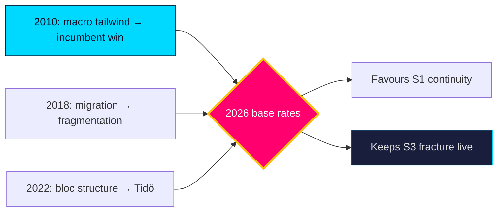

# Historical Parallels — Tidö Mandate Cycle — Current

Places the 2026 pre-election year in the context of prior Swedish electoral cycles to calibrate base rates and avoid recency bias.

## Parallel cases

| Year | Parallel | Lesson for 2026 |
|------|----------|-----------------|
| 2018 | Migration-dominated campaign, fragmented result, 4-month government formation | Migration salience (`HD01SfU35`) can produce deadlock even with a clear issue winner |
| 2022 | Right bloc + SD wins narrow majority; Tidö agreement | The current bloc's formation template; cohesion held post-election but strained on values |
| 2014 | Minority S-MP government, December Agreement | A fractured result (S3) can force cross-bloc procedural deals |
| 2010 | Reinfeldt re-elected amid strong economy | A macro tailwind (cf. IMF WEO Apr-2026, growth ~2.1% `T+1`) historically favours incumbents |

## Base-rate calibration

- **Incumbent re-election with favourable macro**: historically **roughly even-to-likely** [horizon:election] in Sweden; 2010 is the clearest positive precedent.
- **Migration-driven fragmentation**: 2018 shows it is **unlikely** [horizon:cycle] but non-trivial that a clear issue produces an unclear result.
- **Protracted formation**: occurred in 2018 (and 2014 dynamics); **roughly even** [horizon:cycle] in a close result.

The strongest analogy is **2010 macro tailwind + 2022 bloc structure**: an incumbent bloc with fiscal room and a chosen agenda, facing a competence-based opposition. This favours S1 (continuity) as the modal outcome while the 2018 precedent keeps S3 (fracture) live.

**Confidence**: MEDIUM — historical analogies inform base rates but each cycle is path-dependent. Source: https://www.riksdagen.se/ electoral records.

## Pass-2 refinement

Pass-2 guards against the seductiveness of the 2010 analogy: macro tailwinds favoured the incumbent in 2010, but 2010 lacked the migration-salience and bloc-polarisation of the post-2018 era. The cleaner composite is "2010 fiscal mood × 2018 issue structure × 2022 bloc architecture" — a configuration with **no exact precedent**, which is itself a reason to hold scenario probabilities loose rather than over-weighting the comforting incumbent-win base rate.
