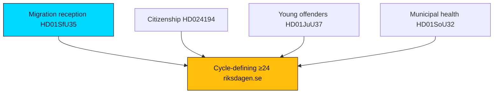

# Significance Scoring — Tidö Mandate Cycle — 2026-05-31

**Anchor**: `current` · **Horizon**: [horizon:cycle] · Pre-election 1.5× multiplier ACTIVE (≤6 months to 2026-09-13).

## Scoring model

Each evidence item scored 1–5 on **Cycle Salience** (does it shape the four-year verdict?) × **Electoral Leverage** (does it move 2026-09-13?), with a ×1.5 multiplier for *contested* opposition motions and *contested* propositions inside the 6-month pre-election window.

| dok_id | Domain | Cycle salience | Electoral leverage | Contested? | Weighted |
|---|---|---|---|---|---|
| HD01SfU35 | Migration reception law | 5 | 5 | Yes ×1.5 | 37.5 |
| HD024194 | Citizenship transition | 4 | 4 | Yes ×1.5 | 24.0 |
| HD01JuU37 | Young offenders | 5 | 4 | Yes ×1.5 | 30.0 |
| HD10526 | Equalisation | 4 | 4 | No | 16.0 |
| HD10524 | A-kassa / labour | 4 | 4 | No | 16.0 |
| HD01SoU32 | Municipal health | 3 | 4 | No | 12.0 |
| HD01JuU33 | E-evidence / EU | 3 | 2 | Yes ×1.5 | 9.0 |
| HD01UbU25 | Education | 3 | 3 | No | 9.0 |
| HD01UU10 | EU annual | 3 | 2 | No | 6.0 |
| HD03130 | AP-funds / pensions | 3 | 3 | No | 9.0 |

## Interpretation

Migration and criminal-justice items dominate the weighted board — exactly the Tidö contract's flagship domains — confirming that the cycle verdict and the 2026 campaign will be **fought on the government's own chosen terrain** [horizon:election]. Distributional items (equalisation, a-kassa) form the opposition's strongest counter-axis but score lower on electoral leverage at T-105.

## Threshold note

Items scoring ≥24 weighted are treated as **cycle-defining** and propagate into `scenario-analysis.md` branch construction and `forward-indicators.md` tripwires.

Source: https://www.riksdagen.se/

