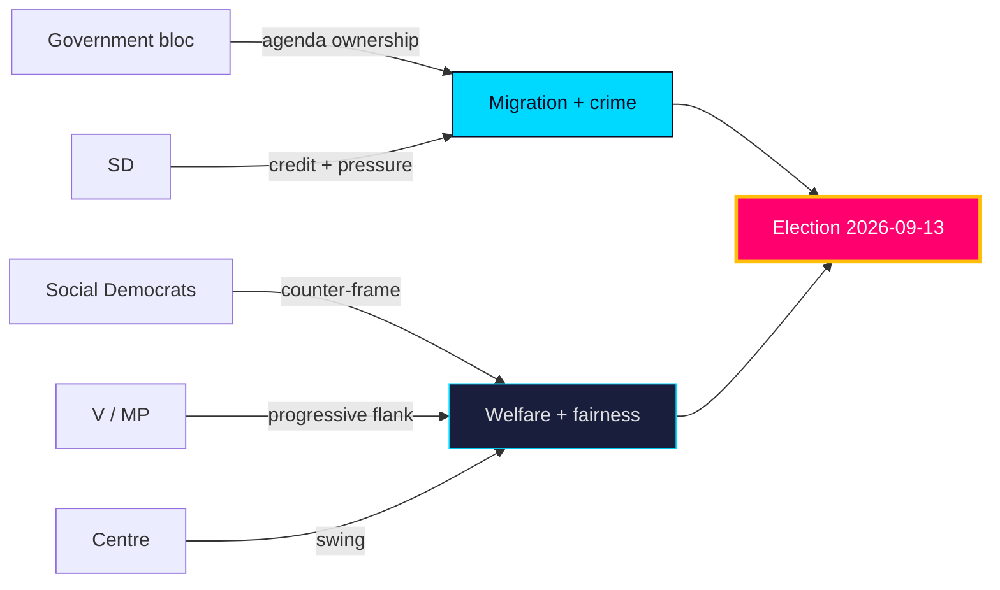

# Stakeholder Perspectives — Tidö Mandate Cycle — Current

How the major actors are **likely** [horizon:year] to position over the pre-election year. Each perspective is evidence-anchored.

## Government bloc (M, KD, L + SD support)
Prioritises migration and crime delivery to consolidate ownership of the dominant agenda (`HD01SfU35`, `HD01JuU37`). **Very likely** [horizon:year] to frame the year as "promises kept" on security and order. Internal tension: L's liberal profile vs. SD's restrictionism on citizenship (`HD024194`). https://www.riksdagen.se/

## Sweden Democrats (SD)
Pushes citizenship tightening and reception restriction as signature wins (`HD024194`, `HD01SfU35`). **Likely** [horizon:year] to claim credit while pressing for more, testing bloc cohesion. dok_id `HD024194`.

## Social Democrats (S, opposition lead)
Pivots to welfare delivery and fiscal fairness — equalisation, a-kassa, municipal care (`HD10526`, `HD10524`, `HD01SoU32`) — to reframe off the government's terrain. **Likely** [horizon:year] to contest competence, not values. dok_id `HD10526`.

## Left & Green (V, MP)
Supply the civil-liberties and humanitarian counter-frame on crime and migration (`HD01JuU37` reservations). **Likely** [horizon:year] to anchor the progressive flank and pressure S from the left. dok_id `HD01JuU37`.

## Centre (C)
Navigates the rural–equalisation axis (`HD10526`), courting net-recipient municipalities while preserving fiscal credibility. **Roughly even** [horizon:year] on which bloc it ultimately leans toward. dok_id `HD10526`.

## Municipalities & agencies (implementers)
290 municipalities and agencies (Migrationsverket, Polismyndigheten, Socialstyrelsen) absorb the implementation load (`HD01SfU35`, `HD01JuU37`, `HD01SoU32`). **Likely** [horizon:year] to surface capacity constraints (`implementation-feasibility.md`). dok_id `HD01SoU32`.

## Voters
Migration, crime and welfare top the concern hierarchy (`voter-segmentation.md`); the macro tailwind (IMF WEO Apr-2026, growth ~2.1% `T+1`) keeps economic anxiety secondary. https://www.scb.se/

**Net**: stakeholder incentives reinforce the two-axis campaign — government on migration/crime, opposition on welfare/fairness — with C the **roughly even** [horizon:year] pivot.

## Pass-2 refinement

Pass-2 adds the non-party stakeholder layer: municipalities and regions (delivery agents for `HD01SoU32`/`HD10526`) have a structural interest in amplifying the funding-adequacy debate regardless of which bloc governs, making them an opposition-aligned amplifier on fiscal fairness. Conversely, Migrationsverket and Polismyndigheten (delivery agents for `HD01SfU35`/`HD01JuU37`) are incentivised toward capacity-realism messaging that can cut against the government's "control restored" frame — an under-appreciated cross-pressure on the incumbent's strongest axis.
