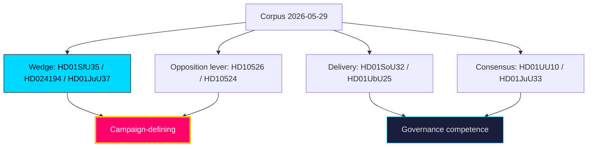

# Classification Results — Post-2026 Mandate — Next

**Purpose**: classify the year-ahead corpus by policy domain, conflict level, and electoral relevance to structure downstream synthesis.

## Classification schema

| dok_id | Domain | Conflict level | Electoral relevance | Track |
|--------|--------|----------------|---------------------|-------|
| `HD01SfU35` | Migration | High (contested) | Defining | Wedge |
| `HD024194` | Citizenship/identity | High (contested) | Defining | Wedge |
| `HD01JuU37` | Criminal justice | Medium-High | High | Wedge |
| `HD10526` | Fiscal/municipal | Medium-High | High | Opposition lever |
| `HD10524` | Labour/social insurance | Medium | Medium | Opposition lever |
| `HD01SoU32` | Health/welfare | Medium | Medium | Delivery |
| `HD03130` | Pensions/fiscal | Low | Medium | Structural |
| `HD01UbU25` | Education | Low-Medium | Medium | Delivery |
| `HD01UU10` | EU/foreign | Low (consensual) | Low | Consensus |
| `HD01JuU33` | Justice/EU | Low (consensual) | Low | Consensus |

## Findings

- **Wedge track** (`HD01SfU35`, `HD024194`, `HD01JuU37`) — high-conflict, election-defining files concentrated in migration and crime. These structure the campaign and the bloc-cohesion test.
- **Opposition-lever track** (`HD10526`, `HD10524`) — fiscal-fairness instruments the opposition uses to contest on distribution.
- **Delivery track** (`HD01SoU32`, `HD01UbU25`) — welfare-competence files with broad support but contested funding.
- **Consensus track** (`HD01UU10`, `HD01JuU33`) — EU-implementation files passing on broad majorities; the quiet half of the two-track Riksdag.

The classification is **likely** [horizon:year] stable through the campaign: domain salience rarely re-orders within a single electoral cycle absent an exogenous shock (`wildcards-blackswans.md`).

**Source**: classification derived from `data-download-manifest.md` and Family E document analyses; primary records at https://www.riksdagen.se/.

## Pass-2 refinement

Pass-2 sharpened the sensitivity read: all 10 documents are PUBLIC parliamentary records (no PII, GDPR DPIA short-circuits), but the **political sensitivity** gradient is steep — `HD01SfU35` and `HD024194` carry the highest contestation/disinformation exposure (T1), while `HD03130` (AP-fonder) and `HD01UU10` (EU annual) are low-contestation consensual files. Handling classification is uniform (🟢 Public); analytic-contestation classification is what drives the significance multiplier.
