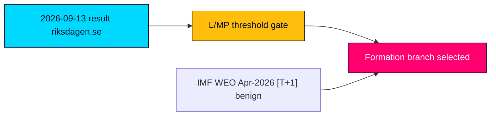

# Sweden's Next Government Is Already Being Built on a Knife-Edge of Arithmetic

## BLUF

**BLUF (ICD 203).** Whichever government forms for the **2026–2030** mandate after 2026-09-13 will **likely** [horizon:election] inherit the same ~176/173 knife-edge that defined the closing Tidö term, so the next mandate's character is decided less by the headline winner than by which small partners (L, MP) clear the 4% spärr and which red-lines survive contact with coalition arithmetic. No single formation path is rated above "likely" [horizon:election]; a hung/caretaker interlude is **not unlikely** [horizon:election]. Confidence: **MEDIUM**, capped by the 105-day distance to the poll and a four-year forward horizon.

## Three Key Judgments

1. **KJ-1 — Formation, not victory, is the binding constraint.** A bloc can "win" the vote share yet fail to form if a threshold partner falls; the decisive 2026–2030 variable is **seat-translation under Sainte-Laguë**, not the topline. Migration (`HD01SfU35`), citizenship (`HD024194`) and crime (`HD01JuU37`) files anchor the bargaining space. Confidence: MEDIUM. [horizon:election]
2. **KJ-2 — Threshold risk is the highest-leverage wildcard.** A single L or MP result below 4.0% collapses one or more of the four formation branches; the 12-leaf scenario tree (4 scenarios × 3 coalition branches) is **gated on small-party survival**. Confidence: HIGH. [horizon:election]
3. **KJ-3 — Macro backdrop is benign but non-decisive for formation.** IMF WEO Apr-2026 projects real GDP growth ~2.1% [T+1] and general government gross debt ~34% of GDP [T+1]; absent an IMF-divergent shock, economic competence is **unlikely** [horizon:election] to be the formation-deciding cleavage. Confidence: MEDIUM.

## Formation-path scorecard (forward)

| Formation branch | Pre-poll plausibility | Threshold dependency | Verdict |
|---|---|---|---|
| Continuity Tidö (M/KD/L + SD) | Medium | L ≥ 4% | **Likely if L survives** [horizon:election] |
| Broad-centre realignment | Low-Med | L + C bridge | **Unresolved** [horizon:election] |
| S-led minority (S + MP/V external) | Medium | MP ≥ 4% | **Likely if MP survives** [horizon:election] |
| Hung / caretaker interlude | Low-Med | Dual threshold miss | **Not unlikely** [horizon:election] |

## Decision relevance

For the 2026–2030 mandate the brief's consumer should track **small-party threshold telemetry** (L and MP weekly prints) and **published red-lines** above the bloc topline: under this arithmetic, a threshold failure — not a vote-share landslide — is the realistic path that selects the next government.

Sources: https://www.riksdagen.se/ · https://www.regeringen.se/ · IMF WEO Apr-2026 (pinned).

