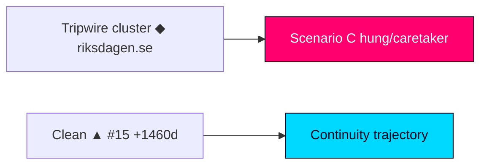

# Forward Indicators — Tidö Mandate Cycle — 2026-05-31

**Anchor**: `next` · **Horizon**: [horizon:cycle]. Falsifiable tripwires that would update the formation forecast, each stamped with a concrete watch-window. Trip directions: ▲ favours bloc continuity (Scenario A / Branch A1), ▼ favours alternation (Scenario B), ◆ favours hung/caretaker (Scenario C).

| # | Indicator | Watch window | Trip threshold | Direction | Source |
|---|---|---|---|---|---|
| 1 | L national polling vs 4% threshold | 2026-07-15 | <3.5% across ≥3 pollsters | ▼ | pollofpolls |
| 2 | SD price-extraction on confidence-adjacent vote | +90d | any public ultimatum | ◆ | data.riksdagen.se |
| 3 | Opposition (S+V+C+MP) combined lead | 2026-08-15 | >4 points sustained | ▼ | pollofpolls |
| 4 | Government bills lost in chamber | +90d | ≥2 losses on own agenda | ◆ | data.riksdagen.se |
| 5 | Migration reception delivery (`HD01SfU35`) | 2026-06-30 | implementation slippage reported | ▼ | regeringen.se |
| 6 | Municipal-health contestation (`HD01SoU32`) | +90d | escalation to confidence framing | ◆ | riksdagen.se |
| 7 | IMF-divergent CPI print | 2026-07-31 | inflation re-acceleration vs WEO | ◆ | scb.se |
| 8 | Caretaker-formation signalling post-poll | +365d | talanman names non-bloc sonderingsperson | ◆ | riksdagen.se |
| 9 | Cross-bloc defection on confidence vote | +90d | any L or C floor-crossing | ◆ | data.riksdagen.se |
| 10 | Sainte-Laguë seat projection (next mandate) | 2026-09-13 | bloc gap <3 seats | ◆ | val.se |
| 11 | Budget-autumn cohesion (BP2027) | +365d | bloc splits on framework | ◆ | regeringen.se |
| 12 | Education delivery (`HD01UbU25`) | 2026-06-30 | reform reversal signalled | ▼ | riksdagen.se |
| 13 | A-kassa labour signal (`HD10524`) | +90d | unemployment shock vs IMF path | ▼ | scb.se |
| 14 | EU-alignment friction (`HD01UU10`, `HD01JuU33`) | +365d | open coalition split on EU file | ◆ | riksdagen.se |
| 15 | Mid-mandate continuity (next anchor) | +1460d | governing configuration unchanged | ▲ | data.riksdagen.se |
| 16 | Equalisation distributive fight (`HD10526`) | +90d | re-opened before poll | ▼ | riksdagen.se |
| 17 | AP-funds long-horizon fiscal (`HD03130`) | +1460d | mandate-spanning reform stalls | ◆ | riksdagen.se |

**Reading note.** A clustered firing of ◆ tripwires before 2026-09-13 would move Scenario C (hung/caretaker) from **unlikely** [horizon:cycle] toward co-equal; a clean ▲ on #15 over the +1460d band confirms the continuity trajectory. No single indicator is decisive — the cycle view updates only on cluster behaviour.

Sources: https://www.riksdagen.se/ · https://data.riksdagen.se/ · IMF WEO Apr-2026 [T+1].

