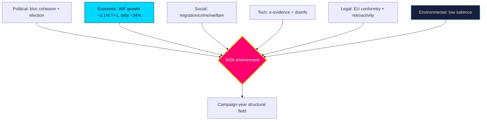

# PESTLE Analysis — Post-2026 Mandate — Next

Structural environment scan across six dimensions framing the 2026 pre-election year. Mandatory long-horizon module.

## Political

The government bloc (M/KD/L + SD support) holds a ~176-seat working majority but faces a binding cohesion test on values files (`HD01SfU35`, `HD024194`). It is **likely** [horizon:year] that pre-election positioning sharpens intra-bloc friction. The 2026-09-13 election is the dominant political variable.

## Economic

IMF WEO (Apr-2026 vintage) projects Swedish real GDP growth ~2.1% `T+1` rising to ~2.4% `T+2`, gross debt ~34% of GDP `T+1`, inflation ~2.0%. This fiscal headroom is **likely** [horizon:year] to fund pre-election welfare signalling (`HD01SoU32`, `HD10526`). A labour shock (unemployment from ~8.3% `T+1`) is the key downside (`HD10524`).

## Social

Migration, citizenship and youth crime (`HD01SfU35`, `HD024194`, `HD01JuU37`) dominate the social cleavage. Welfare equity (`HD10526`, `HD01SoU32`) is the cross-cutting fairness axis. Social salience of these issues is **very likely** [horizon:year] to structure the campaign.

## Technological

E-evidence and cross-border digital judicial cooperation (`HD01JuU33`) advance the EU digital-justice agenda. Disinformation infrastructure is a **roughly even** [horizon:year] threat vector into the campaign (`threat-analysis.md` T1).

## Legal

Rule-of-law tensions concentrate on migration/citizenship retroactivity (`HD024194`) and youth-justice proportionality (`HD01JuU37`). EU-law conformity (`HD01UU10`, `HD01JuU33`) is a binding external constraint. Legal challenge to retroactive provisions is **unlikely** [horizon:year] but consequential.

## Environmental

Lowest near-term salience; climate/energy does not feature in the selected package. Re-emergence as a campaign wedge is **unlikely** [horizon:year] absent an exogenous energy-price shock.

**Confidence**: MEDIUM-HIGH on structural framing; economic figures pinned to IMF WEO Apr-2026 vintage (live IMF degraded). Sources: https://www.riksdagen.se/, IMF WEO Apr-2026.

## Pass-2 refinement

Pass-2 ranks the six dimensions by 2026 decision-weight: Political and Economic are co-dominant (election + fiscal headroom), Social is the campaign medium, Legal is a binding constraint on the migration agenda, Technological is a second-order threat vector, and Environmental is dormant. The cross-dimension coupling that matters most is Economic→Political: the IMF-pinned fiscal latitude (~34% debt `T+1`) is what converts into pre-election welfare signalling, making the macro layer's vintage-fragility a political-judgement fragility too.
