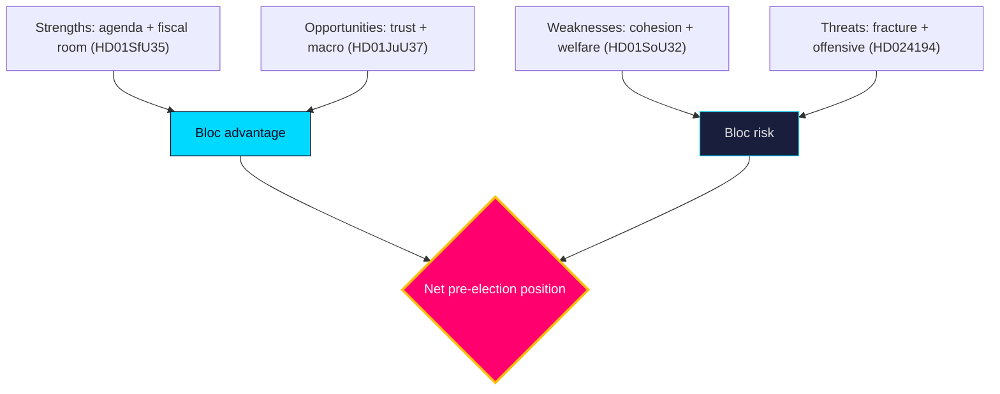

# SWOT Analysis — Post-2026 Mandate — Next

Strategic position of the **four-party government bloc** entering the pre-election year [horizon:year]. Each item is evidence-anchored to a dok_id or primary source.

### Strengths
- **Agenda ownership on migration/crime** — the bloc sets the dominant campaign terrain (`HD01SfU35`, `HD01JuU37`). https://www.riksdagen.se/sv/dokument-och-lagar/dokument/betankande/_HD01SfU35/
- **Fiscal headroom** — gross debt near 34% of GDP (`T+1`, IMF WEO Apr-2026) funds pre-election initiatives without austerity. dok_id `HD03130`.
- **Legislative momentum** — contested files clearing committee before recess shows delivery capacity (`HD01JuU37`, `HD024194`).
- **EU-track competence** — consensual implementation (`HD01JuU33`, `HD01UU10`) signals governing reliability.

### Weaknesses
- **Cohesion fragility** — four-party differentiation incentives rise in a campaign (`HD01SfU35` reservation risk). dok_id `HD01SfU35`.
- **Welfare-delivery exposure** — municipal care/education gaps are attack surfaces (`HD01SoU32`, `HD01UbU25`). dok_id `HD01SoU32`.
- **Equalisation flank** — rural net-recipient grievances are unaddressed (`HD10526`). dok_id `HD10526`.
- **Labour sensitivity** — a-kassa design exposed to a softening labour market (`HD10524`). dok_id `HD10524`.

### Opportunities
- **Security-competence dividend** — visible crime legislation can convert salience into trust (`HD01JuU37`). dok_id `HD01JuU37`.
- **Pension-stability narrative** — strong AP-fund year supports adequacy messaging (`HD03130`). dok_id `HD03130`.
- **Macro tailwind** — growth near 2.1%/2.4% (`T+1`/`T+2`, IMF WEO Apr-2026) underwrites optimistic framing. https://www.imf.org/en/Publications/WEO
- **EU agenda** — competitiveness/defence leadership burnishes statecraft (`HD01UU10`). dok_id `HD01UU10`.

### Threats
- **Bloc fracture under campaign pressure** — the defining downside (`HD024194` contestation). dok_id `HD024194`.
- **Exogenous shock** — security/economic black swans (see `wildcards-blackswans.md`). https://www.riksdagen.se/
- **Opposition fiscal-fairness offensive** — equalisation + welfare grievance coalition (`HD10526`, `HD01SoU32`). dok_id `HD10526`.
- **Implementation failure** — agency capacity gaps undercut delivery claims (`HD01JuU37` → Polismyndigheten). dok_id `HD01JuU37`.

## SWOT matrix

| Quadrant | Item | Evidence |
|----------|------|----------|
| Strength | Migration/crime agenda ownership | `HD01SfU35` / https://www.riksdagen.se/ |
| Strength | Fiscal headroom (debt ~34% GDP `T+1`) | `HD03130` / IMF WEO Apr-2026 |
| Weakness | Four-party cohesion fragility | `HD01SfU35` |
| Weakness | Welfare-delivery exposure | `HD01SoU32` |
| Opportunity | Security-competence trust dividend | `HD01JuU37` |
| Opportunity | Macro tailwind (growth ~2.1% `T+1`) | https://www.imf.org/en/Publications/WEO |
| Threat | Bloc fracture under campaign pressure | `HD024194` |
| Threat | Opposition fiscal-fairness offensive | `HD10526` |

**Net read**: structurally advantaged on agenda and macro; the decisive variable is internal cohesion, not external opposition strength.

## Pass-2 refinement

Pass-2 reconciles the SWOT with the quantitative scoring: the qualitative "decisive variable is cohesion" claim maps to the weighted scores where the top weakness (cohesion fragility, 3.25) sits just below the top strength (fiscal headroom, 4.25) — close enough that a modest re-scoring tips the net. This confirms the SWOT is *cohesion-pivoted*, not *opposition-pivoted*: the threat that actually moves outcomes is internal (W3 rupture), not the opposition's intrinsic strength.
