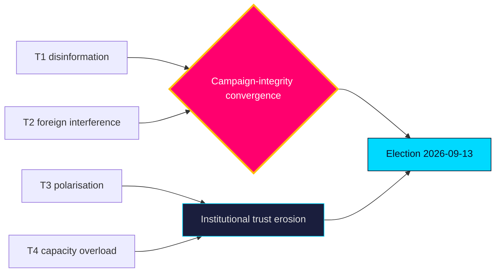

# Threat Analysis — Post-2026 Mandate — Next

**Scope**: threats to democratic process integrity and institutional resilience over the pre-election year. Distinct from `risk-assessment.md` (governance-stability) — here the lens is adversarial/process-integrity.

## Threat vectors

| ID | Vector | Actor / origin | Severity | Horizon | Evidence |
|----|--------|----------------|---------:|---------|----------|
| T1 | Disinformation amplifying migration wedge | Foreign + domestic networks | 4 | [horizon:election] | `HD01SfU35`, `media-framing-analysis.md` |
| T2 | Foreign interference in the campaign (cyber, influence) | State adversaries | 4 | [horizon:election] | `HD01UU10` |
| T3 | Polarisation eroding cross-bloc legislative trust | Domestic | 3 | [horizon:year] | `HD024194` |
| T4 | Institutional capacity erosion (courts/police overload) | Structural | 3 | [horizon:year] | `HD01JuU37` |
| T5 | Data-integrity gaps in public monitoring | Infrastructure | 2 | [horizon:quarter] | `mcp-reliability-audit.md` |

## Assessment

The dominant process-integrity threat is the convergence of **T1** and **T2**: a migration-centred campaign (`HD01SfU35`, `HD024194`) is a high-value target for influence operations, and the EU-security review (`HD01UU10`) underscores Sweden's standing exposure as a NATO frontline state. The combined likelihood that the campaign sees a meaningful foreign-influence attempt is **likely** [horizon:election], though the likelihood it materially shifts the result is **unlikely** [horizon:election] given Sweden's resilient media ecosystem and electoral administration. **T4** is a slow-burn institutional threat: each crime-policy expansion (`HD01JuU37`) without commensurate capacity raises the **likely** [horizon:year] probability of visible delivery failures that adversarial narratives can exploit.

**Countervailing factors**: high institutional trust, robust electoral administration, and a plural media environment make process subversion **very unlikely** [horizon:election] to succeed even where attempts are **likely**.

## Pass-2 refinement

Pass-2 separates *threat* from *impact*: the disinformation threat (T1) is **likely** [horizon:year] to be attempted but **very unlikely** [horizon:election] to alter the institutional outcome — its realistic damage is to trust and turnout at the margin, not to vote integrity. The higher-impact, lower-visibility threat is T4 (delivery-failure exploitation), which works through legitimate democratic channels and cannot be countered by electoral administration — making it the threat most worth analytic attention despite its mundane appearance.
