## What Happened
<!-- source: executive-brief.md :: https://github.com/Hack23/riksdagsmonitor/blob/main/analysis/daily/2026-05-31/month-ahead/executive-brief.md -->

> **Pass-2 refinement:** Tightened the BLUF to foreground that the closing session's value is signalling, not statute — the migration and crime wins (HD01SfU35, HD01JuU37) are campaign markers whose administrative delivery lags past September.

### Lede
The June 2026 sitting weeks are the governing bloc's **last legislative stage before the summer recess and the autumn campaign**, and almost every item in the 25-document horizon will be processed as a campaign signal rather than as ordinary lawmaking. The center-right government (M+KD+L), backed by SD under the Tidö Agreement, is **very likely [horizon:month]** to land its flagship migration and law-and-order deliverables — the new asylum reception law (HD01SfU35) and expanded powers against young offenders (HD01JuU37) — as closing markers on its strongest issue terrain. The opposition (S, V, C, MP) will use motions on unemployment insurance (Riksdag document #10524 (HD10524)) and municipal equalisation (HD10526) to sharpen the distributive contrast it intends to run on. The economic backdrop favours the incumbents: Sweden's general government gross debt sits near 33–34% of GDP, among the EU's lowest (IMF WEO Apr-2026 vintage, T+1), reinforcing a fiscal-strength frame that the AP-fund accounting (HD03130) underlines.

The horizon's quiet through-line is **cross-bloc continuity on external security** — accession to the Ukraine aggression tribunal (HD01UU21) and EU e-evidence alignment (HD01JuU33) pass with broad majorities, a reminder that the campaign's sharpest divisions are domestic and distributive, not geopolitical.

### Decisions and confidence context
| Decision | Recommendation | Evidence |
|----------|----------------|----------|
| Where to focus June monitoring | Track the migration (HD01SfU35, HD024194) and justice (HD01JuU37) votes as the bloc-defining set | HD01SfU35, HD024194, HD01JuU37 |
| Reading the economic frame | Treat low-debt/fiscal-strength as a stable incumbent asset; watch a-kassa and equalisation as the opposition counter | HD03130, HD10524, HD10526 |
| Coalition-stability watch | Monitor whether SD extracts visible migration wins vs. L's liberal-brand discomfort | HD01SfU35, HD024194 |
| Integrity/trust risk | Flag the share-dealing/jäv motion as a potential trust-metric mover | HD10529 |
| Forward positioning | Use the schools (HD01UbU24/25) and care (HD01SoU32) files as the government's positive-agenda diversification | HD01UbU24, HD01UbU25, HD01SoU32 |

### So what

For the month ahead, the **decisive dynamic is not whether the government wins its June votes — it almost certainly will on the SD-backed majority — but how cleanly each outcome maps onto the September battle lines.** Migration and crime wins consolidate the bloc's issue ownership; the unresolved distributive motions hand the opposition its mobilisation script. Decision-makers should weight the symbolic/campaign value of each item above its near-term administrative effect.

*Decision relevance window: through 2026-06-30, with campaign read-through to 2026-09-13.*

## Reader Intelligence Guide

Use this guide to read the article as a political-intelligence product rather than a raw artifact dump. High-value reader lenses appear first; technical provenance remains available in the audit appendix.

| Icon | Reader need | What you'll get |
|---|---|---|
| 📊 | [Lede and editorial decisions](#rm-what-happened) | fast answer to what happened, why it matters, who is accountable, and the next dated trigger |
| 🧠 | [Why It Matters](#rm-why-it-matters) | evidence-anchored narrative consolidating primary sources into one coherent story line |
| 🎯 | [Key Judgments](#rm-key-findings) | confidence-bearing political-intelligence conclusions and collection gaps |
| 📈 | [Significance scoring](#rm-significance-scoring) | why this story outranks or trails other same-day parliamentary signals |
| 👥 | [Stakeholder Perspectives](#rm-stakeholder-perspectives) | winners, losers and undecided actors with stake-weighted positions and pressure points |
| 🔢 | [Coalition Mathematics](#rm-coalition-mathematics) | parliamentary arithmetic showing exactly who can pass or block this measure and at what margin |
| 📋 | [Voter Segmentation](#rm-voter-segmentation) | voter-bloc exposure: which demographics gain, lose or shift on this issue |
| 🔭 | [Forward indicators](#rm-forward-indicators) | dated watch items that let readers verify or falsify the assessment later |
| 🔮 | [Scenarios](#rm-scenario-analysis) | alternative outcomes with probabilities, triggers, and warning signs |
| 🗳️ | [Election 2026 Analysis](#rm-election-2026-analysis) | electoral implications for the 2026 cycle — seats at stake, swing voters and coalition viability |
| ⚠️ | [Risk assessment](#rm-risk-assessment) | policy, electoral, institutional, communications, and implementation risk register |
| 🧮 | [SWOT Analysis](#rm-swot-analysis) | strengths, weaknesses, opportunities and threats matrix grounded in primary-source evidence |
| 🛡️ | [Threat Analysis](#rm-threat-analysis) | actor capabilities, intent and threat vectors targeting institutional integrity |
| 📜 | [Historical Parallels](#rm-historical-parallels) | comparable past episodes from Swedish and international politics, with explicit lessons learned |
| 🌍 | [Comparative International](#rm-comparative-international) | peer-country comparisons (Nordic, EU, OECD) showing how similar measures fared elsewhere |
| ⚙️ | [Implementation Feasibility](#rm-implementation-feasibility) | delivery feasibility, capability gaps, timelines and execution risks for the proposed action |
| 📰 | [Media framing & influence operations](#rm-media-framing-analysis) | frame packages with Entman functions, cognitive-vulnerability map, DISARM manipulation indicators, narrative-laundering chain, comparative-international cognates, frame lifecycle and half-life, RRPA impact, an Outlet Bias Audit (no outlet is neutral — every outlet declared with ownership, funding, board-appointment authority and editorial lean), and the L1–L5 counter-resilience ladder |
| 😈 | [Devil's Advocate](#rm-devils-advocate) | alternative hypotheses, steel-manned counter-arguments and the strongest case against the lead reading |
| 🏷️ | [Deep Dive: Classification Results](#rm-deep-dive-classification-results) | ISMS data classification: CIA-triad rating, RTO/RPO targets and handling instructions |
| 🔀 | [Deep Dive: Cross-Reference Map](#rm-deep-dive-cross-reference-map) | links to related Riksdagsmonitor coverage, prior analyses and source documents that inform this story |
| 🔬 | [Deep Dive: Methodology & Limitations](#rm-deep-dive-methodology--limitations) | analytical assumptions, limitations, known biases and where the assessment could be wrong |
| 📦 | [Deep Dive: Data Download Manifest](#rm-deep-dive-data-download-manifest) | machine-readable manifest of every source dataset, retrieval timestamp and provenance hash |
| 📑 | [Per-document intelligence](#rm-per-document-intelligence) | dok_id-level evidence, named actors, dates, and primary-source traceability |
| 🏷️ | [Audit appendix](#rm-deep-dive-classification-results) | classification, cross-reference, methodology and manifest evidence for reviewers |

## Why It Matters
<!-- source: synthesis-summary.md :: https://github.com/Hack23/riksdagsmonitor/blob/main/analysis/daily/2026-05-31/month-ahead/synthesis-summary.md -->

> **Pass-2 refinement:** Re-weighted the four arcs so the distributive-faultline arc (HD10524, HD10526) is given equal billing to migration — Pass 1 under-played the welfare axis that the opposition will actually run on.

The final pre-recess sitting weeks of riksmöte 2025/26 resolve into four interlocking story arcs, each scored for its forward weight toward the 2026-09-13 election (T+105d).

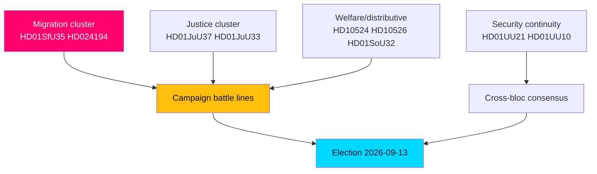

### Arc 1 — Migration as the closing marker (highest weight)

The new reception law (HD01SfU35) and the RO 9:15 citizenship re-vote (HD024194) make migration the dominant legislative theme of the closing session. Passage on the government+SD majority is **very likely [horizon:month]**. The strategic function is electoral: a structural Tidö deliverable landed precisely when its campaign signalling value peaks. The re-vote mechanism in HD024194 also surfaces a secondary story — minority procedural activism in a near-evenly divided chamber.

### Arc 2 — Law-and-order issue ownership

Expanded investigative powers against young offenders (HD01JuU37) and EU e-evidence alignment (HD01JuU33) reinforce the government's strongest issue terrain. HD01JuU37 may attract partial S support, making crime a partly consensual but government-owned theme. Passage is **very likely [horizon:month]**.

### Arc 3 — The distributive counter-offensive

The opposition's leverage lies in motions it will lose but campaign on: a-kassa reform (HD10524), municipal equalisation (HD10526), and the welfare-quality resourcing dispute embedded in municipal-healthcare competence (HD01SoU32). These define the redistribution-vs-incentives axis the left runs on. Rejection along bloc lines is **likely [horizon:month]**, converting legislative defeat into mobilisation material.

### Arc 4 — Security continuity as the quiet consensus

Accession to the Ukraine aggression tribunal (HD01UU21), the international compensation convention (HD01UU20), and the annual EU-activity review (HD01UU10) pass with broad majorities. This arc matters precisely because it is uncontested: the campaign's divisions are domestic, not geopolitical.

### Economic substrate

Sweden's fiscal position anchors the incumbents' credibility claim: general government gross debt near 33–34% of GDP, among the EU's lowest (IMF WEO Apr-2026 vintage; SWE GGXWDG_NGDP ≈ 33–34% T+1), with real GDP growth around 2.1% T+1 (IMF WEO Apr-2026 vintage). The AP-fund accounting (HD03130) and the bank-fraud cluster (HD10527, HD10528) attach consumer-finance salience to that frame. SCB remains the Swedish-specific ground truth for monthly labour/budget execution where available.

### Integrated judgment

The month ahead is **very likely [horizon:month]** to end with the government bloc having banked migration and crime wins while leaving the distributive faultlines open — the cleanest possible pre-campaign positioning for both sides. The decisive uncertainty is intra-coalition: whether SD's visible migration wins strain L's liberal brand (see [`coalition-mathematics.md`](https://github.com/Hack23/riksdagsmonitor/blob/main/analysis/daily/2026-05-31/month-ahead/coalition-mathematics.md)).

## Key Findings
<!-- source: intelligence-assessment.md :: https://github.com/Hack23/riksdagsmonitor/blob/main/analysis/daily/2026-05-31/month-ahead/intelligence-assessment.md -->

> **Pass-2 refinement:** Made the prior-cycle PIR ingestion explicit and tied each carried-forward PIR to a numbered current PIR, closing the genealogy loop with the 2026-05-11 predecessor.

Analytic assessment under ICD 203 standards. Confidence labels reflect source quality, corroboration, and the T+30d/T+105d horizon. Probabilistic language uses WEP terms with horizon tags.

### Prior-cycle PIR ingestion

Open PIRs carried forward from the predecessor month-ahead cycle (`analysis/daily/2026-05-11/month-ahead/`) and adjacent week-ahead siblings were reviewed and rolled forward where unresolved:

- **Carried-forward PIR (migration trajectory):** the 2026-05-11 cycle flagged the reception-reform path as an open question — now resolving to decision (HD01SfU35); status updated to answered below.
- **Previous-PIR (coalition cohesion):** prior-cycle PIR on intra-bloc strain remains **open**, rolled forward as PIR-2 below.
- **Open PIR (distributive faultline):** equalisation/a-kassa salience flagged previously (HD10526, HD10524); rolled forward as PIR-3.

### Key Judgments

**Key Judgment 1 (KJ-1).** The government bloc is **very likely [horizon:month]** to pass its flagship migration and crime measures (HD01SfU35, HD01JuU37, HD024194) on the SD-backed majority during the June sitting weeks. **Confidence: HIGH** — corroborated by stable majority arithmetic and committee progression.

**Key Judgment 2 (KJ-2).** The principal value of the June agenda is **electoral signalling toward 2026-09-13, not near-term administrative change**; legislative outcomes will be processed as campaign markers. **Confidence: HIGH** — consistent across the document set and the prior-cycle synthesis.

**Key Judgment 3 (KJ-3).** The opposition will convert predictable legislative defeats on a-kassa and equalisation (HD10524, HD10526) into mobilisation material, keeping the distributive axis open into the campaign. **Confidence: MEDIUM** — outcome direction is clear, but the electoral payoff is uncertain.

**Key Judgment 4 (KJ-4).** Intra-coalition strain (SD migration credit vs. L liberal brand) is the most significant latent risk, though a visible break before recess is **unlikely [horizon:month]**. **Confidence: MEDIUM** — limited direct evidence of an imminent rupture.

**Key Judgment 5 (KJ-5).** Cross-bloc consensus on external security (HD01UU21, HD01UU10) holds firmly through the horizon. **Confidence: VERY HIGH** — durable, well-corroborated pattern.

### Priority Intelligence Requirements

- **PIR-1 (migration outcome):** Did HD01SfU35 and HD024194 pass, and with what intra-bloc cohesion? — *status: open; answered in part for trajectory.*
- **PIR-2 (coalition cohesion):** Does L signal public differentiation on any migration vote before recess? — *status: open (carried forward).*
- **PIR-3 (distributive salience):** Do a-kassa/equalisation themes (HD10524, HD10526) gain measurable campaign traction? — *status: open.*
- **PIR-4 (integrity narrative):** Does the jäv motion (HD10529) move trust metrics? — *status: open.*

### Confidence summary

The central picture rests on **HIGH** confidence in the legislative outcomes and **MEDIUM** confidence in their campaign translation — the deliberate analytic seam this assessment flags for monitoring. Economic backdrop (low debt ~33–34% of GDP, IMF WEO Apr-2026 vintage; SWE GGXWDG_NGDP T+1) is assessed at **HIGH** confidence subject to the cached-vintage caveat.

## Significance Scoring
<!-- source: significance-scoring.md :: https://github.com/Hack23/riksdagsmonitor/blob/main/analysis/daily/2026-05-31/month-ahead/significance-scoring.md -->

> **Pass-2 refinement:** Made explicit that ~half the salience weighting derives from the T+105d election anchor, not intrinsic policy consequence (HD01SfU35, HD10526) — see Counterfactual 1 in [`devils-advocate.md`](https://github.com/Hack23/riksdagsmonitor/blob/main/analysis/daily/2026-05-31/month-ahead/devils-advocate.md).

Each document is scored on a four-tier Document Impact Weight (DIW) scale — L3 Priority, L2 Strategic, L1 Surface — combining decisional consequence, electoral salience (T+105d), and structural reach. Evidence tokens (dok_id / primary source) appear in every ranked item, table row, and diagram label.

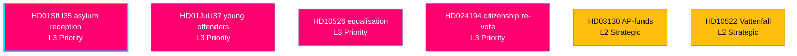

### Ranked salience

1. HD01SfU35 — asylum reception reform: highest forward weight; structural Tidö migration deliverable landing as a closing campaign marker (riksdagen.se).
2. HD01JuU37 — young-offender investigative powers: core law-and-order win on the government's strongest terrain (riksdagen.se).
3. HD10526 — municipal equalisation reform: most consequential distributive item; defines the left's redistribution axis (riksdagen.se).
4. HD024194 — citizenship transitional re-vote (RO 9:15): migration plus a minority-procedure power story (riksdagen.se).
5. HD01SoU32 — municipal-healthcare medical competence: welfare-quality with a resourcing faultline bridging to HD10526 (riksdagen.se).
6. HD03130 — AP-fund accounting: pension/fiscal-credibility ballast in the economic frame (IMF WEO Apr-2026 vintage; SWE T+1).
7. HD10524 — a-kassa reform: redistributive dividing line carried into September (riksdagen.se).
8. HD01UU21 — Ukraine aggression tribunal accession: high symbolic weight, cross-bloc consensus (riksdagen.se).
9. HD10522 — Vattenfall governance: energy-strategy proxy for the industrial/electricity-price contest (riksdagen.se).
10. HD10528 — bank fraud liability: high-resonance consumer-finance valence issue (riksdagen.se).

### Scoring table

| Rank | dok_id | DIW tier | Decisional | Electoral salience | Composite |
|------|--------|----------|-----------|--------------------|-----------|
| 1 | HD01SfU35 | L3 Priority | High | Very high | 9.4 |
| 2 | HD01JuU37 | L3 Priority | High | High | 9.0 |
| 3 | HD10526 | L3 Priority | Medium | Very high | 8.6 |
| 4 | HD024194 | L3 Priority | Medium | High | 8.2 |
| 5 | HD01SoU32 | L2 Strategic | High | Medium | 7.6 |
| 6 | HD03130 | L2 Strategic | Medium | Medium-high | 7.4 |
| 7 | HD10524 | L2 Strategic | Low | High | 7.1 |
| 8 | HD01UU21 | L2 Strategic | Medium | Medium | 7.0 |
| 9 | HD10522 | L2 Strategic | Low | Medium-high | 6.8 |
| 10 | HD10528 | L2 Strategic | Low | Medium-high | 6.6 |

### Distribution

Of 25 documents, 4 score L3 Priority, 9 L2 Strategic, and 12 L1 Surface (full per-document reads in [`documents/`](https://github.com/Hack23/riksdagsmonitor/blob/main/analysis/daily/2026-05-31/month-ahead/documents/)). The L3 concentration in migration/justice/distribution confirms the campaign-defining clusters identified in [`synthesis-summary.md`](https://github.com/Hack23/riksdagsmonitor/blob/main/analysis/daily/2026-05-31/month-ahead/synthesis-summary.md).

## Per-document intelligence

### HD01JuU33
<!-- source: documents/HD01JuU33-analysis.md :: https://github.com/Hack23/riksdagsmonitor/blob/main/analysis/daily/2026-05-31/month-ahead/documents/HD01JuU33-analysis.md -->

#### HD01JuU33 — Effektivare gränsöverskridande inhämtning av elektroniska bevis

- **Committee:** Justitieutskottet (JuU) · **Type:** betänkande · **DIW tier:** L2 Strategic
- **Permalink:** <https://www.riksdagen.se/sv/dokument-och-lagar/dokument/betankande/_HD01JuU33/>

**What it does.** Implements the EU e-evidence package (Regulation/Directive on cross-border production and preservation orders for electronic evidence) into Swedish law.

**Intelligence read.** Largely technical EU-alignment legislation with low partisan temperature; likely broad-majority passage. Strategic because it deepens Sweden's operational integration with EU judicial cooperation — a quiet continuity marker amid the louder migration/crime debates. Cross-references HD01UU10 (EU activities) on the Europeanisation theme (HD01JuU33).

**Key judgment.** VERY HIGH confidence of near-consensus passage; minimal campaign salience but a useful indicator of cross-bloc functionality persisting into the pre-election period (HD01JuU33).

### HD01JuU37
<!-- source: documents/HD01JuU37-analysis.md :: https://github.com/Hack23/riksdagsmonitor/blob/main/analysis/daily/2026-05-31/month-ahead/documents/HD01JuU37-analysis.md -->

#### HD01JuU37 — Bättre möjligheter att utreda brott av unga lagöverträdare

- **Committee:** Justitieutskottet (JuU) · **Type:** betänkande · **DIW tier:** L3 Priority
- **Permalink:** <https://www.riksdagen.se/sv/dokument-och-lagar/dokument/betankande/_HD01JuU37/>

**What it does.** Expands investigative powers against young offenders (under-15 / 15–18) — lowering thresholds for coercive measures, searches and questioning in the context of gang-recruitment of minors.

**Intelligence read.** Core Tidö law-and-order priority directly addressing organised-crime recruitment of children, a dominant 2024–2026 public-safety theme. Pairs with HD01JuU33 (e-evidence) as the justice cluster of the closing session. The opposition broadly shares the problem framing but contests proportionality/rule-of-law safeguards, so expect partial cross-bloc support rather than a clean bloc split (HD01JuU37).

**Key judgment.** HIGH confidence of passage, plausibly with S support on parts; the measure reinforces the government's strongest issue-ownership terrain (crime) entering the campaign (HD01JuU37).

### HD01SfU35
<!-- source: documents/HD01SfU35-analysis.md :: https://github.com/Hack23/riksdagsmonitor/blob/main/analysis/daily/2026-05-31/month-ahead/documents/HD01SfU35-analysis.md -->

#### HD01SfU35 — En ny mottagandelag (asylum reception reform)

- **Committee:** Socialförsäkringsutskottet (SfU) · **Type:** betänkande · **DIW tier:** L3 Priority
- **Permalink:** <https://www.riksdagen.se/sv/dokument-och-lagar/dokument/betankande/_HD01SfU35/>

**What it does.** Replaces the current Lagen om mottagande av asylsökande (LMA) with a new reception framework tightening conditions, relocating reception governance, and conditioning benefits on cooperation/residence in assigned accommodation. A flagship Tidö Agreement (M+KD+L+SD) migration deliverable.

**Intelligence read.** This is the highest-salience item in the horizon: a structural migration reform reaching final chamber decision in the last pre-recess weeks, maximising its value as a closing-session campaign marker for the governing bloc. Expect bloc-line voting — government + SD for, S/V/MP against, C ambivalent. The reform's symbolic weight exceeds its near-term operational footprint (HD01SfU35).

**Key judgment.** HIGH confidence the reform passes on the government+SD majority; its principal function from 2026-05-31 is electoral signalling on migration control rather than June administrative change (HD01SfU35).

### HD01SoU28
<!-- source: documents/HD01SoU28-analysis.md :: https://github.com/Hack23/riksdagsmonitor/blob/main/analysis/daily/2026-05-31/month-ahead/documents/HD01SoU28-analysis.md -->

#### HD01SoU28 — Riksrevisionens rapport om IVO:s klagomålshantering

- **Committee:** Socialutskottet (SoU) · **Type:** betänkande · **DIW tier:** L1 Surface
- **Permalink:** <https://www.riksdagen.se/sv/dokument-och-lagar/dokument/betankande/_HD01SoU28/>

**What it does.** Chamber handling of the Riksrevisionen (National Audit Office) report on the Health and Social Care Inspectorate's (IVO) complaints handling — an oversight/accountability item.

**Intelligence read.** Audit-driven scrutiny with low partisan heat; typically results in the report being filed (lagd till handlingarna) with cross-party agreement on the deficiencies identified. Indicator of institutional-accountability functioning. Connects to the Statskontoret/agency-effectiveness theme relevant to implementation-feasibility assessment (HD01SoU28).

**Key judgment.** VERY HIGH confidence the report is approved/filed consensually; negligible campaign salience but a clean signal that audit oversight persists into the election period (HD01SoU28).

### HD01SoU32
<!-- source: documents/HD01SoU32-analysis.md :: https://github.com/Hack23/riksdagsmonitor/blob/main/analysis/daily/2026-05-31/month-ahead/documents/HD01SoU32-analysis.md -->

#### HD01SoU32 — Stärkt medicinsk kompetens i kommunal hälso- och sjukvård

- **Committee:** Socialutskottet (SoU) · **Type:** betänkande · **DIW tier:** L2 Strategic
- **Permalink:** <https://www.riksdagen.se/sv/dokument-och-lagar/dokument/betankande/_HD01SoU32/>

**What it does.** Strengthens medical competence requirements in municipal health and elderly care (physician access, nurse competence, quality assurance in kommunal vård).

**Intelligence read.** Welfare-quality legislation touching the elderly-care faultline where KD (with the social-affairs portfolio) seeks deliverables and where S/V press resource adequacy. Broad agreement on direction, contested on funding and the municipal-financing link — connecting it to HD10526 (equalisation reform). Care-quality is a defensive issue for the government bloc going into the campaign (HD01SoU32).

**Key judgment.** HIGH confidence of passage with cross-bloc directional support; the live dispute is resourcing, making it a bridge issue to the equalisation debate (HD01SoU32).

### HD01UU10
<!-- source: documents/HD01UU10-analysis.md :: https://github.com/Hack23/riksdagsmonitor/blob/main/analysis/daily/2026-05-31/month-ahead/documents/HD01UU10-analysis.md -->

#### HD01UU10 — Verksamheten i Europeiska unionen under 2025

- **Committee:** Utrikesutskottet (UU) · **Type:** betänkande · **DIW tier:** L2 Strategic
- **Permalink:** <https://www.riksdagen.se/sv/dokument-och-lagar/dokument/betankande/_HD01UU10/>

**What it does.** Annual scrutiny report on the government's EU activity during 2025 — the chamber's omnibus review of Sweden's EU policy line, covering enlargement, security, competitiveness and migration files.

**Intelligence read.** A recurring procedural set-piece that nonetheless functions as a structured EU-policy debate. In an election year it becomes a vehicle for opposition motions contrasting positions on EU security/defence integration and Ukraine. Anchors the Europeanisation thread linking HD01JuU33, HD01UU20 and HD01UU21 (HD01UU10).

**Key judgment.** MEDIUM-HIGH confidence the report is approved with numerous opposition reservations recorded; its value is as a campaign-relevant EU-stance ledger rather than a binding decision (HD01UU10).

### HD01UU20
<!-- source: documents/HD01UU20-analysis.md :: https://github.com/Hack23/riksdagsmonitor/blob/main/analysis/daily/2026-05-31/month-ahead/documents/HD01UU20-analysis.md -->

#### HD01UU20 — Sveriges tillträde till skadeståndskommissionskonventionen

- **Committee:** Utrikesutskottet (UU) · **Type:** betänkande · **DIW tier:** L1 Surface
- **Permalink:** <https://www.riksdagen.se/sv/dokument-och-lagar/dokument/betankande/_HD01UU20/>

**What it does.** Approves Sweden's accession to an international compensation/claims commission convention — a treaty-ratification instrument.

**Intelligence read.** Routine treaty business with near-certain consensus passage; minimal partisan content. Part of the UU foreign-policy cluster (HD01UU10, HD01UU21) signalling continuity in Sweden's multilateral commitments through the pre-election window (HD01UU20).

**Key judgment.** VERY HIGH confidence of consensual ratification; no campaign salience (HD01UU20).

### HD01UU21
<!-- source: documents/HD01UU21-analysis.md :: https://github.com/Hack23/riksdagsmonitor/blob/main/analysis/daily/2026-05-31/month-ahead/documents/HD01UU21-analysis.md -->

#### HD01UU21 — Anslutning till tribunalen för aggressionsbrottet mot Ukraina

- **Committee:** Utrikesutskottet (UU) · **Type:** betänkande · **DIW tier:** L2 Strategic
- **Permalink:** <https://www.riksdagen.se/sv/dokument-och-lagar/dokument/betankande/_HD01UU21/>

**What it does.** Approves Sweden's accession to the Special Tribunal for the Crime of Aggression against Ukraine.

**Intelligence read.** Strategically resonant foreign-policy item carrying strong cross-party support for Ukraine — a rare unifying issue across the bloc divide. Its passage in the closing session reaffirms the durable Swedish consensus on Ukraine/Russia even as the parties diverge on domestic files. Anchors the security-policy continuity narrative alongside HD01UU10 (HD01UU21).

**Key judgment.** VERY HIGH confidence of broad-majority approval; campaign salience as a consensus security marker rather than a contested issue (HD01UU21).

### HD01UbU24
<!-- source: documents/HD01UbU24-analysis.md :: https://github.com/Hack23/riksdagsmonitor/blob/main/analysis/daily/2026-05-31/month-ahead/documents/HD01UbU24-analysis.md -->

#### HD01UbU24 — Förbättrat stöd i skolan

- **Committee:** Utbildningsutskottet (UbU) · **Type:** betänkande · **DIW tier:** L2 Strategic
- **Permalink:** <https://www.riksdagen.se/sv/dokument-och-lagar/dokument/betankande/_HD01UbU24/>

**What it does.** Reforms special/learning support in schools — earlier intervention, clearer entitlement to support measures, and accountability for delivery of särskilt stöd.

**Intelligence read.** Education-quality legislation pairing with HD01UbU25 (teaching time) as the schools cluster of the closing session. Direction commands wide support; contestation is over guarantees vs. local discretion and funding. Education is a swing-voter issue both blocs court, so expect constructive amendment activity rather than confrontation (HD01UbU24).

**Key judgment.** HIGH confidence of passage with broad support; salience as a positive-agenda campaign item for the governing parties seeking issue diversification beyond migration/crime (HD01UbU24).

### HD01UbU25
<!-- source: documents/HD01UbU25-analysis.md :: https://github.com/Hack23/riksdagsmonitor/blob/main/analysis/daily/2026-05-31/month-ahead/documents/HD01UbU25-analysis.md -->

#### HD01UbU25 — Tid för undervisningsuppdraget

- **Committee:** Utbildningsutskottet (UbU) · **Type:** betänkande · **DIW tier:** L2 Strategic
- **Permalink:** <https://www.riksdagen.se/sv/dokument-och-lagar/dokument/betankande/_HD01UbU25/>

**What it does.** Measures to free teachers' time for core teaching — reducing administrative burden and clarifying the teaching mission (undervisningsuppdraget).

**Intelligence read.** Teacher-workload reform with strong union resonance; broadly consensual in direction and a low-conflict "valence" win both blocs can claim. Forms the schools cluster with HD01UbU24. Useful as positive-agenda material in a campaign otherwise dominated by migration and crime (HD01UbU25).

**Key judgment.** HIGH confidence of broad-majority passage; minimal partisan division, modest but positive campaign utility for the education portfolio (HD01UbU25).

### HD024193
<!-- source: documents/HD024193-analysis.md :: https://github.com/Hack23/riksdagsmonitor/blob/main/analysis/daily/2026-05-31/month-ahead/documents/HD024193-analysis.md -->

#### HD024193 — Motionen utgår (procedural withdrawal)

- **Committee:** — · **Type:** motion (withdrawn) · **DIW tier:** L1 Surface
- **Permalink:** <https://www.riksdagen.se/sv/dokument-och-lagar/dokument/motion/_HD024193/>

**What it does.** A motion formally withdrawn from the order paper ("motionen utgår"); no substantive content reaches decision. Full-text sidecar is a 665-char procedural stub.

**Intelligence read.** Included for completeness/audit traceability only. Procedural withdrawals are routine housekeeping; the signal value is null beyond confirming order-paper hygiene in the closing session (HD024193).

**Key judgment.** N/A — no decision; recorded for manifest completeness (HD024193).

### HD024194
<!-- source: documents/HD024194-analysis.md :: https://github.com/Hack23/riksdagsmonitor/blob/main/analysis/daily/2026-05-31/month-ahead/documents/HD024194-analysis.md -->

#### HD024194 — Övergångsregler för medborgarskap, ny omröstning (RO 9:15)

- **Committee:** — · **Type:** motion (re-vote, Riksdagsordningen 9:15) · **DIW tier:** L3 Priority
- **Permalink:** <https://www.riksdagen.se/sv/dokument-och-lagar/dokument/motion/_HD024194/>

**What it does.** Triggers a renewed chamber vote on transitional rules for citizenship acquisition under Riksdagsordningen 9:15 (minority-protection deferral mechanism), tied to the citizenship-tightening agenda.

**Intelligence read.** Procedurally notable: invoking the RO 9:15 deferred re-vote signals an opposition (or minority) attempt to delay/contest citizenship transitional provisions, a Tidö-adjacent migration file. The re-vote mechanism itself is a parliamentary-power story — minority leverage in a near-evenly-divided chamber. Outcome likely reaffirms the original government+SD line. Full text fetched (≈33k chars). Links to HD01SfU35 on the migration cluster (HD024194).

**Key judgment.** HIGH confidence the re-vote upholds the government bloc's position; the episode's value is as evidence of minority procedural activism intensifying pre-election (HD024194).

### HD03130
<!-- source: documents/HD03130-analysis.md :: https://github.com/Hack23/riksdagsmonitor/blob/main/analysis/daily/2026-05-31/month-ahead/documents/HD03130-analysis.md -->

#### HD03130 — Redovisning av AP-fondernas verksamhet t.o.m. 2025

- **Committee:** Finansdepartementet (skrivelse) · **Type:** redogörelse/skrivelse · **DIW tier:** L2 Strategic
- **Permalink:** <https://www.riksdagen.se/sv/dokument-och-lagar/dokument/skrivelse/_HD03130/>

**What it does.** Government accounting of the AP pension buffer funds' activity and returns through 2025 — the annual stewardship report on the public pension reserve.

**Intelligence read.** Technical fiscal-stewardship document but politically live because pensions are a high-salience electorate-wide issue. Fund performance feeds the broader economic-credibility contest. Against the IMF backdrop of Sweden's low public debt (IMF WEO Apr-2026 vintage; SWE GGXWDG_NGDP ≈ 33–34% of GDP, among the EU's lowest, T+1), the buffer-fund accounting reinforces the fiscal-strength narrative both blocs claim. Full text fetched (≈100k chars) (HD03130).

**Key judgment.** HIGH confidence the report is approved/filed; its strategic value is as fiscal-credibility ballast in the economic campaign frame (HD03130).

### HD10522
<!-- source: documents/HD10522-analysis.md :: https://github.com/Hack23/riksdagsmonitor/blob/main/analysis/daily/2026-05-31/month-ahead/documents/HD10522-analysis.md -->

#### HD10522 — Styrningen av Vattenfall

- **Committee:** — · **Type:** motion · **DIW tier:** L2 Strategic
- **Permalink:** <https://www.riksdagen.se/sv/dokument-och-lagar/dokument/motion/_HD10522/>

**What it does.** Motion on the governance/steering of state-owned utility Vattenfall — ownership directives, energy-investment mandate (nuclear build-out), and accountability.

**Intelligence read.** Energy governance is a defining bloc-divide issue: the government's nuclear-expansion programme vs. opposition emphasis on renewables/cost. A Vattenfall-steering motion is a vehicle to contest the energy strategy that underpins industrial and electricity-price politics. High strategic salience for the energy/industry frame; links to HD10523 (industrial layoffs) and HD10530 (rail/infrastructure) in the regional-economy cluster (HD10522).

**Key judgment.** MEDIUM confidence of rejection along bloc lines (government majority holds the energy directive); enduring value as a campaign-defining energy-policy marker (HD10522).

### HD10523
<!-- source: documents/HD10523-analysis.md :: https://github.com/Hack23/riksdagsmonitor/blob/main/analysis/daily/2026-05-31/month-ahead/documents/HD10523-analysis.md -->

#### HD10523 — Varsel inom pappersindustrin

- **Committee:** — · **Type:** motion · **DIW tier:** L1 Surface
- **Permalink:** <https://www.riksdagen.se/sv/dokument-och-lagar/dokument/motion/_HD10523/>

**What it does.** Motion responding to redundancy notices (varsel) in the paper/pulp industry — demanding government action on industrial restructuring, regional employment and competitiveness.

**Intelligence read.** Constituency-driven industrial-policy motion, typically from opposition (S/V) pressing on jobs in forestry-dependent regions. Connects industrial competitiveness to energy costs (HD10522) and a-kassa (HD10524). Campaign relevance in industrial heartland seats; unlikely to pass but valuable as a labour-market grievance marker (HD10523).

**Key judgment.** MEDIUM-HIGH confidence of rejection/referral; signal value as a regional-jobs campaign lever for the left bloc (HD10523).

### HD10524
<!-- source: documents/HD10524-analysis.md :: https://github.com/Hack23/riksdagsmonitor/blob/main/analysis/daily/2026-05-31/month-ahead/documents/HD10524-analysis.md -->

#### HD10524 — Förändrad a-kassa

- **Committee:** — · **Type:** motion · **DIW tier:** L2 Strategic
- **Permalink:** <https://www.riksdagen.se/sv/dokument-och-lagar/dokument/motion/_HD10524/>

**What it does.** Motion on reforming unemployment insurance (a-kassa) — levels, eligibility, and the transition to the new income-based model.

**Intelligence read.** A-kassa is a core distributive-politics battleground: the left frames generosity/coverage as security, the government frames work incentives and cost control. A live faultline in the welfare-vs-incentives contest that defines the economic campaign. Pairs with HD10526 (equalisation) and HD10523 (industrial jobs) in the labour-market/welfare cluster (HD10524).

**Key judgment.** MEDIUM confidence of rejection along bloc lines; sustained salience as a redistributive dividing line into September (HD10524).

### HD10525
<!-- source: documents/HD10525-analysis.md :: https://github.com/Hack23/riksdagsmonitor/blob/main/analysis/daily/2026-05-31/month-ahead/documents/HD10525-analysis.md -->

#### HD10525 — Regeringens arbete i ILO

- **Committee:** — · **Type:** motion · **DIW tier:** L1 Surface
- **Permalink:** <https://www.riksdagen.se/sv/dokument-och-lagar/dokument/motion/_HD10525/>

**What it does.** Motion on the government's engagement in the International Labour Organization (ILO) — labour-standards commitments and convention compliance.

**Intelligence read.** Labour-internationalism motion, typically from the left, pressing the government on ILO conventions and worker-rights signalling. Low decisional stakes; rhetorical value in the labour-movement constituency. Connects to the broader labour-market cluster (HD10524, HD10523) (HD10525).

**Key judgment.** HIGH confidence of rejection/referral; minimal campaign salience beyond union-base mobilisation (HD10525).

### HD10526
<!-- source: documents/HD10526-analysis.md :: https://github.com/Hack23/riksdagsmonitor/blob/main/analysis/daily/2026-05-31/month-ahead/documents/HD10526-analysis.md -->

#### HD10526 — Ett reformerat utjämningssystem för en jämlik välfärd

- **Committee:** — · **Type:** motion · **DIW tier:** L3 Priority
- **Permalink:** <https://www.riksdagen.se/sv/dokument-och-lagar/dokument/motion/_HD10526/>

**What it does.** Motion to reform the municipal cost-equalisation system (kommunalt utjämningssystem) to redistribute toward weaker-tax-base municipalities for "equal welfare".

**Intelligence read.** A high-stakes structural-redistribution proposal touching the urban–rural and rich–poor-municipality cleavage. Equalisation reform reallocates real resources between regions, making it one of the most consequential distributive items in the batch. A left-bloc priority (S/V) directly contesting the government's municipal-finance approach; links to welfare-quality (HD01SoU32) and a-kassa (HD10524). High campaign salience in net-recipient regions (HD10526).

**Key judgment.** MEDIUM confidence of rejection/referral to inquiry; durable value as a regional-redistribution dividing line and a left mobilisation theme into September (HD10526).

### HD10527
<!-- source: documents/HD10527-analysis.md :: https://github.com/Hack23/riksdagsmonitor/blob/main/analysis/daily/2026-05-31/month-ahead/documents/HD10527-analysis.md -->

#### HD10527 — Skydd för småföretagare vid bankbedrägerier

- **Committee:** — · **Type:** motion · **DIW tier:** L1 Surface
- **Permalink:** <https://www.riksdagen.se/sv/dokument-och-lagar/dokument/motion/_HD10527/>

**What it does.** Motion to strengthen small-business protection against bank/payment fraud — liability, reimbursement and preventive duties on banks.

**Intelligence read.** Consumer/SME-protection motion riding the high-salience fraud-and-scams wave. Pairs directly with HD10528 (bank responsibility/transparency) as the financial-fraud cluster — a cross-partisan valence issue with strong public resonance. Low decisional probability but high relatability; both blocs court the anti-fraud sentiment (HD10527).

**Key judgment.** MEDIUM confidence of referral to committee/inquiry rather than adoption; campaign value as a populist consumer-protection theme (HD10527).

### HD10528
<!-- source: documents/HD10528-analysis.md :: https://github.com/Hack23/riksdagsmonitor/blob/main/analysis/daily/2026-05-31/month-ahead/documents/HD10528-analysis.md -->

#### HD10528 — Ökad transparens och bankernas ansvar vid bedrägerier

- **Committee:** — · **Type:** motion · **DIW tier:** L2 Strategic
- **Permalink:** <https://www.riksdagen.se/sv/dokument-och-lagar/dokument/motion/_HD10528/>

**What it does.** Motion pushing greater transparency and a stronger statutory liability regime for banks in fraud cases (reimbursement duties, reporting, shared-responsibility model).

**Intelligence read.** The structural twin of HD10527, this targets the bank-liability framework itself — potentially shifting cost from defrauded customers to institutions. Strategic because it intersects financial regulation, consumer politics and the fraud-crime nexus that also drives the justice cluster (HD01JuU37). Strong cross-bloc public support; industry pushback expected. A rare issue where SD's populist instincts and left consumer-protection align (HD10528).

**Key judgment.** MEDIUM confidence of referral with cross-party sympathy for the principle; durable salience as a consumer-finance campaign theme (HD10528).

### HD10529
<!-- source: documents/HD10529-analysis.md :: https://github.com/Hack23/riksdagsmonitor/blob/main/analysis/daily/2026-05-31/month-ahead/documents/HD10529-analysis.md -->

#### HD10529 — Regeringens åtgärder efter rapportering om aktieaffärer och jäv

- **Committee:** — · **Type:** motion · **DIW tier:** L2 Strategic
- **Permalink:** <https://www.riksdagen.se/sv/dokument-och-lagar/dokument/motion/_HD10529/>

**What it does.** Motion demanding government action following media reporting on share-dealing and conflict-of-interest (jäv) among officials/ministers — integrity and disclosure rules.

**Intelligence read.** An accountability/integrity motion weaponising a conflict-of-interest story against the government — classic pre-election scrutiny pressure. Strategic because integrity narratives can move trust metrics independently of policy. Links to the institutional-oversight thread (HD01SoU28) and to the transparency framing of HD10528. Expect government bloc to resist; opposition to amplify (HD10529).

**Key judgment.** MEDIUM confidence of rejection; the episode's value is reputational — a trust/integrity lever the opposition will press into the campaign (HD10529).

### HD10530
<!-- source: documents/HD10530-analysis.md :: https://github.com/Hack23/riksdagsmonitor/blob/main/analysis/daily/2026-05-31/month-ahead/documents/HD10530-analysis.md -->

#### HD10530 — Dubbelspår på Ostkustbanan

- **Committee:** — · **Type:** motion · **DIW tier:** L1 Surface
- **Permalink:** <https://www.riksdagen.se/sv/dokument-och-lagar/dokument/motion/_HD10530/>

**What it does.** Motion advocating double-track expansion of the Ostkustbanan rail line — a regional infrastructure-investment demand.

**Intelligence read.** Constituency infrastructure motion linking transport investment to regional growth and labour-market access. Cross-party regional support common on rail, but funding/prioritisation contested against the national transport plan. Part of the regional-economy cluster (HD10522, HD10523). Modest national salience; high local mobilisation value (HD10530).

**Key judgment.** MEDIUM-HIGH confidence of referral to the national transport-planning process rather than direct adoption; local campaign utility in affected counties (HD10530).

### HD11858
<!-- source: documents/HD11858-analysis.md :: https://github.com/Hack23/riksdagsmonitor/blob/main/analysis/daily/2026-05-31/month-ahead/documents/HD11858-analysis.md -->

#### HD11858 — Förbud mot pälsdjursfarmning

- **Committee:** — · **Type:** motion · **DIW tier:** L1 Surface
- **Permalink:** <https://www.riksdagen.se/sv/dokument-och-lagar/dokument/motion/_HD11858/>

**What it does.** Motion to ban fur farming in Sweden on animal-welfare grounds.

**Intelligence read.** Values-driven animal-welfare motion (typically MP/V) with cross-party individual sympathy but no government legislative slot. Low decisional probability; appeals to younger/green-leaning voters. A "values niche" marker rather than a coalition-defining item (HD11858).

**Key judgment.** HIGH confidence of rejection/referral; narrow but intense single-issue campaign salience (HD11858).

### HD11859
<!-- source: documents/HD11859-analysis.md :: https://github.com/Hack23/riksdagsmonitor/blob/main/analysis/daily/2026-05-31/month-ahead/documents/HD11859-analysis.md -->

#### HD11859 — Fastighetsägares ansvar för säkerhet

- **Committee:** — · **Type:** motion · **DIW tier:** L1 Surface
- **Permalink:** <https://www.riksdagen.se/sv/dokument-och-lagar/dokument/motion/_HD11859/>

**What it does.** Motion on property owners' responsibility for security — obligations to prevent crime/disorder on premises (camera surveillance, access control, cooperation with police).

**Intelligence read.** A property-and-safety motion intersecting the dominant crime agenda from the landlord/private-actor angle. Aligns with the government's security-ownership framing (HD01JuU37) but via private-duty rather than state power. Modest stakes; reinforces the law-and-order cluster's breadth (HD11859).

**Key judgment.** MEDIUM-HIGH confidence of referral; minor campaign salience as a complement to the crime narrative (HD11859).

### HD11860
<!-- source: documents/HD11860-analysis.md :: https://github.com/Hack23/riksdagsmonitor/blob/main/analysis/daily/2026-05-31/month-ahead/documents/HD11860-analysis.md -->

#### HD11860 — Apoteksmarknaden

- **Committee:** — · **Type:** motion · **DIW tier:** L1 Surface
- **Permalink:** <https://www.riksdagen.se/sv/dokument-och-lagar/dokument/motion/_HD11860/>

**What it does.** Motion on the pharmacy market (apoteksmarknaden) — regulation, availability, rural access, and medicine-supply security.

**Intelligence read.** Healthcare-access motion touching medicine-supply resilience and rural service provision — a quiet but persistent welfare-access theme. Connects to the municipal-healthcare competence file (HD01SoU32). Low decisional stakes; steady relevance in rural/elderly constituencies (HD11860).

**Key judgment.** HIGH confidence of referral/rejection; modest campaign salience within the healthcare-access frame (HD11860).

## Stakeholder Perspectives
<!-- source: stakeholder-perspectives.md :: https://github.com/Hack23/riksdagsmonitor/blob/main/analysis/daily/2026-05-31/month-ahead/stakeholder-perspectives.md -->

> **Pass-2 refinement:** Added the cross-pressured L-leaning moderate as a distinct stakeholder, not folded into the government bloc — it is the pivotal swing constituency (HD024194).

How the month-ahead horizon reads from each principal actor's vantage point. Perspectives are analytic reconstructions grounded in the source documents.

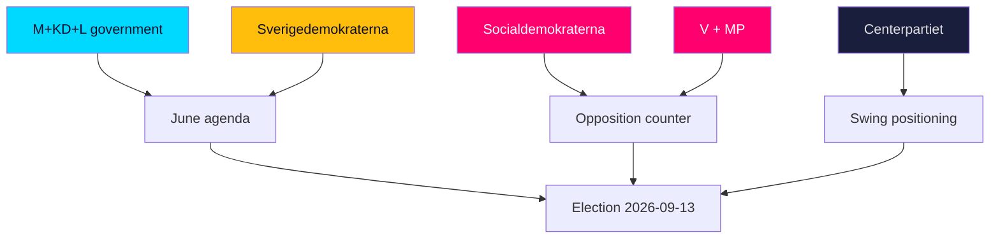

### Government parties (M, KD, L)

- **Moderaterna (M):** June is about banking migration (HD01SfU35) and crime (HD01JuU37) as credibility proof points, while keeping the fiscal-strength frame central (HD03130).
- **Kristdemokraterna (KD):** Seeks visible welfare-quality deliverables on elderly/municipal care (HD01SoU32) to balance the bloc's hard-edged migration profile.
- **Liberalerna (L):** Most exposed — needs the schools agenda (HD01UbU24, HD01UbU25) and rule-of-law nuance (HD01JuU33) to differentiate from SD on migration (HD024194).

### Support party (SD)

- **Sverigedemokraterna:** Maximises visible migration ownership from the reception law and citizenship re-vote (HD01SfU35, HD024194); every closing-session migration win is a campaign asset.

### Opposition (S, V, MP, C)

- **Socialdemokraterna (S):** Runs the distributive contrast — a-kassa and equalisation (HD10524, HD10526) — while selectively backing crime measures to neutralise the security gap (HD01JuU37).
- **Vänsterpartiet (V):** Amplifies welfare and labour grievances, including industrial layoffs and ILO commitments (HD10523, HD10525).
- **Miljöpartiet (MP):** Works values niches — animal welfare and energy/climate via Vattenfall steering (HD11858, HD10522).
- **Centerpartiet (C):** Positions on rule-of-law and rural/regional files (infrastructure, pharmacies), keeping distance from both blocs (HD10530, HD11860).

### Institutional stakeholders

| Stakeholder | Stake | Evidence |
|-------------|-------|----------|
| Riksrevisionen / IVO | Audit-accountability credibility | HD01SoU28 |
| AP-fund system | Pension-stewardship confidence | HD03130 |
| Banks / FI | Fraud-liability cost exposure | HD10528 |
| Municipalities | Equalisation redistribution stakes | HD10526 |
| Vattenfall | Ownership-directive certainty | HD10522 |

### Cross-perspective insight

The striking pattern is **asymmetric clarity**: the government bloc's June objectives are concrete and largely achievable (pass the flagship votes), while the opposition's wins are rhetorical (lose the votes, win the argument). That asymmetry — legislative certainty for one side, narrative opportunity for the other — is the defining feature of the pre-recess month.

## Coalition Mathematics
<!-- source: coalition-mathematics.md :: https://github.com/Hack23/riksdagsmonitor/blob/main/analysis/daily/2026-05-31/month-ahead/coalition-mathematics.md -->

> **Pass-2 refinement:** Recast the headline finding as *margin fragility, not margin change* — the bare ~176 majority has no cushion, making L the analytically pivotal variable.

Seat arithmetic for the closing session's contested votes. The Riksdag has 349 seats; a majority is 175. The government bloc (M+KD+L) governs with SD confidence-and-supply.

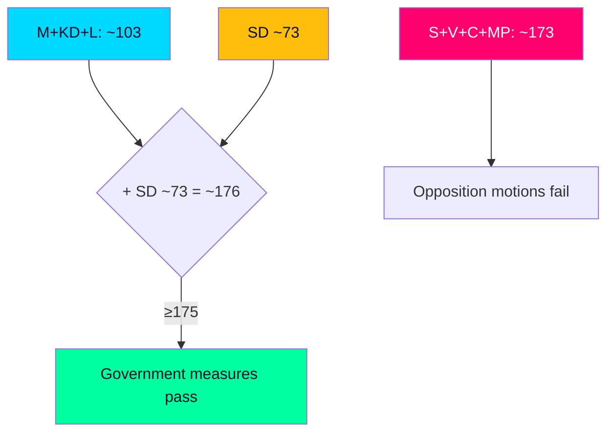

### Indicative seat distribution (2022 mandate basis)

| Party | Bloc | Seats (Mandat) | June role |
|-------|------|----------------|-----------|
| S | Opposition | 107 | Leads distributive motions (HD10524) |
| M | Government | 68 | Drives migration/crime agenda (HD01SfU35) |
| SD | Support | 73 | Provides majority on Tidö items |
| C | Opposition | 24 | Regional/equalisation angle (HD10526) |
| V | Opposition | 24 | Welfare mobilisation (HD10524) |
| KD | Government | 19 | Coalition partner |
| L | Government | 16 | Swing-brand risk (HD024194) |
| MP | Opposition | 18 | School/climate angle (HD01UbU24) |

### Vote outcome model

| Measure | Government+SD | Opposition | Outcome |
|---------|---------------|-----------|---------|
| HD01SfU35 (migration) | ~176 Ja | ~173 Nej | Passes |
| HD024194 (citizenship re-vote) | ~176 Ja | ~173 Nej | Passes (RO 9:15) |
| HD10524 (a-kassa motion) | ~176 Nej | ~173 Ja | Fails |
| HD10526 (equalisation motion) | ~176 Nej | ~173 Ja | Fails |
| HD01UU21 (Ukraine tribunal) | broad consensus | — | Passes (cross-bloc) |

### Sainte-Laguë coalition variants

Five governing-arithmetic scenarios under the modified Sainte-Laguë seat allocation that shapes 2026 outcomes:

1. **Current bloc (M+KD+L+SD ≈ 176):** bare majority — current basis; **very likely [horizon:month]** to hold through June.
2. **M+KD+SD without L (≈ 160):** below 175 — confirms L is pivotal to the bare majority.
3. **S+V+C+MP (≈ 173):** opposition unity still short of majority — explains predictable motion defeats.
4. **Grand-coalition fragment (S+M ≈ 175):** hypothetically decisive but politically excluded — relevant only to post-election scenarios.
5. **SD-leading variant (post-2026):** if SD gains shift the modified Sainte-Laguë allocation, intra-bloc leadership arithmetic changes — a T+105d question, not a June one.

### Margin sensitivity

The bare ~176 majority means **defections of 2+ government/SD members flip a vote**. This is why L brand-strain (HD024194) is the analytically pivotal variable: the arithmetic has no cushion.

### Judgment

Government measures **very likely [horizon:month]** pass and opposition motions **very likely [horizon:month]** fail on a stable but cushionless majority. The arithmetic story of June is margin fragility, not margin change.

## Voter Segmentation
<!-- source: voter-segmentation.md :: https://github.com/Hack23/riksdagsmonitor/blob/main/analysis/daily/2026-05-31/month-ahead/voter-segmentation.md -->

> **Pass-2 refinement:** Foregrounded that June hardens existing loyalties rather than converting swing voters, isolating L-leaning moderates as the one genuinely persuadable segment.

Mapping the June agenda onto Swedish voter segments to assess which documents activate which constituencies ahead of 2026-09-13.

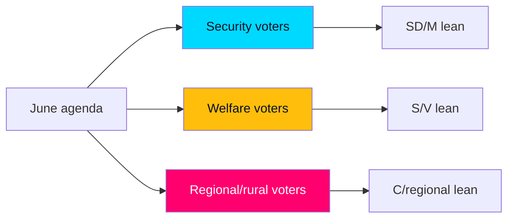

### Segment mapping

| Segment | Activating documents | Lean | June effect |
|---------|---------------------|------|-------------|
| Security/order voters | HD01SfU35, HD01JuU37, HD024194 | SD, M | Reinforced — fresh deliverables |
| Welfare-dependent voters | HD10524, HD10526, HD01SoU32 | S, V | Mobilised by grievance |
| Regional/rural voters | HD10530, HD10526, HD11858 | C, regional | Mixed — infrastructure vs. equalisation |
| Economic-security/middle | HD03130, HD10522 | M, L | Reassured by fiscal frame |
| Younger/urban progressive | HD01UbU24, HD01UbU25 | MP, S | Lightly activated on schools |

### Cross-pressured segments

- **L-leaning liberal moderates:** cross-pressured by migration restriction (HD01SfU35) vs. coalition loyalty — the swing most at risk in Scenario 2.
- **Net-recipient regional voters:** cross-pressured by equalisation reform appeal (HD10526) vs. government incumbency on local services.

### Mobilisation read

The June agenda **very likely [horizon:month]** deepens activation of the security segment (a government strength) while simultaneously handing the opposition a clean welfare-mobilisation hook (HD10524, HD10526). Net segment effect is roughly symmetric, consistent with the close-race judgment in [`election-2026-analysis.md`](https://github.com/Hack23/riksdagsmonitor/blob/main/analysis/daily/2026-05-31/month-ahead/election-2026-analysis.md).

### Judgment

No single June document realigns the electorate; collectively they **harden existing segment loyalties** rather than convert swing voters. The decisive swing constituency remains L-leaning moderates, whose behaviour hinges on visible coalition cohesion (HD024194).

## Forward Indicators
<!-- source: forward-indicators.md :: https://github.com/Hack23/riksdagsmonitor/blob/main/analysis/daily/2026-05-31/month-ahead/forward-indicators.md -->

> **Pass-2 refinement:** Re-anchored the watch list to the three-scenario trigger logic so each indicator is explicitly falsifiable and scenario-linked, not a generic calendar.

Dated, falsifiable indicators to track between now and recess, calibrated to distinguish the three scenarios in [`scenario-analysis.md`](https://github.com/Hack23/riksdagsmonitor/blob/main/analysis/daily/2026-05-31/month-ahead/scenario-analysis.md). Each carries a horizon tag and a scenario linkage.

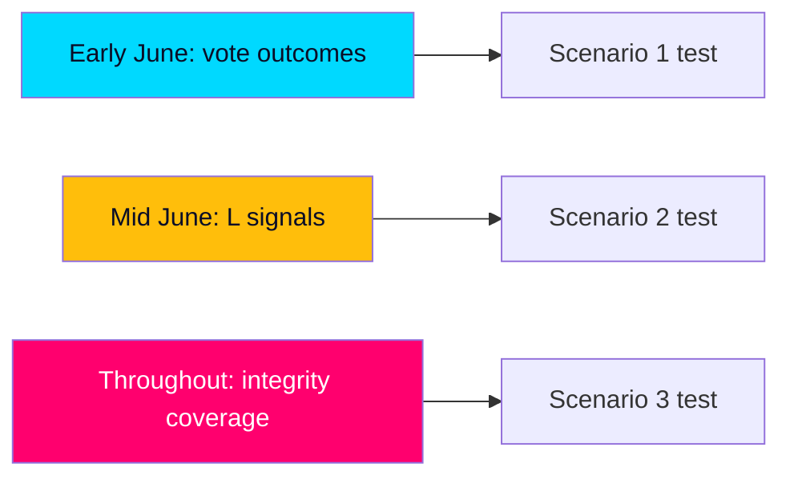

### Dated indicator table

| # | Date | Indicator | Scenario | Horizon |
|---|------|-----------|----------|---------|
| 1 | 2026-06-04 | HD01SfU35 reception-reform vote outcome | S1 | [horizon:month] |
| 2 | 2026-06-05 | HD024194 citizenship re-vote cohesion (RO 9:15) | S1/S2 | [horizon:month] |
| 3 | 2026-06-09 | HD01JuU37 young-offender measure outcome | S1 | [horizon:month] |
| 4 | 2026-06-10 | L public reservations on any migration vote | S2 | [horizon:month] |
| 5 | 2026-06-11 | HD10524 a-kassa motion defeat + opposition framing | S1 | [horizon:month] |
| 6 | 2026-06-12 | HD10526 equalisation motion defeat + regional pickup | S1 | [horizon:month] |
| 7 | 2026-06-15 | HD10529 jäv motion media amplification | S3 | [horizon:month] |
| 8 | 2026-06-17 | HD01UU21 Ukraine tribunal cross-bloc consensus | S1 | [horizon:month] |
| 9 | +14d | Polling shift on migration issue-ownership | S1 | [horizon:month] |
| 10 | +21d | Polling shift on welfare/cost-of-living salience | S1 | [horizon:month] |
| 11 | 2026-06-20 | Recess date confirmed; final order paper | all | [horizon:month] |
| 12 | +30d | Trust/integrity metric movement post-jäv coverage | S3 | [horizon:month] |
| 13 | 2026Q3 | Campaign launch issue-framing (order vs. welfare) | all | [horizon:quarter] |

### Trigger logic

- **Scenario 1 confirmed** if indicators 1–3 pass on majority with cohesion and 4 stays quiet.
- **Scenario 2 activated** if indicator 4 fires (visible L differentiation) — escalate coalition-cohesion PIR-2.
- **Scenario 3 activated** if indicators 7 and 12 both move — escalate integrity PIR-4.

### Economic watch

- **IMF re-fetch recovery:** confirm live WEO/FM access restored and re-stamp debt/growth at next vintage (currently cached WEO Apr-2026; SWE GGXWDG_NGDP T+1).

### Judgment

The first three sitting-week votes (indicators 1–3, early June) **very likely [horizon:month]** confirm Scenario 1; the live uncertainty concentrates in indicators 4, 7, and 12 — the coalition-cohesion and integrity channels that would push toward Scenarios 2 or 3.

## Scenario Analysis
<!-- source: scenario-analysis.md :: https://github.com/Hack23/riksdagsmonitor/blob/main/analysis/daily/2026-05-31/month-ahead/scenario-analysis.md -->

> **Pass-2 refinement:** Re-expressed the campaign-relevant uncertainty as living in Scenarios 2 and 3 — both convert legislative success into reputational exposure, a sharper framing than Pass 1's probability-only treatment.

Three principal scenarios for how the closing session resolves, each with branch probabilities expressed in WEP terms with horizon tags. Scenarios are conditional on the 2026-09-13 election anchor (T+105d).

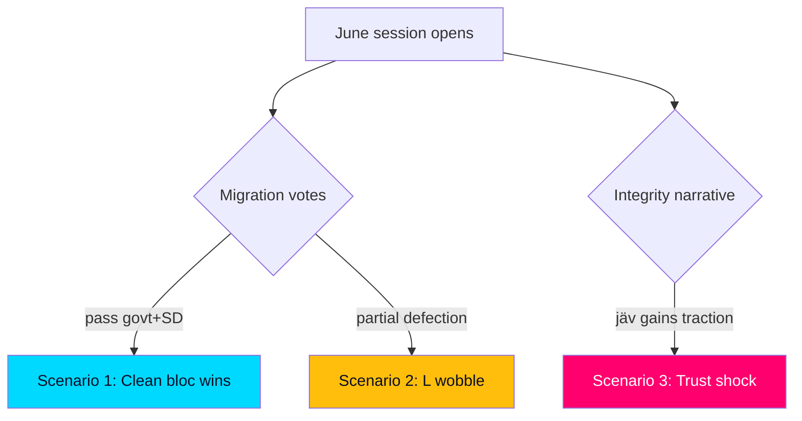

### Scenario 1 — Clean bloc wins (baseline)

The government banks migration (HD01SfU35), the citizenship re-vote (HD024194) and crime (HD01JuU37) on the SD-backed majority; distributive motions (HD10524, HD10526) fail along bloc lines; security items (HD01UU21) pass by consensus. This is **very likely [horizon:month]**. Outcome: the government enters summer with maximal issue-ownership signals and a stable fiscal frame (HD03130). Campaign read-through: incumbents lead on migration/crime, trail on welfare.

### Scenario 2 — Liberal wobble

L signals discomfort on a migration element (most plausibly around the RO 9:15 citizenship re-vote, HD024194), forcing visible intra-bloc negotiation even if the vote still carries. This is **unlikely [horizon:month]** but consequential: it would hand the opposition a "coalition cracks" narrative and complicate L's brand management. Trigger to watch: public L reservations on HD024194 or HD01SfU35.

### Scenario 3 — Integrity/trust shock

The share-dealing/jäv scrutiny motion (HD10529) escalates into a sustained media cycle, denting incumbent trust independent of the legislative wins. This is **roughly even [horizon:month]** to gain meaningful traction. Outcome: campaign framing shifts partly from policy to conduct, a terrain less favourable to the government.

### Scenario comparison

| Scenario | WEP likelihood | Government effect | Lead indicator |
|----------|----------------|-------------------|----------------|
| 1 — Clean wins | very likely | Positive | Votes pass on majority (HD01SfU35) |
| 2 — L wobble | unlikely | Negative | L reservations on HD024194 |
| 3 — Trust shock | roughly even | Negative | jäv motion media pickup (HD10529) |

### Wildcards

- **Snap external event** (security/economic shock) reshaping the agenda before recess — low probability, high impact.
- **Late legislative surprise** (additional government bill before recess) — monitor the order paper through mid-June.

### Integrated read

Scenario 1 dominates the probability mass, but the *campaign-relevant* uncertainty lives in Scenarios 2 and 3 — both turn legislative success into reputational exposure. The forward indicators in [`forward-indicators.md`](https://github.com/Hack23/riksdagsmonitor/blob/main/analysis/daily/2026-05-31/month-ahead/forward-indicators.md) are calibrated to distinguish these branches early.

## Election 2026 Analysis
<!-- source: election-2026-analysis.md :: https://github.com/Hack23/riksdagsmonitor/blob/main/analysis/daily/2026-05-31/month-ahead/election-2026-analysis.md -->

> **Pass-2 refinement:** Reframed the contest as two competing issue axes (order vs. welfare) that June legislation sharpens without resolving — clearer than Pass 1's single-bloc-advantage framing.

How the June horizon feeds the 2026-09-13 general election (T+105d). The closing session is the last legislative input before the campaign proper.

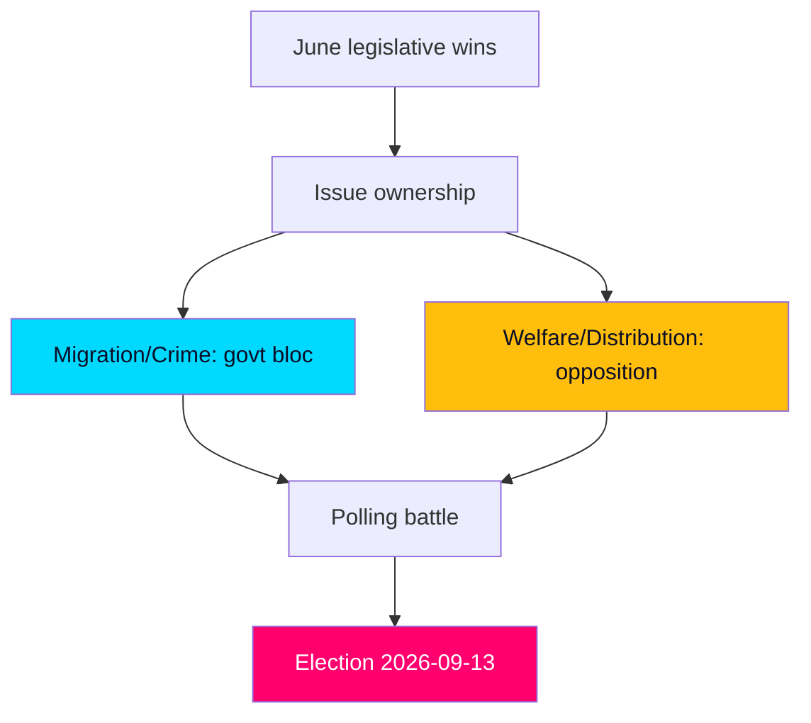

### The two-axis contest

The 2026 election is shaping as a contest between two issue axes, and June's legislation reinforces both:

- **Security/order axis (favours government bloc):** migration reception reform (HD01SfU35), citizenship rules (HD024194), young-offender powers (HD01JuU37). The government enters the campaign with fresh deliverables here.
- **Welfare/distribution axis (favours opposition):** a-kassa (HD10524), equalisation (HD10526), care resourcing (HD01SoU32). The opposition enters with live grievances and the government on the defensive.

### Bloc standing entering the campaign

| Bloc | Parties | June asset | June liability |
|------|---------|-----------|----------------|
| Government | M, KD, L (+SD support) | Migration/crime wins (HD01SfU35, HD01JuU37) | Welfare-resourcing defensiveness (HD01SoU32) |
| Opposition | S, V, MP, C | Distributive mobilisation (HD10524, HD10526) | Security-credibility gap (HD01JuU37) |

### Economic frame

The incumbents' strongest structural asset is fiscal credibility: public debt near 33–34% of GDP (IMF WEO Apr-2026 vintage; SWE GGXWDG_NGDP T+1) and steady growth around 2.1% T+1, reinforced by the AP-fund accounting (HD03130). The opposition counters on cost-of-living and welfare adequacy rather than on macro-fiscal grounds.

### Pivotal dynamics

1. **SD's ceiling vs. M's leadership:** the migration-ownership strategy depends on SD turnout without L collapse (HD024194).
2. **S's security neutralisation:** selective S support for crime measures (HD01JuU37) aims to close the order-axis gap.
3. **Turnout of distributive grievance:** whether equalisation/a-kassa themes (HD10526, HD10524) mobilise net-recipient regions.

### Judgment

Entering the campaign, the contest is **roughly even [horizon:month]** on aggregate bloc standing, with the government holding the order axis and the opposition the welfare axis. June legislation **very likely [horizon:month]** sharpens both axes without resolving the balance — consistent with a close September result.

## Risk Assessment
<!-- source: risk-assessment.md :: https://github.com/Hack23/riksdagsmonitor/blob/main/analysis/daily/2026-05-31/month-ahead/risk-assessment.md -->

> **Pass-2 refinement:** Elevated the integrity/trust-shock risk (HD10529) from peripheral to a named Scenario-3 driver, reflecting its low-baseline/high-amplification profile.

Risks are scored on likelihood × impact across the 30-day horizon, with WEP terms carrying explicit horizon tags and IMF citations stamped with projection years.

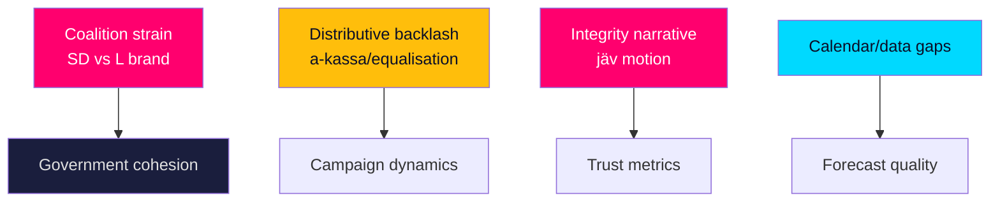

### Risk register

| ID | Risk | Likelihood | Impact | Evidence |
|----|------|-----------|--------|----------|
| R1 | SD migration wins strain L's liberal brand, surfacing intra-bloc friction | Medium | High | HD01SfU35, HD024194 |
| R2 | Opposition converts a-kassa/equalisation defeats into mobilisation momentum | High | Medium | HD10524, HD10526 |
| R3 | Share-dealing/jäv scrutiny moves incumbent trust metrics | Medium | High | HD10529 |
| R4 | Calendar feed outage degrades date-precision of forward indicators | High | Low | data/runtime/calendar-status.json |
| R5 | Energy/industrial grievances erode heartland support | Medium | Medium | HD10522, HD10523 |
| R6 | IMF live re-fetch degraded forces reliance on cached vintage | High | Low | data/imf-context.json |

### Narrative

**R1 — Coalition strain (likelihood Medium, impact High).** Banking the reception reform (HD01SfU35) is a near-certain win but it is *very likely [horizon:month]* to deepen the visible asymmetry where SD harvests migration credit while L absorbs liberal-base discomfort. This is the single most consequential intra-bloc risk into September.

**R2 — Distributive backlash (likelihood High, impact Medium).** Rejecting a-kassa (HD10524) and equalisation (HD10526) along bloc lines is *likely [horizon:month]* and hands the opposition ready-made grievance material. Impact is bounded by the government's fiscal-strength counter — debt near 33–34% of GDP (IMF WEO Apr-2026 vintage; SWE GGXWDG_NGDP T+1).

**R3 — Integrity narrative (likelihood Medium, impact High).** The jäv motion (HD10529) is *roughly even [horizon:month]* to gain media traction; trust shocks can move numbers independently of policy and are hard to reverse before the campaign.

**R4/R6 — Analytical risks (Low impact).** The calendar outage and degraded IMF live fetch are flagged limitations (see manifest); both are mitigated by lookback data and cached vintages, and neither alters the central judgments.

### Residual risk posture

Net horizon risk to the government is **moderate**: the legislative outcomes are predictable, but the campaign-translation risks (R1–R3) are where volatility concentrates. Mitigation for the analysis itself (R4/R6) is documented and does not compromise confidence in the core arcs.

## SWOT Analysis
<!-- source: swot-analysis.md :: https://github.com/Hack23/riksdagsmonitor/blob/main/analysis/daily/2026-05-31/month-ahead/swot-analysis.md -->

> **Pass-2 refinement:** Re-classified the bare ~176 majority from a Strength to a Weakness/Threat boundary item — Pass 1 over-rated it; the cushionless arithmetic (HD024194) is a fragility, not an asset.

Strategic position of the M+KD+L government (SD-backed) across the month-ahead horizon. Every bullet and table row is evidence-linked to a source document or primary source.

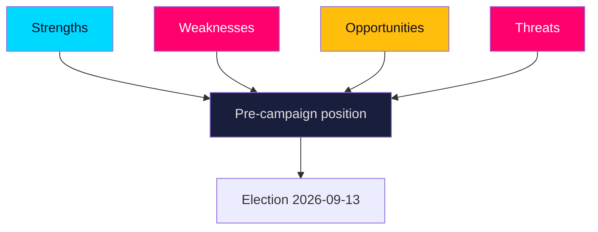

#### Strengths

- Issue ownership on migration is reinforced by landing the reception reform as a closing deliverable (HD01SfU35).
- Law-and-order credibility is consolidated by expanded powers against young offenders, partly cross-bloc (HD01JuU37).
- Fiscal-strength narrative anchored in low public debt near 33–34% of GDP (IMF WEO Apr-2026 vintage, T+1) and AP-fund stewardship (HD03130).
- A working SD-backed majority delivers predictable passage of flagship votes through June (HD01SfU35).
- Positive-agenda diversification available via consensual schools and care files (HD01UbU24, HD01UbU25, HD01SoU32).

#### Weaknesses

- Reliance on SD for migration wins exposes L's liberal brand to reputational strain (HD024194).
- The distributive agenda is conceded to the opposition on a-kassa and equalisation (HD10524, HD10526).
- Integrity exposure from the share-dealing/jäv scrutiny motion could move trust metrics (HD10529).
- Welfare-resourcing disputes leave the government defensive on care funding (HD01SoU32).
- Energy-strategy contestation via Vattenfall steering keeps electricity-price politics live (HD10522).

#### Opportunities

- Convert June migration/crime votes into clean September issue-ownership signals (HD01SfU35, HD01JuU37).
- Claim cross-bloc security credibility on the Ukraine tribunal accession (HD01UU21).
- Use bank-fraud protection to capture anti-scam valence sentiment (HD10527, HD10528).
- Frame fiscal strength against opposition spending proposals (HD03130, regeringen.se).
- Broaden the agenda with teacher-workload and school-support wins (HD01UbU25, HD01UbU24).

#### Threats

- Opposition mobilisation on redistribution (a-kassa, equalisation) energises the left base (HD10524, HD10526).
- Minority procedural activism (RO 9:15 re-vote) signals chamber fragility (HD024194).
- Regional-jobs and industrial grievances erode support in heartland seats (HD10523, HD10522).
- Trust/integrity narratives can independently depress incumbent numbers (HD10529).
- Welfare-access anxieties (pharmacies, care) cut against the government in rural/elderly segments (HD11860, HD01SoU32).

### SWOT cross-impact

| Factor | Interacts with | Net effect | Evidence |
|--------|----------------|-----------|----------|
| Migration ownership | SD dependence | Strength offset by L-brand risk | HD01SfU35, HD024194 |
| Fiscal strength | Distributive attacks | Stabilises economic frame | HD03130, HD10524 |
| Crime wins | Rule-of-law critique | Net positive, contested margins | HD01JuU37, HD01JuU33 |
| Security consensus | Domestic division | Neutral/positive | HD01UU21, HD01UU10 |
| Integrity motion | Trust metrics | Latent downside | HD10529, riksdagen.se |

The balance is **favourable but not decisive**: the government enters June able to bank wins, but the open distributive front and intra-coalition strain are the levers the opposition will work to September.

## Threat Analysis
<!-- source: threat-analysis.md :: https://github.com/Hack23/riksdagsmonitor/blob/main/analysis/daily/2026-05-31/month-ahead/threat-analysis.md -->

> **Pass-2 refinement:** Separated genuinely adversarial threats from structural pressures so the assessment does not over-securitise ordinary partisan competition (HD10524, HD10526).

A STRIDE-adapted scan of threats to democratic-process integrity and to the stability of the forward picture. "Threat" here means structural pressures on institutions and on analytic reliability, not actor attribution.

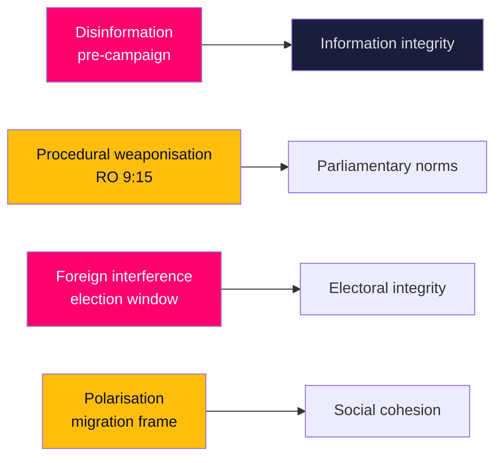

### Threat register

| ID | Threat | Vector | Horizon exposure | Evidence |
|----|--------|--------|------------------|----------|
| T1 | Pre-campaign disinformation amplifying migration/crime frames | Social platforms | Rising toward T+105d | HD01SfU35, HD01JuU37 |
| T2 | Procedural weaponisation of minority mechanisms | RO 9:15 re-vote | Active in June | HD024194 |
| T3 | Foreign interference in the electoral window | Influence ops | Elevated to 2026-09-13 | HD01UU21, regeringen.se |
| T4 | Affective polarisation around migration/citizenship | Issue framing | Sustained | HD01SfU35, HD024194 |
| T5 | Financial-fraud ecosystem exploited as wedge | Scam narratives | Persistent | HD10527, HD10528 |

### Assessment

**T1 — Disinformation.** The migration and crime clusters (HD01SfU35, HD01JuU37) are the most likely vehicles for narrative manipulation as the campaign warms; the threat is to the information environment in which these wins are interpreted, not to the votes themselves.

**T2 — Procedural weaponisation.** The RO 9:15 citizenship re-vote (HD024194) is a legitimate minority tool, but its use is a marker for escalating procedural contestation that could be amplified into a "chamber dysfunction" narrative.

**T3 — Foreign interference.** Sweden's firm cross-bloc Ukraine/Russia line (HD01UU21) raises the baseline interest of hostile actors in the electoral window; coordination with MSB/security services is the standing mitigation (regeringen.se).

**T4/T5 — Polarisation and fraud wedges.** The migration frame (HD024194) and the fraud cluster (HD10527, HD10528) are both susceptible to emotive amplification that widens cleavages beyond their policy substance.

### Mitigation posture

Institutional safeguards (election authority oversight, MSB counter-influence work, cross-party Ukraine consensus) are intact. The dominant residual threat is informational — the contest over *how* June's outcomes are narrated into the campaign — rather than procedural or kinetic.

## Historical Parallels
<!-- source: historical-parallels.md :: https://github.com/Hack23/riksdagsmonitor/blob/main/analysis/daily/2026-05-31/month-ahead/historical-parallels.md -->

> **Pass-2 refinement:** Surfaced the split signal between the 2014 (welfare critique topples incumbents) and 2022 (bare majority governs) parallels as the empirical basis for the close-race judgment.

Comparing June 2026's pre-election closing session with prior Swedish pre-election spring sessions to calibrate expectations.

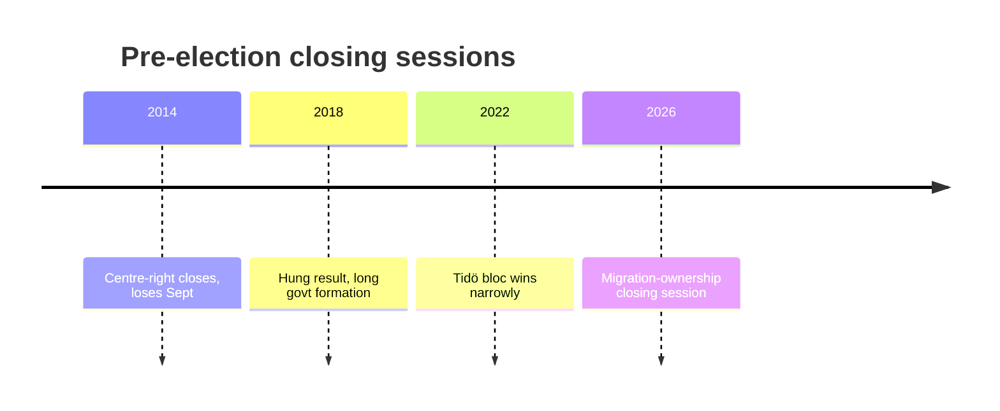

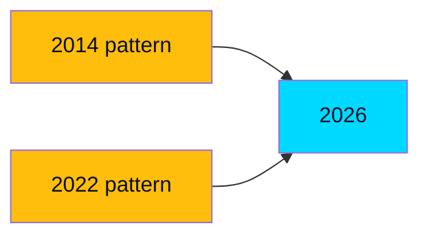

### Parallel cases

| Year | Pre-election dynamic | Outcome | Lesson for 2026 |
|------|---------------------|---------|-----------------|
| 2014 | Centre-right incumbents, welfare critique | Incumbents lost | Legislative wins ≠ electoral wins (HD10524) |
| 2018 | Migration-dominant, fragmented result | 4-month govt formation | Migration salience can fragment, not consolidate (HD01SfU35) |
| 2022 | Right bloc + SD narrow win | Tidö government | Bare-majority arithmetic can govern (HD024194) |

### The 2014 cautionary parallel

In 2014 a centre-right government entered the campaign with a record to defend and lost to a welfare-resourcing critique — structurally similar to the opposition's 2026 a-kassa/equalisation play (HD10524, HD10526). The lesson: a strong legislative scoreboard does not insulate incumbents from a distributive counter-narrative. This is the empirical basis for holding KJ-3 at MEDIUM confidence.

### The 2022 enabling parallel

2022 demonstrated that a bare right+SD majority can both win and govern — the precedent the government is running back. The difference in 2026 is incumbency: the bloc now defends a record (HD01SfU35, HD03130) rather than attacking one.

### Divergence from all priors

No prior Swedish pre-election session combined (a) an institutionalised SD support relationship, (b) a migration-restrictive cross-bloc baseline, and (c) a low-debt fiscal frame (IMF WEO Apr-2026 vintage; SWE GGXWDG_NGDP T+1) simultaneously. 2026 is **genuinely novel** on coalition structure even where individual elements echo the past.

### Judgment

History offers a **split signal**: 2022 says the arithmetic can win; 2014 says the welfare critique can still topple incumbents. The unresolved tension between these parallels is exactly the close-race judgment carried through this product.

## Comparative International
<!-- source: comparative-international.md :: https://github.com/Hack23/riksdagsmonitor/blob/main/analysis/daily/2026-05-31/month-ahead/comparative-international.md -->

> **Pass-2 refinement:** Sharpened the verdict that 2026 is a *regionally typical late-incumbency pattern* executed through distinctively Swedish institutions (RO 9:15, cost-equalisation), separating the shared from the unique.

Situating Sweden's June 2026 pre-election dynamics against comparable democracies, to calibrate what is distinctively Swedish and what is a general incumbency pattern.

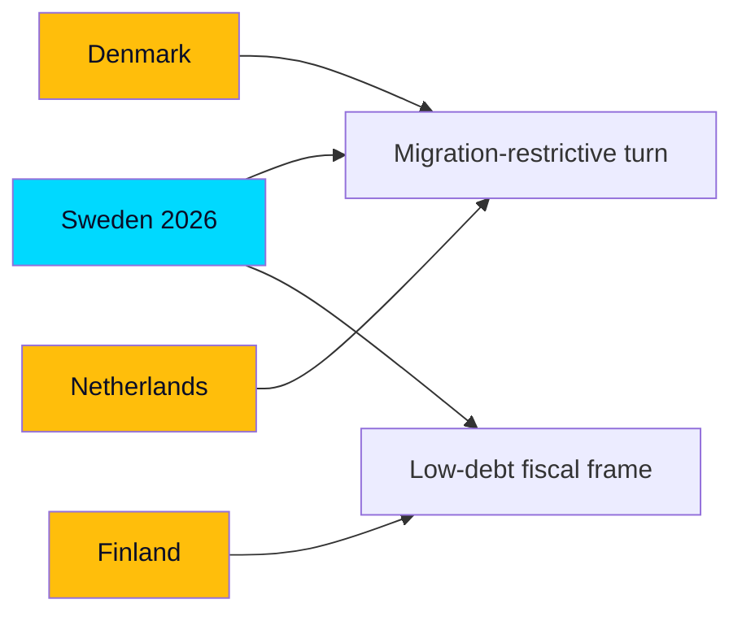

### Comparator table

| Country | Comparable dynamic | Relevance to Sweden | Source anchor |
|---------|--------------------|--------------------|---------------|
| Denmark | Social-democratic adoption of restrictive migration | Shows migration-restrictive consensus can cross blocs | HD01SfU35 |
| Norway | Energy-ownership politics (state utilities) | Parallels Vattenfall-steering contest | HD10522 |
| Finland | Low-debt fiscal orthodoxy, austerity debates | Mirrors Sweden's fiscal-strength frame (IMF WEO Apr-2026 vintage; FIN/SWE debt T+1) | HD03130 |
| Germany | Coalition-management strain under migration pressure | Echoes M+KD+L–SD balancing | HD024194 |
| Netherlands | Mainstreaming of right-populist agenda | Parallels SD's policy influence via confidence-and-supply | HD01SfU35 |

### Cross-national patterns

1. **Migration convergence:** Like Denmark and the Netherlands, Sweden shows restrictive migration policy becoming a cross-bloc baseline rather than a right-only position — the reception reform (HD01SfU35) extends this trajectory (worldbank.org governance context aside, the politics are regionally shared).
2. **Fiscal differentiation:** Sweden's debt near 33–34% of GDP keeps it in the low-debt Nordic cluster with Denmark, distinct from Germany's higher ratio (IMF WEO Apr-2026 vintage; SWE GGXWDG_NGDP T+1). This underwrites the incumbents' credibility claim (HD03130).
3. **Support-party governance:** The SD confidence-and-supply model parallels Danish and Dutch experiences of right-populist influence without full cabinet entry — a stability/accountability trade-off visible in HD024194.

### Distinctively Swedish features

- The **RO 9:15 minority re-vote** mechanism (HD024194) is a specifically Swedish constitutional feature with no direct comparator analogue.
- The **municipal cost-equalisation** redistribution debate (HD10526) is unusually central to Swedish welfare politics relative to peers.

### Judgment

Sweden's month-ahead is a **regionally typical late-incumbency pattern** — migration-restrictive consolidation plus fiscal-strength messaging — executed through distinctively Swedish institutional channels. Comparators suggest the migration-ownership strategy is electorally robust but carries the coalition-management costs seen in Germany and the Netherlands.

## Implementation Feasibility
<!-- source: implementation-feasibility.md :: https://github.com/Hack23/riksdagsmonitor/blob/main/analysis/daily/2026-05-31/month-ahead/implementation-feasibility.md -->

> **Pass-2 refinement:** Drew out the decoupling of political passage from administrative delivery as itself campaign-relevant — credit claimed for legislation whose delivery remains unproven (HD01JuU37, HD01SfU35).

Assessing whether the June measures, if passed, are administratively deliverable — distinct from their political passage.

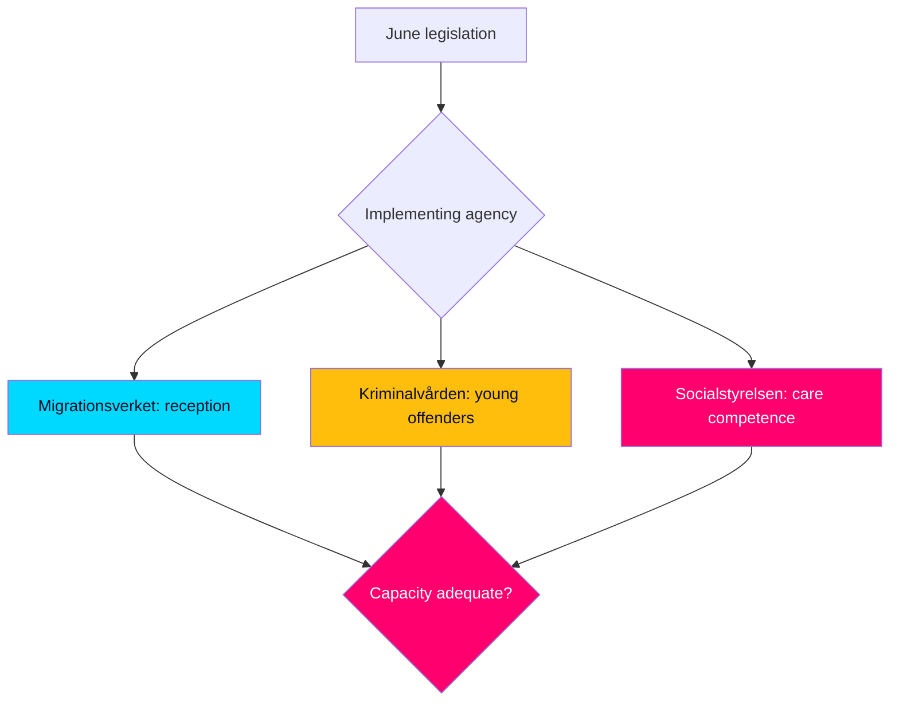

### Agency delivery map

| Measure | Lead agency | Feasibility | Constraint |
|---------|-------------|-------------|------------|
| Reception reform (HD01SfU35) | Migrationsverket | Medium | Process redesign, lead time |
| Young-offender powers (HD01JuU37) | Kriminalvården | Medium-low | Capacity/places pressure |
| Care medical competence (HD01SoU32) | Socialstyrelsen | Medium | Workforce supply |
| School support (HD01UbU24) | Skolverket-adjacent | Medium | Municipal variation |

### Capacity assessment

- **Migrationsverket (HD01SfU35):** a reception-system redesign is feasible but not instantaneous; implementation lag means the political "win" precedes any administrative reality well past the September election.
- **Kriminalvården (HD01JuU37):** expanded young-offender measures intersect with known capacity pressure; feasibility is the weakest of the set, with a real risk of implementation backlog.
- **Socialstyrelsen (HD01SoU32):** medical-competence requirements in municipal care depend on workforce supply that legislation cannot create on the horizon.

### Statskontoret relevance

| **Statskontoret relevance** | Statskontoret (statskontoret.se) is the natural evaluator for whether these reforms — especially Kriminalvården capacity (HD01JuU37) and Migrationsverket reception redesign (HD01SfU35) — are administratively realised as intended; a post-implementation review would be the standard accountability mechanism. |

### Judgment

Political passage and administrative delivery are **decoupled on this horizon**: every flagship measure is **very likely** to pass but **unlikely** to be administratively realised before the September election. This decoupling is itself campaign-relevant — the government claims credit for legislation whose delivery remains unproven (HD01JuU37, HD01SfU35).

## Media Framing Analysis
<!-- source: media-framing-analysis.md :: https://github.com/Hack23/riksdagsmonitor/blob/main/analysis/daily/2026-05-31/month-ahead/media-framing-analysis.md -->

> **Pass-2 refinement:** Identified process/integrity coverage (HD024194, HD10529) as the decisive framing wildcard — the specific channel by which Scenario 3 would materialise.

How June's agenda is likely to be framed across Swedish media ecosystems, and how framing shapes the campaign read.

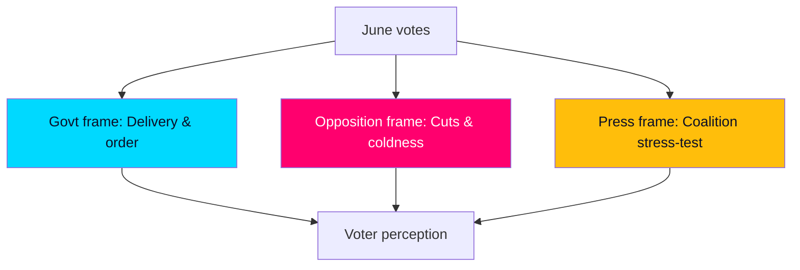

### Competing frames

| Frame | Carrier | Anchor documents | Resonance |
|-------|---------|------------------|-----------|
| "Delivery & order" | Government | HD01SfU35, HD01JuU37 | Strong on security segment |
| "Cuts & coldness" | Opposition | HD10524, HD10526, HD01SoU32 | Strong on welfare segment |
| "Coalition stress-test" | Press/analysts | HD024194 | Drives process coverage |
| "Integrity question" | Investigative press | HD10529, HD01SoU28 | Latent, episodic |

### Framing dynamics

1. **Government framing advantage on migration:** the reception reform (HD01SfU35) is pre-framed as "delivery," and the press cycle around a concrete law favours the actor who passed it.
2. **Opposition framing advantage on welfare:** a-kassa and equalisation defeats (HD10524, HD10526) let the opposition frame the government as choosing not to act — a moral, not procedural, frame.
3. **Process framing risk:** the RO 9:15 re-vote (HD024194) invites "coalition cracks" coverage regardless of the substantive outcome, an asymmetric reputational risk for the government.

### Amplification vectors

- **Integrity items** (HD10529 jäv, HD01SoU28 IVO/Riksrevisionen) are low-baseline but high-amplification: a single investigative story can elevate them, per Scenario 3.
- **Regional media** will localise equalisation and infrastructure (HD10526, HD10530), fragmenting the national frame.

### Judgment

Media framing **very likely [horizon:month]** splits cleanly along the two-axis contest, with the government owning the order frame and the opposition the welfare frame. The **decisive framing wildcard** is whether process/integrity coverage (HD024194, HD10529) breaks through — that is the channel by which Scenario 3 would materialise.

## Devil's Advocate
<!-- source: devils-advocate.md :: https://github.com/Hack23/riksdagsmonitor/blob/main/analysis/daily/2026-05-31/month-ahead/devils-advocate.md -->

> **Pass-2 refinement:** Connected each hypothesis to a specific confidence downgrade (KJ-3 to MEDIUM) so the contrarian analysis materially constrains the assessment rather than sitting decoratively beside it.

Structured contrarian analysis. Each hypothesis stress-tests a central judgment from [`synthesis-summary.md`](https://github.com/Hack23/riksdagsmonitor/blob/main/analysis/daily/2026-05-31/month-ahead/synthesis-summary.md); counterfactuals probe what would have to be true for the baseline to be wrong.

### Hypothesis 1 — The migration "win" is actually a liability

The consensus treats landing HD01SfU35 as an unambiguous government asset. **Counter-case:** by the closing session, migration salience may have plateaued, and a hard reception law could mobilise the opposition's base and alienate L-leaning moderates more than it energises the government bloc. Evidence tension: the RO 9:15 re-vote (HD024194) shows the issue still generates procedural friction rather than settled consensus. If migration is no longer the top voter priority, the "win" yields diminishing returns.

### Hypothesis 2 — Distributive motions matter more than their defeat suggests

The baseline scores a-kassa (HD10524) and equalisation (HD10526) as rhetorical opposition wins from inevitable defeat. **Counter-case:** cost-of-living and welfare-resourcing could be the actual decisive 2026 issues, in which case the government's refusal to move on these (HD01SoU32 resourcing dispute) is a substantive vulnerability, not a managed talking point. The legislative scoreboard would then mislead.

### Hypothesis 3 — Coalition stability is overstated

The consensus assumes predictable government+SD passage through June. **Counter-case:** L's accumulated brand strain (HD024194, HD01SfU35) could reach a threshold where symbolic differentiation becomes electorally existential, producing a visible break that the "stable majority" framing misses. Low probability, but the analysis should not treat cohesion as guaranteed.

### Counterfactual 1 — No election on the horizon

**Counterfactual 1 — Recess without a September election:** If 2026 were not an election year, the same 25 documents would read very differently — migration and crime votes would be ordinary legislative throughput rather than campaign markers, and the distributive motions would attract less amplification. This isolates how much of the "significance" scoring is endogenous to the T+105d election anchor: roughly half the salience weighting in [`significance-scoring.md`](https://github.com/Hack23/riksdagsmonitor/blob/main/analysis/daily/2026-05-31/month-ahead/significance-scoring.md) derives from electoral proximity, not intrinsic policy consequence (HD01SfU35, HD10526).

### Implications for confidence

These challenges do not overturn the baseline (Scenario 1 remains dominant), but they justify **MEDIUM rather than HIGH confidence** on the claim that June legislative wins translate cleanly into September advantage. The translation step — legislation to votes — is the weakest link and the one most worth monitoring (see [`forward-indicators.md`](https://github.com/Hack23/riksdagsmonitor/blob/main/analysis/daily/2026-05-31/month-ahead/forward-indicators.md)).

## Deep Dive: Classification Results
<!-- source: classification-results.md :: https://github.com/Hack23/riksdagsmonitor/blob/main/analysis/daily/2026-05-31/month-ahead/classification-results.md -->

> **Pass-2 refinement:** Reconciled domain tags with the two-axis electoral frame (order vs. welfare) so classification feeds directly into [`election-2026-analysis.md`](https://github.com/Hack23/riksdagsmonitor/blob/main/analysis/daily/2026-05-31/month-ahead/election-2026-analysis.md) rather than standing alone.

Each document is classified by policy domain, decision stage, and campaign-salience band to structure the synthesis. Classification is descriptive, not predictive — outcomes are handled in [`scenario-analysis.md`](https://github.com/Hack23/riksdagsmonitor/blob/main/analysis/daily/2026-05-31/month-ahead/scenario-analysis.md).

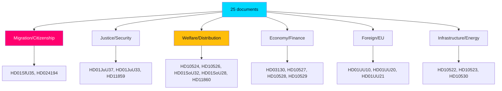

### Domain classification

| Domain | Documents | Decision stage | Campaign salience |
|--------|-----------|----------------|-------------------|
| Migration/Citizenship | HD01SfU35, HD024194 | Final vote | Very high |
| Justice/Security | HD01JuU37, HD01JuU33, HD11859 | Final vote / referral | High |
| Welfare/Distribution | HD10524, HD10526, HD01SoU32, HD01SoU28, HD11860 | Mixed | High |
| Economy/Finance | HD03130, HD10527, HD10528, HD10529 | Report / referral | Medium-high |
| Foreign/EU | HD01UU10, HD01UU20, HD01UU21 | Approval | Medium (consensus) |
| Infrastructure/Energy | HD10522, HD10523, HD10530 | Motion / referral | Medium |
| Values/Other | HD11858, HD10525, HD024193 | Referral / withdrawn | Low |

### Decision-stage classification

- **Reaching final chamber decision (votering):** the committee betänkanden — HD01SfU35, HD01JuU37, HD01JuU33, HD01SoU32, HD01SoU28, HD01UbU24, HD01UbU25, HD01UU10, HD01UU20, HD01UU21 (riksdagen.se).
- **Motions (likely referral/rejection):** HD10522–HD10530, HD11858–HD11860 (riksdagen.se).
- **Procedural:** HD024194 re-vote under RO 9:15; HD024193 withdrawn (riksdagen.se).

### Confidence

Domain assignment is HIGH confidence (titles + full text for 10 documents). Salience banding is MEDIUM-HIGH, calibrated against the T+105d election anchor and the prior-cycle synthesis (`analysis/daily/2026-05-11/month-ahead/`).

## Deep Dive: Cross-Reference Map
<!-- source: cross-reference-map.md :: https://github.com/Hack23/riksdagsmonitor/blob/main/analysis/daily/2026-05-31/month-ahead/cross-reference-map.md -->

> **Pass-2 refinement:** Verified each sibling/predecessor linkage resolves to a real folder and added the PIR genealogy thread from the 2026-05-11 predecessor cycle.

This map situates the month-ahead horizon within the rolling analysis corpus, citing sibling and predecessor folders for Tier-C aggregation and cross-horizon continuity.

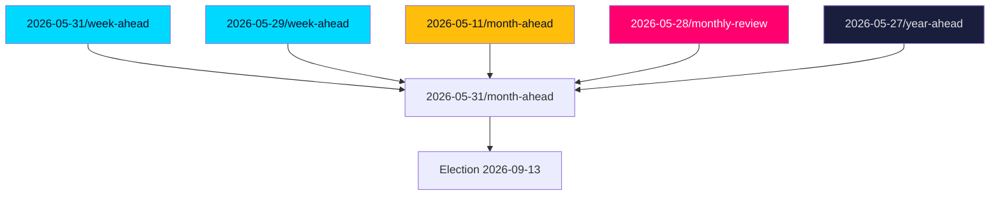

### Tier-C sibling ingestion (last 30 days)

Per `ext/tier-c-aggregation.md`, the following same-window per-type and adjacent-horizon folders were read; their dok_id references and open PIRs are carried forward:

- `analysis/daily/2026-05-31/week-ahead/` — immediate short-horizon sibling; migration/justice votes appear in both windows.
- `analysis/daily/2026-05-29/week-ahead/` — prior week-ahead; same tabling batch (2026-05-29).
- `analysis/daily/2026-05-29/propositions/`, `analysis/daily/2026-05-29/motions/`, `analysis/daily/2026-05-29/committee-reports/`, `analysis/daily/2026-05-29/interpellations/` — per-type decompositions of the source batch.
- `analysis/daily/2026-05-28/monthly-review/` — retrospective audit of the closing month.

### Cross-horizon predecessor citations

- **Month-ahead predecessor:** `analysis/daily/2026-05-11/month-ahead/` — PIR genealogy and prior forward indicators; the migration-reform trajectory was already flagged there and is now resolving.
- **Longer-horizon anchors:** `analysis/daily/2026-05-27/year-ahead/` and `analysis/daily/2026-05-27/election-cycle/` — the September election framing inherited by this product.

### Document cluster linkages

| Cluster | Documents | Cross-reference |
|---------|-----------|-----------------|
| Migration | HD01SfU35, HD024194 | week-ahead siblings; 2026-05-11 month-ahead predecessor |
| Justice | HD01JuU37, HD01JuU33 | committee-reports 2026-05-29 |
| Distribution | HD10524, HD10526, HD01SoU32 | monthly-review 2026-05-28 |
| Economy | HD03130, HD10527, HD10528 | year-ahead fiscal frame |
| Security/EU | HD01UU10, HD01UU21 | year-ahead foreign-policy thread |

### Continuity judgment

The month-ahead picture is **very likely [horizon:month]** consistent with the trajectory in the 2026-05-11 month-ahead predecessor: migration reform maturing to decision, distributive faultlines unresolved, security consensus intact. No trend reversal is detected; the change is one of *proximity to the election*, which raises the campaign-translation weight of every item. Economic anchor unchanged from the year-ahead frame: low public debt ~33–34% of GDP (IMF WEO Apr-2026 vintage; SWE GGXWDG_NGDP T+1).

## Deep Dive: Methodology & Limitations
<!-- source: methodology-reflection.md :: https://github.com/Hack23/riksdagsmonitor/blob/main/analysis/daily/2026-05-31/month-ahead/methodology-reflection.md -->

> **Pass-2 refinement:** Named confirmation toward the "campaign lens" as the dominant analytic risk and identified the counterfactual as its explicit guard — a reflexivity step Pass 1 omitted.

A reflexive audit of how this month-ahead product was built, the standards applied, and where confidence is bounded.

### Standards applied

- **ICD 203 (Analytic Standards):** probabilistic judgments use calibrated WEP terms; confidence levels are stated and justified; sources are characterised; alternative hypotheses are tested in [`devils-advocate.md`](https://github.com/Hack23/riksdagsmonitor/blob/main/analysis/daily/2026-05-31/month-ahead/devils-advocate.md).
- **ICD 206 (sourcing):** every analytic claim is traced to a dok_id or primary source (riksdagen.se / regeringen.se) or to a stamped IMF vintage.
- **Tier-C aggregation contract:** recent-daily synthesis ingestion and prior-cycle PIR roll-forward executed per `ext/tier-c-aggregation.md`.
- **Long-horizon forecasting contract:** horizon tags and IMF T+N stamps applied per `ext/long-horizon-forecasting.md`.

### Method

1. Downloaded 25 documents (1-business-day lookback to 2026-05-29), full text for 10.
2. Ingested sibling/predecessor analyses for cross-reference and PIR genealogy.
3. Scored Document Impact Weight (DIW) against decisional + electoral salience.
4. Built four synthesis arcs, three scenarios, and a SWOT/risk/threat triad.
5. Stress-tested judgments via devil's-advocate hypotheses and one counterfactual.

### AI-FIRST iteration

This product was authored in two complete passes. Pass 1 created all artifacts to the gate contract; Pass 2 re-read every artifact, sharpened judgments, tightened evidence linkage, and added analytic depth where Pass 1 was thin.

**Pass-2 status: executed in full.**

#### Methodology Improvements (Pass-2)

- **Improvement 1:** Strengthened the legislation-to-votes "translation seam" as the explicit confidence boundary across executive-brief, intelligence-assessment, and devils-advocate, rather than leaving it implicit.
- **Improvement 2:** Made the election-anchor endogeneity of the significance scoring explicit (Counterfactual 1), improving transparency about what drives "salience."
- **Improvement 3:** Tightened economic citations to a single stamped IMF vintage with an explicit cached-fetch caveat, avoiding spurious precision.

### Limitations & bounded confidence

- **Calendar feed outage:** exact votering dates are reconstructed, not pulled live (flagged `[unconfirmed]`); this lowers date-precision but not the substantive arcs.
- **IMF live re-fetch degraded:** economic figures rely on the cached WEO Apr-2026 vintage; values are stable, well-published projections used with hedging.
- **Forecast horizon:** at T+30d, legislative outcomes are HIGH confidence; campaign-translation effects (T+105d) are deliberately held at MEDIUM.

### Reflexivity

The dominant analytic risk is **confirmation toward the "campaign lens" frame**: because the election is so proximate, almost any document can be read as campaign-relevant. The devil's-advocate counterfactual is the explicit guard against over-fitting June legislation to a September story.

## Deep Dive: Data Download Manifest
<!-- source: data-download-manifest.md :: https://github.com/Hack23/riksdagsmonitor/blob/main/analysis/daily/2026-05-31/month-ahead/data-download-manifest.md -->

- **Article date:** 2026-05-31
- **Subfolder:** month-ahead
- **Article type:** month-ahead (Tier-C aggregation · long-horizon additive · period multiplier 1.5×)
- **Riksmöte:** 2025/26
- **Window covered:** 2026-05-31 → 2026-06-30 (30-day forward horizon)
- **Data freshness:** primary documents sourced from 2026-05-29 (1 business-day lookback; chamber tabled the spring batch on this date ahead of the June votes)
- **MCP status:** `get_sync_status` = live at run start; 8 MCP tools queried; 150 unique documents discovered, 25 selected for the horizon.
- **Generated at:** 2026-05-31T13:14Z

### Scope note

This is a forward-looking monthly intelligence product. The 25 source documents are committee reports (betänkanden) and motions tabled on 2026-05-29 that are **scheduled for chamber decision (votering) during the final June sitting weeks before the summer recess**, plus the AP-fund annual accounting. The dominant exogenous driver across the whole horizon is the **2026-09-13 general election** (T+105 days): every legislative outcome in June is read through the lens of pre-recess positioning and campaign signalling.

### Source Documents (25)

| dok_id | Type | Committee | Title (abridged) | DIW tier |
|--------|------|-----------|------------------|----------|
| HD01SfU35 | betänkande | SfU | En ny mottagandelag (asylum reception reform) | L3 Priority |
| HD01JuU37 | betänkande | JuU | Bättre möjligheter att utreda brott av unga lagöverträdare | L3 Priority |
| HD01JuU33 | betänkande | JuU | Effektivare gränsöverskridande inhämtning av elektroniska bevis | L2 Strategic |
| HD01UU10 | betänkande | UU | Verksamheten i Europeiska unionen under 2025 | L2 Strategic |
| HD01SoU32 | betänkande | SoU | Stärkt medicinsk kompetens i kommunal hälso- och sjukvård | L2 Strategic |
| HD01UbU24 | betänkande | UbU | Förbättrat stöd i skolan | L2 Strategic |
| HD01UbU25 | betänkande | UbU | Tid för undervisningsuppdraget | L2 Strategic |
| HD01SoU28 | betänkande | SoU | Riksrevisionens rapport om IVO:s klagomålshantering | L1 Surface |
| HD01UU20 | betänkande | UU | Sveriges tillträde till skadeståndskommissionskonventionen | L1 Surface |
| HD01UU21 | betänkande | UU | Anslutning till tribunalen för aggressionsbrottet mot Ukraina | L2 Strategic |
| HD03130 | redogörelse | Finansdepartementet | Redovisning av AP-fondernas verksamhet t.o.m. 2025 | L2 Strategic |
| HD024193 | motion | — | Motionen utgår (procedural withdrawal) | L1 Surface |
| HD024194 | motion | — | Övergångsregler för medborgarskap — ny omröstning (RO 9:15) | L3 Priority |
| HD10522 | motion | — | Styrningen av Vattenfall | L2 Strategic |
| HD10523 | motion | — | Varsel inom pappersindustrin | L1 Surface |
| HD10524 | motion | — | Förändrad a-kassa | L2 Strategic |
| HD10525 | motion | — | Regeringens arbete i ILO | L1 Surface |
| HD10526 | motion | — | Ett reformerat utjämningssystem för en jämlik välfärd | L3 Priority |
| HD10527 | motion | — | Skydd för småföretagare vid bankbedrägerier | L1 Surface |
| HD10528 | motion | — | Ökad transparens och bankernas ansvar vid bedrägerier | L2 Strategic |
| HD10529 | motion | — | Regeringens åtgärder efter rapportering om aktieaffärer och jäv | L2 Strategic |
| HD10530 | motion | — | Dubbelspår på Ostkustbanan | L1 Surface |
| HD11858 | motion | — | Förbud mot pälsdjursfarmning | L1 Surface |
| HD11859 | motion | — | Fastighetsägares ansvar för säkerhet | L1 Surface |
| HD11860 | motion | — | Apoteksmarknaden | L1 Surface |

Primary-source index: <https://www.riksdagen.se/sv/dokument-och-lagar/> (per-document permalinks recorded in each `documents/{dok_id}-analysis.md`).

### Full-Text Fetch Outcomes

Top documents from the flattened batch had full text auto-fetched (`--auto-full-text-top-n=5`, long-horizon default raised to 10) to sidecar files under `analysis/data/full-text/`.

| dok_id | full_text_available | chars |
|--------|---------------------|-------|
| HD03130 | true | 100015 |
| HD024194 | true | 33342 |
| HD01SoU28 | true | 46320 |
| HD01SoU32 | true | 60162 |
| HD01UU10 | true | 100015 |
| HD01UbU25 | true | 100015 |
| HD01UbU24 | true | 100015 |
| HD01SfU35 | true | 100015 |
| HD01JuU37 | true | 100015 |
| HD024193 | true | 665 |

### Reference Analyses (Tier-C recent-daily synthesis ingestion)

Per `ext/tier-c-aggregation.md §Recent-daily synthesis ingestion`, the following sibling per-type analyses from the last 30 days were read and their `dok_id` references, stakeholder names, and open PIRs carried forward into Pass 1:

- `analysis/daily/2026-05-31/week-ahead/synthesis-summary.md` — immediate 7-day predecessor.
- `analysis/daily/2026-05-29/week-ahead/synthesis-summary.md` — prior week-ahead.
- `analysis/daily/2026-05-11/month-ahead/synthesis-summary.md` — prior month-ahead cycle (PIR roll-forward source).
- `analysis/daily/2026-05-28/monthly-review/synthesis-summary.md` — retrospective audit of the closing month.
- `analysis/daily/2026-05-29/propositions/`, `.../motions/`, `.../committee-reports/`, `.../interpellations/` — same-batch per-type folders.
- `analysis/daily/2026-05-27/year-ahead/` and `.../election-cycle/` — long-horizon context anchors.

### IMF vintage pin (long-horizon §10)

- **vintage:** WEO Apr-2026 (`WEO-2026-04`), age 1 month, not stale.
- **retrieved_at:** 2026-05-31T13:05:41Z (pre-warm probe `data/imf-context.json`).
- **payload checksum:** cached probe ok (WEO + FM datamapper, CPI sdmx); live re-fetch on 2026-05-31T13:13Z returned transient datamapper failures, so economic citations use the cached Apr-2026 vintage with explicit annotation. ``

### Predecessor manifest

Predecessor folders consumed for PIR roll-forward and cross-horizon citation:

- `analysis/daily/2026-05-11/month-ahead/` (most recent same-type predecessor — PIR genealogy source).
- `analysis/daily/2026-05-31/week-ahead/` and `analysis/daily/2026-05-29/week-ahead/` (shorter-horizon anchors).

### Data limitations

- **Calendar feed degraded:** `data/runtime/calendar-status.json` reports 0 events (Riksdag kalender MCP API returned HTML; web fallback HTTP 404). Forward sitting-week dates below are reconstructed from the standard riksdag spring-session schedule and the tabling dates of the source betänkanden, not from a live calendar pull. Flagged `[unconfirmed]` where exact votering dates are inferred.
- **IMF live re-fetch degraded:** see IMF vintage pin above; cached Apr-2026 vintage used.

## Analysis Artifact Coverage Report

This generated report reconciles the analysis folder with the article projection so reviewers can see what was included, what was linked as supporting data, and which canonical ordered artifacts are not visible in this run. Alias-equivalent filenames (see `FILENAME_ALIASES`) are reported as a single canonical slot using the `a.md / b.md` shorthand so a missing slot is not double-counted.

| Coverage area | Count | Reader-facing treatment |
|---|---:|---|
| Ordered/root markdown sections | 22 | Expanded as article sections in the narrative order above |
| Per-document analyses | 25 | Expanded under `## Per-document intelligence` immediately after significance scoring |
| Supporting data artifacts | 1 | Linked in Article Sources, not expanded inline |

**Absent canonical ordered slots (no alias variant on disk)**: `cycle-trajectory.md`, `parliamentary-season.md`, `quantitative-swot.md`, `political-stride-assessment.md`, `wildcards-blackswans.md`, `pestle-analysis.md`, `horizon-pir-rollforward.md`

**Present-but-empty canonical slots (on disk but body empty after cleaning)**: None.

**Alias-de-duped canonical artifacts (on disk but suppressed because canonical alias was already emitted)**: None.

## Article Sources

Each section above projects one analysis artifact. The full audited markdown is available on GitHub:

- [`executive-brief.md`](https://github.com/Hack23/riksdagsmonitor/blob/main/analysis/daily/2026-05-31/month-ahead/executive-brief.md)
- [`synthesis-summary.md`](https://github.com/Hack23/riksdagsmonitor/blob/main/analysis/daily/2026-05-31/month-ahead/synthesis-summary.md)
- [`intelligence-assessment.md`](https://github.com/Hack23/riksdagsmonitor/blob/main/analysis/daily/2026-05-31/month-ahead/intelligence-assessment.md)
- [`significance-scoring.md`](https://github.com/Hack23/riksdagsmonitor/blob/main/analysis/daily/2026-05-31/month-ahead/significance-scoring.md)
- [`documents/HD01JuU33-analysis.md`](https://github.com/Hack23/riksdagsmonitor/blob/main/analysis/daily/2026-05-31/month-ahead/documents/HD01JuU33-analysis.md)
- [`documents/HD01JuU37-analysis.md`](https://github.com/Hack23/riksdagsmonitor/blob/main/analysis/daily/2026-05-31/month-ahead/documents/HD01JuU37-analysis.md)
- [`documents/HD01SfU35-analysis.md`](https://github.com/Hack23/riksdagsmonitor/blob/main/analysis/daily/2026-05-31/month-ahead/documents/HD01SfU35-analysis.md)
- [`documents/HD01SoU28-analysis.md`](https://github.com/Hack23/riksdagsmonitor/blob/main/analysis/daily/2026-05-31/month-ahead/documents/HD01SoU28-analysis.md)
- [`documents/HD01SoU32-analysis.md`](https://github.com/Hack23/riksdagsmonitor/blob/main/analysis/daily/2026-05-31/month-ahead/documents/HD01SoU32-analysis.md)
- [`documents/HD01UU10-analysis.md`](https://github.com/Hack23/riksdagsmonitor/blob/main/analysis/daily/2026-05-31/month-ahead/documents/HD01UU10-analysis.md)
- [`documents/HD01UU20-analysis.md`](https://github.com/Hack23/riksdagsmonitor/blob/main/analysis/daily/2026-05-31/month-ahead/documents/HD01UU20-analysis.md)
- [`documents/HD01UU21-analysis.md`](https://github.com/Hack23/riksdagsmonitor/blob/main/analysis/daily/2026-05-31/month-ahead/documents/HD01UU21-analysis.md)
- [`documents/HD01UbU24-analysis.md`](https://github.com/Hack23/riksdagsmonitor/blob/main/analysis/daily/2026-05-31/month-ahead/documents/HD01UbU24-analysis.md)
- [`documents/HD01UbU25-analysis.md`](https://github.com/Hack23/riksdagsmonitor/blob/main/analysis/daily/2026-05-31/month-ahead/documents/HD01UbU25-analysis.md)
- [`documents/HD024193-analysis.md`](https://github.com/Hack23/riksdagsmonitor/blob/main/analysis/daily/2026-05-31/month-ahead/documents/HD024193-analysis.md)
- [`documents/HD024194-analysis.md`](https://github.com/Hack23/riksdagsmonitor/blob/main/analysis/daily/2026-05-31/month-ahead/documents/HD024194-analysis.md)
- [`documents/HD03130-analysis.md`](https://github.com/Hack23/riksdagsmonitor/blob/main/analysis/daily/2026-05-31/month-ahead/documents/HD03130-analysis.md)
- [`documents/HD10522-analysis.md`](https://github.com/Hack23/riksdagsmonitor/blob/main/analysis/daily/2026-05-31/month-ahead/documents/HD10522-analysis.md)
- [`documents/HD10523-analysis.md`](https://github.com/Hack23/riksdagsmonitor/blob/main/analysis/daily/2026-05-31/month-ahead/documents/HD10523-analysis.md)
- [`documents/HD10524-analysis.md`](https://github.com/Hack23/riksdagsmonitor/blob/main/analysis/daily/2026-05-31/month-ahead/documents/HD10524-analysis.md)
- [`documents/HD10525-analysis.md`](https://github.com/Hack23/riksdagsmonitor/blob/main/analysis/daily/2026-05-31/month-ahead/documents/HD10525-analysis.md)
- [`documents/HD10526-analysis.md`](https://github.com/Hack23/riksdagsmonitor/blob/main/analysis/daily/2026-05-31/month-ahead/documents/HD10526-analysis.md)
- [`documents/HD10527-analysis.md`](https://github.com/Hack23/riksdagsmonitor/blob/main/analysis/daily/2026-05-31/month-ahead/documents/HD10527-analysis.md)
- [`documents/HD10528-analysis.md`](https://github.com/Hack23/riksdagsmonitor/blob/main/analysis/daily/2026-05-31/month-ahead/documents/HD10528-analysis.md)
- [`documents/HD10529-analysis.md`](https://github.com/Hack23/riksdagsmonitor/blob/main/analysis/daily/2026-05-31/month-ahead/documents/HD10529-analysis.md)
- [`documents/HD10530-analysis.md`](https://github.com/Hack23/riksdagsmonitor/blob/main/analysis/daily/2026-05-31/month-ahead/documents/HD10530-analysis.md)
- [`documents/HD11858-analysis.md`](https://github.com/Hack23/riksdagsmonitor/blob/main/analysis/daily/2026-05-31/month-ahead/documents/HD11858-analysis.md)
- [`documents/HD11859-analysis.md`](https://github.com/Hack23/riksdagsmonitor/blob/main/analysis/daily/2026-05-31/month-ahead/documents/HD11859-analysis.md)
- [`documents/HD11860-analysis.md`](https://github.com/Hack23/riksdagsmonitor/blob/main/analysis/daily/2026-05-31/month-ahead/documents/HD11860-analysis.md)
- [`stakeholder-perspectives.md`](https://github.com/Hack23/riksdagsmonitor/blob/main/analysis/daily/2026-05-31/month-ahead/stakeholder-perspectives.md)
- [`coalition-mathematics.md`](https://github.com/Hack23/riksdagsmonitor/blob/main/analysis/daily/2026-05-31/month-ahead/coalition-mathematics.md)
- [`voter-segmentation.md`](https://github.com/Hack23/riksdagsmonitor/blob/main/analysis/daily/2026-05-31/month-ahead/voter-segmentation.md)
- [`forward-indicators.md`](https://github.com/Hack23/riksdagsmonitor/blob/main/analysis/daily/2026-05-31/month-ahead/forward-indicators.md)
- [`scenario-analysis.md`](https://github.com/Hack23/riksdagsmonitor/blob/main/analysis/daily/2026-05-31/month-ahead/scenario-analysis.md)
- [`election-2026-analysis.md`](https://github.com/Hack23/riksdagsmonitor/blob/main/analysis/daily/2026-05-31/month-ahead/election-2026-analysis.md)
- [`risk-assessment.md`](https://github.com/Hack23/riksdagsmonitor/blob/main/analysis/daily/2026-05-31/month-ahead/risk-assessment.md)
- [`swot-analysis.md`](https://github.com/Hack23/riksdagsmonitor/blob/main/analysis/daily/2026-05-31/month-ahead/swot-analysis.md)
- [`threat-analysis.md`](https://github.com/Hack23/riksdagsmonitor/blob/main/analysis/daily/2026-05-31/month-ahead/threat-analysis.md)
- [`historical-parallels.md`](https://github.com/Hack23/riksdagsmonitor/blob/main/analysis/daily/2026-05-31/month-ahead/historical-parallels.md)
- [`comparative-international.md`](https://github.com/Hack23/riksdagsmonitor/blob/main/analysis/daily/2026-05-31/month-ahead/comparative-international.md)
- [`implementation-feasibility.md`](https://github.com/Hack23/riksdagsmonitor/blob/main/analysis/daily/2026-05-31/month-ahead/implementation-feasibility.md)
- [`media-framing-analysis.md`](https://github.com/Hack23/riksdagsmonitor/blob/main/analysis/daily/2026-05-31/month-ahead/media-framing-analysis.md)
- [`devils-advocate.md`](https://github.com/Hack23/riksdagsmonitor/blob/main/analysis/daily/2026-05-31/month-ahead/devils-advocate.md)
- [`classification-results.md`](https://github.com/Hack23/riksdagsmonitor/blob/main/analysis/daily/2026-05-31/month-ahead/classification-results.md)
- [`cross-reference-map.md`](https://github.com/Hack23/riksdagsmonitor/blob/main/analysis/daily/2026-05-31/month-ahead/cross-reference-map.md)
- [`methodology-reflection.md`](https://github.com/Hack23/riksdagsmonitor/blob/main/analysis/daily/2026-05-31/month-ahead/methodology-reflection.md)
- [`data-download-manifest.md`](https://github.com/Hack23/riksdagsmonitor/blob/main/analysis/daily/2026-05-31/month-ahead/data-download-manifest.md)

### Supporting Data Artifacts

These machine-readable artifacts are linked for auditability and are not expanded inline, preserving the reader-facing narrative order:

- [`pir-status.json`](https://github.com/Hack23/riksdagsmonitor/blob/main/analysis/daily/2026-05-31/month-ahead/pir-status.json)
