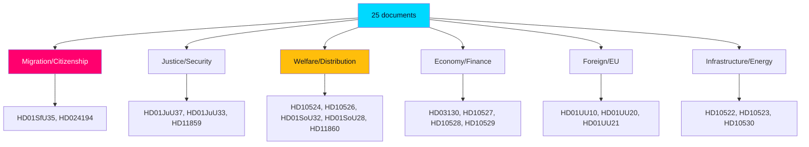

# Classification Results — Domain & Salience Mapping

> **Pass-2 refinement:** Reconciled domain tags with the two-axis electoral frame (order vs. welfare) so classification feeds directly into [`election-2026-analysis.md`](election-2026-analysis.md) rather than standing alone.

Each document is classified by policy domain, decision stage, and campaign-salience band to structure the synthesis. Classification is descriptive, not predictive — outcomes are handled in [`scenario-analysis.md`](scenario-analysis.md).

## Domain classification

| Domain | Documents | Decision stage | Campaign salience |
|--------|-----------|----------------|-------------------|
| Migration/Citizenship | HD01SfU35, HD024194 | Final vote | Very high |
| Justice/Security | HD01JuU37, HD01JuU33, HD11859 | Final vote / referral | High |
| Welfare/Distribution | HD10524, HD10526, HD01SoU32, HD01SoU28, HD11860 | Mixed | High |
| Economy/Finance | HD03130, HD10527, HD10528, HD10529 | Report / referral | Medium-high |
| Foreign/EU | HD01UU10, HD01UU20, HD01UU21 | Approval | Medium (consensus) |
| Infrastructure/Energy | HD10522, HD10523, HD10530 | Motion / referral | Medium |
| Values/Other | HD11858, HD10525, HD024193 | Referral / withdrawn | Low |

## Decision-stage classification

- **Reaching final chamber decision (votering):** the committee betänkanden — HD01SfU35, HD01JuU37, HD01JuU33, HD01SoU32, HD01SoU28, HD01UbU24, HD01UbU25, HD01UU10, HD01UU20, HD01UU21 (riksdagen.se).
- **Motions (likely referral/rejection):** HD10522–HD10530, HD11858–HD11860 (riksdagen.se).
- **Procedural:** HD024194 re-vote under RO 9:15; HD024193 withdrawn (riksdagen.se).

## Confidence

Domain assignment is HIGH confidence (titles + full text for 10 documents). Salience banding is MEDIUM-HIGH, calibrated against the T+105d election anchor and the prior-cycle synthesis (`analysis/daily/2026-05-11/month-ahead/`).
