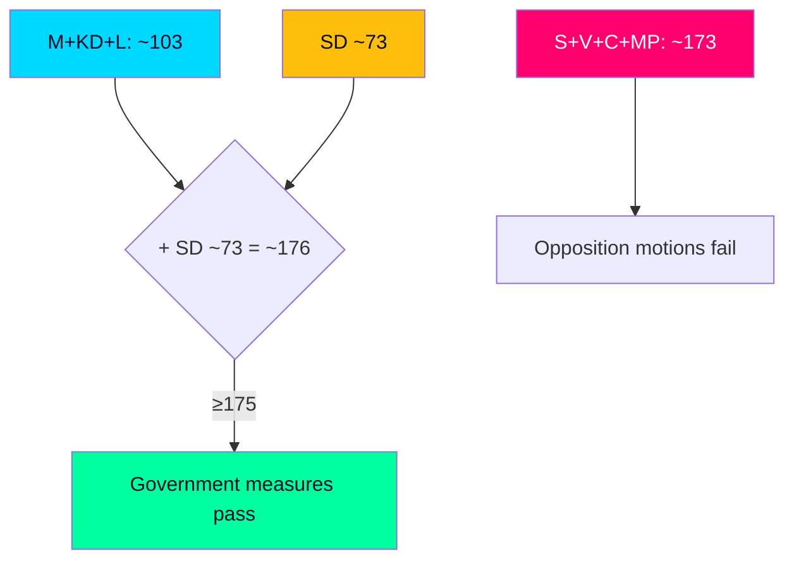

# Coalition Mathematics — June Vote Arithmetic

> **Pass-2 refinement:** Recast the headline finding as *margin fragility, not margin change* — the bare ~176 majority has no cushion, making L the analytically pivotal variable.

Seat arithmetic for the closing session's contested votes. The Riksdag has 349 seats; a majority is 175. The government bloc (M+KD+L) governs with SD confidence-and-supply.

## Indicative seat distribution (2022 mandate basis)

| Party | Bloc | Seats (Mandat) | June role |
|-------|------|----------------|-----------|
| S | Opposition | 107 | Leads distributive motions (HD10524) |
| M | Government | 68 | Drives migration/crime agenda (HD01SfU35) |
| SD | Support | 73 | Provides majority on Tidö items |
| C | Opposition | 24 | Regional/equalisation angle (HD10526) |
| V | Opposition | 24 | Welfare mobilisation (HD10524) |
| KD | Government | 19 | Coalition partner |
| L | Government | 16 | Swing-brand risk (HD024194) |
| MP | Opposition | 18 | School/climate angle (HD01UbU24) |

## Vote outcome model

| Measure | Government+SD | Opposition | Outcome |
|---------|---------------|-----------|---------|
| HD01SfU35 (migration) | ~176 Ja | ~173 Nej | Passes |
| HD024194 (citizenship re-vote) | ~176 Ja | ~173 Nej | Passes (RO 9:15) |
| HD10524 (a-kassa motion) | ~176 Nej | ~173 Ja | Fails |
| HD10526 (equalisation motion) | ~176 Nej | ~173 Ja | Fails |
| HD01UU21 (Ukraine tribunal) | broad consensus | — | Passes (cross-bloc) |

## Sainte-Laguë coalition variants

Five governing-arithmetic scenarios under the modified Sainte-Laguë seat allocation that shapes 2026 outcomes:

1. **Current bloc (M+KD+L+SD ≈ 176):** bare majority — current basis; **very likely [horizon:month]** to hold through June.
2. **M+KD+SD without L (≈ 160):** below 175 — confirms L is pivotal to the bare majority.
3. **S+V+C+MP (≈ 173):** opposition unity still short of majority — explains predictable motion defeats.
4. **Grand-coalition fragment (S+M ≈ 175):** hypothetically decisive but politically excluded — relevant only to post-election scenarios.
5. **SD-leading variant (post-2026):** if SD gains shift the modified Sainte-Laguë allocation, intra-bloc leadership arithmetic changes — a T+105d question, not a June one.

## Margin sensitivity

The bare ~176 majority means **defections of 2+ government/SD members flip a vote**. This is why L brand-strain (HD024194) is the analytically pivotal variable: the arithmetic has no cushion.

## Judgment

Government measures **very likely [horizon:month]** pass and opposition motions **very likely [horizon:month]** fail on a stable but cushionless majority. The arithmetic story of June is margin fragility, not margin change.
