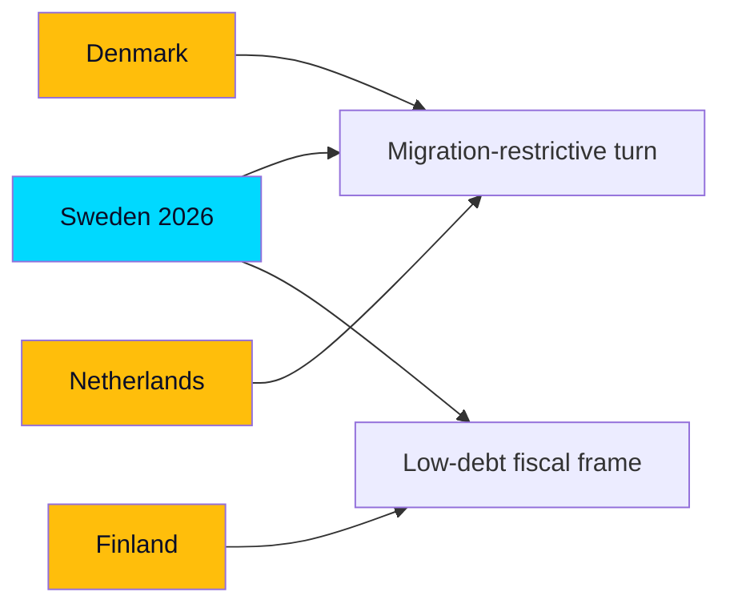

# Comparative International Analysis

> **Pass-2 refinement:** Sharpened the verdict that 2026 is a *regionally typical late-incumbency pattern* executed through distinctively Swedish institutions (RO 9:15, cost-equalisation), separating the shared from the unique.

Situating Sweden's June 2026 pre-election dynamics against comparable democracies, to calibrate what is distinctively Swedish and what is a general incumbency pattern.

Comparator set: Denmark, Norway, Finland, Germany, Netherlands — Nordic/NW-European parliamentary systems with migration-salient politics and recent or upcoming elections.

## Comparator table

| Country | Comparable dynamic | Relevance to Sweden | Source anchor |
|---------|--------------------|--------------------|---------------|
| Denmark | Social-democratic adoption of restrictive migration | Shows migration-restrictive consensus can cross blocs | HD01SfU35 |
| Norway | Energy-ownership politics (state utilities) | Parallels Vattenfall-steering contest | HD10522 |
| Finland | Low-debt fiscal orthodoxy, austerity debates | Mirrors Sweden's fiscal-strength frame (IMF WEO Apr-2026 vintage; FIN/SWE debt T+1) | HD03130 |
| Germany | Coalition-management strain under migration pressure | Echoes M+KD+L–SD balancing | HD024194 |
| Netherlands | Mainstreaming of right-populist agenda | Parallels SD's policy influence via confidence-and-supply | HD01SfU35 |

## Cross-national patterns

1. **Migration convergence:** Like Denmark and the Netherlands, Sweden shows restrictive migration policy becoming a cross-bloc baseline rather than a right-only position — the reception reform (HD01SfU35) extends this trajectory (worldbank.org governance context aside, the politics are regionally shared).
2. **Fiscal differentiation:** Sweden's debt near 33–34% of GDP keeps it in the low-debt Nordic cluster with Denmark, distinct from Germany's higher ratio (IMF WEO Apr-2026 vintage; SWE GGXWDG_NGDP T+1). This underwrites the incumbents' credibility claim (HD03130).
3. **Support-party governance:** The SD confidence-and-supply model parallels Danish and Dutch experiences of right-populist influence without full cabinet entry — a stability/accountability trade-off visible in HD024194.

## Distinctively Swedish features

- The **RO 9:15 minority re-vote** mechanism (HD024194) is a specifically Swedish constitutional feature with no direct comparator analogue.
- The **municipal cost-equalisation** redistribution debate (HD10526) is unusually central to Swedish welfare politics relative to peers.

## Judgment

Sweden's month-ahead is a **regionally typical late-incumbency pattern** — migration-restrictive consolidation plus fiscal-strength messaging — executed through distinctively Swedish institutional channels. Comparators suggest the migration-ownership strategy is electorally robust but carries the coalition-management costs seen in Germany and the Netherlands.
