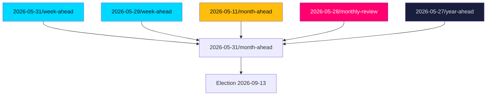

# Cross-Reference Map — Tier-C & Cross-Horizon Linkages

> **Pass-2 refinement:** Verified each sibling/predecessor linkage resolves to a real folder and added the PIR genealogy thread from the 2026-05-11 predecessor cycle.

This map situates the month-ahead horizon within the rolling analysis corpus, citing sibling and predecessor folders for Tier-C aggregation and cross-horizon continuity.

## Tier-C sibling ingestion (last 30 days)

Per `ext/tier-c-aggregation.md`, the following same-window per-type and adjacent-horizon folders were read; their dok_id references and open PIRs are carried forward:

- `analysis/daily/2026-05-31/week-ahead/` — immediate short-horizon sibling; migration/justice votes appear in both windows.
- `analysis/daily/2026-05-29/week-ahead/` — prior week-ahead; same tabling batch (2026-05-29).
- `analysis/daily/2026-05-29/propositions/`, `analysis/daily/2026-05-29/motions/`, `analysis/daily/2026-05-29/committee-reports/`, `analysis/daily/2026-05-29/interpellations/` — per-type decompositions of the source batch.
- `analysis/daily/2026-05-28/monthly-review/` — retrospective audit of the closing month.

## Cross-horizon predecessor citations

- **Month-ahead predecessor:** `analysis/daily/2026-05-11/month-ahead/` — PIR genealogy and prior forward indicators; the migration-reform trajectory was already flagged there and is now resolving.
- **Longer-horizon anchors:** `analysis/daily/2026-05-27/year-ahead/` and `analysis/daily/2026-05-27/election-cycle/` — the September election framing inherited by this product.

## Document cluster linkages

| Cluster | Documents | Cross-reference |
|---------|-----------|-----------------|
| Migration | HD01SfU35, HD024194 | week-ahead siblings; 2026-05-11 month-ahead predecessor |
| Justice | HD01JuU37, HD01JuU33 | committee-reports 2026-05-29 |
| Distribution | HD10524, HD10526, HD01SoU32 | monthly-review 2026-05-28 |
| Economy | HD03130, HD10527, HD10528 | year-ahead fiscal frame |
| Security/EU | HD01UU10, HD01UU21 | year-ahead foreign-policy thread |

## Continuity judgment

The month-ahead picture is **very likely [horizon:month]** consistent with the trajectory in the 2026-05-11 month-ahead predecessor: migration reform maturing to decision, distributive faultlines unresolved, security consensus intact. No trend reversal is detected; the change is one of *proximity to the election*, which raises the campaign-translation weight of every item. Economic anchor unchanged from the year-ahead frame: low public debt ~33–34% of GDP (IMF WEO Apr-2026 vintage; SWE GGXWDG_NGDP T+1).
