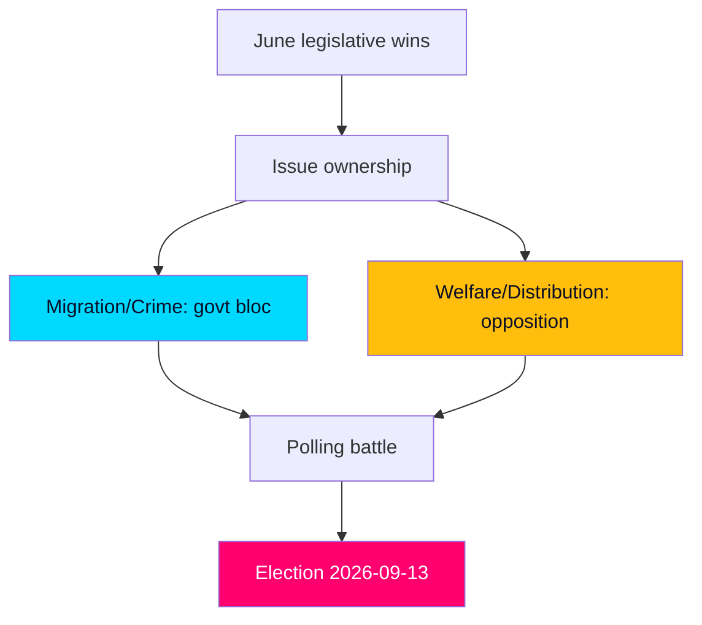

# Election 2026 Analysis — The September Frame

> **Pass-2 refinement:** Reframed the contest as two competing issue axes (order vs. welfare) that June legislation sharpens without resolving — clearer than Pass 1's single-bloc-advantage framing.

How the June horizon feeds the 2026-09-13 general election (T+105d). The closing session is the last legislative input before the campaign proper.

## The two-axis contest

The 2026 election is shaping as a contest between two issue axes, and June's legislation reinforces both:

- **Security/order axis (favours government bloc):** migration reception reform (HD01SfU35), citizenship rules (HD024194), young-offender powers (HD01JuU37). The government enters the campaign with fresh deliverables here.
- **Welfare/distribution axis (favours opposition):** a-kassa (HD10524), equalisation (HD10526), care resourcing (HD01SoU32). The opposition enters with live grievances and the government on the defensive.

## Bloc standing entering the campaign

| Bloc | Parties | June asset | June liability |
|------|---------|-----------|----------------|
| Government | M, KD, L (+SD support) | Migration/crime wins (HD01SfU35, HD01JuU37) | Welfare-resourcing defensiveness (HD01SoU32) |
| Opposition | S, V, MP, C | Distributive mobilisation (HD10524, HD10526) | Security-credibility gap (HD01JuU37) |

## Economic frame

The incumbents' strongest structural asset is fiscal credibility: public debt near 33–34% of GDP (IMF WEO Apr-2026 vintage; SWE GGXWDG_NGDP T+1) and steady growth around 2.1% T+1, reinforced by the AP-fund accounting (HD03130). The opposition counters on cost-of-living and welfare adequacy rather than on macro-fiscal grounds.

## Pivotal dynamics

1. **SD's ceiling vs. M's leadership:** the migration-ownership strategy depends on SD turnout without L collapse (HD024194).
2. **S's security neutralisation:** selective S support for crime measures (HD01JuU37) aims to close the order-axis gap.
3. **Turnout of distributive grievance:** whether equalisation/a-kassa themes (HD10526, HD10524) mobilise net-recipient regions.

## Judgment

Entering the campaign, the contest is **roughly even [horizon:month]** on aggregate bloc standing, with the government holding the order axis and the opposition the welfare axis. June legislation **very likely [horizon:month]** sharpens both axes without resolving the balance — consistent with a close September result.
