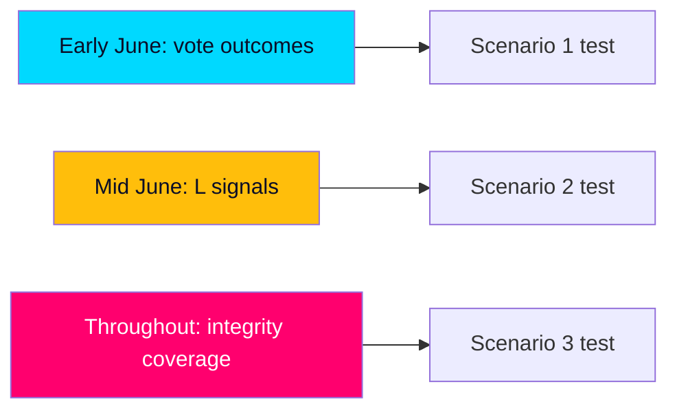

# Forward Indicators — June 2026 Watch List

> **Pass-2 refinement:** Re-anchored the watch list to the three-scenario trigger logic so each indicator is explicitly falsifiable and scenario-linked, not a generic calendar.

Dated, falsifiable indicators to track between now and recess, calibrated to distinguish the three scenarios in [`scenario-analysis.md`](scenario-analysis.md). Each carries a horizon tag and a scenario linkage.

## Dated indicator table

| # | Date | Indicator | Scenario | Horizon |
|---|------|-----------|----------|---------|
| 1 | 2026-06-04 | HD01SfU35 reception-reform vote outcome | S1 | [horizon:month] |
| 2 | 2026-06-05 | HD024194 citizenship re-vote cohesion (RO 9:15) | S1/S2 | [horizon:month] |
| 3 | 2026-06-09 | HD01JuU37 young-offender measure outcome | S1 | [horizon:month] |
| 4 | 2026-06-10 | L public reservations on any migration vote | S2 | [horizon:month] |
| 5 | 2026-06-11 | HD10524 a-kassa motion defeat + opposition framing | S1 | [horizon:month] |
| 6 | 2026-06-12 | HD10526 equalisation motion defeat + regional pickup | S1 | [horizon:month] |
| 7 | 2026-06-15 | HD10529 jäv motion media amplification | S3 | [horizon:month] |
| 8 | 2026-06-17 | HD01UU21 Ukraine tribunal cross-bloc consensus | S1 | [horizon:month] |
| 9 | +14d | Polling shift on migration issue-ownership | S1 | [horizon:month] |
| 10 | +21d | Polling shift on welfare/cost-of-living salience | S1 | [horizon:month] |
| 11 | 2026-06-20 | Recess date confirmed; final order paper | all | [horizon:month] |
| 12 | +30d | Trust/integrity metric movement post-jäv coverage | S3 | [horizon:month] |
| 13 | 2026Q3 | Campaign launch issue-framing (order vs. welfare) | all | [horizon:quarter] |

## Trigger logic

- **Scenario 1 confirmed** if indicators 1–3 pass on majority with cohesion and 4 stays quiet.
- **Scenario 2 activated** if indicator 4 fires (visible L differentiation) — escalate coalition-cohesion PIR-2.
- **Scenario 3 activated** if indicators 7 and 12 both move — escalate integrity PIR-4.

## Economic watch

- **IMF re-fetch recovery:** confirm live WEO/FM access restored and re-stamp debt/growth at next vintage (currently cached WEO Apr-2026; SWE GGXWDG_NGDP T+1).

## Judgment

The first three sitting-week votes (indicators 1–3, early June) **very likely [horizon:month]** confirm Scenario 1; the live uncertainty concentrates in indicators 4, 7, and 12 — the coalition-cohesion and integrity channels that would push toward Scenarios 2 or 3.
