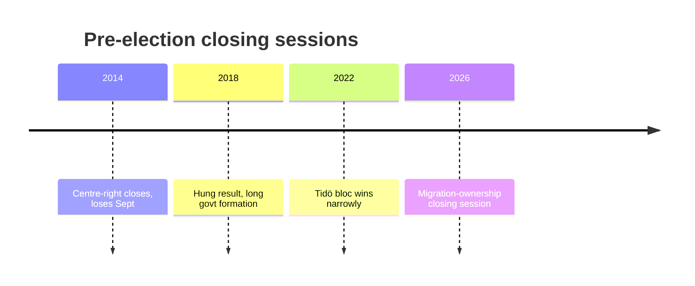
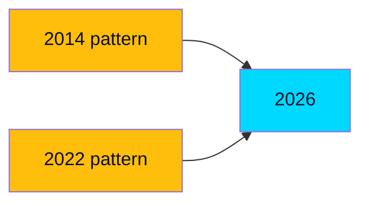

# Historical Parallels

> **Pass-2 refinement:** Surfaced the split signal between the 2014 (welfare critique topples incumbents) and 2022 (bare majority governs) parallels as the empirical basis for the close-race judgment.

Comparing June 2026's pre-election closing session with prior Swedish pre-election spring sessions to calibrate expectations.

## Parallel cases

| Year | Pre-election dynamic | Outcome | Lesson for 2026 |
|------|---------------------|---------|-----------------|
| 2014 | Centre-right incumbents, welfare critique | Incumbents lost | Legislative wins ≠ electoral wins (HD10524) |
| 2018 | Migration-dominant, fragmented result | 4-month govt formation | Migration salience can fragment, not consolidate (HD01SfU35) |
| 2022 | Right bloc + SD narrow win | Tidö government | Bare-majority arithmetic can govern (HD024194) |

## The 2014 cautionary parallel

In 2014 a centre-right government entered the campaign with a record to defend and lost to a welfare-resourcing critique — structurally similar to the opposition's 2026 a-kassa/equalisation play (HD10524, HD10526). The lesson: a strong legislative scoreboard does not insulate incumbents from a distributive counter-narrative. This is the empirical basis for holding KJ-3 at MEDIUM confidence.

## The 2022 enabling parallel

2022 demonstrated that a bare right+SD majority can both win and govern — the precedent the government is running back. The difference in 2026 is incumbency: the bloc now defends a record (HD01SfU35, HD03130) rather than attacking one.

## Divergence from all priors

No prior Swedish pre-election session combined (a) an institutionalised SD support relationship, (b) a migration-restrictive cross-bloc baseline, and (c) a low-debt fiscal frame (IMF WEO Apr-2026 vintage; SWE GGXWDG_NGDP T+1) simultaneously. 2026 is **genuinely novel** on coalition structure even where individual elements echo the past.

## Judgment

History offers a **split signal**: 2022 says the arithmetic can win; 2014 says the welfare critique can still topple incumbents. The unresolved tension between these parallels is exactly the close-race judgment carried through this product.
