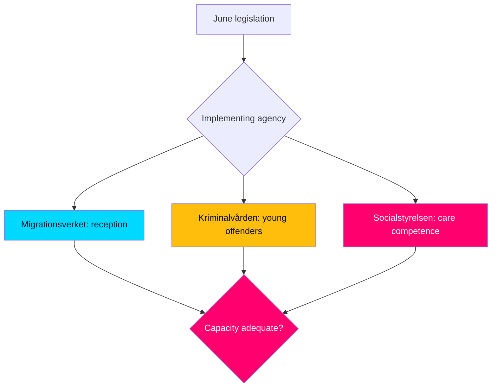

# Implementation Feasibility

> **Pass-2 refinement:** Drew out the decoupling of political passage from administrative delivery as itself campaign-relevant — credit claimed for legislation whose delivery remains unproven (HD01JuU37, HD01SfU35).

Assessing whether the June measures, if passed, are administratively deliverable — distinct from their political passage.

## Agency delivery map

| Measure | Lead agency | Feasibility | Constraint |
|---------|-------------|-------------|------------|
| Reception reform (HD01SfU35) | Migrationsverket | Medium | Process redesign, lead time |
| Young-offender powers (HD01JuU37) | Kriminalvården | Medium-low | Capacity/places pressure |
| Care medical competence (HD01SoU32) | Socialstyrelsen | Medium | Workforce supply |
| School support (HD01UbU24) | Skolverket-adjacent | Medium | Municipal variation |

## Capacity assessment

- **Migrationsverket (HD01SfU35):** a reception-system redesign is feasible but not instantaneous; implementation lag means the political "win" precedes any administrative reality well past the September election.
- **Kriminalvården (HD01JuU37):** expanded young-offender measures intersect with known capacity pressure; feasibility is the weakest of the set, with a real risk of implementation backlog.
- **Socialstyrelsen (HD01SoU32):** medical-competence requirements in municipal care depend on workforce supply that legislation cannot create on the horizon.

## Statskontoret relevance

| **Statskontoret relevance** | Statskontoret (statskontoret.se) is the natural evaluator for whether these reforms — especially Kriminalvården capacity (HD01JuU37) and Migrationsverket reception redesign (HD01SfU35) — are administratively realised as intended; a post-implementation review would be the standard accountability mechanism. |

## Judgment

Political passage and administrative delivery are **decoupled on this horizon**: every flagship measure is **very likely** to pass but **unlikely** to be administratively realised before the September election. This decoupling is itself campaign-relevant — the government claims credit for legislation whose delivery remains unproven (HD01JuU37, HD01SfU35).
