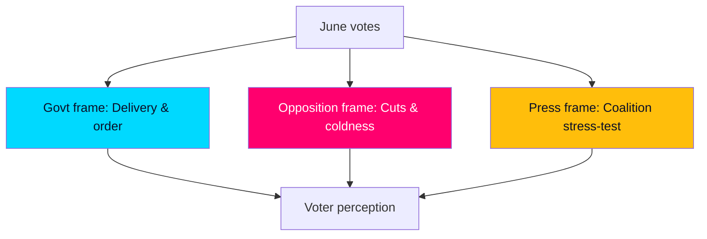

# Media Framing Analysis

> **Pass-2 refinement:** Identified process/integrity coverage (HD024194, HD10529) as the decisive framing wildcard — the specific channel by which Scenario 3 would materialise.

How June's agenda is likely to be framed across Swedish media ecosystems, and how framing shapes the campaign read.

## Competing frames

| Frame | Carrier | Anchor documents | Resonance |
|-------|---------|------------------|-----------|
| "Delivery & order" | Government | HD01SfU35, HD01JuU37 | Strong on security segment |
| "Cuts & coldness" | Opposition | HD10524, HD10526, HD01SoU32 | Strong on welfare segment |
| "Coalition stress-test" | Press/analysts | HD024194 | Drives process coverage |
| "Integrity question" | Investigative press | HD10529, HD01SoU28 | Latent, episodic |

## Framing dynamics

1. **Government framing advantage on migration:** the reception reform (HD01SfU35) is pre-framed as "delivery," and the press cycle around a concrete law favours the actor who passed it.
2. **Opposition framing advantage on welfare:** a-kassa and equalisation defeats (HD10524, HD10526) let the opposition frame the government as choosing not to act — a moral, not procedural, frame.
3. **Process framing risk:** the RO 9:15 re-vote (HD024194) invites "coalition cracks" coverage regardless of the substantive outcome, an asymmetric reputational risk for the government.

## Amplification vectors

- **Integrity items** (HD10529 jäv, HD01SoU28 IVO/Riksrevisionen) are low-baseline but high-amplification: a single investigative story can elevate them, per Scenario 3.
- **Regional media** will localise equalisation and infrastructure (HD10526, HD10530), fragmenting the national frame.

## Judgment

Media framing **very likely [horizon:month]** splits cleanly along the two-axis contest, with the government owning the order frame and the opposition the welfare frame. The **decisive framing wildcard** is whether process/integrity coverage (HD024194, HD10529) breaks through — that is the channel by which Scenario 3 would materialise.
