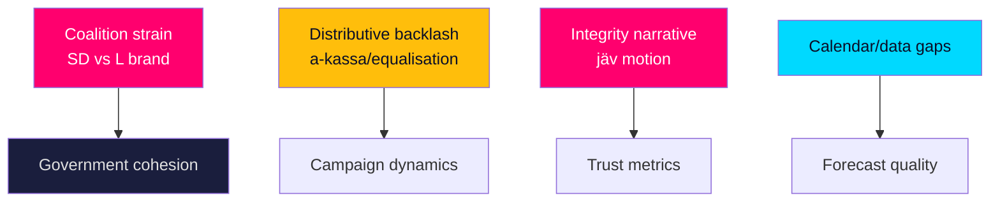

# Risk Assessment — Month-Ahead Political & Institutional Risks

> **Pass-2 refinement:** Elevated the integrity/trust-shock risk (HD10529) from peripheral to a named Scenario-3 driver, reflecting its low-baseline/high-amplification profile.

Risks are scored on likelihood × impact across the 30-day horizon, with WEP terms carrying explicit horizon tags and IMF citations stamped with projection years.

## Risk register

| ID | Risk | Likelihood | Impact | Evidence |
|----|------|-----------|--------|----------|
| R1 | SD migration wins strain L's liberal brand, surfacing intra-bloc friction | Medium | High | HD01SfU35, HD024194 |
| R2 | Opposition converts a-kassa/equalisation defeats into mobilisation momentum | High | Medium | HD10524, HD10526 |
| R3 | Share-dealing/jäv scrutiny moves incumbent trust metrics | Medium | High | HD10529 |
| R4 | Calendar feed outage degrades date-precision of forward indicators | High | Low | data/runtime/calendar-status.json |
| R5 | Energy/industrial grievances erode heartland support | Medium | Medium | HD10522, HD10523 |
| R6 | IMF live re-fetch degraded forces reliance on cached vintage | High | Low | data/imf-context.json |

## Narrative

**R1 — Coalition strain (likelihood Medium, impact High).** Banking the reception reform (HD01SfU35) is a near-certain win but it is *very likely [horizon:month]* to deepen the visible asymmetry where SD harvests migration credit while L absorbs liberal-base discomfort. This is the single most consequential intra-bloc risk into September.

**R2 — Distributive backlash (likelihood High, impact Medium).** Rejecting a-kassa (HD10524) and equalisation (HD10526) along bloc lines is *likely [horizon:month]* and hands the opposition ready-made grievance material. Impact is bounded by the government's fiscal-strength counter — debt near 33–34% of GDP (IMF WEO Apr-2026 vintage; SWE GGXWDG_NGDP T+1).

**R3 — Integrity narrative (likelihood Medium, impact High).** The jäv motion (HD10529) is *roughly even [horizon:month]* to gain media traction; trust shocks can move numbers independently of policy and are hard to reverse before the campaign.

**R4/R6 — Analytical risks (Low impact).** The calendar outage and degraded IMF live fetch are flagged limitations (see manifest); both are mitigated by lookback data and cached vintages, and neither alters the central judgments.

## Residual risk posture

Net horizon risk to the government is **moderate**: the legislative outcomes are predictable, but the campaign-translation risks (R1–R3) are where volatility concentrates. Mitigation for the analysis itself (R4/R6) is documented and does not compromise confidence in the core arcs.
