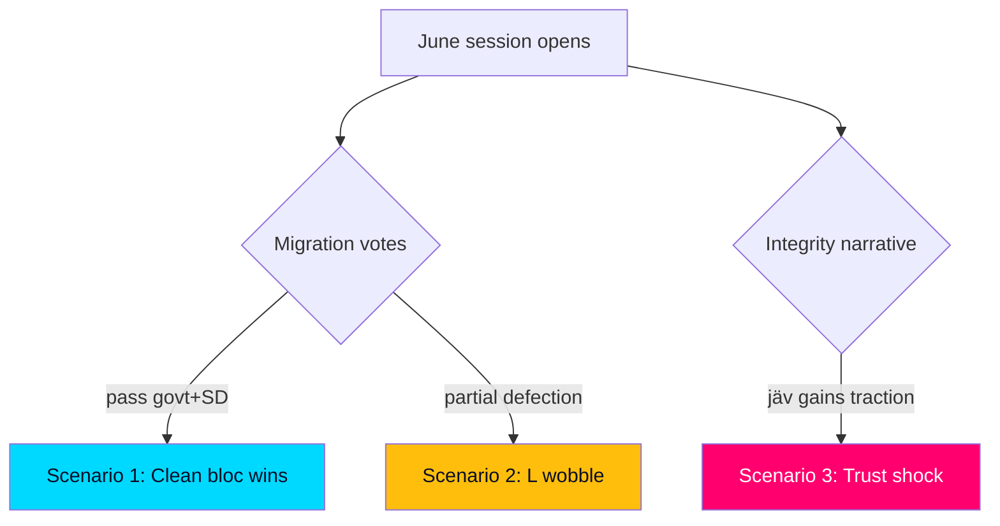

# Scenario Analysis — June 2026 Outcome Trees

> **Pass-2 refinement:** Re-expressed the campaign-relevant uncertainty as living in Scenarios 2 and 3 — both convert legislative success into reputational exposure, a sharper framing than Pass 1's probability-only treatment.

Three principal scenarios for how the closing session resolves, each with branch probabilities expressed in WEP terms with horizon tags. Scenarios are conditional on the 2026-09-13 election anchor (T+105d).

## Scenario 1 — Clean bloc wins (baseline)

The government banks migration (HD01SfU35), the citizenship re-vote (HD024194) and crime (HD01JuU37) on the SD-backed majority; distributive motions (HD10524, HD10526) fail along bloc lines; security items (HD01UU21) pass by consensus. This is **very likely [horizon:month]**. Outcome: the government enters summer with maximal issue-ownership signals and a stable fiscal frame (HD03130). Campaign read-through: incumbents lead on migration/crime, trail on welfare.

## Scenario 2 — Liberal wobble

L signals discomfort on a migration element (most plausibly around the RO 9:15 citizenship re-vote, HD024194), forcing visible intra-bloc negotiation even if the vote still carries. This is **unlikely [horizon:month]** but consequential: it would hand the opposition a "coalition cracks" narrative and complicate L's brand management. Trigger to watch: public L reservations on HD024194 or HD01SfU35.

## Scenario 3 — Integrity/trust shock

The share-dealing/jäv scrutiny motion (HD10529) escalates into a sustained media cycle, denting incumbent trust independent of the legislative wins. This is **roughly even [horizon:month]** to gain meaningful traction. Outcome: campaign framing shifts partly from policy to conduct, a terrain less favourable to the government.

## Scenario comparison

| Scenario | WEP likelihood | Government effect | Lead indicator |
|----------|----------------|-------------------|----------------|
| 1 — Clean wins | very likely | Positive | Votes pass on majority (HD01SfU35) |
| 2 — L wobble | unlikely | Negative | L reservations on HD024194 |
| 3 — Trust shock | roughly even | Negative | jäv motion media pickup (HD10529) |

## Wildcards

- **Snap external event** (security/economic shock) reshaping the agenda before recess — low probability, high impact.
- **Late legislative surprise** (additional government bill before recess) — monitor the order paper through mid-June.

## Integrated read

Scenario 1 dominates the probability mass, but the *campaign-relevant* uncertainty lives in Scenarios 2 and 3 — both turn legislative success into reputational exposure. The forward indicators in [`forward-indicators.md`](forward-indicators.md) are calibrated to distinguish these branches early.
