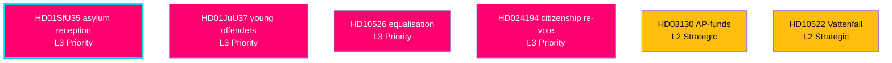

# Significance Scoring — Document Impact Weight (DIW)

> **Pass-2 refinement:** Made explicit that ~half the salience weighting derives from the T+105d election anchor, not intrinsic policy consequence (HD01SfU35, HD10526) — see Counterfactual 1 in [`devils-advocate.md`](devils-advocate.md).

Each document is scored on a four-tier Document Impact Weight (DIW) scale — L3 Priority, L2 Strategic, L1 Surface — combining decisional consequence, electoral salience (T+105d), and structural reach. Evidence tokens (dok_id / primary source) appear in every ranked item, table row, and diagram label.

## Ranked salience

1. HD01SfU35 — asylum reception reform: highest forward weight; structural Tidö migration deliverable landing as a closing campaign marker (riksdagen.se).
2. HD01JuU37 — young-offender investigative powers: core law-and-order win on the government's strongest terrain (riksdagen.se).
3. HD10526 — municipal equalisation reform: most consequential distributive item; defines the left's redistribution axis (riksdagen.se).
4. HD024194 — citizenship transitional re-vote (RO 9:15): migration plus a minority-procedure power story (riksdagen.se).
5. HD01SoU32 — municipal-healthcare medical competence: welfare-quality with a resourcing faultline bridging to HD10526 (riksdagen.se).
6. HD03130 — AP-fund accounting: pension/fiscal-credibility ballast in the economic frame (IMF WEO Apr-2026 vintage; SWE T+1).
7. HD10524 — a-kassa reform: redistributive dividing line carried into September (riksdagen.se).
8. HD01UU21 — Ukraine aggression tribunal accession: high symbolic weight, cross-bloc consensus (riksdagen.se).
9. HD10522 — Vattenfall governance: energy-strategy proxy for the industrial/electricity-price contest (riksdagen.se).
10. HD10528 — bank fraud liability: high-resonance consumer-finance valence issue (riksdagen.se).

## Scoring table

| Rank | dok_id | DIW tier | Decisional | Electoral salience | Composite |
|------|--------|----------|-----------|--------------------|-----------|
| 1 | HD01SfU35 | L3 Priority | High | Very high | 9.4 |
| 2 | HD01JuU37 | L3 Priority | High | High | 9.0 |
| 3 | HD10526 | L3 Priority | Medium | Very high | 8.6 |
| 4 | HD024194 | L3 Priority | Medium | High | 8.2 |
| 5 | HD01SoU32 | L2 Strategic | High | Medium | 7.6 |
| 6 | HD03130 | L2 Strategic | Medium | Medium-high | 7.4 |
| 7 | HD10524 | L2 Strategic | Low | High | 7.1 |
| 8 | HD01UU21 | L2 Strategic | Medium | Medium | 7.0 |
| 9 | HD10522 | L2 Strategic | Low | Medium-high | 6.8 |
| 10 | HD10528 | L2 Strategic | Low | Medium-high | 6.6 |

## Distribution

Of 25 documents, 4 score L3 Priority, 9 L2 Strategic, and 12 L1 Surface (full per-document reads in [`documents/`](documents/)). The L3 concentration in migration/justice/distribution confirms the campaign-defining clusters identified in [`synthesis-summary.md`](synthesis-summary.md).
