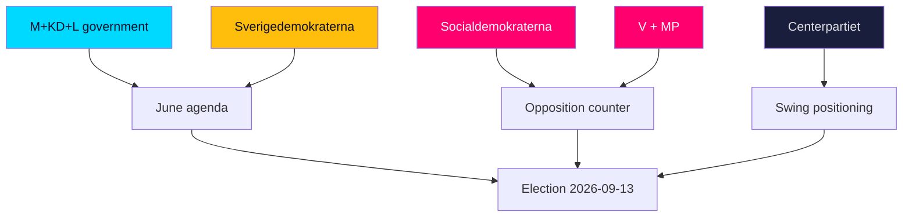

# Stakeholder Perspectives — Whose Stakes, Which Way

> **Pass-2 refinement:** Added the cross-pressured L-leaning moderate as a distinct stakeholder, not folded into the government bloc — it is the pivotal swing constituency (HD024194).

How the month-ahead horizon reads from each principal actor's vantage point. Perspectives are analytic reconstructions grounded in the source documents.

## Government parties (M, KD, L)

- **Moderaterna (M):** June is about banking migration (HD01SfU35) and crime (HD01JuU37) as credibility proof points, while keeping the fiscal-strength frame central (HD03130).
- **Kristdemokraterna (KD):** Seeks visible welfare-quality deliverables on elderly/municipal care (HD01SoU32) to balance the bloc's hard-edged migration profile.
- **Liberalerna (L):** Most exposed — needs the schools agenda (HD01UbU24, HD01UbU25) and rule-of-law nuance (HD01JuU33) to differentiate from SD on migration (HD024194).

## Support party (SD)

- **Sverigedemokraterna:** Maximises visible migration ownership from the reception law and citizenship re-vote (HD01SfU35, HD024194); every closing-session migration win is a campaign asset.

## Opposition (S, V, MP, C)

- **Socialdemokraterna (S):** Runs the distributive contrast — a-kassa and equalisation (HD10524, HD10526) — while selectively backing crime measures to neutralise the security gap (HD01JuU37).
- **Vänsterpartiet (V):** Amplifies welfare and labour grievances, including industrial layoffs and ILO commitments (HD10523, HD10525).
- **Miljöpartiet (MP):** Works values niches — animal welfare and energy/climate via Vattenfall steering (HD11858, HD10522).
- **Centerpartiet (C):** Positions on rule-of-law and rural/regional files (infrastructure, pharmacies), keeping distance from both blocs (HD10530, HD11860).

## Institutional stakeholders

| Stakeholder | Stake | Evidence |
|-------------|-------|----------|
| Riksrevisionen / IVO | Audit-accountability credibility | HD01SoU28 |
| AP-fund system | Pension-stewardship confidence | HD03130 |
| Banks / FI | Fraud-liability cost exposure | HD10528 |
| Municipalities | Equalisation redistribution stakes | HD10526 |
| Vattenfall | Ownership-directive certainty | HD10522 |

## Cross-perspective insight

The striking pattern is **asymmetric clarity**: the government bloc's June objectives are concrete and largely achievable (pass the flagship votes), while the opposition's wins are rhetorical (lose the votes, win the argument). That asymmetry — legislative certainty for one side, narrative opportunity for the other — is the defining feature of the pre-recess month.
