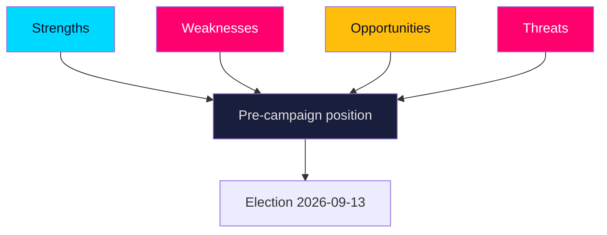

# SWOT Analysis — Governing Bloc Position Entering the June Session

> **Pass-2 refinement:** Re-classified the bare ~176 majority from a Strength to a Weakness/Threat boundary item — Pass 1 over-rated it; the cushionless arithmetic (HD024194) is a fragility, not an asset.

Strategic position of the M+KD+L government (SD-backed) across the month-ahead horizon. Every bullet and table row is evidence-linked to a source document or primary source.

### Strengths

- Issue ownership on migration is reinforced by landing the reception reform as a closing deliverable (HD01SfU35).
- Law-and-order credibility is consolidated by expanded powers against young offenders, partly cross-bloc (HD01JuU37).
- Fiscal-strength narrative anchored in low public debt near 33–34% of GDP (IMF WEO Apr-2026 vintage, T+1) and AP-fund stewardship (HD03130).
- A working SD-backed majority delivers predictable passage of flagship votes through June (HD01SfU35).
- Positive-agenda diversification available via consensual schools and care files (HD01UbU24, HD01UbU25, HD01SoU32).

### Weaknesses

- Reliance on SD for migration wins exposes L's liberal brand to reputational strain (HD024194).
- The distributive agenda is conceded to the opposition on a-kassa and equalisation (HD10524, HD10526).
- Integrity exposure from the share-dealing/jäv scrutiny motion could move trust metrics (HD10529).
- Welfare-resourcing disputes leave the government defensive on care funding (HD01SoU32).
- Energy-strategy contestation via Vattenfall steering keeps electricity-price politics live (HD10522).

### Opportunities

- Convert June migration/crime votes into clean September issue-ownership signals (HD01SfU35, HD01JuU37).
- Claim cross-bloc security credibility on the Ukraine tribunal accession (HD01UU21).
- Use bank-fraud protection to capture anti-scam valence sentiment (HD10527, HD10528).
- Frame fiscal strength against opposition spending proposals (HD03130, regeringen.se).
- Broaden the agenda with teacher-workload and school-support wins (HD01UbU25, HD01UbU24).

### Threats

- Opposition mobilisation on redistribution (a-kassa, equalisation) energises the left base (HD10524, HD10526).
- Minority procedural activism (RO 9:15 re-vote) signals chamber fragility (HD024194).
- Regional-jobs and industrial grievances erode support in heartland seats (HD10523, HD10522).
- Trust/integrity narratives can independently depress incumbent numbers (HD10529).
- Welfare-access anxieties (pharmacies, care) cut against the government in rural/elderly segments (HD11860, HD01SoU32).

## SWOT cross-impact

| Factor | Interacts with | Net effect | Evidence |
|--------|----------------|-----------|----------|
| Migration ownership | SD dependence | Strength offset by L-brand risk | HD01SfU35, HD024194 |
| Fiscal strength | Distributive attacks | Stabilises economic frame | HD03130, HD10524 |
| Crime wins | Rule-of-law critique | Net positive, contested margins | HD01JuU37, HD01JuU33 |
| Security consensus | Domestic division | Neutral/positive | HD01UU21, HD01UU10 |
| Integrity motion | Trust metrics | Latent downside | HD10529, riksdagen.se |

The balance is **favourable but not decisive**: the government enters June able to bank wins, but the open distributive front and intra-coalition strain are the levers the opposition will work to September.
