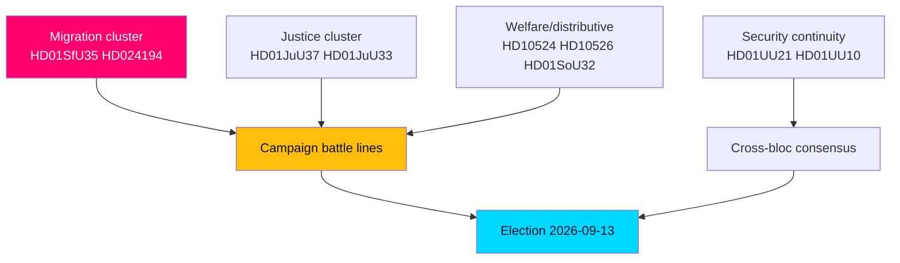

# Synthesis Summary — Month Ahead (2026-05-31 → 2026-06-30)

> **Pass-2 refinement:** Re-weighted the four arcs so the distributive-faultline arc (HD10524, HD10526) is given equal billing to migration — Pass 1 under-played the welfare axis that the opposition will actually run on.

The final pre-recess sitting weeks of riksmöte 2025/26 resolve into four interlocking story arcs, each scored for its forward weight toward the 2026-09-13 election (T+105d).

## Arc 1 — Migration as the closing marker (highest weight)

The new reception law (HD01SfU35) and the RO 9:15 citizenship re-vote (HD024194) make migration the dominant legislative theme of the closing session. Passage on the government+SD majority is **very likely [horizon:month]**. The strategic function is electoral: a structural Tidö deliverable landed precisely when its campaign signalling value peaks. The re-vote mechanism in HD024194 also surfaces a secondary story — minority procedural activism in a near-evenly divided chamber.

## Arc 2 — Law-and-order issue ownership

Expanded investigative powers against young offenders (HD01JuU37) and EU e-evidence alignment (HD01JuU33) reinforce the government's strongest issue terrain. HD01JuU37 may attract partial S support, making crime a partly consensual but government-owned theme. Passage is **very likely [horizon:month]**.

## Arc 3 — The distributive counter-offensive

The opposition's leverage lies in motions it will lose but campaign on: a-kassa reform (HD10524), municipal equalisation (HD10526), and the welfare-quality resourcing dispute embedded in municipal-healthcare competence (HD01SoU32). These define the redistribution-vs-incentives axis the left runs on. Rejection along bloc lines is **likely [horizon:month]**, converting legislative defeat into mobilisation material.

## Arc 4 — Security continuity as the quiet consensus

Accession to the Ukraine aggression tribunal (HD01UU21), the international compensation convention (HD01UU20), and the annual EU-activity review (HD01UU10) pass with broad majorities. This arc matters precisely because it is uncontested: the campaign's divisions are domestic, not geopolitical.

## Economic substrate

Sweden's fiscal position anchors the incumbents' credibility claim: general government gross debt near 33–34% of GDP, among the EU's lowest (IMF WEO Apr-2026 vintage; SWE GGXWDG_NGDP ≈ 33–34% T+1), with real GDP growth around 2.1% T+1 (IMF WEO Apr-2026 vintage). The AP-fund accounting (HD03130) and the bank-fraud cluster (HD10527, HD10528) attach consumer-finance salience to that frame. SCB remains the Swedish-specific ground truth for monthly labour/budget execution where available.

## Integrated judgment

The month ahead is **very likely [horizon:month]** to end with the government bloc having banked migration and crime wins while leaving the distributive faultlines open — the cleanest possible pre-campaign positioning for both sides. The decisive uncertainty is intra-coalition: whether SD's visible migration wins strain L's liberal brand (see [`coalition-mathematics.md`](coalition-mathematics.md)).
