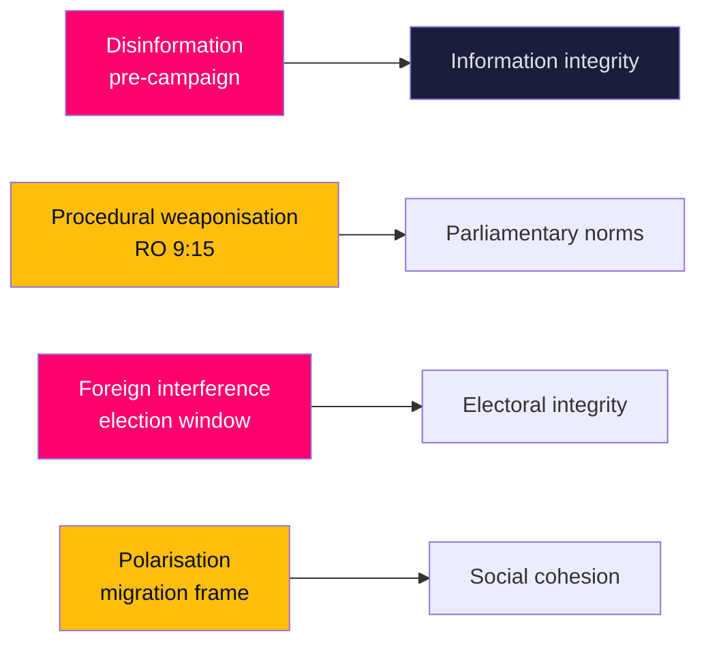

# Threat Analysis — Adversarial & Structural Pressures

> **Pass-2 refinement:** Separated genuinely adversarial threats from structural pressures so the assessment does not over-securitise ordinary partisan competition (HD10524, HD10526).

A STRIDE-adapted scan of threats to democratic-process integrity and to the stability of the forward picture. "Threat" here means structural pressures on institutions and on analytic reliability, not actor attribution.

## Threat register

| ID | Threat | Vector | Horizon exposure | Evidence |
|----|--------|--------|------------------|----------|
| T1 | Pre-campaign disinformation amplifying migration/crime frames | Social platforms | Rising toward T+105d | HD01SfU35, HD01JuU37 |
| T2 | Procedural weaponisation of minority mechanisms | RO 9:15 re-vote | Active in June | HD024194 |
| T3 | Foreign interference in the electoral window | Influence ops | Elevated to 2026-09-13 | HD01UU21, regeringen.se |
| T4 | Affective polarisation around migration/citizenship | Issue framing | Sustained | HD01SfU35, HD024194 |
| T5 | Financial-fraud ecosystem exploited as wedge | Scam narratives | Persistent | HD10527, HD10528 |

## Assessment

**T1 — Disinformation.** The migration and crime clusters (HD01SfU35, HD01JuU37) are the most likely vehicles for narrative manipulation as the campaign warms; the threat is to the information environment in which these wins are interpreted, not to the votes themselves.

**T2 — Procedural weaponisation.** The RO 9:15 citizenship re-vote (HD024194) is a legitimate minority tool, but its use is a marker for escalating procedural contestation that could be amplified into a "chamber dysfunction" narrative.

**T3 — Foreign interference.** Sweden's firm cross-bloc Ukraine/Russia line (HD01UU21) raises the baseline interest of hostile actors in the electoral window; coordination with MSB/security services is the standing mitigation (regeringen.se).

**T4/T5 — Polarisation and fraud wedges.** The migration frame (HD024194) and the fraud cluster (HD10527, HD10528) are both susceptible to emotive amplification that widens cleavages beyond their policy substance.

## Mitigation posture

Institutional safeguards (election authority oversight, MSB counter-influence work, cross-party Ukraine consensus) are intact. The dominant residual threat is informational — the contest over *how* June's outcomes are narrated into the campaign — rather than procedural or kinetic.
