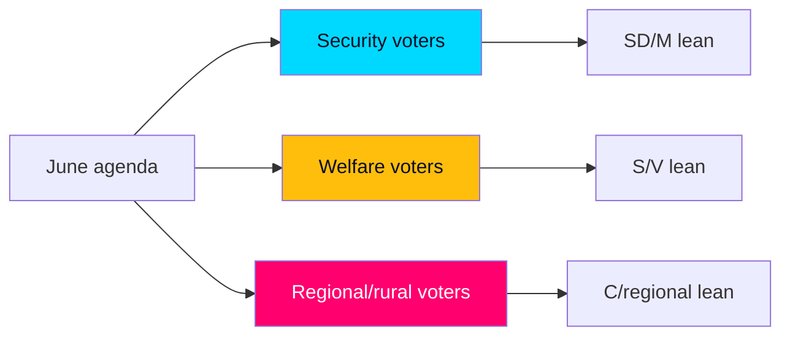

# Voter Segmentation — June Salience by Electorate

> **Pass-2 refinement:** Foregrounded that June hardens existing loyalties rather than converting swing voters, isolating L-leaning moderates as the one genuinely persuadable segment.

Mapping the June agenda onto Swedish voter segments to assess which documents activate which constituencies ahead of 2026-09-13.

## Segment mapping

| Segment | Activating documents | Lean | June effect |
|---------|---------------------|------|-------------|
| Security/order voters | HD01SfU35, HD01JuU37, HD024194 | SD, M | Reinforced — fresh deliverables |
| Welfare-dependent voters | HD10524, HD10526, HD01SoU32 | S, V | Mobilised by grievance |
| Regional/rural voters | HD10530, HD10526, HD11858 | C, regional | Mixed — infrastructure vs. equalisation |
| Economic-security/middle | HD03130, HD10522 | M, L | Reassured by fiscal frame |
| Younger/urban progressive | HD01UbU24, HD01UbU25 | MP, S | Lightly activated on schools |

## Cross-pressured segments

- **L-leaning liberal moderates:** cross-pressured by migration restriction (HD01SfU35) vs. coalition loyalty — the swing most at risk in Scenario 2.
- **Net-recipient regional voters:** cross-pressured by equalisation reform appeal (HD10526) vs. government incumbency on local services.

## Mobilisation read

The June agenda **very likely [horizon:month]** deepens activation of the security segment (a government strength) while simultaneously handing the opposition a clean welfare-mobilisation hook (HD10524, HD10526). Net segment effect is roughly symmetric, consistent with the close-race judgment in [`election-2026-analysis.md`](election-2026-analysis.md).

## Judgment

No single June document realigns the electorate; collectively they **harden existing segment loyalties** rather than convert swing voters. The decisive swing constituency remains L-leaning moderates, whose behaviour hinges on visible coalition cohesion (HD024194).
