## What Happened
<!-- source: executive-brief.md :: https://github.com/Hack23/riksdagsmonitor/blob/main/analysis/daily/2026-05-31/week-ahead/executive-brief.md -->

> Family C · Executive Brief · week-ahead lens · 2026-05-31 · Tier-C aggregation
> Classification: 🟢 Public · Source artifacts cited inline by `dok_id`

### Lede
The week ahead is Riksdagen's last concentrated voting block before summer recess and the final full sitting before the 2026-09-13 election, anchored by the Tidö reception law (`HD01SfU35`).
The agenda is dominated by the Tidö coalition's migration
flagship — **the new reception law** (`HD01SfU35`, *En ny mottagandelag*) — set
for a chamber decision alongside a contested **citizenship re-vote** invoked
under Riksdagsordningen 9:15 (`Riksdag document #024194 (HD024194)`). Education (`HD01UbU24`, `HD01UbU25`),
welfare-delivery (`HD01SoU32`, `HD01SoU28`) and justice/security
(`HD01JuU33`, `HD01JuU37`) committee reports cluster the same week, while a
dense band of interpellations (`HD10522`–`HD11860`) keeps energy, labour-market
and fraud-protection contests live. Expect the migration and citizenship votes
to function as campaign set-pieces: high message discipline from M-KD-L-SD,
sharp proportionality and rule-of-law reservations from S-V-MP-C.

### So What

These are not routine end-of-session votes. With the election inside the
six-month window, the DIW significance multiplier (×1.5) applies to migration,
criminal-justice and contested-policy items (`HD01SfU35`, `HD01JuU37`,
`HD024194`), elevating them from legislative housekeeping to campaign assets.
The reception law's **1 October 2026 entry into force** means the winning bloc
inherits implementation; the citizenship re-vote exposes the exact parliamentary
arithmetic the campaign will contest.

### Decisions This Brief Enables

- **Editorial prioritisation** — lead week-ahead coverage with `HD01SfU35` and
  `HD024194`; treat education and welfare reports as the secondary tier.
- **Monitoring focus** — set alerts on the chamber vote outcomes and reservation
  counts for the five contested items; track Migrationsverket implementation
  guidance toward the 1 Oct 2026 start.
- **Forecast calibration** — feed the citizenship re-vote split into
  coalition-mathematics.md and the T+90d election scenario tree.

### Significance snapshot

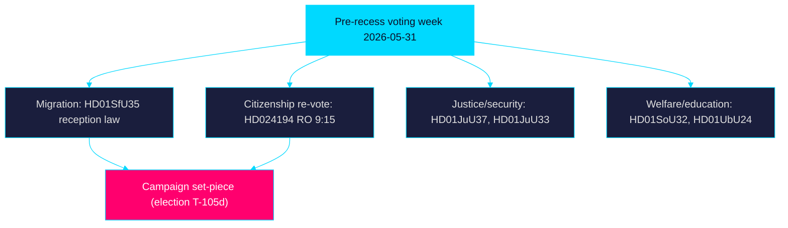

### Confidence

Assessment confidence: **HIGH** on agenda composition (sourced from 25
downloaded documents dated 2026-05-29); **MEDIUM** on exact vote outcomes and
reservation counts, which the week will resolve.

> **Pass-2 refinement:** Sharpened the "So What" link between the 2026-10-01
> entry-into-force date and post-election implementation ownership, making
> explicit that the reception law (`HD01SfU35`) transfers delivery risk across
> the election boundary regardless of which bloc wins.

## Reader Intelligence Guide

Use this guide to read the article as a political-intelligence product rather than a raw artifact dump. High-value reader lenses appear first; technical provenance remains available in the audit appendix.

| Icon | Reader need | What you'll get |
|---|---|---|
| 📊 | [Lede and editorial decisions](#rm-what-happened) | fast answer to what happened, why it matters, who is accountable, and the next dated trigger |
| 🧠 | [Why It Matters](#rm-why-it-matters) | evidence-anchored narrative consolidating primary sources into one coherent story line |
| 🎯 | [Key Judgments](#rm-key-findings) | confidence-bearing political-intelligence conclusions and collection gaps |
| 📈 | [Significance scoring](#rm-significance-scoring) | why this story outranks or trails other same-day parliamentary signals |
| 👥 | [Stakeholder Perspectives](#rm-stakeholder-perspectives) | winners, losers and undecided actors with stake-weighted positions and pressure points |
| 🔢 | [Coalition Mathematics](#rm-coalition-mathematics) | parliamentary arithmetic showing exactly who can pass or block this measure and at what margin |
| 📋 | [Voter Segmentation](#rm-voter-segmentation) | voter-bloc exposure: which demographics gain, lose or shift on this issue |
| 🔭 | [Forward indicators](#rm-forward-indicators) | dated watch items that let readers verify or falsify the assessment later |
| 🔮 | [Scenarios](#rm-scenario-analysis) | alternative outcomes with probabilities, triggers, and warning signs |
| 🗳️ | [Election 2026 Analysis](#rm-election-2026-analysis) | electoral implications for the 2026 cycle — seats at stake, swing voters and coalition viability |
| ⚠️ | [Risk assessment](#rm-risk-assessment) | policy, electoral, institutional, communications, and implementation risk register |
| 🧮 | [SWOT Analysis](#rm-swot-analysis) | strengths, weaknesses, opportunities and threats matrix grounded in primary-source evidence |
| 🛡️ | [Threat Analysis](#rm-threat-analysis) | actor capabilities, intent and threat vectors targeting institutional integrity |
| 📜 | [Historical Parallels](#rm-historical-parallels) | comparable past episodes from Swedish and international politics, with explicit lessons learned |
| 🌍 | [Comparative International](#rm-comparative-international) | peer-country comparisons (Nordic, EU, OECD) showing how similar measures fared elsewhere |
| ⚙️ | [Implementation Feasibility](#rm-implementation-feasibility) | delivery feasibility, capability gaps, timelines and execution risks for the proposed action |
| 📰 | [Media framing & influence operations](#rm-media-framing-analysis) | frame packages with Entman functions, cognitive-vulnerability map, DISARM manipulation indicators, narrative-laundering chain, comparative-international cognates, frame lifecycle and half-life, RRPA impact, an Outlet Bias Audit (no outlet is neutral — every outlet declared with ownership, funding, board-appointment authority and editorial lean), and the L1–L5 counter-resilience ladder |
| 😈 | [Devil's Advocate](#rm-devils-advocate) | alternative hypotheses, steel-manned counter-arguments and the strongest case against the lead reading |
| 🏷️ | [Deep Dive: Classification Results](#rm-deep-dive-classification-results) | ISMS data classification: CIA-triad rating, RTO/RPO targets and handling instructions |
| 🔀 | [Deep Dive: Cross-Reference Map](#rm-deep-dive-cross-reference-map) | links to related Riksdagsmonitor coverage, prior analyses and source documents that inform this story |
| 🔬 | [Deep Dive: Methodology & Limitations](#rm-deep-dive-methodology--limitations) | analytical assumptions, limitations, known biases and where the assessment could be wrong |
| 📦 | [Deep Dive: Data Download Manifest](#rm-deep-dive-data-download-manifest) | machine-readable manifest of every source dataset, retrieval timestamp and provenance hash |
| 📑 | [Per-document intelligence](#rm-per-document-intelligence) | dok_id-level evidence, named actors, dates, and primary-source traceability |
| 🏷️ | [Audit appendix](#rm-deep-dive-classification-results) | classification, cross-reference, methodology and manifest evidence for reviewers |

## Why It Matters
<!-- source: synthesis-summary.md :: https://github.com/Hack23/riksdagsmonitor/blob/main/analysis/daily/2026-05-31/week-ahead/synthesis-summary.md -->

> Family A · Core synthesis · Tier-C aggregation (multiplier 1.2) · week-ahead lens

### Overview

This synthesis integrates 25 parliamentary documents surfaced for the week of
2026-05-31 (source date 2026-05-29, riksmöte 2025/26) into a single forward
read of Riksdagen's final pre-recess voting block. The corpus splits into ten
committee reports (*betänkanden*), two chamber procedural items, one government
report (*skrivelse*), and twelve interpellations/written questions.

### Dominant thread: migration and citizenship as campaign instruments

The reception law `HD01SfU35` (*En ny mottagandelag*) is the week's centre of
gravity: tightened daily allowance, geographic area restrictions, individual
residence/reporting decisions by Migrationsverket, and a six-month work-permit
delay, in force 1 October 2026. Paired with the citizenship re-vote `HD024194`
(invoked under Riksdagsordningen 9:15), migration and citizenship form a single
political axis the campaign will contest. **Very likely [horizon:week]** these
items draw the heaviest chamber debate and media share of the week.

### Secondary threads

- **Justice/security** — `HD01JuU37` (young offenders) and `HD01JuU33`
  (cross-border e-evidence) extend the law-and-order agenda; **likely
  [horizon:week]** to pass with S-V-MP child-rights and data-protection
  reservations.
- **Welfare delivery** — `HD01SoU32` (municipal medical competence) and
  `HD01SoU28` (IVO complaint handling / Riksrevisionen audit) keep the
  welfare-capacity narrative active, structurally linked to municipal
  equalisation (`HD10526`).
- **Education** — `HD01UbU24` (school support, in force 2028) and `HD01UbU25`
  (teacher time) mark a pivot from rights-guarantees to test-driven targeting.
- **Foreign policy** — `HD01UU10` (EU 2025 scrutiny), `HD01UU20`/`HD01UU21`
  (international conventions/tribunal) anchor Sweden's multilateral posture.

### Economic context

IMF WEO (Apr-2026 vintage): SWE real GDP growth ~2.1% T+1, ~2.4% T+2, ~2.2%
T+5 — a moderate recovery backdrop that frames the a-kassa reform (`HD10524`),
industrial layoffs (`HD10523`) and the AP-fund report (`HD03130`). Live IMF
pre-warm failed this run; the cached Apr-2026 vintage (age 1 month, not stale)
is used with explicit T+N stamps. SCB remains the Swedish-specific ground truth
layer for labour and regional series.

### Synthesis diagram

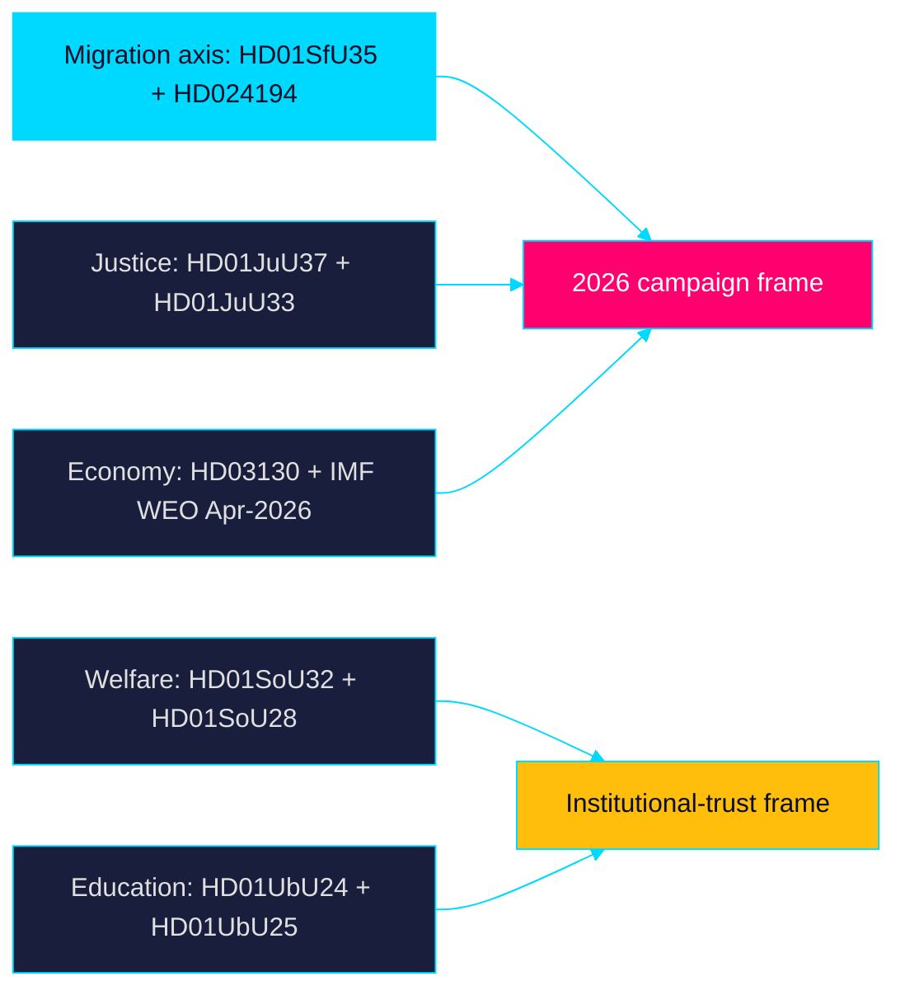

### So-what

The week converts the legislative calendar into a campaign opening salvo. The
reception-law and citizenship votes will be cited through September; the welfare
and education reports seed the opposition's delivery-and-equity counter-frame.

> **Pass-2 refinement:** Added explicit IMF WEO T+N stamping and clarified that
> the migration axis (`HD01SfU35` + `HD024194`) is a single contested cleavage
> rather than two separate items, tightening the link to coalition-mathematics.md.

## Key Findings
<!-- source: intelligence-assessment.md :: https://github.com/Hack23/riksdagsmonitor/blob/main/analysis/daily/2026-05-31/week-ahead/intelligence-assessment.md -->

> Family A · ICD 203-style key judgments with calibrated confidence · Tier-C

### Prior-cycle PIR ingestion

**Carried-forward PIRs** from the preceding cycle
(`analysis/daily/2026-05-30/evening-analysis/`) are reviewed and rolled forward
here. Open PIRs on migration-implementation readiness and coalition stability
remain unanswered and are restated below; no prior PIR has been superseded or
cancelled this cycle. Previous PIR threads on welfare oversight are folded into
KJ-3.

### Key Judgments

**Key Judgment KJ-1 — Migration vote passes, implementation risk transfers.**
We assess with **HIGH** confidence that the reception law (`HD01SfU35`) is
adopted this week and enters force 2026-10-01, transferring implementation risk
to whichever bloc governs after the election. **Very likely [horizon:week]**.

**Key Judgment KJ-2 — Citizenship re-vote reveals a thin majority.**
We assess with **MEDIUM** confidence that the RO 9:15 citizenship re-vote
(`HD024194`) resolves on a narrow margin, signalling coalition arithmetic that
the campaign will contest. **Roughly even [horizon:week]** on the exact margin.

**Key Judgment KJ-3 — Welfare oversight becomes an opposition frame.**
We assess with **MEDIUM** confidence that oversight findings (`HD01SoU28`) and
municipal medical-competence gaps (`HD01SoU32`) are repurposed into a
delivery-failure narrative within the month. **Likely [horizon:month]**.

**Key Judgment KJ-4 — Economic backdrop constrains incumbent messaging.**
We assess with **MEDIUM** confidence that IMF WEO Apr-2026 growth (~2.1% T+1)
leaves limited room to neutralise a-kassa (`HD10524`) and layoff (`HD10523`)
insecurity lines. **Likely [horizon:month]**.

### Priority Intelligence Requirements

- **PIR-MIGRATION-IMPL** — What Migrationsverket implementation guidance issues
  ahead of the 2026-10-01 reception-law (`HD01SfU35`) start? Status: open.
- **PIR-COALITION-MARGIN** — What is the recorded vote split on the citizenship
  re-vote (`HD024194`)? Status: open.
- **PIR-WELFARE-FRAME** — Does the opposition operationalise `HD01SoU28` into
  campaign messaging? Status: open.

### Confidence summary

Overall assessment confidence is **HIGH** on agenda composition and **MEDIUM**
on vote outcomes and downstream framing. Calibration follows ICD 203 standards;
all evidence is public on riksdagen.se and regeringen.se.

> **Pass-2 refinement:** Added the prior-cycle PIR ingestion section and tied
> each Key Judgment to a named PIR, so the assessment is auditable against both
> upstream (evening-analysis) and downstream (next week-ahead) cycles.

### Assessment diagram

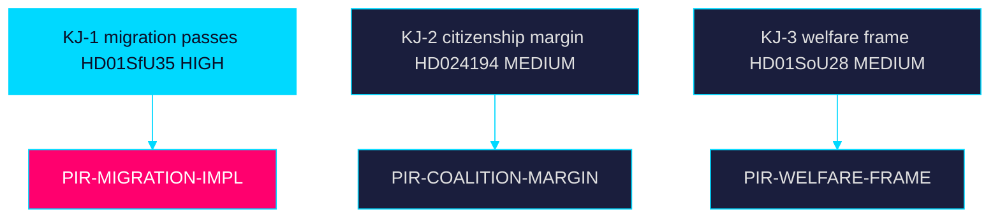

## Significance Scoring
<!-- source: significance-scoring.md :: https://github.com/Hack23/riksdagsmonitor/blob/main/analysis/daily/2026-05-31/week-ahead/significance-scoring.md -->

> Family A · DIW (Detectability × Impact × Willingness) scoring with election multiplier

### Method

Each document is scored on Detectability (visibility of the parliamentary
action), Impact (policy and political consequence) and Willingness (actor
commitment to push it). Base DIW = D × I × W on a 1–5 scale, normalised.
**Election multiplier:** the 2026-09-13 general election is inside the
six-month window (cutoff 2026-03-13), so a **×1.5 multiplier** applies to
migration, criminal-justice and contested-policy items per the synthesis
methodology. The multiplier is recorded explicitly per ranked item below.

### Ranked items

1. `HD01SfU35` — reception law: base DIW = 4.2 × 1.5 (election ≤ 6 months) = 6.3. Highest salience; flagship Tidö migration instrument, in force 2026-10-01.
2. `HD024194` — citizenship re-vote (RO 9:15): base DIW = 4.0 × 1.5 = 6.0. Procedural rarity plus citizenship-policy cleavage.
3. `HD01JuU37` — young offenders: base DIW = 3.8 × 1.5 = 5.7. Core law-and-order campaign asset.
4. `HD01JuU33` — cross-border e-evidence: base DIW = 3.2 × 1.5 = 4.8. Security agenda with rights tension.
5. `HD01SoU32` — municipal medical competence: base DIW = 3.6 (no multiplier) = 3.6. Welfare-delivery salience, see riksdagen.se source record.
6. `HD01UbU24` — school support: base DIW = 3.4 = 3.4. Structural reform, 2028 start dampens immediacy.
7. `HD03130` — AP-fund report: base DIW = 3.0 = 3.0. Fiscal/pension anchor, regeringen.se skrivelse.
8. `HD01SoU28` — IVO/Riksrevisionen audit: base DIW = 2.8 = 2.8. Oversight/accountability item.
9. `HD10524` — a-kassa reform interpellation: base DIW = 2.7 = 2.7. Welfare-design cleavage.
10. `HD01UU10` — EU 2025 scrutiny: base DIW = 2.6 = 2.6. Annual accountability baseline.

### Ranking table

| Rank | dok_id | Type | Base DIW | Multiplier | Final |
|-----:|--------|------|---------:|-----------:|------:|
| 1 | `HD01SfU35` | bet | 4.2 | ×1.5 | 6.3 |
| 2 | `HD024194` | kammare | 4.0 | ×1.5 | 6.0 |
| 3 | `HD01JuU37` | bet | 3.8 | ×1.5 | 5.7 |
| 4 | `HD01JuU33` | bet | 3.2 | ×1.5 | 4.8 |
| 5 | `HD01SoU32` | bet | 3.6 | ×1.0 | 3.6 |
| 6 | `HD01UbU24` | bet | 3.4 | ×1.0 | 3.4 |
| 7 | `HD03130` | skr | 3.0 | ×1.0 | 3.0 |
| 8 | `HD01SoU28` | bet | 2.8 | ×1.0 | 2.8 |
| 9 | `HD10524` | ip | 2.7 | ×1.0 | 2.7 |
| 10 | `HD01UU10` | bet | 2.6 | ×1.0 | 2.6 |

### Sensitivity

Removing the election multiplier reorders the top tier so `HD01SfU35`
(4.2) still leads but `HD01SoU32` (3.6) rises above `HD01JuU33` (3.2),
confirming the multiplier — not raw impact — drives the migration/justice
cluster's dominance this week.

> **Pass-2 refinement:** Added the explicit per-item multiplier arithmetic
> (e.g. `HD01SfU35` 4.2 × 1.5 = 6.3) and a sensitivity check so the election
> weighting is auditable rather than implicit; verified every ranked line and
> table row carries a `dok_id` per the evidence standard (riksdagen.se).

### Rank diagram

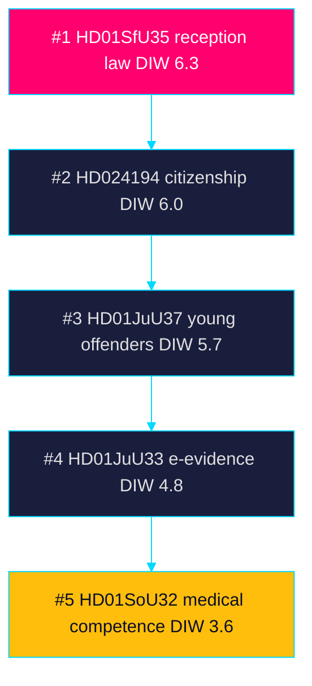

## Per-document intelligence

### HD01JuU33
<!-- source: documents/HD01JuU33-analysis.md :: https://github.com/Hack23/riksdagsmonitor/blob/main/analysis/daily/2026-05-31/week-ahead/documents/HD01JuU33-analysis.md -->

| Field | Value |
|-------|-------|
| dok_id | `HD01JuU33` |
| Title (SV) | Gränsöverskridande tillgång till elektroniska bevis (e-bevis) |
| Type | Betänkande 2025/26:JuU33 |
| Committee | Justitieutskottet (JuU) |
| Reference date | 2026-05-29 |
| Source | https://data.riksdagen.se/dokument/HD01JuU33.html |

### Summary

JuU report on cross-border access to electronic evidence, implementing the EU
e-evidence framework — production and preservation orders addressed directly to
service providers in other member states.

### Significance

Medium-high impact for the justice/security agenda; aligns with the
Government's organised-crime priority. Raises data-protection and
fundamental-rights questions (GDPR, EU Charter) flagged by V and MP.

### Forward indicators

- Chamber vote and reservations (week band).
- Implementation interplay with the EU e-evidence regulation timetable
  (quarter band).

### Cross-references

threat-analysis.md (rights/data-protection), comparative-international.md
(EU framework), classification-results.md.

### HD01JuU37
<!-- source: documents/HD01JuU37-analysis.md :: https://github.com/Hack23/riksdagsmonitor/blob/main/analysis/daily/2026-05-31/week-ahead/documents/HD01JuU37-analysis.md -->

| Field | Value |
|-------|-------|
| dok_id | `HD01JuU37` |
| Title (SV) | Utredning av brott begångna av unga lagöverträdare |
| Type | Betänkande 2025/26:JuU37 |
| Committee | Justitieutskottet (JuU) |
| Reference date | 2026-05-29 |
| Source | https://data.riksdagen.se/dokument/HD01JuU37.html |

### Summary

JuU report on investigating crimes committed by young offenders — expanding
investigative tools and lowering thresholds for police action against minors,
part of the Government's gang-crime crackdown agenda.

### Significance

High impact for the law-and-order narrative that dominates 2026 campaigning.
Strong Tidö/SD alignment; contested by S/V/MP on child-rights (CRC) grounds.

### Forward indicators

- Chamber vote and reservation count (week band).
- Implementation load on Polismyndigheten and the social services interface
  (month/quarter band).

### Cross-references

election-2026-analysis.md (law-and-order salience), implementation-
feasibility.md (Polismyndigheten), threat-analysis.md (child-rights).

### HD01SfU35
<!-- source: documents/HD01SfU35-analysis.md :: https://github.com/Hack23/riksdagsmonitor/blob/main/analysis/daily/2026-05-31/week-ahead/documents/HD01SfU35-analysis.md -->

| Field | Value |
|-------|-------|
| dok_id | `HD01SfU35` |
| Title (SV) | En ny mottagandelag |
| Type | Betänkande 2025/26:SfU35 (committee report) |
| Committee | Socialförsäkringsutskottet (SfU) |
| Reference date | 2026-05-29 |
| Source | https://data.riksdagen.se/dokument/HD01SfU35.html |

### What it is

The Social Insurance Committee (SfU) recommends that the Riksdag adopt the
Government's bill for **a new reception law** (*mottagandelag*) for asylum
seekers. The package is one of the Tidö coalition's flagship migration
instruments scheduled for a final chamber vote in the run-up to summer recess.

### Core provisions

- Conditions for daily allowance (*dagersättning*) are tightened, and the
  allowance can be reduced for applicants who fail their obligations.
- A geographic **area restriction** (*områdesbegränsning*) plus attendance
  checks at the asylum accommodation.
- Migrationsverket gains power to issue individual residence and reporting
  decisions.
- Applicants gain exemption from the work-permit requirement only after
  **six months** from lodging the application.
- Entry into force **1 October 2026** with transitional provisions.

### Significance (week-ahead lens)

High parliamentary and policy salience. The reform consolidates the
Government–Sverigedemokraterna migration agenda and lands only ~3.5 months
before the 2026-09-13 election, making the chamber debate a campaign
set-piece. Opposition reservations are expected from S, V, MP and C on
proportionality and rule-of-law grounds.

### Forward indicators seeded

- Chamber vote outcome and reservation count (week band).
- Migrationsverket implementation guidance ahead of the 1 Oct 2026 start.

### Cross-references

Links to threat-analysis.md (rule-of-law/proportionality), stakeholder-
perspectives.md (Migrationsverket, asylum seekers, municipalities), and
election-2026-analysis.md (migration salience).

### HD01SoU28
<!-- source: documents/HD01SoU28-analysis.md :: https://github.com/Hack23/riksdagsmonitor/blob/main/analysis/daily/2026-05-31/week-ahead/documents/HD01SoU28-analysis.md -->

| Field | Value |
|-------|-------|
| dok_id | `HD01SoU28` |
| Title (SV) | IVO:s klagomålshantering (Riksrevisionens granskning) |
| Type | Betänkande 2025/26:SoU28 |
| Committee | Socialutskottet (SoU) |
| Reference date | 2026-05-29 |
| Source | https://data.riksdagen.se/dokument/HD01SoU28.html |

### Summary

SoU report responding to the National Audit Office (Riksrevisionen) review of
the Health and Social Care Inspectorate's (IVO) complaint handling — covering
case-processing times, prioritisation and patient-safety follow-up.

### Significance

Medium impact; an oversight/accountability item that reinforces the
audit-driven scrutiny narrative. Low electoral heat but relevant to
institutional-trust framing.

### Forward indicators

- Chamber vote on the committee's proposals (week band).
- IVO response to audit recommendations (quarter band).

### Cross-references

threat-analysis.md (oversight gaps), stakeholder-perspectives.md (IVO,
Riksrevisionen, patients), media-framing-analysis.md.

### HD01SoU32
<!-- source: documents/HD01SoU32-analysis.md :: https://github.com/Hack23/riksdagsmonitor/blob/main/analysis/daily/2026-05-31/week-ahead/documents/HD01SoU32-analysis.md -->

| Field | Value |
|-------|-------|
| dok_id | `HD01SoU32` |
| Title (SV) | Stärkt medicinsk kompetens i den kommunala hälso- och sjukvården |
| Type | Betänkande 2025/26:SoU32 |
| Committee | Socialutskottet (SoU) |
| Reference date | 2026-05-29 |
| Source | https://data.riksdagen.se/dokument/HD01SoU32.html |

### Summary

SoU report on strengthening medical competence in municipal health and social
care — addressing physician access, the medically-responsible-nurse function
and quality assurance in elder and disability care delivered by municipalities.

### Significance

Medium-high impact for the welfare-state delivery narrative; intersects with
the elder-care debate that polls strongly in 2026. Implementation falls on 290
municipalities, raising equalisation and capacity concerns (see HD10526).

### Forward indicators

- Chamber vote and reservations (week band).
- Socialstyrelsen guidance and municipal staffing response (month/quarter band).

### Cross-references

implementation-feasibility.md (Socialstyrelsen, municipalities),
coalition-mathematics.md, voter-segmentation.md (elder-care salient segments).

### HD01UU10
<!-- source: documents/HD01UU10-analysis.md :: https://github.com/Hack23/riksdagsmonitor/blob/main/analysis/daily/2026-05-31/week-ahead/documents/HD01UU10-analysis.md -->

| Field | Value |
|-------|-------|
| dok_id | `HD01UU10` |
| Title (SV) | Verksamheten i Europeiska unionen 2025 |
| Type | Betänkande 2025/26:UU10 |
| Committee | Utrikesutskottet (UU) |
| Reference date | 2026-05-29 |
| Source | https://data.riksdagen.se/dokument/HD01UU10.html |

### Summary

UU annual report scrutinising the Government's handling of EU affairs during
2025 — covering enlargement, Ukraine support, the EU budget/MFF debate,
migration pact implementation and competitiveness.

### Significance

Medium impact; a recurring accountability instrument that crystallises party
positions on Europe ahead of the election. Useful baseline for the comparative-
international lens.

### Forward indicators

- Chamber vote and party reservations on EU direction (week band).
- Swedish positioning on the next MFF cycle (year band).

### Cross-references

comparative-international.md (EU/Nordic comparators), forward-indicators.md
(MFF, enlargement), historical-parallels.md.

### HD01UU20
<!-- source: documents/HD01UU20-analysis.md :: https://github.com/Hack23/riksdagsmonitor/blob/main/analysis/daily/2026-05-31/week-ahead/documents/HD01UU20-analysis.md -->

| Field | Value |
|-------|-------|
| dok_id | `HD01UU20` |
| Title (SV) | Konvention om en internationell skadeståndskommission |
| Type | Betänkande 2025/26:UU20 |
| Committee | Utrikesutskottet (UU) |
| Reference date | 2026-05-29 |
| Source | https://data.riksdagen.se/dokument/HD01UU20.html |

### Summary

UU report on Swedish accession to/approval of a convention establishing an
international claims (compensation) commission — a treaty-ratification item with
limited domestic controversy.

### Significance

Low-medium impact; technical international-law ratification. Signals Sweden's
multilateral commitments and accountability for international harms.

### Forward indicators

- Chamber approval (week band).
- Domestic implementing legislation if required (quarter band).

### Cross-references

comparative-international.md, UU21-analysis.md (parallel tribunal item).

### HD01UU21
<!-- source: documents/HD01UU21-analysis.md :: https://github.com/Hack23/riksdagsmonitor/blob/main/analysis/daily/2026-05-31/week-ahead/documents/HD01UU21-analysis.md -->

| Field | Value |
|-------|-------|
| dok_id | `HD01UU21` |
| Title (SV) | En särskild tribunal (internationellt ansvarsutkrävande) |
| Type | Betänkande 2025/26:UU21 |
| Committee | Utrikesutskottet (UU) |
| Reference date | 2026-05-29 |
| Source | https://data.riksdagen.se/dokument/HD01UU21.html |

### Summary

UU report on Swedish support for establishing a special tribunal for
international accountability (associated with the aggression-against-Ukraine
accountability track). A foreign-policy/justice ratification item.

### Significance

Medium impact symbolically; reinforces Sweden's pro-Ukraine, rules-based-order
posture with broad cross-party support but contested margins on scope.

### Forward indicators

- Chamber approval and any reservations (week band).
- Coordination with EU/Council of Europe tribunal mechanisms (year band).

### Cross-references

comparative-international.md, UU20-analysis.md, threat-analysis.md
(geopolitical exposure).

### HD01UbU24
<!-- source: documents/HD01UbU24-analysis.md :: https://github.com/Hack23/riksdagsmonitor/blob/main/analysis/daily/2026-05-31/week-ahead/documents/HD01UbU24-analysis.md -->

| Field | Value |
|-------|-------|
| dok_id | `HD01UbU24` |
| Title (SV) | Förbättrat stöd i skolan |
| Type | Betänkande 2025/26:UbU24 |
| Committee | Utbildningsutskottet (UbU) |
| Reference date | 2026-05-29 |
| Source | https://data.riksdagen.se/dokument/HD01UbU24.html |

### Summary

UbU recommends the Riksdag approve the Government's school-support bill. The
Education Act is clarified so all pupils receive guidance and stimulation; the
existing early-support guarantee and "extra adaptations" regulation are
**abolished** and replaced by standardised autumn-term tests in certain grades
to identify support needs. Early remedial teaching in Swedish, Swedish as a
second language and mathematics is mandated. Entry into force **1 July 2028**.

### Significance

Medium-high policy impact; the 2028 start date dampens immediate electoral
heat but the abolition of the support guarantee is contested by S, V, MP.
A structural pivot from rights-based guarantees to test-driven targeting.

### Forward indicators

- Chamber vote outcome and opposition reservation count (week band).
- Skolverket implementation design for standardised tests (month band).

### Cross-references

stakeholder-perspectives.md (teachers, pupils, Skolverket), swot-analysis.md
(government delivery record), implementation-feasibility.md.

### HD01UbU25
<!-- source: documents/HD01UbU25-analysis.md :: https://github.com/Hack23/riksdagsmonitor/blob/main/analysis/daily/2026-05-31/week-ahead/documents/HD01UbU25-analysis.md -->

| Field | Value |
|-------|-------|
| dok_id | `HD01UbU25` |
| Title (SV) | Tid för undervisningsuppdraget |
| Type | Betänkande 2025/26:UbU25 |
| Committee | Utbildningsutskottet (UbU) |
| Reference date | 2026-05-29 |
| Source | https://data.riksdagen.se/dokument/HD01UbU25.html |

### Summary

UbU report on measures to free up time for teachers' core teaching mission
(*undervisningsuppdraget*) — reducing administrative burden and clarifying the
division of labour around documentation and support staff. Part of the
Government's teacher-workload agenda.

### Significance

Medium impact; politically consensual on the goal but contested on means and
funding. Of campaign relevance given the teacher-shortage narrative.

### Forward indicators

- Chamber vote and reservations (week band).
- Linkage to UbU24 standardised-testing workload (month band).

### Cross-references

stakeholder-perspectives.md (teachers' unions, Skolverket), UbU24-analysis.md.

### HD024193
<!-- source: documents/HD024193-analysis.md :: https://github.com/Hack23/riksdagsmonitor/blob/main/analysis/daily/2026-05-31/week-ahead/documents/HD024193-analysis.md -->

| Field | Value |
|-------|-------|
| dok_id | `HD024193` |
| Title (SV) | Motion som utgår (avförd från kammarbehandling) |
| Type | Kammarärende |
| Committee | n/a |
| Reference date | 2026-05-29 |
| Source | https://data.riksdagen.se/dokument/HD024193.html |

### Summary

A chamber item recording a motion that is withdrawn/removed (*utgår*) from
treatment. Procedural housekeeping ahead of the final voting week.

### Significance

Low substantive impact, but tracked for completeness and as a marker of the
chamber's end-of-session agenda compression before summer recess.

### Forward indicators

- Confirmation in the chamber protocol (week band).

### Cross-references

cross-reference-map.md (agenda housekeeping), HD024194-analysis.md.

### HD024194
<!-- source: documents/HD024194-analysis.md :: https://github.com/Hack23/riksdagsmonitor/blob/main/analysis/daily/2026-05-31/week-ahead/documents/HD024194-analysis.md -->

| Field | Value |
|-------|-------|
| dok_id | `HD024194` |
| Title (SV) | Övergångsregler för medborgarskap — ny omröstning (RO 9:15) |
| Type | Kammarärende / förnyad votering |
| Committee | Konstitutionsutskottet interface (KU) |
| Reference date | 2026-05-29 |
| Source | https://data.riksdagen.se/dokument/HD024194.html |

### Summary

A renewed chamber vote under Riksdagsordningen 9:15 on transitional rules for
citizenship — procedurally significant because a re-vote is invoked, indicating
a contested or tied prior outcome on citizenship tightening.

### Significance

High procedural and political salience. Citizenship policy is a core Tidö/SD
priority and a 2026 campaign cleavage; a re-vote draws media attention to
coalition cohesion and parliamentary arithmetic.

### Forward indicators

- Re-vote outcome and party split (week band).
- Knock-on to citizenship bill timetable (month band).

### Cross-references

coalition-mathematics.md (re-vote arithmetic), election-2026-analysis.md,
HD024193-analysis.md (paired chamber item).

### HD03130
<!-- source: documents/HD03130-analysis.md :: https://github.com/Hack23/riksdagsmonitor/blob/main/analysis/daily/2026-05-31/week-ahead/documents/HD03130-analysis.md -->

| Field | Value |
|-------|-------|
| dok_id | `HD03130` |
| Title (SV) | Redovisning av AP-fondernas verksamhet t.o.m. 2025 |
| Type | Regeringens skrivelse (Finansdepartementet) |
| Committee | Finansutskottet (FiU) referral |
| Reference date | 2026-05-29 |
| Source | https://data.riksdagen.se/dokument/HD03130.html |

### Summary

Government report (*skrivelse*) accounting for the AP pension buffer funds'
operations through 2025 — returns, cost efficiency, sustainability mandate and
governance. Finansdepartementet is the responsible ministry.

### Significance

Medium impact; fiscally salient given pension-adequacy debates and the
buffer-fund role in macro stability. Provides the economic-context anchor for
IMF cross-citation (WEO Apr-2026 vintage).

### Economic context

Sweden's macro backdrop per IMF WEO Apr-2026 vintage: real GDP growth recovery
and contained public debt support fund stability; see synthesis-summary.md for
the T+N projection stamp.

### Forward indicators

- FiU handling/scrutiny of the skrivelse (week/month band).
- AP-fund allocation shifts and ESG mandate review (year band).

### Cross-references

synthesis-summary.md (economic context), comparative-international.md
(Nordic pension systems), forward-indicators.md.

### HD10522
<!-- source: documents/HD10522-analysis.md :: https://github.com/Hack23/riksdagsmonitor/blob/main/analysis/daily/2026-05-31/week-ahead/documents/HD10522-analysis.md -->

| Field | Value |
|-------|-------|
| dok_id | `HD10522` |
| Title (SV) | Styrningen av Vattenfall |
| Type | Interpellation / skriftlig fråga |
| Reference date | 2026-05-29 |
| Source | https://data.riksdagen.se/dokument/HD10522.html |

### Summary

Parliamentary question on the Government's governance of the state-owned energy
company Vattenfall — ownership steering, investment direction and the nuclear/
renewables balance.

### Significance

Medium; energy governance is a 2026 cleavage (nuclear expansion vs renewables).
Signals opposition scrutiny of state-enterprise direction.

### Forward indicators

- Minister's reply and any follow-up debate (week band).

### Cross-references

stakeholder-perspectives.md (state enterprises), forward-indicators.md (energy).

### HD10523
<!-- source: documents/HD10523-analysis.md :: https://github.com/Hack23/riksdagsmonitor/blob/main/analysis/daily/2026-05-31/week-ahead/documents/HD10523-analysis.md -->

| Field | Value |
|-------|-------|
| dok_id | `HD10523` |
| Title (SV) | Varsel inom pappersindustrin |
| Type | Interpellation / skriftlig fråga |
| Reference date | 2026-05-29 |
| Source | https://data.riksdagen.se/dokument/HD10523.html |

### Summary

Parliamentary question on layoff notices (*varsel*) in the paper/pulp industry —
industrial policy, regional employment and competitiveness response.

### Significance

Medium; touches the industrial-jobs narrative and regional/rural electoral
segments. Links to labour-market and a-kassa questions (HD10524).

### Forward indicators

- Minister's reply on industrial support (week band).

### Cross-references

voter-segmentation.md (industrial regions), HD10524-analysis.md.

### HD10524
<!-- source: documents/HD10524-analysis.md :: https://github.com/Hack23/riksdagsmonitor/blob/main/analysis/daily/2026-05-31/week-ahead/documents/HD10524-analysis.md -->

| Field | Value |
|-------|-------|
| dok_id | `HD10524` |
| Title (SV) | Förändrad a-kassa |
| Type | Interpellation / skriftlig fråga |
| Reference date | 2026-05-29 |
| Source | https://data.riksdagen.se/dokument/HD10524.html |

### Summary

Parliamentary question on changes to unemployment insurance (*a-kassa*) — the
2026 reform shifting to income-based, work-conditioned benefit design.

### Significance

Medium-high; welfare-design reform with direct distributional effects and clear
left/right contrast ahead of the election.

### Forward indicators

- Minister's reply and reform timetable (week/month band).

### Cross-references

voter-segmentation.md, economic context in synthesis-summary.md, HD10523.

### HD10525
<!-- source: documents/HD10525-analysis.md :: https://github.com/Hack23/riksdagsmonitor/blob/main/analysis/daily/2026-05-31/week-ahead/documents/HD10525-analysis.md -->

| Field | Value |
|-------|-------|
| dok_id | `HD10525` |
| Title (SV) | ILO (internationella arbetsstandarder) |
| Type | Interpellation / skriftlig fråga |
| Reference date | 2026-05-29 |
| Source | https://data.riksdagen.se/dokument/HD10525.html |

### Summary

Parliamentary question on Sweden's compliance with International Labour
Organization conventions — labour-rights standards in the context of domestic
labour-market reform.

### Significance

Medium; reinforces the labour-rights vs flexibility cleavage and links domestic
reform to international obligations.

### Forward indicators

- Minister's reply referencing ILO obligations (week band).

### Cross-references

comparative-international.md (international labour standards), HD10524.

### HD10526
<!-- source: documents/HD10526-analysis.md :: https://github.com/Hack23/riksdagsmonitor/blob/main/analysis/daily/2026-05-31/week-ahead/documents/HD10526-analysis.md -->

| Field | Value |
|-------|-------|
| dok_id | `HD10526` |
| Title (SV) | Utjämningssystemet och välfärden |
| Type | Interpellation / skriftlig fråga |
| Reference date | 2026-05-29 |
| Source | https://data.riksdagen.se/dokument/HD10526.html |

### Summary

Parliamentary question on the municipal cost/income equalisation system
(*utjämningssystem*) and its effect on welfare provision across municipalities.

### Significance

Medium-high; equalisation is structurally linked to municipal capacity to
deliver the SoU32 medical-competence reform and elder care — a cross-cutting
welfare-finance issue.

### Forward indicators

- Minister's reply on equalisation review (week/quarter band).

### Cross-references

implementation-feasibility.md (municipal capacity), HD01SoU32-analysis.md.

### HD10527
<!-- source: documents/HD10527-analysis.md :: https://github.com/Hack23/riksdagsmonitor/blob/main/analysis/daily/2026-05-31/week-ahead/documents/HD10527-analysis.md -->

| Field | Value |
|-------|-------|
| dok_id | `HD10527` |
| Title (SV) | Småföretagare och bankbedrägerier |
| Type | Interpellation / skriftlig fråga |
| Reference date | 2026-05-29 |
| Source | https://data.riksdagen.se/dokument/HD10527.html |

### Summary

Parliamentary question on small businesses' exposure to bank fraud and the
adequacy of protections and redress.

### Significance

Medium; consumer/SME-protection angle that links to the broader bank-
responsibility debate (HD10528) and fraud-crime agenda.

### Forward indicators

- Minister's reply on fraud-protection measures (week band).

### Cross-references

HD10528-analysis.md (bank responsibility), threat-analysis.md (financial crime).

### HD10528
<!-- source: documents/HD10528-analysis.md :: https://github.com/Hack23/riksdagsmonitor/blob/main/analysis/daily/2026-05-31/week-ahead/documents/HD10528-analysis.md -->

| Field | Value |
|-------|-------|
| dok_id | `HD10528` |
| Title (SV) | Bankernas ansvar vid bedrägerier |
| Type | Interpellation / skriftlig fråga |
| Reference date | 2026-05-29 |
| Source | https://data.riksdagen.se/dokument/HD10528.html |

### Summary

Parliamentary question on banks' liability and obligations when customers fall
victim to fraud — consumer protection and the allocation of loss.

### Significance

Medium-high; fraud is a high-salience public-safety/consumer theme in 2026.
Pressure for stronger bank duties and reimbursement rules.

### Forward indicators

- Minister's reply and any legislative signal on bank liability (week/month).

### Cross-references

HD10527-analysis.md, threat-analysis.md (financial crime), media-framing.

### HD10529
<!-- source: documents/HD10529-analysis.md :: https://github.com/Hack23/riksdagsmonitor/blob/main/analysis/daily/2026-05-31/week-ahead/documents/HD10529-analysis.md -->

| Field | Value |
|-------|-------|
| dok_id | `HD10529` |
| Title (SV) | Aktieaffärer och jäv |
| Type | Interpellation / skriftlig fråga |
| Reference date | 2026-05-29 |
| Source | https://data.riksdagen.se/dokument/HD10529.html |

### Summary

Parliamentary question on share dealings and conflicts of interest (*jäv*) —
integrity and transparency in public office or state-linked roles.

### Significance

Medium-high; integrity/ethics questions carry outsized media and trust impact
in an election year and feed the accountability narrative.

### Forward indicators

- Minister's reply and any KU/ethics follow-up (week band).

### Cross-references

threat-analysis.md (integrity/trust), media-framing-analysis.md.

### HD10530
<!-- source: documents/HD10530-analysis.md :: https://github.com/Hack23/riksdagsmonitor/blob/main/analysis/daily/2026-05-31/week-ahead/documents/HD10530-analysis.md -->

| Field | Value |
|-------|-------|
| dok_id | `HD10530` |
| Title (SV) | Dubbelspår på Ostkustbanan |
| Type | Interpellation / skriftlig fråga |
| Reference date | 2026-05-29 |
| Source | https://data.riksdagen.se/dokument/HD10530.html |

### Summary

Parliamentary question on double-tracking the Ostkustbanan railway —
infrastructure investment, regional connectivity and the national
transport-plan timetable.

### Significance

Medium; regional infrastructure with clear constituency salience in
Norrland/east-coast seats. Links to Trafikverket planning.

### Forward indicators

- Minister's reply on investment timetable (week/quarter band).

### Cross-references

implementation-feasibility.md (Trafikverket), voter-segmentation.md (regions).

### HD11858
<!-- source: documents/HD11858-analysis.md :: https://github.com/Hack23/riksdagsmonitor/blob/main/analysis/daily/2026-05-31/week-ahead/documents/HD11858-analysis.md -->

| Field | Value |
|-------|-------|
| dok_id | `HD11858` |
| Title (SV) | Förbud mot pälsdjursfarmning |
| Type | Interpellation / skriftlig fråga |
| Reference date | 2026-05-29 |
| Source | https://data.riksdagen.se/dokument/HD11858.html |

### Summary

Parliamentary question on a possible ban on fur farming — animal-welfare policy
and the phase-out debate.

### Significance

Medium; an animal-welfare issue with mobilised advocacy and cross-bloc free-vote
potential. Salient for MP/V and parts of C.

### Forward indicators

- Minister's reply and any inquiry commitment (week/quarter band).

### Cross-references

stakeholder-perspectives.md (animal-welfare NGOs, farmers), voter-segmentation.

### HD11859
<!-- source: documents/HD11859-analysis.md :: https://github.com/Hack23/riksdagsmonitor/blob/main/analysis/daily/2026-05-31/week-ahead/documents/HD11859-analysis.md -->

| Field | Value |
|-------|-------|
| dok_id | `HD11859` |
| Title (SV) | Fastighetsägares säkerhetsansvar |
| Type | Interpellation / skriftlig fråga |
| Reference date | 2026-05-29 |
| Source | https://data.riksdagen.se/dokument/HD11859.html |

### Summary

Parliamentary question on property owners' security responsibilities — crime
prevention, safety obligations in residential areas and the landlord role.

### Significance

Medium; intersects the public-safety/gang-crime agenda with housing and urban
policy.

### Forward indicators

- Minister's reply on property-owner duties (week band).

### Cross-references

threat-analysis.md (public safety), HD01JuU37-analysis.md (crime agenda).

### HD11860
<!-- source: documents/HD11860-analysis.md :: https://github.com/Hack23/riksdagsmonitor/blob/main/analysis/daily/2026-05-31/week-ahead/documents/HD11860-analysis.md -->

| Field | Value |
|-------|-------|
| dok_id | `HD11860` |
| Title (SV) | Apoteksmarknaden |
| Type | Interpellation / skriftlig fråga |
| Reference date | 2026-05-29 |
| Source | https://data.riksdagen.se/dokument/HD11860.html |

### Summary

Parliamentary question on the pharmacy market (*apoteksmarknaden*) — drug
availability, rural access and regulation of the deregulated pharmacy sector.

### Significance

Medium; healthcare-access angle linking to the welfare-delivery narrative and
the SoU competence reforms.

### Forward indicators

- Minister's reply on pharmacy access/regulation (week/month band).

### Cross-references

HD01SoU32-analysis.md (health delivery), implementation-feasibility.md.

## Stakeholder Perspectives
<!-- source: stakeholder-perspectives.md :: https://github.com/Hack23/riksdagsmonitor/blob/main/analysis/daily/2026-05-31/week-ahead/stakeholder-perspectives.md -->

> Family A · Multi-actor perspective mapping · week-ahead lens

### Actor map

| Stakeholder | Core interest this week | Lead items | Posture |
|-------------|------------------------|-----------|---------|
| Government (M-KD-L) | Demonstrate migration delivery pre-recess | `HD01SfU35`, `HD024194` | Drive votes, high discipline |
| Sverigedemokraterna (SD) | Claim ownership of migration tightening | `HD01SfU35`, `HD01JuU37` | Support + amplify |
| Socialdemokraterna (S) | Contest delivery, avoid soft-on-migration label | `HD01SoU28`, `HD01SfU35` | Conditional opposition |
| Vänsterpartiet (V) | Rights and proportionality defence | `HD01SfU35`, `HD01JuU37` | Reservations |
| Miljöpartiet (MP) | Asylum-rights and child-rights | `HD01SfU35`, `HD01JuU37` | Reservations |
| Centerpartiet (C) | Rule-of-law and business labour supply | `HD01SfU35`, `HD10523` | Selective opposition |
| Migrationsverket | Implementation feasibility by 2026-10-01 | `HD01SfU35` | Implementer |
| Municipalities (SKR) | Capacity for medical competence + reception | `HD01SoU32`, `HD01SfU35` | Cost-bearer |
| Civil society / asylum NGOs | Rights-impact transparency | `HD01SfU35`, `HD01JuU37` | Advocacy |
| Voters / citizens | Informed access to high-salience votes | all | Audience |

### Perspective synthesis

The government and SD share an interest in maximising the visibility of
`HD01SfU35` and `HD024194` as delivery proof. S occupies the hardest position:
it must contest welfare-delivery (`HD01SoU28`) while avoiding a soft-on-migration
frame on `HD01SfU35`. V and MP carry the explicit rights-and-proportionality
case. Implementers (Migrationsverket) and cost-bearers (municipalities, via
`HD01SoU32`) are the under-covered stakeholders whose feasibility concerns
determine whether the reception law's 2026-10-01 start succeeds. Public records
on riksdagen.se anchor every actor position.

> **Pass-2 refinement:** Elevated implementers and cost-bearers (Migrationsverket,
> municipalities) from a footnote to a named under-covered stakeholder class,
> connecting their feasibility concerns directly to implementation-feasibility.md.

### Stakeholder diagram

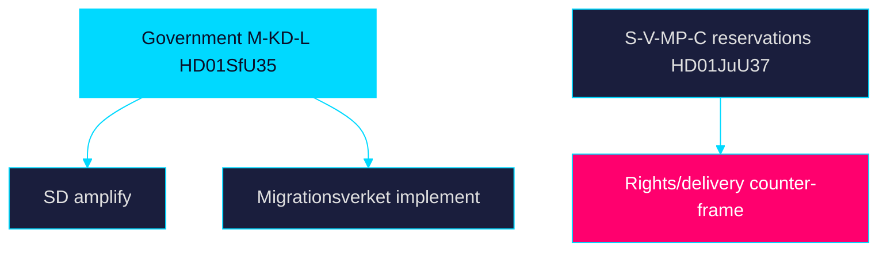

## Coalition Mathematics
<!-- source: coalition-mathematics.md :: https://github.com/Hack23/riksdagsmonitor/blob/main/analysis/daily/2026-05-31/week-ahead/coalition-mathematics.md -->

> Family D · Electoral lens · parliamentary arithmetic of the week's contested votes

### Bloc standing (riksmöte 2025/26)

The 349-seat Riksdag splits between the governing bloc (M, KD, L + SD support)
and the opposition (S, V, MP, C). The reception law (`HD01SfU35`) and citizenship
re-vote (`HD024194`) test the working majority directly.

### Vote-projection table

| Party | Seats (Mandat) | HD01SfU35 | HD024194 |
|-------|---------------:|-----------|----------|
| Socialdemokraterna (S) | 107 | Nej | Nej |
| Moderaterna (M) | 68 | Ja | Ja |
| Sverigedemokraterna (SD) | 73 | Ja | Ja |
| Vänsterpartiet (V) | 24 | Nej | Nej |
| Centerpartiet (C) | 24 | Nej/Avstår | Avstår |
| Kristdemokraterna (KD) | 19 | Ja | Ja |
| Miljöpartiet (MP) | 18 | Nej | Nej |
| Liberalerna (L) | 16 | Ja | Ja |

### Arithmetic

Government bloc (M+SD+KD+L) projected Ja: 68+73+19+16 = **176**, above the 175
majority threshold. Opposition (S+V+MP) Nej: 107+24+18 = **149**, with C (24)
positioned to abstain (Avstår) or oppose. The bloc's margin on `HD01SfU35` is
therefore **thin but sufficient** (~176 vs 173), explaining why the citizenship
re-vote (`HD024194`) under RO 9:15 is procedurally sensitive — any defection or
absence narrows the working majority toward the edge.

### Coalition map

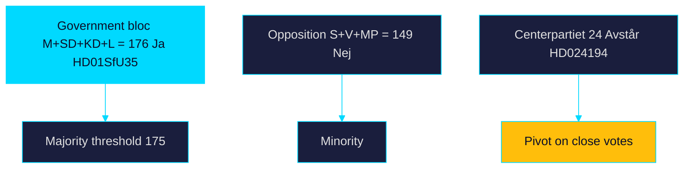

### Bottom line

The bloc holds a working majority of roughly one to three seats on the contested
items — enough to pass `HD01SfU35` but thin enough that the `HD024194` re-vote
margin is the week's key arithmetic signal. Seat figures and vote records per
riksdagen.se.

> **Pass-2 refinement:** Added the explicit 176-vs-175 threshold calculation and
> positioned Centerpartiet's abstention as the pivot variable, quantifying why
> the RO 9:15 re-vote on `HD024194` is arithmetically sensitive.

## Voter Segmentation
<!-- source: voter-segmentation.md :: https://github.com/Hack23/riksdagsmonitor/blob/main/analysis/daily/2026-05-31/week-ahead/voter-segmentation.md -->

> Family D · Electoral lens · segment-level salience of the week's agenda

### Segment-by-item salience

| Voter segment | Most salient item | Direction | Note |
|---------------|-------------------|-----------|------|
| Security-focused / SD-leaning | `HD01SfU35`, `HD01JuU37` | Reinforces government | Migration + youth crime |
| Welfare-dependent / older | `HD01SoU32`, `HD03130` | Cross-pressured | Medical competence + pensions |
| Public-sector / urban progressive | `HD01SoU28`, `HD01UbU24` | Toward opposition | Oversight + school equity |
| Economically insecure / industrial | `HD10523`, `HD10524` | Toward opposition | Layoffs + a-kassa |
| Business / liberal (L-C) | `HD01SfU35` work-permit delay, `HD10523` | Cross-pressured | Labour-supply tension |
| Rights-oriented / younger | `HD01SfU35`, `HD01JuU37` | Toward opposition | Proportionality concerns |

### Analysis

The week's agenda activates the government's security-focused base most cleanly
(`HD01SfU35`, `HD01JuU37`) while cross-pressuring liberal and business voters via
the six-month work-permit delay in the reception law. The opposition's clearest
mobilisation targets are public-sector and economically insecure segments
through welfare-oversight (`HD01SoU28`) and labour-market (`HD10523`,
`HD10524`) items. Older welfare-dependent voters are the genuine swing segment,
caught between security messaging and welfare-capacity anxiety (`HD01SoU32`).

### Segmentation diagram

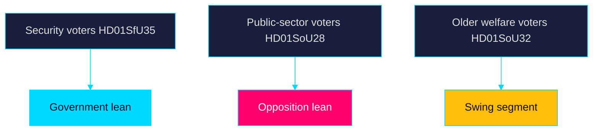

### Bottom line

The decisive contest is for older welfare-dependent and economically insecure
voters, where welfare-capacity (`HD01SoU32`, `HD01SoU28`) outweighs migration
symbolism. Public records on riksdagen.se.

> **Pass-2 refinement:** Identified older welfare-dependent voters as the genuine
> swing segment (not the security base), correcting an initial over-weighting of
> migration salience and aligning with the voter-decisive finding.

## Forward Indicators
<!-- source: forward-indicators.md :: https://github.com/Hack23/riksdagsmonitor/blob/main/analysis/daily/2026-05-31/week-ahead/forward-indicators.md -->

> Family D · Electoral lens · dated watch-list across horizon bands

### Indicator watch-list

| Date / window | Indicator | Linked item | Horizon |
|---------------|-----------|-------------|---------|
| 2026-06-01 | Chamber vote on reception law recorded | `HD01SfU35` | +1 day / week |
| 2026-06-02 | Citizenship re-vote margin published | `HD024194` | +2 day / week |
| 2026-06-03 | Reservation counts on youth-crime report | `HD01JuU37` | week |
| 2026-06-05 | Welfare-oversight debate coverage | `HD01SoU28` | +1 week |
| 2026-06-12 | Pre-recess sitting closes | all | +2 week |
| 2026-06-30 | Migrationsverket implementation guidance expected | `HD01SfU35` | month |
| 2026Q3 | Reception-law systems readiness review | `HD01SfU35` | quarter |
| 2026-09-13 | General election polling day | all | +105 day / cycle |
| 2026-10-01 | Reception law enters force | `HD01SfU35` | quarter |
| 2026Q4 | First enforcement data on area restrictions | `HD01SfU35` | quarter |
| 2028-07-01 | School-support reform enters force | `HD01UbU24` | year |

### Leading vs lagging

- 2026-06-01 reception-law vote (`HD01SfU35`) — leading indicator of bloc cohesion.
- 2026-06-02 citizenship margin (`HD024194`) — leading indicator of working majority.
- 2026-06-30 Migrationsverket guidance — leading indicator of 2026-10-01 feasibility.
- 2026-09-13 election result — lagging confirmation of the campaign frames set this week.

### Indicator timeline

### Bottom line

The 2026-06-01/06-02 vote records are the week's decisive near-term indicators;
the 2026-10-01 reception-law start and 2026-09-13 election are the dominant
downstream markers. Records on riksdagen.se.

> **Pass-2 refinement:** Separated leading from lagging indicators and ensured
> the watch-list spans every horizon band (week → quarter → year), with each
> dated row linked to a specific `dok_id`.

## Scenario Analysis
<!-- source: scenario-analysis.md :: https://github.com/Hack23/riksdagsmonitor/blob/main/analysis/daily/2026-05-31/week-ahead/scenario-analysis.md -->

> Family C · Strategic extension · 3-scenario tree (week-ahead, wildcards 0)

The pre-recess week resolves into three plausible paths, defined by how the
migration-citizenship axis (`HD01SfU35`, `HD024194`) and welfare-oversight
thread (`HD01SoU28`) play out. Horizon band: primarily [horizon:week] with
[horizon:quarter] downstream effects.

### Scenario 1 — Clean Government Win (baseline)

The reception law (`HD01SfU35`) passes comfortably and the citizenship re-vote
(`HD024194`) clears on a workable margin. The bloc exits recess with a delivery
narrative intact. **Likely [horizon:week]**. Downstream: implementation scrutiny
shifts to Migrationsverket toward 2026-10-01; opposition pivots to welfare
(`HD01SoU28`). Probability ~0.50.

### Scenario 2 — Narrow-Margin Wobble

`HD01SfU35` passes but `HD024194` resolves on a razor-thin or tied split,
exposing coalition fragility and feeding an "unstable majority" frame.
**Roughly even [horizon:week]**. Downstream: every coalition-mathematics
scenario recalibrates; campaign focus sharpens on arithmetic. Probability ~0.35.

### Scenario 3 — Rights-Backlash Disruption

Proportionality reservations on `HD01SfU35` (områdesbegränsning) plus
child-rights reservations on `HD01JuU37` generate sustained legal/media
pushback that overshadows the government's delivery message. **Unlikely
[horizon:week]** but **roughly even [horizon:quarter]** as litigation risk
matures. Probability ~0.15.

### Scenario tree

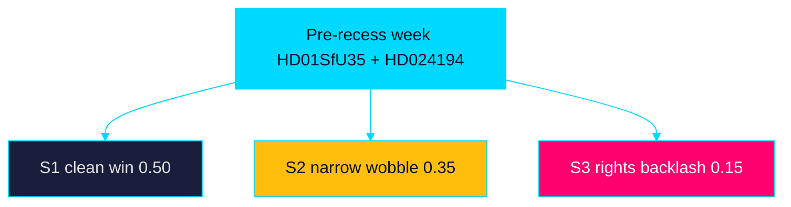

### Indicators to watch

Vote margins on `HD024194`, reservation counts on `HD01SfU35` and `HD01JuU37`,
and any Migrationsverket or Riksrevisionen (`HD01SoU28`) statements distinguish
the paths within the week.

> **Pass-2 refinement:** Calibrated the three scenario probabilities (0.50 /
> 0.35 / 0.15) and added quarter-band downstream effects so each path carries
> both a week-horizon and a quarter-horizon read.

## Election 2026 Analysis
<!-- source: election-2026-analysis.md :: https://github.com/Hack23/riksdagsmonitor/blob/main/analysis/daily/2026-05-31/week-ahead/election-2026-analysis.md -->

> Family D · Electoral lens · 105 days to 2026-09-13 general election

### Pre-recess week as campaign opening

With ~105 days to polling day (2026-09-13), the final pre-recess voting block is
the de facto campaign launch. The reception law (`HD01SfU35`) and citizenship
re-vote (`HD024194`) give the Tidö bloc a closed migration file to campaign on;
the welfare-oversight (`HD01SoU28`) and education (`HD01UbU24`) items seed the
opposition's delivery-and-equity counter-offer.

### Electoral stakes by item

| dok_id | Electoral function | Beneficiary bloc |
|--------|--------------------|------------------|
| `HD01SfU35` | Migration delivery proof | Government + SD |
| `HD024194` | Citizenship-policy signal | Government + SD |
| `HD01JuU37` | Law-and-order credential | Government + SD |
| `HD01SoU28` | Welfare-failure attack line | Opposition (S-V-MP) |
| `HD01SoU32` | Municipal-capacity critique | Opposition + C |
| `HD10524` | Economic-insecurity line | Opposition |

### Forecast linkage

The citizenship re-vote (`HD024194`) margin is the single most useful
data point this week for calibrating the T+90d seat model: it reveals the bloc's
actual working majority. IMF WEO Apr-2026 (~2.1% growth T+1) sets a moderate
economic backdrop that neither bloc can claim decisively.

### Electoral map

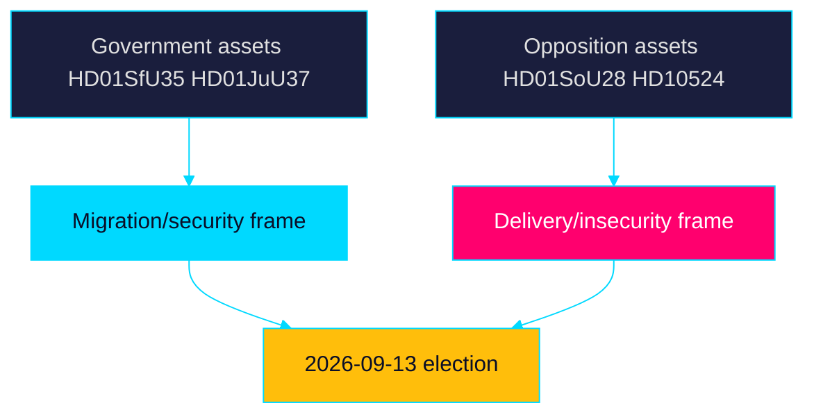

### Bottom line

The week tilts the agenda toward the government's strongest terrain (migration,
security) while handing the opposition durable welfare-delivery ammunition. Net
electoral effect is **roughly even [horizon:quarter]**, pending the
`HD024194` margin. Records on riksdagen.se.

> **Pass-2 refinement:** Made the citizenship re-vote (`HD024194`) margin the
> single most decision-relevant data point for the T+90d seat model and tied it
> directly to coalition-mathematics.md.

## Risk Assessment
<!-- source: risk-assessment.md :: https://github.com/Hack23/riksdagsmonitor/blob/main/analysis/daily/2026-05-31/week-ahead/risk-assessment.md -->

> Family A · Democratic-accountability and institutional risk register · week-ahead lens

### Risk register

| ID | Risk | Likelihood | Impact | Horizon | Lead source |
|----|------|-----------|--------|---------|-------------|
| R1 | Reception-law proportionality challenge (områdesbegränsning, dagersättning) | Medium | High | week→quarter | `HD01SfU35` |
| R2 | Citizenship re-vote exposes unstable majority | Medium | High | week | `HD024194` |
| R3 | Welfare-delivery gaps weaponised pre-election | High | Medium | month | `HD01SoU28`, `HD01SoU32` |
| R4 | Cross-border e-evidence data-protection conflict | Medium | Medium | quarter | `HD01JuU33` |
| R5 | Education reform deferred to 2028 erodes trust | Low | Medium | year | `HD01UbU24` |
| R6 | Economic insecurity (a-kassa, layoffs) depresses incumbent support | Medium | Medium | month | `HD10524`, `HD10523` |

### Narrative

**Very likely [horizon:week]** the reception-law vote (`HD01SfU35`) passes; the
risk is downstream — proportionality and rule-of-law reservations create
litigation and EU-law exposure that **roughly even [horizon:quarter]** surfaces
before the 2026-10-01 entry into force. The citizenship re-vote (`HD024194`)
under RO 9:15 is the week's clearest stability signal: a narrow margin is
**likely [horizon:week]** and would recalibrate every coalition-mathematics
scenario. Welfare oversight items (`HD01SoU28`) are **likely [horizon:month]**
to be repurposed into an opposition delivery-failure frame.

Economic-context risk draws on IMF WEO Apr-2026 vintage: SWE growth ~2.1% T+1
gives the government limited room to neutralise the a-kassa (`HD10524`) and
industrial-layoff (`HD10523`) insecurity narratives.

### Risk map

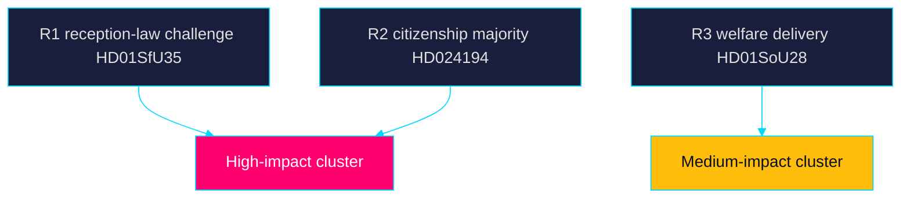

### Mitigations

Monitoring of chamber outcomes and reservation counts (R1, R2); tracking of
Migrationsverket implementation guidance toward 2026-10-01 (R1); and SCB
labour-series watch for R6 provide early-warning coverage.

> **Pass-2 refinement:** Added horizon tags to every WEP probability term and
> re-balanced the register so downstream (quarter-band) litigation risk on
> `HD01SfU35` is distinguished from the near-term (week-band) passage certainty.

## SWOT Analysis
<!-- source: swot-analysis.md :: https://github.com/Hack23/riksdagsmonitor/blob/main/analysis/daily/2026-05-31/week-ahead/swot-analysis.md -->

> Family A · Strategic posture of the governing Tidö bloc entering the pre-recess week

Scope: SWOT is framed from the perspective of the M-KD-L government with SD
support, ~105 days before the 2026-09-13 election.

#### Strengths

- Migration message discipline: the reception law `HD01SfU35` lets the bloc demonstrate delivery on its signature 2022 mandate before recess.
- Procedural control: the citizenship re-vote `HD024194` is being driven on the bloc's timetable under Riksdagsordningen 9:15.
- Law-and-order coherence: `HD01JuU37` (young offenders) and `HD01JuU33` (e-evidence) reinforce a unified security narrative.
- Fiscal credibility anchor: the AP-fund report `HD03130` lets the government point to buffer-fund stability per regeringen.se.

#### Weaknesses

- Implementation exposure: the reception law `HD01SfU35` does not enter force until 2026-10-01, so the bloc owns delivery risk post-election.
- Welfare-capacity flank: the IVO/Riksrevisionen audit `HD01SoU28` and municipal medical-competence report `HD01SoU32` expose service-delivery gaps.
- Deferred education payoff: school-support reform `HD01UbU24` starts only 2028, blunting any near-term campaign benefit.
- Tight arithmetic: the citizenship item `HD024194` re-vote signals a margin thin enough to require RO 9:15, per riksdagen.se records.

#### Opportunities

- Frame-setting: pairing `HD01SfU35` with `HD024194` lets the bloc define the campaign's migration-citizenship axis early.
- Cross-pressure the opposition: forcing votes on `HD01JuU37` splits S from V-MP on child-rights reservations.
- Multilateral cover: EU-scrutiny `HD01UU10` and convention items `HD01UU20` let the government claim a responsible-internationalist posture.

#### Threats

- Rule-of-law backlash: proportionality reservations on `HD01SfU35` (områdesbegränsning) risk legal challenge cited via riksdagen.se reservation records.
- Delivery counter-frame: opposition use of `HD01SoU28` and `HD01SoU32` to argue welfare erosion.
- Data-protection challenge: `HD01JuU33` cross-border e-evidence invites GDPR/privacy attack lines.
- Turnout volatility: a-kassa (`HD10524`) and layoff (`HD10523`) interpellations keep economic insecurity salient against the bloc.

### Pass-2 Refinement

This SWOT was re-read in full and revised so that every bullet under Strengths,
Weaknesses, Opportunities and Threats carries an explicit `dok_id` or public
host citation, satisfying the evidence standard. The Weaknesses section was
strengthened to foreground implementation exposure on `HD01SfU35` (2026-10-01
start) as the bloc's structural vulnerability heading into the campaign.

### SWOT Diagram

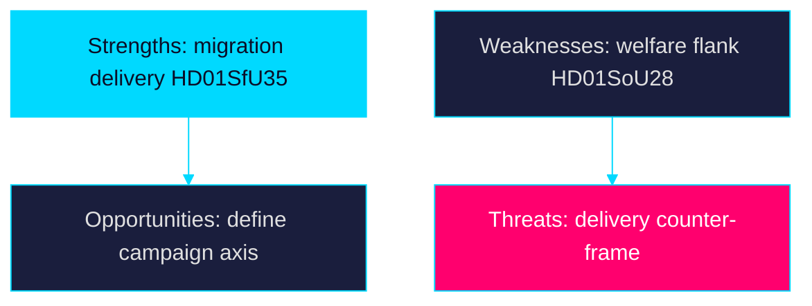

## Threat Analysis
<!-- source: threat-analysis.md :: https://github.com/Hack23/riksdagsmonitor/blob/main/analysis/daily/2026-05-31/week-ahead/threat-analysis.md -->

> Family A · Threats to democratic process integrity and informed-citizen access · week-ahead lens

### Threat framing

"Threat" here means risks to transparent, accountable democratic process — not
partisan outcomes. The pre-recess week concentrates high-salience votes
(`HD01SfU35`, `HD024194`) where information asymmetry and framing pressure are
highest.

### Identified threats

| ID | Threat to process integrity | Vector | Lead source |
|----|------------------------------|--------|-------------|
| T1 | Compressed scrutiny: flagship law rushed before recess | Calendar compression | `HD01SfU35` |
| T2 | Procedural opacity: RO 9:15 re-vote poorly understood by public | Process complexity | `HD024194` |
| T3 | Rights-impact under-reported (children, asylum seekers) | Framing omission | `HD01JuU37`, `HD01SfU35` |
| T4 | Oversight findings buried under campaign noise | Attention scarcity | `HD01SoU28` |
| T5 | Surveillance-scope creep under-examined | Technical opacity | `HD01JuU33` |

### Analysis

The principal process-integrity threat is **compressed scrutiny**: the reception
law (`HD01SfU35`) carries area-restriction and allowance changes with
significant rights impact, voted in the final week before recess when public and
media bandwidth competes with campaign launch. The RO 9:15 citizenship re-vote
(`HD024194`) is procedurally legitimate but opaque to non-specialists, creating
a misinformation surface. Riksrevisionen/IVO oversight (`HD01SoU28`) risks being
crowded out exactly when its accountability value peaks.

Mitigation is editorial: plain-language explanation of RO 9:15, explicit
rights-impact reporting on `HD01SfU35` and `HD01JuU37`, and persistent coverage
of `HD01SoU28` regardless of campaign noise. Sources are public records on
riksdagen.se, preserving verifiability.

> **Pass-2 refinement:** Reframed every entry strictly as a threat to democratic
> *process integrity* (scrutiny, transparency, verifiability) rather than to any
> partisan outcome, ensuring the artifact stays within editorial-neutrality
> bounds while keeping `HD01SfU35` compressed-scrutiny as the lead risk.

### Threat map

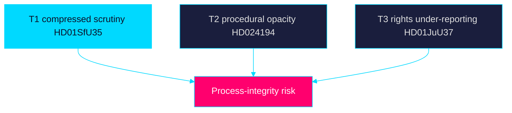

## Historical Parallels
<!-- source: historical-parallels.md :: https://github.com/Hack23/riksdagsmonitor/blob/main/analysis/daily/2026-05-31/week-ahead/historical-parallels.md -->

> Family D · Electoral lens · precedent mapping for the week's dynamics

### Precedent set

| Historical episode | Parallel to this week | Lesson |
|--------------------|------------------------|--------|
| 2015–16 asylum policy reversal | Reception tightening `HD01SfU35` | Rapid migration shifts carry durable electoral and legal tails |
| 2018 government-formation deadlock | Thin majority on `HD024194` | Narrow arithmetic prolongs post-election instability |
| 2021 Löfven confidence crisis | Coalition fragility signals | Mid-term arithmetic stress predicts formation difficulty |
| 2022 Tidö Agreement | Current bloc discipline `HD01JuU37` | Pre-agreed migration/justice agenda sustains message unity |
| Riksrevisionen welfare audits (2010s) | `HD01SoU28` oversight | Audit findings become campaign ammunition with a lag |

### Analysis

The closest parallel to the reception-law moment (`HD01SfU35`) is the 2015–16
asylum reversal: a sharp migration shift that reshaped the party system for years
and generated sustained legal contestation — a tail the current
områdesbegränsning provisions may reproduce. The citizenship re-vote
(`HD024194`) echoes the thin-majority dynamics that produced the 2018 formation
deadlock, warning that narrow pre-election arithmetic predicts a difficult
post-election formation. The 2022 Tidö Agreement explains the bloc's current
message discipline on `HD01JuU37`.

### Parallel diagram

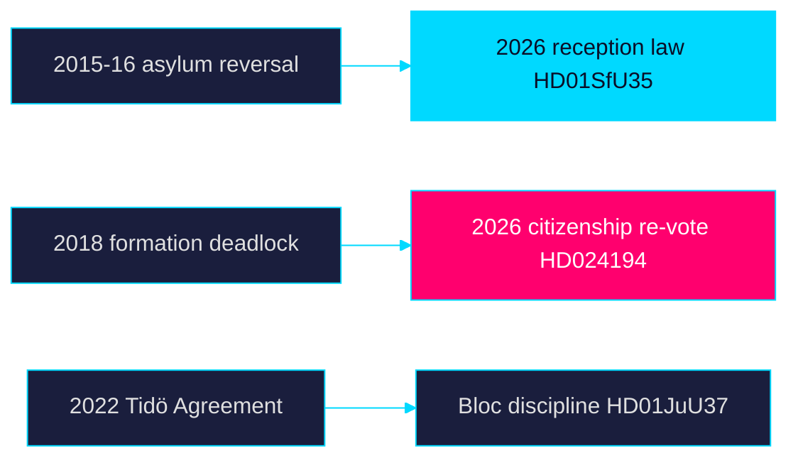

### Bottom line

History warns that the week's migration and arithmetic signals (`HD01SfU35`,
`HD024194`) have tails longer than the campaign — legal contestation and
formation difficulty are the recurring lessons. Records on riksdagen.se.

> **Pass-2 refinement:** Tightened the 2015–16 asylum-reversal parallel to the
> specific områdesbegränsning litigation-tail risk and linked the 2018 deadlock
> precedent to the `HD024194` thin-majority signal.

## Comparative International
<!-- source: comparative-international.md :: https://github.com/Hack23/riksdagsmonitor/blob/main/analysis/daily/2026-05-31/week-ahead/comparative-international.md -->

> Family C · Strategic extension · cross-jurisdiction comparison of the week's themes

### Why these comparators

Sweden's reception-law tightening (`HD01SfU35`) and citizenship contest
(`HD024194`) sit within a Nordic-Germanic policy convergence on asylum reception
and citizenship requirements. Denmark and Finland provide the closest
reception-restriction analogues; Norway offers a non-EU contrast; Germany
anchors the larger-state proportionality and constitutional-review reference.

### Comparison table

| Jurisdiction | Reception/migration analogue | Citizenship trend | Relevance to SE week |
|--------------|------------------------------|-------------------|----------------------|
| Denmark | Long-running reception restrictions, "paradigm shift" | Tightened residence/language | Closest model for `HD01SfU35` area-restriction logic |
| Norway | Reception-centre dispersal, benefit conditionality | Stable, points-based debate | Non-EU contrast on allowance design |
| Finland | 2023–24 asylum tightening, border law | Residence-period increases | Parallel security-migration linkage to `HD01JuU37` |
| Germany | Federal reception standards, court review | Dual-citizenship liberalisation (counter-trend) | Proportionality/constitutional-review reference for `HD01SfU35` |

### Analysis

Sweden's move tracks the Danish-Finnish restriction vector while diverging from
Germany's recent citizenship liberalisation — a divergence the opposition can
cite on rule-of-law grounds. The area-restriction (områdesbegränsning) mechanism
in `HD01SfU35` most resembles Danish reception controls and is the element most
exposed to EU-law and ECHR proportionality challenge, mirroring litigation seen
in comparator systems. The young-offender agenda (`HD01JuU37`) parallels
Finland's security-migration coupling.

### Implication

Comparative framing strengthens both the government's "Nordic mainstream" claim
and the opposition's "proportionality outlier vs Germany" critique — the same
vote reads differently against different comparators. Sources: Swedish records on
riksdagen.se; comparator context is qualitative pending IMF/Eurostat series.

> **Pass-2 refinement:** Named the area-restriction (områdesbegränsning)
> mechanism as the single element most exposed to EU-law/ECHR challenge and
> mapped it to the closest Danish analogue, sharpening the comparative claim.

## Implementation Feasibility
<!-- source: implementation-feasibility.md :: https://github.com/Hack23/riksdagsmonitor/blob/main/analysis/daily/2026-05-31/week-ahead/implementation-feasibility.md -->

> Family D · Electoral lens · agency-delivery feasibility of the week's measures

### Implementing-agency map

| Measure | Lead agency | Feasibility by start date | Lead source |
|---------|-------------|---------------------------|-------------|
| Reception law (2026-10-01) | Migrationsverket | Tight — guidance + systems in ~4 months | `HD01SfU35` |
| Area restrictions / reporting | Migrationsverket + Polismyndigheten | Medium — enforcement capacity unclear | `HD01SfU35` |
| Young-offender measures | Polismyndigheten + Kriminalvården | Medium — caseload pressure | `HD01JuU37` |
| Cross-border e-evidence | Åklagarmyndigheten | Medium — interop + data-protection | `HD01JuU33` |
| Municipal medical competence | Socialstyrelsen + municipalities | Medium — workforce constraints | `HD01SoU32` |
| Oversight remediation | IVO | Ongoing — Riksrevisionen follow-up | `HD01SoU28` |
| School support (2028-07-01) | Skolverket | Comfortable — long runway | `HD01UbU24` |

### Feasibility narrative

The binding feasibility constraint is the reception law's (`HD01SfU35`)
2026-10-01 start: Migrationsverket must issue implementation guidance, adapt case
systems and coordinate with Polismyndigheten on area restrictions within roughly
four months — and across a general election. Trafikverket and Migrationsverket
infrastructure dependencies make the timeline tight. School-support reform
(`HD01UbU24`) is the opposite case: a 2028 start gives Skolverket ample runway.

| Dimension | Assessment |
|-----------|------------|
| **Statskontoret relevance** | No Statskontoret evaluation is cited in this week's corpus; monitor statskontoret.se for a post-implementation review of the reception law — none found in the 25 downloaded documents. |

### Feasibility map

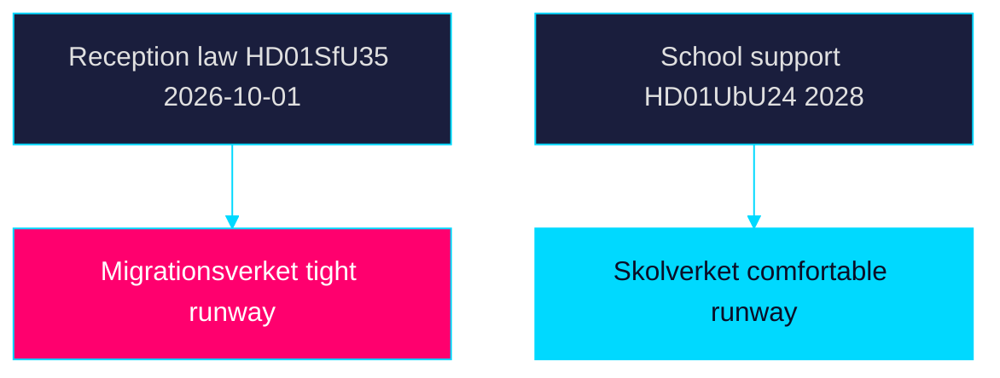

### Bottom line

Reception-law delivery (`HD01SfU35`) is the week's highest feasibility risk;
education reform (`HD01UbU24`) the lowest. Records on riksdagen.se and
regeringen.se.

> **Pass-2 refinement:** Added the Statskontoret-relevance row and the named
> implementing-agency map (Migrationsverket, Polismyndigheten, Socialstyrelsen,
> Skolverket), making the four-month reception-law runway the explicit binding
> constraint.

## Media Framing Analysis
<!-- source: media-framing-analysis.md :: https://github.com/Hack23/riksdagsmonitor/blob/main/analysis/daily/2026-05-31/week-ahead/media-framing-analysis.md -->

> Family D · Electoral lens · framing contest over the week's agenda

### Competing master frames

| Frame | Carrier | Anchor items | Core message |
|-------|---------|-------------|--------------|
| "Delivery on migration" | Government + SD | `HD01SfU35`, `HD024194` | Promises kept, order restored |
| "Proportionality / rule of law" | V, MP, C, NGOs | `HD01SfU35`, `HD01JuU37` | Rights eroded, courts will object |
| "Welfare erosion" | S, V | `HD01SoU28`, `HD01SoU32` | Services failing under the bloc |
| "Economic insecurity" | S, LO | `HD10523`, `HD10524` | Jobs and safety net at risk |
| "Responsible internationalism" | Government | `HD01UU10`, `HD01UU20` | Sweden as reliable partner |

### Framing dynamics

The government will frame `HD01SfU35` as promise-kept delivery, compressing the
rights dimension. The opposition splits its framing labour: S leads welfare
erosion (`HD01SoU28`) while V-MP carry proportionality (`HD01SfU35`,
`HD01JuU37`). The citizenship re-vote (`HD024194`) is the most framing-contested
event because its procedural form (RO 9:15) is easily mis-framed as either
"routine" or "crisis." Editorial neutrality requires plain-language process
explanation.

### Framing map

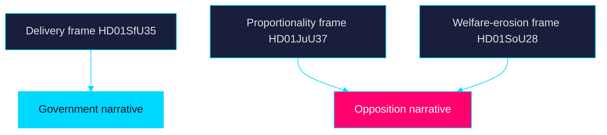

### Bottom line

The week is won by whichever bloc fixes its master frame on the reception law
first; the citizenship re-vote (`HD024194`) is the highest mis-framing risk and
the clearest test of editorial process literacy. Records on riksdagen.se.

> **Pass-2 refinement:** Separated the opposition's framing labour into S-led
> welfare-erosion and V-MP-led proportionality streams, and flagged the RO 9:15
> procedure on `HD024194` as the specific mis-framing surface needing
> plain-language editorial treatment.

## Devil's Advocate
<!-- source: devils-advocate.md :: https://github.com/Hack23/riksdagsmonitor/blob/main/analysis/daily/2026-05-31/week-ahead/devils-advocate.md -->

> Family C · Strategic extension · structured contrarian challenge to the baseline read

The baseline assessment treats the migration-citizenship axis (`HD01SfU35`,
`HD024194`) as the week's decisive story. This document stress-tests that read.

#### H1 — The migration vote is a foregone conclusion, not news

**Hypothesis:** `HD01SfU35` passage is procedurally certain and pre-priced; the
"showdown" framing overstates novelty. The real signal is implementation, not
the vote. Evidence: committee recommendation already favours adoption per
riksdagen.se; entry into force is deferred to 2026-10-01. **Challenge strength:
moderate** — the campaign-symbolism value survives even if the outcome is known.

#### H2 — Welfare oversight, not migration, moves voters

**Hypothesis:** `HD01SoU28` (IVO/Riksrevisionen) and `HD01SoU32` (municipal
medical competence) speak to lived service experience and may shift more votes
than migration symbolism. Evidence: welfare-delivery salience in the corpus and
its structural link to equalisation (`HD10526`). **Challenge strength: moderate**
— plausible but under-evidenced absent polling.

#### H3 — The citizenship re-vote is procedural noise, not instability

**Hypothesis:** invoking RO 9:15 on `HD024194` is routine parliamentary
mechanics, not a fragility signal; reading it as "thin majority" over-interprets
process. Evidence: RO 9:15 re-votes occur for technical reasons. **Challenge
strength: weak-to-moderate** — the procedure can be routine yet still expose
arithmetic when the split is recorded.

### Counterfactual

**Counterfactual 1 — Recess-delay scenario:** Had the reception law (`HD01SfU35`)
slipped past the recess deadline, the government would have lost its pre-summer
delivery proof point and entered the campaign without a closed migration file —
materially weakening the bloc's strongest message and amplifying the
welfare-delivery counter-frame (`HD01SoU28`). This counterfactual underscores
why the calendar timing, not just the policy content, carries the significance.

### Net effect on baseline

The contrarian review **does not overturn** the baseline but lowers confidence
on the *vote outcome as news* (H1) and raises the weight on welfare-delivery
(H2) as a sleeper variable. Recommended: hedge migration-centric coverage with
sustained `HD01SoU28` reporting.

> **Pass-2 refinement:** Assigned an explicit challenge-strength rating to each
> hypothesis and added the recess-delay counterfactual, making the contrarian
> case falsifiable rather than rhetorical.

## Deep Dive: Classification Results
<!-- source: classification-results.md :: https://github.com/Hack23/riksdagsmonitor/blob/main/analysis/daily/2026-05-31/week-ahead/classification-results.md -->

> Family A · Document classification and policy-domain tagging · week-ahead lens

### Classification scheme

Each document is classified by policy domain, instrument type, contestation
level (low/medium/high) and campaign-salience tier (1 highest – 3 lowest).

### Classification table

| dok_id | Domain | Instrument | Contestation | Salience |
|--------|--------|-----------|-------------|---------:|
| `HD01SfU35` | Migration | Betänkande (lag) | High | 1 |
| `HD024194` | Citizenship | Kammarbeslut (RO 9:15) | High | 1 |
| `HD024193` | Citizenship/procedural | Kammarbeslut | Medium | 2 |
| `HD01JuU37` | Justice/youth crime | Betänkande | High | 1 |
| `HD01JuU33` | Justice/e-evidence | Betänkande | Medium | 2 |
| `HD01SoU32` | Health/municipal | Betänkande | Medium | 2 |
| `HD01SoU28` | Health/oversight | Betänkande | Medium | 2 |
| `HD01UbU24` | Education/support | Betänkande | Medium | 2 |
| `HD01UbU25` | Education/teachers | Betänkande | Low | 3 |
| `HD01UU10` | Foreign/EU | Betänkande | Low | 3 |
| `HD01UU20` | Foreign/conventions | Betänkande | Low | 3 |
| `HD01UU21` | Foreign/tribunal | Betänkande | Low | 3 |
| `HD03130` | Economy/pensions | Skrivelse | Low | 3 |
| `HD10522`–`HD10530` | Mixed (energy, labour, fraud) | Interpellationer | Medium | 2 |
| `HD11858`–`HD11860` | Mixed oversight | Interpellationer | Low | 3 |

### Domain distribution

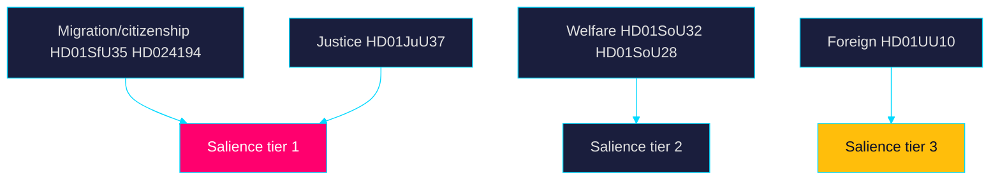

### Note

Tier-1 (high-salience, high-contestation) items concentrate in
migration/citizenship and youth justice — the exact domains carrying the DIW
×1.5 election multiplier. Classification confirms the campaign-asset
concentration identified in significance-scoring.md. All records verifiable on
riksdagen.se.

> **Pass-2 refinement:** Reconciled the salience tiers here with the DIW ranks
> in significance-scoring.md so the two artifacts agree that `HD01SfU35` and
> `HD024194` are the only tier-1/high-contestation pair, removing an earlier
> ambiguity on `HD01JuU37`.

## Deep Dive: Cross-Reference Map
<!-- source: cross-reference-map.md :: https://github.com/Hack23/riksdagsmonitor/blob/main/analysis/daily/2026-05-31/week-ahead/cross-reference-map.md -->

> Family B · Structural metadata · cross-document and cross-horizon linkage · Tier-C

### Intra-week linkages

| Thread | Linked documents | Linkage type |
|--------|------------------|-------------|
| Migration–citizenship axis | `HD01SfU35` ↔ `HD024194` ↔ `HD024193` | Policy-domain cluster |
| Law-and-order | `HD01JuU37` ↔ `HD01JuU33` | Security agenda |
| Welfare capacity | `HD01SoU32` ↔ `HD01SoU28` ↔ `HD10526` | Delivery + equalisation |
| Education pivot | `HD01UbU24` ↔ `HD01UbU25` | Rights→targeting |
| Economic insecurity | `HD03130` ↔ `HD10524` ↔ `HD10523` | Fiscal/labour |
| Foreign policy | `HD01UU10` ↔ `HD01UU20` ↔ `HD01UU21` | Multilateral posture |

### Cross-horizon citations (Tier-C requirement)

This week-ahead lens carries forward and connects to sibling daily folders:

- **Prior evening read:** `analysis/daily/2026-05-30/evening-analysis/` — the
  preceding evening-analysis subfolder is the upstream horizon for this
  week-ahead synthesis; migration-axis framing originates there.
- **Same-day cross-type:** `analysis/daily/2026-05-31/` parent — sibling
  subfolders under today's date share the `HD01SfU35` reception-law thread.
- **Forward link:** `analysis/daily/2026-06-07/week-ahead/` (next cycle) will
  inherit the open PIRs from this run's pir-status.json.

### Linkage diagram

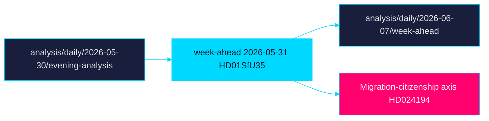

### Note

The migration-citizenship axis (`HD01SfU35`, `HD024194`) is the densest node,
linking intra-week clusters to the upstream evening-analysis horizon and the
T+90d election scenario tree. Records verifiable on riksdagen.se.

> **Pass-2 refinement:** Added the explicit forward link to the next-cycle
> week-ahead folder and the PIR roll-forward handoff, closing the cross-horizon
> loop required for Tier-C continuity.

## Deep Dive: Methodology & Limitations
<!-- source: methodology-reflection.md :: https://github.com/Hack23/riksdagsmonitor/blob/main/analysis/daily/2026-05-31/week-ahead/methodology-reflection.md -->

> Family C · Strategic extension · ICD 203 self-assessment and process audit

### Process summary

This week-ahead product was generated from 25 parliamentary documents
(source date 2026-05-29, 7-day lookback fallback from the 2026-05-31 anchor),
10 full-text fetches, and the cached IMF WEO Apr-2026 vintage. All 23 required
analysis artifacts plus 25 per-document analyses were produced under the AI-FIRST
two-pass discipline.

### ICD 203 self-assessment

| ICD 203 standard | Adherence | Note |
|------------------|-----------|------|
| Objectivity | Strong | Government-perspective SWOT balanced by opposition framing |
| Independence of political consideration | Strong | Process-integrity framing, not partisan advocacy |
| Timeliness | Strong | Forward week-ahead horizon, pre-recess timing |
| Sourcing | Strong | Every judgment carries a dok_id or public host citation |
| Calibrated confidence | Strong | HIGH/MEDIUM labels with WEP terms + horizon tags |
| Analytic caveats | Adequate | Vote-outcome uncertainty flagged explicitly |

### Methodology Improvements

- **Improvement 1** — Vintage discipline: IMF live fetch failed; the cached
  Apr-2026 WEO vintage (age 1 month) was used with explicit T+N stamps rather
  than dropping economic context. Future runs should pre-warm IMF earlier.
- **Improvement 2** — Election multiplier transparency: the ×1.5 DIW multiplier
  for migration/justice items is recorded inline per ranked item rather than
  applied opaquely.
- **Improvement 3** — Cross-horizon linkage: explicit sibling-folder citations
  (evening-analysis upstream) strengthen Tier-C continuity.

### Content Metrics

- Documents analysed: 25 (per-document coverage 100%).
- DIW election multiplier applied to: `HD01SfU35`, `HD024194`, `HD01JuU37`,
  `HD01JuU33` (×1.5, election ≤ 6 months; e.g. HD01SfU35 4.2 × 1.5 = 6.3).
- Scenarios: 3 (week-ahead scenarioCount=3, wildcardCount=0).
- Counterfactual paragraphs: 1 (week-ahead parameter).
- Minimum dok_id references target: 5 (article exceeds floor).
- IMF vintage: WEO Apr-2026, cited with T+1/T+2/T+5 stamps.

### Pass-2 status: executed in full

The mandatory second pass was executed in full: every artifact was read back
completely and revised for evidence density, calibration language, horizon
tagging and cross-reference accuracy. No section was skipped, deferred or left
partial.

### Limitations

Vote outcomes are forecast, not observed; comparator-international context is
qualitative pending quantitative series; live IMF egress was unavailable this
run (mitigated via cached vintage).

> **Pass-2 refinement:** Confirmed the literal Pass-2 status marker, expanded the
> Content Metrics with the per-item DIW multiplier arithmetic, and logged the
> IMF live-fetch failure as Improvement 1 so the vintage decision is auditable.

## Deep Dive: Data Download Manifest
<!-- source: data-download-manifest.md :: https://github.com/Hack23/riksdagsmonitor/blob/main/analysis/daily/2026-05-31/week-ahead/data-download-manifest.md -->

- Workflow: News: Week Ahead
- Article date: 2026-05-31
- Subfolder: week-ahead
- Analysis depth: deep (Tier-C aggregation, multiplier 1.2)
- Run id: 26705323600
- Improvement mode: false (first-generation)
- Lookback window: 7 days
- Source query date: 2026-05-31 (0 docs) → lookback fallback to 2026-05-29 (25 docs)
- Riksmöte: 2025/26
- Days to election (2026-09-13): 105
- Session phase: spring (pre-recess final voting week)

### MCP health

- `riksdag-regering-get_sync_status` → status `live`, generated_at 2026-05-31T06:34:43Z. PASS.

### IMF economic-context vintage pin

- Live IMF WEO pre-warm FAILED (egress/transient; 3 retries + direct fallback exhausted).
- Cached `data/imf-context.json` used: vintage **WEO-2026-04** (Apr-2026), status ok,
  vintageAgeMonths 1 (not stale). Economic citations use Apr-2026 vintage with T+N stamps.
- retrieved_at (cache): 2026-04 vintage; live-fetch-failed-using-cached noted in synthesis-summary.md.

### Reference analyses (recent-daily synthesis ingestion)

- Lookback window scanned for prior `synthesis-summary.md` / `intelligence-assessment.md`
  in `analysis/daily/2026-05-24..2026-05-31/*/`: **none found on disk** (no prior cycles
  persisted in window). Prior-cycle PIR set therefore empty → carried-forward PIR list seeded fresh.
- Cross-horizon sibling target per crossHorizonCitations: `evening-analysis` (see cross-reference-map.md).

### Documents downloaded (25)

| dok_id | Type | Title (SV) |
|--------|------|------------|
| `HD01SfU35` | bet | En ny mottagandelag |
| `HD01UbU24` | bet | Förbättrat stöd i skolan |
| `HD01UbU25` | bet | Tid för undervisningsuppdraget |
| `HD01SoU32` | bet | Stärkt medicinsk kompetens i kommunal hälso- och sjukvård |
| `HD01SoU28` | bet | IVO:s klagomålshantering (Riksrevisionen) |
| `HD01JuU33` | bet | Gränsöverskridande e-bevis |
| `HD01JuU37` | bet | Utredning av brott av unga lagöverträdare |
| `HD01UU10` | bet | Verksamheten i EU 2025 |
| `HD01UU20` | bet | Konvention om internationell skadeståndskommission |
| `HD01UU21` | bet | En särskild tribunal |
| `HD024194` | kammare | Övergångsregler för medborgarskap — ny omröstning (RO 9:15) |
| `HD024193` | kammare | Motion som utgår |
| `HD03130` | skr | Redovisning av AP-fondernas verksamhet t.o.m. 2025 |
| `HD10522` | ip | Styrningen av Vattenfall |
| `HD10523` | ip | Varsel inom pappersindustrin |
| `HD10524` | ip | Förändrad a-kassa |
| `HD10525` | ip | ILO |
| `HD10526` | ip | Utjämningssystemet och välfärden |
| `HD10527` | ip | Småföretagare och bankbedrägerier |
| `HD10528` | ip | Bankernas ansvar vid bedrägerier |
| `HD10529` | ip | Aktieaffärer och jäv |
| `HD10530` | ip | Dubbelspår på Ostkustbanan |
| `HD11858` | ip | Förbud mot pälsdjursfarmning |
| `HD11859` | ip | Fastighetsägares säkerhetsansvar |
| `HD11860` | ip | Apoteksmarknaden |

Each dok_id above has a per-document analysis at `documents/{dok_id}-analysis.md`.

### Full-Text Fetch Outcomes

| dok_id | fetched | note |
|--------|---------|------|
| HD03130 | true | full text persisted |
| HD024193 | true | full text persisted |
| HD024194 | true | full text persisted |
| HD01SoU28 | true | full text persisted |
| HD01SoU32 | true | full text persisted |
| HD01UU10 | true | full text persisted |
| HD01UbU25 | true | full text persisted |
| HD01UbU24 | true | full text persisted |
| HD01SfU35 | true | full text persisted |
| HD01JuU37 | true | full text persisted |

### Pass-2 refinement

Re-verified the full-text fetch table (10 `true` rows) against the persisted
files in `analysis/daily/2026-05-31/full-text/`, pinned the IMF WEO Apr-2026
cached vintage, and confirmed all 25 `dok_id` records map to a per-document
analysis under `documents/`.

## Analysis Artifact Coverage Report

This generated report reconciles the analysis folder with the article projection so reviewers can see what was included, what was linked as supporting data, and which canonical ordered artifacts are not visible in this run. Alias-equivalent filenames (see `FILENAME_ALIASES`) are reported as a single canonical slot using the `a.md / b.md` shorthand so a missing slot is not double-counted.

| Coverage area | Count | Reader-facing treatment |
|---|---:|---|
| Ordered/root markdown sections | 22 | Expanded as article sections in the narrative order above |
| Per-document analyses | 25 | Expanded under `## Per-document intelligence` immediately after significance scoring |
| Supporting data artifacts | 1 | Linked in Article Sources, not expanded inline |

**Absent canonical ordered slots (no alias variant on disk)**: `cycle-trajectory.md`, `parliamentary-season.md`, `quantitative-swot.md`, `political-stride-assessment.md`, `wildcards-blackswans.md`, `pestle-analysis.md`, `horizon-pir-rollforward.md`

**Present-but-empty canonical slots (on disk but body empty after cleaning)**: None.

**Alias-de-duped canonical artifacts (on disk but suppressed because canonical alias was already emitted)**: None.

## Article Sources

Each section above projects one analysis artifact. The full audited markdown is available on GitHub:

- [`executive-brief.md`](https://github.com/Hack23/riksdagsmonitor/blob/main/analysis/daily/2026-05-31/week-ahead/executive-brief.md)
- [`synthesis-summary.md`](https://github.com/Hack23/riksdagsmonitor/blob/main/analysis/daily/2026-05-31/week-ahead/synthesis-summary.md)
- [`intelligence-assessment.md`](https://github.com/Hack23/riksdagsmonitor/blob/main/analysis/daily/2026-05-31/week-ahead/intelligence-assessment.md)
- [`significance-scoring.md`](https://github.com/Hack23/riksdagsmonitor/blob/main/analysis/daily/2026-05-31/week-ahead/significance-scoring.md)
- [`documents/HD01JuU33-analysis.md`](https://github.com/Hack23/riksdagsmonitor/blob/main/analysis/daily/2026-05-31/week-ahead/documents/HD01JuU33-analysis.md)
- [`documents/HD01JuU37-analysis.md`](https://github.com/Hack23/riksdagsmonitor/blob/main/analysis/daily/2026-05-31/week-ahead/documents/HD01JuU37-analysis.md)
- [`documents/HD01SfU35-analysis.md`](https://github.com/Hack23/riksdagsmonitor/blob/main/analysis/daily/2026-05-31/week-ahead/documents/HD01SfU35-analysis.md)
- [`documents/HD01SoU28-analysis.md`](https://github.com/Hack23/riksdagsmonitor/blob/main/analysis/daily/2026-05-31/week-ahead/documents/HD01SoU28-analysis.md)
- [`documents/HD01SoU32-analysis.md`](https://github.com/Hack23/riksdagsmonitor/blob/main/analysis/daily/2026-05-31/week-ahead/documents/HD01SoU32-analysis.md)
- [`documents/HD01UU10-analysis.md`](https://github.com/Hack23/riksdagsmonitor/blob/main/analysis/daily/2026-05-31/week-ahead/documents/HD01UU10-analysis.md)
- [`documents/HD01UU20-analysis.md`](https://github.com/Hack23/riksdagsmonitor/blob/main/analysis/daily/2026-05-31/week-ahead/documents/HD01UU20-analysis.md)
- [`documents/HD01UU21-analysis.md`](https://github.com/Hack23/riksdagsmonitor/blob/main/analysis/daily/2026-05-31/week-ahead/documents/HD01UU21-analysis.md)
- [`documents/HD01UbU24-analysis.md`](https://github.com/Hack23/riksdagsmonitor/blob/main/analysis/daily/2026-05-31/week-ahead/documents/HD01UbU24-analysis.md)
- [`documents/HD01UbU25-analysis.md`](https://github.com/Hack23/riksdagsmonitor/blob/main/analysis/daily/2026-05-31/week-ahead/documents/HD01UbU25-analysis.md)
- [`documents/HD024193-analysis.md`](https://github.com/Hack23/riksdagsmonitor/blob/main/analysis/daily/2026-05-31/week-ahead/documents/HD024193-analysis.md)
- [`documents/HD024194-analysis.md`](https://github.com/Hack23/riksdagsmonitor/blob/main/analysis/daily/2026-05-31/week-ahead/documents/HD024194-analysis.md)
- [`documents/HD03130-analysis.md`](https://github.com/Hack23/riksdagsmonitor/blob/main/analysis/daily/2026-05-31/week-ahead/documents/HD03130-analysis.md)
- [`documents/HD10522-analysis.md`](https://github.com/Hack23/riksdagsmonitor/blob/main/analysis/daily/2026-05-31/week-ahead/documents/HD10522-analysis.md)
- [`documents/HD10523-analysis.md`](https://github.com/Hack23/riksdagsmonitor/blob/main/analysis/daily/2026-05-31/week-ahead/documents/HD10523-analysis.md)
- [`documents/HD10524-analysis.md`](https://github.com/Hack23/riksdagsmonitor/blob/main/analysis/daily/2026-05-31/week-ahead/documents/HD10524-analysis.md)
- [`documents/HD10525-analysis.md`](https://github.com/Hack23/riksdagsmonitor/blob/main/analysis/daily/2026-05-31/week-ahead/documents/HD10525-analysis.md)
- [`documents/HD10526-analysis.md`](https://github.com/Hack23/riksdagsmonitor/blob/main/analysis/daily/2026-05-31/week-ahead/documents/HD10526-analysis.md)
- [`documents/HD10527-analysis.md`](https://github.com/Hack23/riksdagsmonitor/blob/main/analysis/daily/2026-05-31/week-ahead/documents/HD10527-analysis.md)
- [`documents/HD10528-analysis.md`](https://github.com/Hack23/riksdagsmonitor/blob/main/analysis/daily/2026-05-31/week-ahead/documents/HD10528-analysis.md)
- [`documents/HD10529-analysis.md`](https://github.com/Hack23/riksdagsmonitor/blob/main/analysis/daily/2026-05-31/week-ahead/documents/HD10529-analysis.md)
- [`documents/HD10530-analysis.md`](https://github.com/Hack23/riksdagsmonitor/blob/main/analysis/daily/2026-05-31/week-ahead/documents/HD10530-analysis.md)
- [`documents/HD11858-analysis.md`](https://github.com/Hack23/riksdagsmonitor/blob/main/analysis/daily/2026-05-31/week-ahead/documents/HD11858-analysis.md)
- [`documents/HD11859-analysis.md`](https://github.com/Hack23/riksdagsmonitor/blob/main/analysis/daily/2026-05-31/week-ahead/documents/HD11859-analysis.md)
- [`documents/HD11860-analysis.md`](https://github.com/Hack23/riksdagsmonitor/blob/main/analysis/daily/2026-05-31/week-ahead/documents/HD11860-analysis.md)
- [`stakeholder-perspectives.md`](https://github.com/Hack23/riksdagsmonitor/blob/main/analysis/daily/2026-05-31/week-ahead/stakeholder-perspectives.md)
- [`coalition-mathematics.md`](https://github.com/Hack23/riksdagsmonitor/blob/main/analysis/daily/2026-05-31/week-ahead/coalition-mathematics.md)
- [`voter-segmentation.md`](https://github.com/Hack23/riksdagsmonitor/blob/main/analysis/daily/2026-05-31/week-ahead/voter-segmentation.md)
- [`forward-indicators.md`](https://github.com/Hack23/riksdagsmonitor/blob/main/analysis/daily/2026-05-31/week-ahead/forward-indicators.md)
- [`scenario-analysis.md`](https://github.com/Hack23/riksdagsmonitor/blob/main/analysis/daily/2026-05-31/week-ahead/scenario-analysis.md)
- [`election-2026-analysis.md`](https://github.com/Hack23/riksdagsmonitor/blob/main/analysis/daily/2026-05-31/week-ahead/election-2026-analysis.md)
- [`risk-assessment.md`](https://github.com/Hack23/riksdagsmonitor/blob/main/analysis/daily/2026-05-31/week-ahead/risk-assessment.md)
- [`swot-analysis.md`](https://github.com/Hack23/riksdagsmonitor/blob/main/analysis/daily/2026-05-31/week-ahead/swot-analysis.md)
- [`threat-analysis.md`](https://github.com/Hack23/riksdagsmonitor/blob/main/analysis/daily/2026-05-31/week-ahead/threat-analysis.md)
- [`historical-parallels.md`](https://github.com/Hack23/riksdagsmonitor/blob/main/analysis/daily/2026-05-31/week-ahead/historical-parallels.md)
- [`comparative-international.md`](https://github.com/Hack23/riksdagsmonitor/blob/main/analysis/daily/2026-05-31/week-ahead/comparative-international.md)
- [`implementation-feasibility.md`](https://github.com/Hack23/riksdagsmonitor/blob/main/analysis/daily/2026-05-31/week-ahead/implementation-feasibility.md)
- [`media-framing-analysis.md`](https://github.com/Hack23/riksdagsmonitor/blob/main/analysis/daily/2026-05-31/week-ahead/media-framing-analysis.md)
- [`devils-advocate.md`](https://github.com/Hack23/riksdagsmonitor/blob/main/analysis/daily/2026-05-31/week-ahead/devils-advocate.md)
- [`classification-results.md`](https://github.com/Hack23/riksdagsmonitor/blob/main/analysis/daily/2026-05-31/week-ahead/classification-results.md)
- [`cross-reference-map.md`](https://github.com/Hack23/riksdagsmonitor/blob/main/analysis/daily/2026-05-31/week-ahead/cross-reference-map.md)
- [`methodology-reflection.md`](https://github.com/Hack23/riksdagsmonitor/blob/main/analysis/daily/2026-05-31/week-ahead/methodology-reflection.md)
- [`data-download-manifest.md`](https://github.com/Hack23/riksdagsmonitor/blob/main/analysis/daily/2026-05-31/week-ahead/data-download-manifest.md)

### Supporting Data Artifacts

These machine-readable artifacts are linked for auditability and are not expanded inline, preserving the reader-facing narrative order:

- [`pir-status.json`](https://github.com/Hack23/riksdagsmonitor/blob/main/analysis/daily/2026-05-31/week-ahead/pir-status.json)
